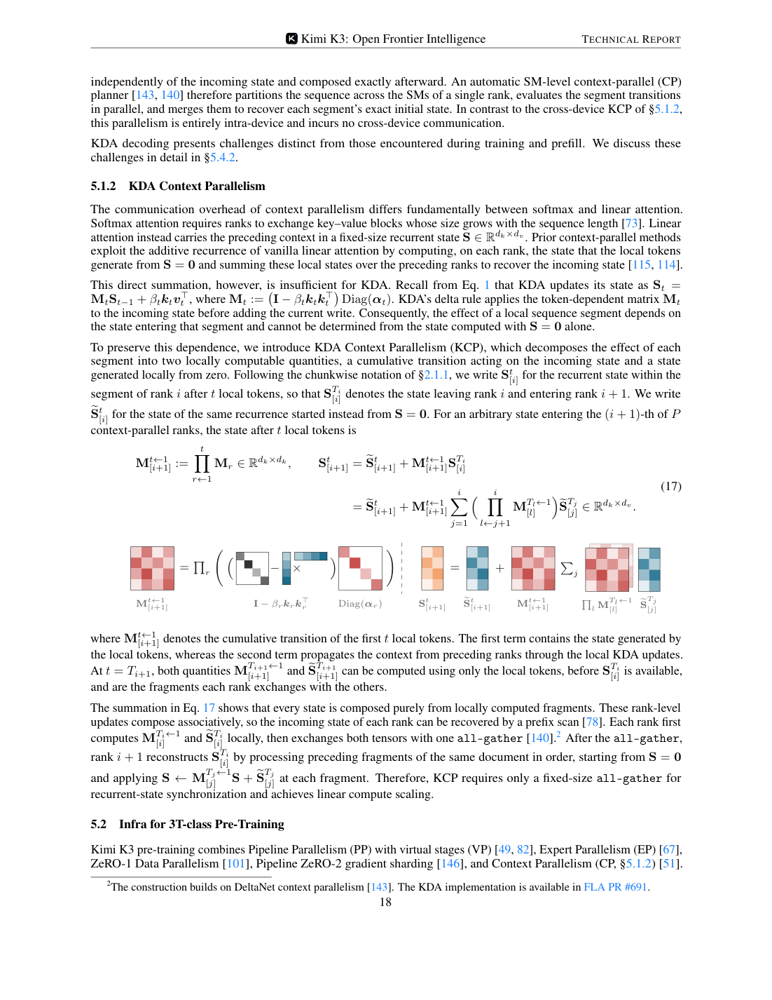
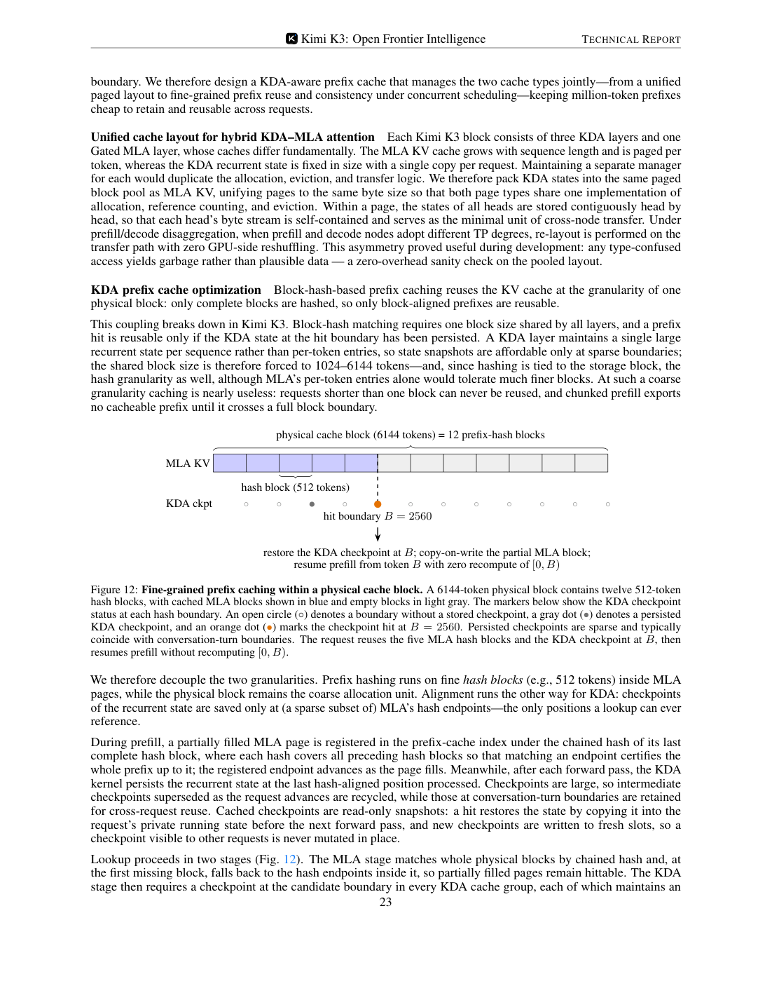
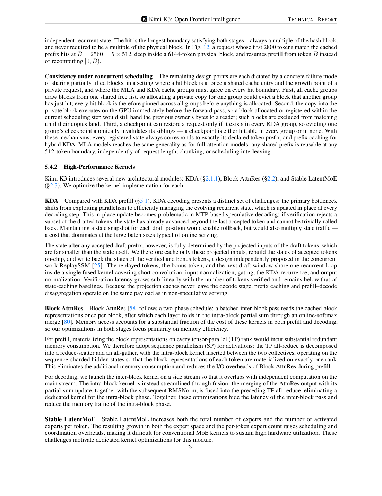
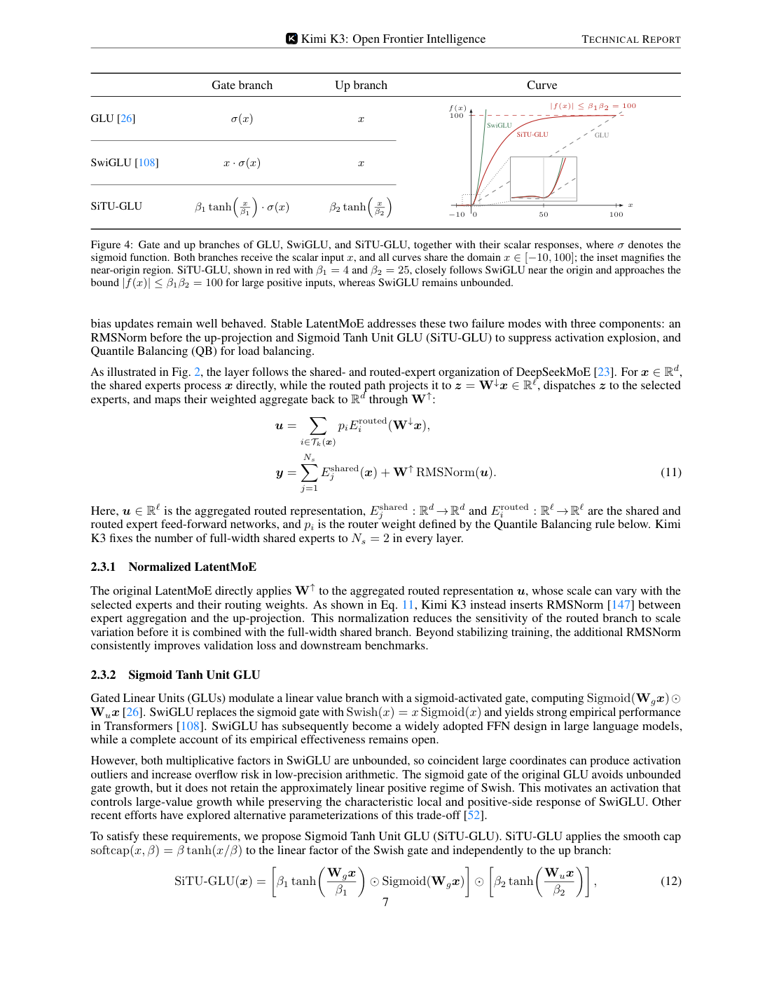
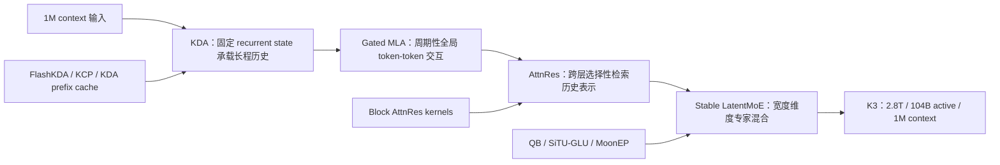

# Kimi K3 三项核心技术报告：KDA、Attention Residuals 与 Stable MoE

更新时间：2026-07-30  
关注范围：只讨论 Kimi K3 中的三项结构性技术：Kimi Delta Attention（KDA）、Attention Residuals（AttnRes）、Stable LatentMoE / Stable MoE。  
主来源：Kimi K3 technical report、Kimi K3 官方博客、Kimi K3 Hugging Face 模型卡、Kimi Linear technical report。

> 这篇报告刻意不再铺开 Kimi 全系列时间线。K3 的结构创新可以按三个维度理解：KDA 解决序列长度维度的信息混合和 cache 成本，Attention Residuals 解决模型深度维度的信息流，Stable LatentMoE 解决模型宽度和专家规模维度的稳定扩展。

## 0. 结论速览

### 0.1 三项技术在 K3 中分别解决什么

| 技术 | 对应维度 | K3 中的位置 | 主要解决的问题 | 关键创新 |
|---|---|---|---|---|
| Kimi Delta Attention（KDA） | 序列维度 | 69 个 KDA layers，与 24 个 Gated MLA layers 组成 3:1 hybrid attention | 1M context 下 full attention 的 KV cache 和 prefill/decode 成本过高 | 用固定大小 recurrent state 替代随序列增长的 KV cache，并用 Gated MLA 周期性补全全局交互 |
| Attention Residuals（AttnRes） | 深度维度 | K3 93 层 backbone 中的 Block AttnRes | 深层模型中早期表示被层层 residual 压缩，跨层信息检索能力弱 | 把“attention over tokens”的思想搬到“attention over layers”，让每层选择性检索前序层表示 |
| Stable LatentMoE / Stable MoE | 宽度与专家维度 | 每个 attention layer 后接 Stable LatentMoE feed-forward network | 896 routed experts、Top-16 激活时，普通 MoE 容易出现激活爆炸、专家负载不均和通信开销上升 | Latent routed path + RMSNorm + SiTU-GLU + Quantile Balancing + MoonEP，使极大专家池稳定训练和服务 |

### 0.2 K3 不是 K2.x 后训练增强，而是结构跳变

| 项 | Kimi K2 | Kimi K3 | 变化含义 |
|---|---|---|---|
| 总参数 | 1.04T | 2.78T | 容量显著扩大 |
| 激活参数 | 32.6B | 104.2B | 单 token 计算也明显上升 |
| 层数 | 61 | 93 | 深度增加，需要更强跨层信息流 |
| context | 128K | 1M | 序列维度进入百万 token |
| attention | 61 MLA | 69 KDA + 24 MLA | 从纯 MLA 转向 hybrid KDA-MLA |
| routed experts | 384 | 896 | 专家空间扩大 133% |
| active experts/token | 8 | 16 | 每 token 专家混合能力增强 |
| shared experts | 1 | 2 | 保留更强通用 full-width path |
| activation | SwiGLU | SiTU-GLU | 为低精度和极大 MoE 稳定性做约束 |

图：InfraTech 绘制的 Kimi K3 architecture overview，用一张图串起 hybrid KDA-MLA attention、Attention Residuals、Stable LatentMoE、QB 与系统侧并行/serving 组件。来源：[CalvinXKY/InfraTech](https://github.com/CalvinXKY/InfraTech/blob/main/models/kimi_k_3/kimi_k_3_architecture.jpg)。

图：Kimi K3 technical report 第 11 页。Figure 7 和 Table 1 给出 K2 到 K3 的 scaling efficiency 与结构差异。

## 1. KDA：把 1M context 从 KV cache 问题改造成 recurrent state 问题

### 1.1 K3 为什么需要 KDA

K3 的目标上下文是 1M tokens。如果继续使用标准 full attention 或只靠 MLA，成本压力主要来自两块：

| 压力 | 说明 |
|---|---|
| KV cache 随长度线性增长 | 每层都需要保存历史 token 的 key/value 或 latent KV；1M context 下 cache 成本直接进入服务瓶颈 |
| prefill 计算和 prefix reuse 难度上升 | 长输入一旦 cache miss，prefill 代价极高；如果 prefix cache 颗粒度过粗，短请求和部分匹配都无法复用 |

KDA 的核心转向是：不再为每个历史 token 保存一份 KV，而是用固定大小的 recurrent state 承载历史信息。代价是状态更新存在串行依赖，需要专门 kernel 和 context parallelism；收益是 cache 体积、跨节点传输和 prefix 复用都可以重新设计。

### 1.2 KDA 的基本 recurrence

K3 technical report 对单头 KDA 的定义如下。设 hidden state 为 $x_t\in\mathbb{R}^d$，query/key/value 分别为 $q_t,k_t\in\mathbb{R}^{d_k}$、$v_t\in\mathbb{R}^{d_v}$，recurrent state 为 $S_t\in\mathbb{R}^{d_k\times d_v}$。

$$
S_t=
\left(I-\beta_t k_t k_t^\top\right)
\operatorname{Diag}(\alpha_t)S_{t-1}
+\beta_t k_t v_t^\top
$$

$$
\tilde{o}_t=S_t^\top q_t
$$

其中：

| 符号 | 含义 |
|---|---|
| $\alpha_t\in(0,1)^{d_k}$ | channel-wise one-step retention factor，决定每个 key channel 的遗忘/保留强度 |
| $\beta_t\in(0,1)$ | delta-rule write strength，决定当前 token 写入 recurrent state 的强度 |
| $I-\beta_t k_t k_t^\top$ | delta-rule correction，用当前 key 对旧状态做校正 |
| $\beta_t k_t v_t^\top$ | 当前 token 写入项 |

这个公式的直觉是：KDA 不只是累加历史 value，而是带有“遗忘、校正、写入”的状态机。它比普通线性注意力更像可学习的有限状态 memory。

### 1.3 K3 相比 Kimi Linear 的关键改动

Kimi Linear 已经验证 KDA + MLA 的 3:1 hybrid 路线。K3 继承这条路线，但做了两个重要改变。

| 改动 | Kimi Linear | Kimi K3 | 作用 |
|---|---|---|---|
| decay parameterization | negative-Softplus，log-decay 下界为 $-\infty$ | scaled sigmoid，把 log-decay 限制在 $(g_{\min},0)$ | 避免 chunk 内 reciprocal cumulative decay 过大，减少 BF16 溢出和 diagonal tile 特殊路径 |
| output gate | low-rank gate | full-rank input-dependent gate | 提高通道级输出调制能力，与 Gated MLA 的 full-rank gate 对齐 |

K3 的 lower-bounded decay 写法是：

$$
g_t^h=g_{\min}\operatorname{Sigmoid}\left(e^{A^h}z_t^h\right)\in(g_{\min},0)^{d_k}
$$

$$
\alpha_t^h=\exp(g_t^h)\in(e^{g_{\min}},1)^{d_k}
$$

K3 固定 $g_{\min}=-5$。因此每个 retention factor 都满足：

$$
\alpha_{t,j}^h>e^{-5}\approx 6.7\times10^{-3}
$$

对 16-token tile，累计 log-decay 落在 $(-80,0)$，reciprocal rescaling 小于 $e^{80}$，仍在 BF16 动态范围内。这样 diagonal 和 off-diagonal causal tiles 都可以走 dense Tensor Core GEMM，减少原先 position-pair diagonal path 的瓶颈。

K3 的 full-rank output gate 为：

$$
y_t=W_o\left[\operatorname{Sigmoid}(W_gx_t)\odot\operatorname{RMSNorm}(\tilde{o}_t)\right]
$$

图：Kimi K3 technical report 第 5 页，包含 KDA lower-bounded decay、Gated MLA 和 AttnRes 相邻定义。

### 1.4 为什么 K3 不是纯 KDA，而是 KDA + Gated MLA

K3 每个 block 中使用 3 个 KDA layers + 1 个 Gated MLA layer，整个 backbone 为 69 KDA + 24 Gated MLA，末尾额外放一个 Gated MLA，确保最后一层仍能执行全局 attention。

这个组合的取舍是：

| 纯 KDA 的优势 | 纯 KDA 的问题 |
|---|---|
| cache 固定、长上下文成本低、递推状态适合 1M context | 对精确 token-token 检索、needle 类任务和跨远距离证据绑定可能弱于 full/global attention |

| Gated MLA 的作用 | 说明 |
|---|---|
| 周期性提供 unrestricted global content interaction | 补偿有限状态 memory 对精确全局交互的不足 |
| 使用 NoPE | K3 把位置/recency 信息交给 KDA，不再为 MLA queries/keys 加显式 positional encoding |
| full-rank gate | 让每个 token 自适应调制从 global attention 读出的通道 |

Gated MLA 的输出门控为：

$$
y_t=W_o\left[\operatorname{Sigmoid}(W_gx_t)\odot\tilde{o}_t\right]
$$

### 1.5 KDA 的系统共设计：FlashKDA、KCP、prefix cache

KDA 不是只改模型结构。K3 report 专门给了 KDA 的系统共设计。

| 系统点 | 解决的问题 | K3 做法 |
|---|---|---|
| FlashKDA | chunkwise KDA 训练/prefill 中，chunk 内并行与 chunk 间状态传播交替导致 SM 空闲 | CUTLASS-based chunkwise kernel，重叠 intra-chunk computation 与 cross-chunk state propagation |
| intra-device context parallelism | 超长 prefill 下，纯 TP 只分 heads，不能缩短 recurrent path | 在单 rank 的 SM 内切分 sequence segment，并合成 exact initial state |
| KDA Context Parallelism（KCP） | 跨设备 context parallelism 不能像普通 linear attention 那样直接求和状态 | 每段拆成 local zero-state contribution 和 cumulative transition，用 prefix scan 组合 |
| KDA-aware prefix cache | KDA recurrent state 和 MLA KV cache 生命周期、大小、颗粒度都不同 | 统一 paged pool，MLA 细粒度 hash blocks，KDA 在 hash endpoint 保存 sparse checkpoints |

KCP 的关键原因是 KDA 状态更新不是加法递推。写作：

$$
S_t=M_tS_{t-1}+\beta_t k_t v_t^\top
$$

其中：

$$
M_t=\left(I-\beta_t k_t k_t^\top\right)\operatorname{Diag}(\alpha_t)
$$

所以某段序列对输入 state 的作用依赖 $M_t$ 的连乘，不能只把“从零开始得到的 state”相加。K3 的做法是让每个 rank 计算两个本地片段：

| 片段 | 作用 |
|---|---|
| $\tilde{S}$ | 本段从 $S=0$ 开始生成的状态 |
| $M^{T\leftarrow 1}$ | 本段对输入 state 的 cumulative transition |

然后跨 rank all-gather 这些固定大小张量，用 associative prefix scan 重构每个 rank 的 incoming state。

图：Kimi K3 technical report 第 18 页，说明 KDA Context Parallelism 如何把本地 transition 和 zero-state contribution 组合起来。

KDA-aware prefix cache 的关键是“命中边界必须同时满足 MLA KV 和 KDA state”。K3 把 MLA 的物理 cache block 和 prefix hash block 解耦，例如 physical block 6144 tokens、hash block 512 tokens；KDA checkpoint 只在 hash endpoint 的稀疏子集保存，通常保留会话轮次边界。命中时必须找到同一边界处的 MLA blocks 和所有 KDA cache groups 的 checkpoint。

图：Kimi K3 technical report 第 23 页，Figure 12 展示 KDA checkpoint 与 MLA hash blocks 的细粒度 prefix cache。

### 1.6 KDA 的收益和风险

| 维度 | 收益 | 风险或代价 |
|---|---|---|
| 训练 | 1M context 训练更可行，KCP 让 recurrent state 可以跨设备并行 | KDA recurrence 比 attention 更依赖专用 kernel，普通实现容易慢 |
| prefill | fixed recurrent state 降低长上下文 cache 压力 | chunkwise kernel、context parallelism、state checkpoint 都需要实现支持 |
| decode | 状态大小固定，理论上比长 KV cache 更友好 | speculative decoding 回滚复杂，需要 replay projected inputs 或保存额外状态 |
| prefix cache | prefix reuse 可扩展到 hybrid KDA-MLA | 只有 MLA 与所有 KDA groups 在同一边界都命中才可复用 |

对本仓库来说，KDA 不能按普通 MHA/MLA 模型处理。接入 K3 时至少要检查：

| 检查项 | 为什么重要 |
|---|---|
| vLLM 是否支持 KDA layer 和 KDA state | 否则模型即使能加载权重，也可能无法正确推理 |
| prefix cache 是否 KDA-aware | 普通 KV block hash 不足以复用 KDA state |
| P-D 分离时 KDA state 如何传输 | prefill/decode TP degree 不同会触发 re-layout |
| speculative decoding 是否支持状态回滚 | draft token 被拒绝后 recurrent state 不能简单倒退 |

## 2. Attention Residuals：把 attention 从 token 维度扩展到 layer 维度

### 2.1 K3 为什么需要 AttnRes

K3 有 93 层、1M context、hybrid KDA-MLA attention。随着深度增加，普通 residual connection 会把历史层信息压缩进当前 hidden state，早期层表示是否能被后层保真读取，取决于中间层变换是否保留这些信息。

K3 report 对这个问题的类比很明确：标准 residual connection 在深度维度上类似 RNN，它把所有之前的信息压成一个状态；Transformer 当年用 attention 替代时间维度 RNN，让每个位置能选择性访问历史位置；AttnRes 则把同样思想搬到深度维度，让每层选择性访问前序层表示。

### 2.2 Full AttnRes 的定义

对第 $l$ 层，K3 定义一个 layer-specific learnable pseudo-query：

$$
q_l=w_l\in\mathbb{R}^d
$$

前序层的 keys 和 values 为：

$$
k_i=v_i=
\begin{cases}
h_1, & i=0\\
f_i(h_i), & 1\le i\le l-1
\end{cases}
$$

其中 $h_1$ 是 token embedding，$f_i(h_i)$ 是第 $i$ 层输出。注意力核为：

$$
\phi(q,k)=\exp\left(q^\top\operatorname{RMSNorm}(k)\right)
$$

权重和输出为：

$$
\alpha_{i\to l}=
\frac{\phi(q_l,k_i)}
{\sum_{j=0}^{l-1}\phi(q_l,k_j)}
$$

$$
h_l=\sum_{i=0}^{l-1}\alpha_{i\to l}v_i
$$

这个机制的核心不是“把所有残差相加”，而是“让当前层学习应该读哪些历史层”。RMSNorm 的作用是避免某些大幅值层输出仅因范数大而支配权重。

### 2.3 Block AttnRes：K3 的可部署版本

Full AttnRes 的算术成本在 $L<100$ 时还可接受，但真正麻烦是 memory 和 pipeline parallelism 下的跨 stage 通信：需要保留所有前层输出，开销为 $O(Ld)$。

K3 使用 Block AttnRes：把 $L$ 层分成 $N$ 个 blocks，每个 block 内把层输出聚合成一个 block representation。对 block $n$，若层集合为 $B_n$，则：

$$
b_n=\sum_{j\in B_n} f_j(h_j)
$$

第 $n$ 个 block 的第 $i$ 层看到的 value matrix 为：

$$
V=
\begin{cases}
[b_0,b_1,\ldots,b_{n-1}]^\top, & i=1\\
[b_0,b_1,\ldots,b_{n-1},b_n^{i-1}]^\top, & i\ge2
\end{cases}
$$

其中 $b_0=h_1$，即 embedding 始终作为一个 source。这样内存/通信开销从：

$$
O(Ld)\rightarrow O(Nd)
$$

K3 采用 $N\approx8$ 的经验设置：93 层分成 8 个 blocks，block size 约 12 层，加上 embedding 后共有 9 个 block-level sources。

### 2.4 AttnRes 与 KDA 的关系

KDA 解决的是 token sequence 维度，AttnRes 解决的是 network depth 维度。两者不是替代关系。

| 问题 | KDA 的回答 | AttnRes 的回答 |
|---|---|---|
| 历史 token 怎么保留 | 用 recurrent state 压缩长程上下文 | 不直接解决 token 维度 |
| 历史层表示怎么保留 | 不直接解决层间压缩 | 用 pseudo-query 选择性读前序层/block 表示 |
| 为什么 K3 同时需要两者 | 1M context 需要序列维度高效 | 93 层深模型需要深度维度信息流 |

更具体地说，KDA 把百万 token 的历史压入固定状态，会不可避免地损失部分可精确检索的信息；周期性 Gated MLA 提供全局 token-token 交互，而 AttnRes 让模型在深度方向上重新访问较早层的表示。三者一起服务于“长序列 + 深网络”的信息保真。

### 2.5 AttnRes 的 serving kernel

K3 report 说明 Block AttnRes 在 serving 中采用两阶段：

| 阶段 | 做法 |
|---|---|
| inter-block pass | 批量读取 cached block representations，每个 block 读一次 |
| intra-block merge | 通过 online softmax 合并当前 block 的 partial sum |

Prefill 时，为避免每个 TP rank 都 materialize block representations，K3 使用 sequence parallelism：把 TP all-reduce 拆成 reduce-scatter 和 all-gather，并把 intra-block kernel 插在二者之间，让每个 token 的 block representation 只在一个 rank 上物化。

Decode 时，inter-block kernel 放到 side stream，与 main stream 的独立计算重叠；intra-block merge、partial-sum update 和后续 RMSNorm 融进前面的 TP all-reduce，减少单独 kernel 和内存读写。

图：Kimi K3 technical report 第 24 页，包含 KDA、Block AttnRes、Stable LatentMoE 的 serving kernel 优化入口。

### 2.6 AttnRes 的收益和待验证点

| 维度 | 收益 | 待验证点 |
|---|---|---|
| 深层信息流 | 避免所有历史层信息被普通 residual 统一压缩 | 公开报告没有给 AttnRes 单独 ablation |
| 长程任务 | 早期层捕获的局部证据、格式状态、工具状态更容易被后续层读取 | 对 coding、BrowseComp、long-context reasoning 的单项贡献未公开 |
| 系统实现 | Block AttnRes 把开销控制到 $O(Nd)$，并有专门 serving kernel | vLLM 或其他推理框架是否支持完整 Block AttnRes 仍需确认 |

K3 report 的 case study 提到，Kimi K3 在 GPU kernel optimization 任务中把 AttnRes latency 从 283.6 ms 降到 114.4 ms。但这属于 K3 作为 coding agent 优化 kernel 的能力案例，不等价于 AttnRes 模块对模型质量的消融证据。

## 3. Stable MoE：让 896 experts / Top-16 的宽度扩展稳定下来

### 3.1 K3 的 MoE 扩展为什么需要“stable”

K3 的专家配置比 K2 大很多：

| 项 | Kimi K2 | Kimi K3 |
|---|---|---|
| routed experts | 384 | 896 |
| active experts per token | 8 | 16 |
| shared experts | 1 | 2 |
| MoE hidden dimension per expert | 2048 | 3072 |
| Latent MoE dimension | 无 | 3584 |
| sparsity | 384/8 = 48 | 896/16 = 56 |

专家池扩大带来两个直接问题：

| 问题 | 具体表现 |
|---|---|
| 计算链更不稳定 | routed path 经过 down projection、gated expert FFN、up projection，近似四个矩阵乘连续组合，2.8T 规模下内部 activation 容易爆炸 |
| 负载均衡更难 | 896 experts 的 router bias 更新和专家负载波动进入大规模分布式训练瓶颈，专家过热或死亡都会拖慢 EP 训练 |

所以 K3 的 Stable MoE 不是一个单独小技巧，而是一组组合设计：LatentMoE 负责把 routed path 变窄，RMSNorm 和 SiTU-GLU 负责抑制激活异常，Quantile Balancing 负责路由负载均衡，MoonEP 和 serving kernels 负责系统侧负载与通信。

### 3.2 Stable LatentMoE 的结构

LatentMoE 的基本思想是把 full model width 和 routed expert width 分离：

| 路径 | 作用 |
|---|---|
| shared experts | 处理 full-width token representation，保留通用变换能力 |
| routed experts | 只在 latent width $\ell$ 上工作，降低专家扩展时的通信和 expert-weight traffic |

K3 report 给出的 Stable LatentMoE 形式是：

$$
u=\sum_{i\in T_k(x)} p_i E_i^{\text{routed}}(W_\downarrow x)
$$

$$
y=\sum_{j=1}^{N_s}E_j^{\text{shared}}(x)+W_\uparrow \operatorname{RMSNorm}(u)
$$

其中：

| 符号 | 含义 |
|---|---|
| $W_\downarrow x\in\mathbb{R}^{\ell}$ | 把 full-width 输入投到 routed latent space |
| $E_i^{\text{routed}}:\mathbb{R}^{\ell}\to\mathbb{R}^{\ell}$ | routed expert，在 latent width 上工作 |
| $E_j^{\text{shared}}:\mathbb{R}^{d}\to\mathbb{R}^{d}$ | shared expert，保留 full-width path |
| $p_i$ | router weight，由 Quantile Balancing 路由规则定义 |
| $N_s=2$ | K3 每层固定两个 shared experts |

RMSNorm 插在 routed aggregation 和 up-projection 之间，目的不是为了好看，而是降低 $u$ 的尺度波动对后续 $W_\uparrow$ 和 shared branch 合流的影响。K3 report 明确说这既稳定训练，也持续改善 validation loss 和 downstream benchmarks。

### 3.3 SiTU-GLU：把 SwiGLU 的大值爆炸封顶

SwiGLU 的经验效果强，但两个 multiplicative factors 都是无界的。大模型和低精度训练中，如果 gate branch 和 up branch 同时出现大坐标，乘积容易制造 activation outliers。

K3 提出 Sigmoid Tanh Unit GLU（SiTU-GLU）：

$$
\operatorname{SiTU\text{-}GLU}(x)=
\left[
\beta_1\tanh\left(\frac{W_gx}{\beta_1}\right)
\odot\operatorname{Sigmoid}(W_gx)
\right]
\odot
\left[
\beta_2\tanh\left(\frac{W_ux}{\beta_2}\right)
\right]
$$

K3 使用：

$$
\beta_1=4,\quad \beta_2=25
$$

因此每个输出坐标满足：

$$
\|\operatorname{SiTU\text{-}GLU}(x)\|_\infty\le \beta_1\beta_2=100
$$

这个设计保留了 SwiGLU 的局部形状：当 $z$ 接近 0 时，

$$
\beta\tanh\left(\frac{z}{\beta}\right)=z+O\left(\frac{z^3}{\beta^2}\right)
$$

所以 SiTU-GLU 在原点附近与 SwiGLU 一阶一致；当输入很大时，tanh smooth cap 把输出封顶。相比 hard clamp，smooth cap 在饱和边界外仍有非零梯度，训练行为更平滑。

图：Kimi K3 technical report 第 7 页，Figure 4 展示 GLU、SwiGLU、SiTU-GLU 的 branch 定义和曲线，并给出 Stable LatentMoE 的公式。

### 3.4 Quantile Balancing：不用 auxiliary loss 的专家负载均衡

传统 MoE 常用 auxiliary load balancing loss。问题是 loss 权重需要调，且可能和主任务优化相互拉扯。K3 采用 auxiliary-loss-free routing：给每个专家一个 bias $b_j$，用它影响 Top-k dispatch，但不把 bias 放进 mixture weight。

对 token $x_i$，router score 为：

$$
s_i=\operatorname{Sigmoid}(W_rx_i)
$$

K3 的 routing rule 是：

$$
T_i=\operatorname{argtopk}(s_i+b)
$$

$$
p_{i,j}=\frac{s_{i,j}}{\sum_{r\in T_i}s_{i,r}},\quad j\in T_i
$$

注意 $b$ 只影响被派发到哪些专家，不影响 $p_{i,j}$ 的归一化权重。这样 dispatch 可以均衡，但 router 的梯度目标不被 bias 直接扭曲。

设 batch 中有 $m$ 个 tokens、$n$ 个 routed experts、Top-k，则每个专家的目标负载为：

$$
q=\frac{mk}{n}
$$

Quantile Balancing 的思路是：先做 Top-$(k+1)$，得到每个 token 的 cutoff $\alpha_i^{(t)}$，再看每个专家 $j$ 的 margin：

$$
s_{:,j}-\alpha^{(t)}
$$

下一步 bias 由分位数确定：

$$
\hat{b}_{j}^{(t+1)}
\leftarrow
-\operatorname{quantile}_{1-k/n}\left(s_{:,j}-\alpha^{(t)}\right)
$$

$$
b^{(t+1)}
\leftarrow
\hat{b}^{(t+1)}
-\operatorname{mean}(\hat{b}^{(t+1)})\mathbf{1}
$$

直觉上，QB 为每个专家选择一个阈值，让它刚好接收目标数量 $q$ 的 token。K3 report 的小例子中，$m=8,n=4,k=1$，普通 Top-k 得到负载 $(4,3,1,0)$，QB 后变成 $(2,2,2,2)$。

图：Kimi K3 technical report 第 8 页，Figure 5 展示 Quantile Balancing 如何把不均衡路由变成均衡负载。

### 3.5 大规模训练中的 QB histogram estimator

真实训练中不可能把全局 batch 中所有 margin gather 到一起做精确分位数。K3 使用 histogram estimator：

| 步骤 | 做法 |
|---|---|
| 本地统计 | 每个 rank 为每个 expert 统计 margin histogram |
| 全局汇总 | 用一次 all-reduce 求和各 rank bin counts |
| 近似分位数 | 从 pooled counts 恢复全局 batch 的 quantile |
| 通信成本 | 每个 expert 只传几百个 bins，而不是传所有 token-expert margins |

这个设计的关键是 counts 可加，所以不受 token shard 方式影响；代价是存在 bin width 带来的估计误差。

### 3.6 Stable MoE 的系统侧：MoonEP 与 serving kernel

Stable MoE 在模型侧让路由更稳，在系统侧还需要让 EP 执行更可预测。

K3 report 对 MoonEP 的描述是：每个 rank 接收固定 $S\times K$ tokens，并在每个 rank 最多 $E/R$ 个 redundant experts 的条件下保持 perfect balance。系统实现包括：

| 机制 | 作用 |
|---|---|
| online planning kernel | 近似求解专家分配，避免 CPU/host 同步成为瓶颈 |
| zero-copy communication | 直接把 tokens 发到 remote rank 的 expert-grouped positions |
| static shapes | 消除 per-layer MoE host synchronization |
| bounded redundant experts | 用有限冗余换取固定负载和更稳定流水 |

Serving 侧，K3 对 Stable LatentMoE 还做了专门 kernel：

| 优化 | 作用 |
|---|---|
| fuse latent down-projection with router | 把 latent $W_\downarrow$ 和 router 合并成一个 GEMM |
| shard latent weight matrices | 降低 latent GEMM 的冗余权重流量 |
| fuse output all-gather into GEMM epilogue | 用 multimem store 指令减少额外通信开销 |
| overlap communication with shared experts | 把 latent path 的通信藏在 shared-expert computation 后面 |
| token-centric MoE decoding kernel | 小 batch decode 下 group GEMM 变成 weight streaming，使用 WarpDecode 风格降低内存瓶颈 |

### 3.7 Stable MoE 的收益和风险

| 维度 | 收益 | 风险或待验证点 |
|---|---|---|
| 模型容量 | 896 experts / Top-16 提供更大的专家特化空间 | 单独归因到 expert 数、Top-k、latent width 的 ablation 未完全公开 |
| 训练稳定性 | RMSNorm、SiTU-GLU、QB 共同控制 scale、activation、load | SiTU-GLU 的 $\beta_1,\beta_2$ 是否跨模型可迁移需要验证 |
| 分布式效率 | QB + MoonEP 让 EP 负载更可预测 | 真实 expert load histogram、rank dispatch 方差和 tail latency 需要实测 |
| 服务实现 | fused kernels 和 token-centric decode 降低 MoE serving 开销 | vLLM 是否完整支持 K3 Stable LatentMoE、MoonEP、MXFP 格式仍需跟进 |

## 4. 三项技术的组合关系

K3 的三项技术不是孤立模块，而是按 token、layer、channel 三个混合维度协同。

| 组合 | 关键含义 |
|---|---|
| KDA + Gated MLA | KDA 提供低 cache 成本的长程状态，Gated MLA 周期性保留全局精确交互 |
| KDA + AttnRes | 一个解决序列维度，一个解决深度维度，避免 1M token 和 93 层同时带来的信息瓶颈 |
| Stable MoE + AttnRes | MoE 扩宽能力空间，AttnRes 让深层模块不必只依赖局部 residual 累积 |
| Stable MoE + MoonEP | 模型侧路由均衡和系统侧专家执行均衡必须配套，否则 896 experts 会转化为 tail latency |

一句话概括：K3 的核心不是“用了 KDA”或“专家更多”，而是把长序列、深层网络、超大专家池三个方向同时扩展，并为每个方向配了相应的训练和 serving 系统。

## 5. 对本仓库 vLLM / 推理实验的落点

### 5.1 接入 K3 前必须确认的实现问题

| 模块 | 检查项 | 不确认的风险 |
|---|---|---|
| KDA | 模型 config、KDA kernel、KDA state layout、KDA prefix cache | 普通 KV cache 逻辑无法复用 KDA state，长上下文会退化或错误 |
| Gated MLA | NoPE MLA、full-rank gate、FP32 attention output training 逻辑是否影响推理实现 | 以 K2 MLA 假设直接加载可能漏掉门控路径 |
| AttnRes | Block AttnRes state、block source 数、kernel fusion | 标准 residual path 无法等价替代 AttnRes |
| Stable LatentMoE | latent routed width、shared/routed experts、QB frozen bias、SiTU-GLU、量化格式 | 普通 MoE expert mapping 和 activation function 可能不兼容 |
| EP / serving | expert parallel、rank dispatch、KDA/MLA cache transfer、P-D 分离 re-layout | 平均吞吐看起来可用，但 p99 latency 和 cache miss 成本不可控 |

### 5.2 推荐 benchmark 指标

| 方向 | 指标 |
|---|---|
| KDA 长上下文 | TTFT、prefill tokens/s、decode TPOT、KDA state transfer bytes、prefix cache hit boundary、cache miss recompute tokens |
| AttnRes | block 数、block state bytes、prefill/decode extra latency、kernel launch 数、TP all-reduce 融合效果 |
| Stable MoE | expert load variance、rank dispatch bytes、热门专家 p99、token-centric decode kernel 吞吐、small-batch latency |
| 三者组合 | 1M context 下 quality/cost ratio、长程 coding 成功率、BrowseComp/DeepSearch 类型任务 wall time、cache-aware routing 收益 |

### 5.3 建议实验

| 实验 | 做法 | 目的 |
|---|---|---|
| KDA prefix cache 微基准 | 构造共享前缀长度为 512、2560、6144、128K 的请求，对比 cache hit/miss | 验证 KDA checkpoint 与 MLA hash block 边界对 TTFT 的影响 |
| MoE tail latency 压测 | 构造不同 batch token 分布，记录 expert load 和 p99 decode latency | 验证 Stable MoE 是否仍会出现专家拥塞 |
| AttnRes kernel 开销 | 分别测打开/关闭或模拟 AttnRes block state 的额外内存与 latency | 判断 Block AttnRes 对 serving 的实际成本 |
| 1M coding workload | 使用长 repo prompt + 多轮工具调用，记录 cache hit、工具步、最终测试通过率 | 观察 KDA、AttnRes、Stable MoE 对长程 coding 的组合收益 |

## 6. 参考链接

| 来源 | 链接 | 用途 |
|---|---|---|
| Kimi K3 官方博客 | https://www.kimi.com/blog/kimi-k3 | K3 发布定位、公开 benchmark、核心技术概述 |
| Kimi K3 Hugging Face | https://huggingface.co/moonshotai/Kimi-K3 | 模型规格、context、架构摘要、使用限制 |
| Kimi K3 GitHub | https://github.com/MoonshotAI/Kimi-K3 | 技术报告、推理配置、开源入口 |
| Kimi K3 technical report PDF | https://github.com/MoonshotAI/Kimi-K3/blob/main/k3_tech_report.pdf | 本文 KDA、AttnRes、Stable LatentMoE 的主要公式和系统证据 |
| InfraTech Kimi K3 architecture | https://github.com/CalvinXKY/InfraTech/blob/main/models/kimi_k_3/kimi_k_3_architecture.jpg | K3 整体架构图与技术模块位置参考 |
| Kimi Linear GitHub | https://github.com/MoonshotAI/Kimi-Linear | KDA 前置技术、3:1 hybrid、KDA kernel 与 vLLM implementation |
| Kimi Linear paper | https://huggingface.co/papers/2510.26692 | KDA 与 MLA 混合路线、1M context 性能数据 |
| FlashKDA | https://github.com/MoonshotAI/FlashKDA | KDA kernel 线索 |
| MoonEP | https://github.com/MoonshotAI/MoonEP | K3 专家并行系统线索 |
| Gated Delta Networks | https://arxiv.org/abs/2412.06464 | KDA 的 DeltaNet/GDN 背景 |
| LatentMoE | https://arxiv.org/abs/2601.18089 | Latent MoE 的结构背景 |
| BASE Layers | https://arxiv.org/abs/2103.16716 | balanced assignment 与专家负载均衡背景 |
| DeepSeek-V2 MLA | https://arxiv.org/abs/2405.04434 | MLA 背景 |
| Transformer | https://arxiv.org/abs/1706.03762 | attention 背景 |
| ResNet | https://arxiv.org/abs/1512.03385 | residual connection 背景 |

## 7. 待继续验证

| 问题 | 下一步 |
|---|---|
| KDA 在 K3 权重中的 config 名称、state tensor layout、vLLM 支持状态 | 读取 K3 repo config、vLLM PR、Kimi Linear vLLM implementation |
| AttnRes 是否有单独 ablation | 搜索 K3 report 附录、Attention Residuals preprint 或后续技术博客 |
| Stable LatentMoE 三个稳定组件的单独贡献 | 查找 RMSNorm、SiTU-GLU、QB 的 validation loss/downstream benchmark 消融 |
| MoonEP 与 serving MoE kernel 的实测指标 | 读取 MoonEP 仓库和 K3 serving 相关实现，设计本仓库压测 |
| K3 在本仓库 vLLM serving 中的最小可运行路径 | 确认模型权重格式、MXFP4/MXFP8、KDA/AttnRes/Stable LatentMoE custom op 支持 |
