# Kimi 系列技术演进研究：时间线、推理效率、RL 后训练与 Agent 编排

更新时间：2026-07-29  
任务书：`contexts/kimi_k2_7/Technique/tasks/kimi_series_technology_timeline_rework_taskbook_20260729.md`  
目标：参照知乎专栏时间线重绘 Kimi 系列演进，并用官方模型卡、技术报告、论文、开源仓库和 benchmark 资料交叉验证关键技术点。

> 本文把“知乎文章的时间线”和“官方资料可验证的技术事实”分开处理：时间线顺序以知乎第二章《Kimi 技术演进路线图与核心创新》为主；模型规格、架构细节、效果指标优先引用 Hugging Face 模型卡、Moonshot/Kimi 官方页面、GitHub 仓库、论文或 benchmark 页面。

## 0. 摘要与资料边界

### 0.1 主结论

| 结论 | 说明 | 证据状态 |
|---|---|---|
| Kimi 的长期主线是“长上下文产品化 + 大稀疏模型 + agentic 后训练 + 推理系统工程” | 2023 到 2024 年以长上下文打出产品差异；2025 年 K2 用 1T/32B MoE 建立开源基座；2025 年底到 2026 年围绕 thinking、tool use、Swarm、long-horizon coding 和 K3 架构跳变持续演进。 | 知乎时间线已在 141 Chrome 复核；K2 到 K3 规格由 HF/GitHub/官方博客交叉验证 |
| K2.x 基本冻结在 1T 总参、32B 激活、384 experts、Top-8、MLA、256K context 这一架构族上 | K2-0905、K2-Thinking、K2.5、K2.6、K2.7-Code 主要变化集中在后训练、工具使用、多模态、Agent Swarm、coding harness 和低精度部署。 | HF 模型卡已核验 |
| K3 是从 K2.x 到下一代的架构跳变 | K3 公开规格为 2.8T 总参、104B 激活、93 层、1M context、69 KDA + 24 Gated MLA、896 experts、Top-16、2 shared experts、MXFP4 weights / MXFP8 activations。 | K3 HF 与 K3 GitHub 已核验 |
| 推理效率线的关键创新不是单点技术，而是“模型结构 + cache 语义 + 低精度 + P-D 分离”的组合 | KDA 让 1M context 更可服务化，Mooncake 把 prefill/decode/cache 拆开，QAT 把部署格式纳入训练目标，KDA prefix cache 需要 vLLM 层支持。 | K3 blog、K3 HF、Kimi Linear、Mooncake README 已核验 |
| RL 后训练线从“长 CoT”走向“工具环境中的可执行任务学习” | K1.5 关注 long-CoT 与 long2short；K2 强化 tool-use 数据和自评；K2 Thinking 强化交错思考和 200 到 300 次工具调用；K2.5/K2.6/K2.7-Code 把 Swarm、长程 coding、执行反馈、token efficiency 纳入后训练。 | K1.5 arXiv、K2/K2 Thinking/K2.5/K2.6/K2.7 模型卡与知乎观点交叉整理 |
| Agent 编排线的价值来自 harness，而不只是裸模型 | Kimi Code、Kimi Work、MCP、preserve thinking、工具预算、权限约束和执行反馈都会影响 benchmark 和真实任务表现。 | K2.7/K3 模型卡、K3 blog、MCP benchmark 页面可核验 |

### 0.2 资料来源与证据分级

| 证据级别 | 来源类型 | 本文使用方式 |
|---|---|---|
| A | Kimi/Moonshot 官方博客、HF 模型卡、GitHub 技术报告、开源仓库 README | 用来写确定事实，例如模型规格、上下文长度、量化格式、公开 benchmark、API 限制 |
| B | 论文、arXiv、USENIX FAST、vLLM/Mooncake 等工程论文或代码仓库 | 用来解释理论背景、机制、相近技术和系统设计边界 |
| C | 用户指定知乎专栏和高质量技术文章 | 用来组织时间线、抽取作者观点、提示技术关系；关键事实必须与 A/B 交叉验证 |
| D | 推测、产品形态观察、尚未公开的实现细节 | 只能写为“可能”“待验证”“技术假设”，不能写成已发生事实 |

| 来源 | 链接 | 当前状态 |
|---|---|---|
| 知乎第二章：Kimi 技术演进路线图与核心创新 | https://zhuanlan.zhihu.com/p/2061492527589494896 | 141 命令行 403，Jina Reader 返回安全验证；141 Google Chrome 可读全文，正文约 18.9K 字符 |
| 知乎第一章：Kimi 与 DeepSeek 大模型技术路线图 | https://zhuanlan.zhihu.com/p/2061491373937791328 | Jina Reader 与 141 Google Chrome 可读；用于三条主线背景 |
| 知乎专栏：大模型初探 | https://zhuanlan.zhihu.com/c_2061491184288245579 | 141 可读目录，确认 5 篇系列文章 |
| K2 官方模型卡与技术报告 | https://huggingface.co/moonshotai/Kimi-K2-Instruct ，https://github.com/MoonshotAI/Kimi-K2 | 已核验 |
| K2 Thinking 官方模型卡 | https://huggingface.co/moonshotai/Kimi-K2-Thinking | 已核验 |
| K2.5/K2.6/K2.7-Code 模型卡与 K2.5 技术报告 | https://huggingface.co/moonshotai/Kimi-K2.5 ，https://huggingface.co/moonshotai/Kimi-K2.6 ，https://huggingface.co/moonshotai/Kimi-K2.7-Code ，https://arxiv.org/abs/2602.02276 | 已核验；K2.5 技术报告已抽取 PARL、joint text-vision RL、DEP 与 Agent Swarm 证据 |
| K3 官方模型卡与仓库 | https://huggingface.co/moonshotai/Kimi-K3 ，https://github.com/MoonshotAI/Kimi-K3 | 已核验 |
| Kimi Linear / KDA | https://huggingface.co/papers/2510.26692 ，https://github.com/MoonshotAI/Kimi-Linear | 论文页与仓库元信息可读；README 原始路径需继续复核 |
| Mooncake | https://github.com/kvcache-ai/Mooncake ，https://www.usenix.org/system/files/fast25-qin.pdf | README 与 FAST 论文入口可读 |

### 0.3 读表边界

| 边界 | 处理规则 |
|---|---|
| “汉字”和“tokens”不能直接等价比较 | 2023 到 2024 年知乎时间线使用“20 万汉字、200 万字”；K2 以后官方模型卡使用 token context，如 128K、256K、1048576。本文在表格中保留原口径，不把二者直接换算。 |
| 模型能力与 harness 能力分开记录 | SWE、Terminal、BrowseComp、MCP 类结果往往依赖工具环境、上下文管理、thinking history 和执行器。本文会标注“模型技术”和“agent harness”两个层面。 |
| 公开 benchmark 不等于本仓库可复现结论 | 本仓库需要单独测 TTFT、TPOT、cache hit、吞吐、工具调用成功率和脚本稳定性。公开分数只作为方向性证据。 |
| 截图使用 | 本版已从公开 PDF 渲染 18 张关键页面截图，放在 `contexts/kimi_k2_7/Technique/assets/kimi_series/`；后续可继续裁剪成更精确的图表级截图。 |

## 1. Kimi 系列时间线

### 1.1 四个阶段

知乎第二章把 Kimi 演进拆成四段：第一段是 2023 到 2024 年的长上下文立身；第二段是 2024 年底到 2025 年中 K1/K1.5 的 reasoning 与战略转向；第三段是 2025 年 7 月 K2 的万亿开源 MoE；第四段是 2025 年 11 月到 2026 年 7 月 agentic 深化并最终过渡到 K3。

这个划分有一个重要含义：Kimi 并不是从 K2 才开始技术路线。早期“无损长上下文”让产品和数据流围绕长文档、长会话、长任务建立，后续 K2/K3 的 sparse MoE、KDA、Mooncake、Agent Swarm 都是在继续解决“更长任务下如何保持质量和成本可控”。

### 1.2 时间线图

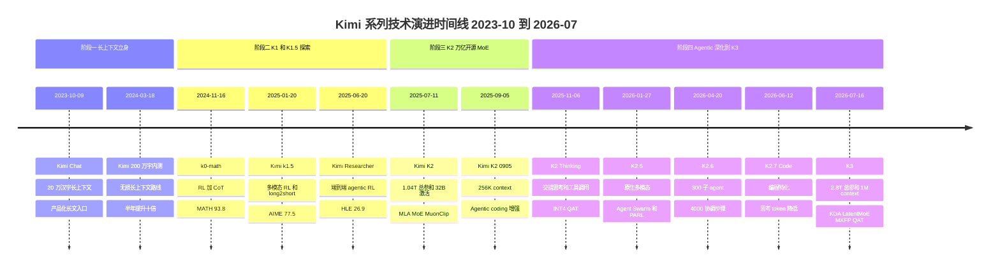
```mermaid
timeline
    title Kimi 系列技术演进时间线 2023-10 到 2026-07
    section 阶段一 长上下文立身
        2023-10-09 : Kimi Chat
                   : 20 万汉字长上下文
                   : 产品化长文入口
        2024-03-18 : Kimi 200 万字内测
                   : 无损长上下文路线
                   : 半年提升十倍
    section 阶段二 K1 和 K1.5 探索
        2024-11-16 : k0-math
                   : RL 加 CoT
                   : MATH 93.8
        2025-01-20 : Kimi k1.5
                   : 多模态 RL 和 long2short
                   : AIME 77.5
        2025-06-20 : Kimi Researcher
                   : 端到端 agentic RL
                   : HLE 26.9
    section 阶段三 K2 万亿开源 MoE
        2025-07-11 : Kimi K2
                   : 1.04T 总参和 32B 激活
                   : MLA MoE MuonClip
        2025-09-05 : Kimi K2 0905
                   : 256K context
                   : Agentic coding 增强
    section 阶段四 Agentic 深化到 K3
        2025-11-06 : K2 Thinking
                   : 交错思考和工具调用
                   : INT4 QAT
        2026-01-27 : K2.5
                   : 原生多模态
                   : Agent Swarm 和 PARL
        2026-04-20 : K2.6
                   : 300 子 agent
                   : 4000 协调步骤
        2026-06-12 : K2.7 Code
                   : 编程特化
                   : 思考 token 降低
        2026-07-16 : K3
                   : 2.8T 总参和 1M context
                   : KDA LatentMoE MXFP QAT
```

### 1.3 相比旧版时间线清理了什么

| 旧内容类型 | 处理方式 | 原因 |
|---|---|---|
| 只从 2025-07 K2 开始 | 前移到 2023-10 Kimi Chat | 知乎第二章明确把早期长上下文作为 Kimi 路线起点 |
| Mermaid 节点里堆完整 benchmark | 移到第 2 章总表 | 时间线只承担顺序和阶段，不承担完整证据表 |
| K2.x 每代重复写相同规格 | 时间线只写变化点，总表再写规格 | K2.x 多数仍是 1T/32B、384 experts、MLA，重复会掩盖后训练和 harness 演进 |
| “知乎不可读”旧说明 | 改为“命令行不可读，141 Chrome 可读” | 2026-07-29 已按用户要求在 141 Chrome 复核全文可读 |
| 无法核验的确定性表述 | 标注为“知乎观点，需官方交叉验证” | 避免把二级资料中的说法写成官方事实 |

## 2. Kimi 系列时间表

| 时间 | 节点 | 类型 | 模型规格或上下文 | 关键变化 | 技术关键词 | 代表指标 | 主来源 | 证据状态 |
|---|---|---|---|---|---|---|---|---|
| 2023-10-09 | Kimi Chat | 产品与长上下文 | 20 万汉字口径 | 长上下文作为产品入口，强调不依赖短窗口拼接的长文处理体验 | 长上下文、长文档、会话记忆 | 知乎称“全球首个可产品化长上下文输入” | [知乎第二章](https://zhuanlan.zhihu.com/p/2061492527589494896) | 知乎已复核，需官方历史资料交叉验证 |
| 2024-03-18 | Kimi 200 万字内测 | 产品与长上下文 | 200 万汉字口径 | 沿“无损”长上下文路线扩展，不采用滑窗或降采样作为主叙事 | 无损长上下文、长文档理解 | 半年提升约 10 倍 | [知乎第二章](https://zhuanlan.zhihu.com/p/2061492527589494896) | 知乎已复核，需官方历史资料交叉验证 |
| 2024-11-16 | k0-math | 推理后训练 | 未公开完整模型规格 | 以 RL + CoT 强化数学推理，为 K1.5 的长链推理探索铺路 | RL、CoT、数学推理 | 知乎记录 MATH 93.8 | [知乎第二章](https://zhuanlan.zhihu.com/p/2061492527589494896) | 知乎观点，需官方交叉验证 |
| 2025-01-20 | Kimi k1.5 | 推理后训练 | 128K long-context RL 口径 | 使用极简 RL 路线、partial rollouts、long2short，把长 CoT 能力压缩成更短推理链 | long-CoT、long2short、DPO、长度惩罚、多模态 RL | 知乎记录 AIME 77.5、MATH-500 96.2 | [Kimi k1.5 arXiv](https://arxiv.org/abs/2501.12599)，[知乎第二章](https://zhuanlan.zhihu.com/p/2061492527589494896) | 论文已核验，指标需逐表复核 |
| 2025-02 | MoBA | 长上下文注意力技术 | 技术论文/仓库节点 | 把 top-k 路由思想引入 block attention，探索长上下文稀疏注意力 | Mixture of Block Attention、稀疏注意力、块路由 | 作为 KDA 前的长上下文效率探索 | [MoBA GitHub](https://github.com/MoonshotAI/MoBA)，[知乎第二章](https://zhuanlan.zhihu.com/p/2061492527589494896) | 仓库存在已核验，是否进入生产模型需继续查证 |
| 2025-06-20 | Kimi Researcher | Agentic RL | 产品/研究节点 | 用端到端 agentic RL 提升研究型工具任务能力 | 搜索、浏览、工具使用、agentic RL | 知乎记录 HLE 8.6 到 26.9 | [知乎第二章](https://zhuanlan.zhihu.com/p/2061492527589494896) | 知乎观点，需官方博客交叉验证 |
| 2025-07-11 | Kimi K2 | 模型发布 | 1.04T 总参、32B 激活、61 层、384 experts、Top-8、1 shared expert、128K context、MLA | 建立 K2 系列开源基座；用稀疏 MoE 扩容量，用 MLA 控 KV cache，用 MuonClip 稳定 15.5T tokens 训练 | MoE、MLA、MuonClip、128K、tool use、agentic coding | SWE-bench Verified 65.8；官方称 15.5T tokens 零 loss spike | [K2 HF](https://huggingface.co/moonshotai/Kimi-K2-Instruct)，[K2 GitHub](https://github.com/MoonshotAI/Kimi-K2)，[K2 report](https://github.com/MoonshotAI/Kimi-K2/blob/main/tech_report.pdf) | 已核验 |
| 2025-09-05 | Kimi K2 0905 | 模型迭代 | 1T/32B，256K context，MLA | 上下文从 128K 扩到 256K，增强 agentic coding 和前端 coding | 256K、coding RL、frontend coding | SWE-bench Verified 69.2 | [K2-0905 HF](https://huggingface.co/moonshotai/Kimi-K2-Instruct-0905) | 已核验 |
| 2025-10 至 2025-11 | Kimi Linear / KDA | 注意力架构 | 48B-A3B 研究模型，1M context | 公开 Kimi Delta Attention，采用 KDA 与 MLA 的混合路线，面向 1M context 降低 cache 和解码成本 | KDA、Gated DeltaNet、linear attention、3:1 hybrid | KV cache 最高降低 75%，1M context 解码最高 6.3 倍 | [Kimi Linear paper](https://huggingface.co/papers/2510.26692)，[Kimi Linear GitHub](https://github.com/MoonshotAI/Kimi-Linear) | 论文页/仓库已核验，细节需读完整论文 |
| 2025-11-06 | Kimi K2 Thinking | 模型发布 | 1T/32B，256K context，MLA，native INT4 QAT | 从 reflex 回答转向 thinking agent；支持交错思考、动态工具调用和 200 到 300 次连续 tool call | thinking、tool-use RL、INT4 QAT、preserve thinking 前置 | HLE w/tools 44.9；BrowseComp w/tools 60.2；SWE-bench Verified 71.3 | [K2 Thinking HF](https://huggingface.co/moonshotai/Kimi-K2-Thinking)，[K2 Thinking blog](https://moonshotai.github.io/Kimi-K2/thinking.html)，[Kimi blog](https://www.kimi.com/blog/kimi-k2-thinking) | 已核验 |
| 2026-01-27 | Kimi K2.5 | 模型发布 | 1T/32B，256K context，MLA，MoonViT-3D 视觉编码器 | 原生多模态 agentic 模型；继续预训练约 15T 视觉文本混合 token；引入 zero-vision SFT、joint multimodal RL、Agent Swarm 和 PARL | MoonViT-3D、joint text-vision RL、zero-vision SFT、Agent Swarm、PARL、critical steps、DEP | SWE-bench Verified 76.8；BrowseComp Agent Swarm 78.4；WideSearch Agent Swarm 79.0；Swarm latency 最高降低 4.5 倍 | [K2.5 HF](https://huggingface.co/moonshotai/Kimi-K2.5)，[K2.5 blog](https://www.kimi.com/blog/kimi-k2-5)，[K2.5 arXiv](https://arxiv.org/abs/2602.02276) | 技术报告已核验 |
| 2026-04-20 | Kimi K2.6 | 模型发布 | 1T/32B，256K context，MLA，MoonViT | 面向 long-horizon coding 和 proactive autonomous execution；Agent Swarm 扩到 300 sub-agents 和 4000 steps | 长程编码、执行反馈、Swarm 扩展、agent orchestration | SWE-bench Verified 80.2；SWE-bench Pro 58.6；BrowseComp Agent Swarm 86.3 | [K2.6 HF](https://huggingface.co/moonshotai/Kimi-K2.6)，[K2.6 blog](https://www.kimi.com/blog/kimi-k2-6) | 已核验 |
| 2026-06-12 | Kimi K2.7-Code | 模型发布 | 1T/32B，256K context，MLA，thinking-only coding model | 编程特化；降低无效 thinking token；强调 preserve_thinking、MCP 与真实世界长程 coding | token-efficient thinking、MCP、Kimi Code harness、preserve thinking | Kimi Code Bench v2 62.0；thinking token 使用约降低 30% | [K2.7-Code HF](https://huggingface.co/moonshotai/Kimi-K2.7-Code) | 已核验 |
| 2026-07-16 | Kimi K3 | 模型发布 | 2.8T 总参、104B 激活、93 层、1M context、896 experts、Top-16、69 KDA + 24 Gated MLA | 架构和系统跳变：KDA、AttnRes、Stable LatentMoE、Quantile Balancing、SiTU-GLU、MXFP4/MXFP8 QAT、MoonViT-V2 | KDA、AttnRes、Stable LatentMoE、Quantile Balancing、MXFP QAT、1M context | BrowseComp 91.2；Terminal Bench 2.1 88.3；GPQA-Diamond 93.5；官方称约 2.5 倍 scaling efficiency | [K3 blog](https://www.kimi.com/blog/kimi-k3)，[K3 HF](https://huggingface.co/moonshotai/Kimi-K3)，[K3 GitHub](https://github.com/MoonshotAI/Kimi-K3) | 已核验 |
| 2026-07 下旬 | K3 权重与报告开放 | 开源与部署 | open-weight，MXFP4 weights / MXFP8 activations | 补齐模型卡、技术报告、推理配置和限制说明，确认 preserved thinking history 与 vLLM/KDA prefix cache 相关约束 | open weights、vLLM、KDA prefix cache、Mooncake | 无新增独立分数，补充可部署规格 | [K3 HF](https://huggingface.co/moonshotai/Kimi-K3)，[K3 report](https://github.com/MoonshotAI/Kimi-K3/blob/main/k3_tech_report.pdf)，[vLLM](https://github.com/vllm-project/vllm) | 已核验，部分实现需继续跟 vLLM PR |

## 3. 推理效率演进

推理效率线可以概括为：先用稀疏 MoE 把总容量和单 token 激活计算解耦，再用 MLA/KDA/长上下文工程压低 KV cache 与解码成本，最后通过 QAT、Mooncake、KDA prefix cache、checkpoint 热更新把模型真正接到在线服务。

### 3.1 推理效率技术发展脉络图

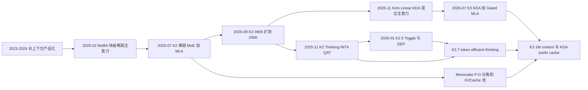
```mermaid
flowchart LR
    A["2023-2024 长上下文产品化"] --> B["2025-02 MoBA 块级稀疏注意力"]
    B --> C["2025-07 K2 稀疏 MoE 加 MLA"]
    C --> D["2025-09 K2 0905 扩到 256K"]
    D --> E["2025-11 Kimi Linear KDA 混合注意力"]
    D --> F["2025-11 K2 Thinking INT4 QAT"]
    F --> K["2026-01 K2.5 Toggle 与 DEP"]
    E --> G["2026-07 K3 KDA 加 Gated MLA"]
    C --> H["Mooncake P-D 分离和 KVCache 池"]
    F --> I["K2.7 token-efficient thinking"]
    K --> I
    G --> J["K3 1M context 与 KDA prefix cache"]
    H --> J
    I --> J
```

### 3.2 模型到技术点映射表

| 模型或阶段 | 推理效率技术点 | 演进状态 | 代表效果 |
|---|---|---|---|
| Kimi Chat / 200 万字内测 | 无损长上下文产品路线 | 后续被 token context、KDA、cache 系统吸收 | 从 20 万汉字到 200 万字口径 |
| MoBA | 块级稀疏注意力 | 探索线，是否进入 K2/K3 生产架构需继续验证 | 为长上下文注意力稀疏化提供前置方案 |
| K2 | 384 experts Top-8 MoE、MLA、MuonClip、128K | K2.x 架构基线 | 1.04T/32B，15.5T tokens 零 loss spike |
| K2-0905 | 256K context | 继承 K2 基线并扩上下文 | SWE-bench Verified 69.2 |
| Kimi Linear | KDA + MLA 3:1 hybrid | K3 前置技术公开 | KV cache 最高降低 75%，1M decode 最高 6.3 倍 |
| K2 Thinking | INT4 QAT | 后续 K2.7-Code 继承，K3 转向 MXFP4/MXFP8 | 官方称 2 倍 generation speed-up |
| K2.5 | MoonViT-3D、Decoupled Encoder Process、Toggle token-efficient RL | 多模态训练效率与推理 token 成本控制线 | 多模态训练效率达到 text-only 训练的 90%；Toggle 使输出 token 平均降低 25% 到 30% |
| K2.7-Code | token-efficient thinking | K3 likely 继承为 effort 控制和成本优化 | thinking token 约降低 30% |
| K3 | 896 experts Top-16、Stable LatentMoE、Quantile Balancing、KDA、AttnRes、Gated MLA、MXFP4/MXFP8、KDA prefix cache | 新一代架构主线 | 2.8T/104B，1M context，约 2.5 倍 scaling efficiency |
| Mooncake / checkpoint-engine | P-D 分离、KVCache 池、早拒、20 秒级权重热更新 | 服务系统线，直接影响部署成本 | 真实负载容量提升 59% 到 498%，生产 A800/H800 请求量提升约 115%/107% |
| K3 训练系统 | MoonEP、全均衡专家执行、静态 shape、zero-copy communication | MoE 系统线，从训练吞吐影响可服务化 | 避免 per-layer host synchronization，降低专家负载不均造成的停顿 |

### 3.3 稀疏 MoE 与专家路由

**提出位置与演进状态**  
K2 首次在 Kimi 开源主线中固定成 1T 总参、32B 激活、384 routed experts、Top-8、1 shared expert 的 MoE 架构。K2-0905 到 K2.7-Code 继续沿用这一族规格。K3 扩到 2.8T 总参、104B 激活、896 routed experts、Top-16、2 shared experts，说明稀疏 MoE 没有被替代，而是进入更大专家池和更高激活容量。

**理论背景**  
Dense Transformer 扩参时，每个 token 基本都会经过所有层的 dense 参数，推理计算随参数规模同步增长。MoE 的核心是让每个 token 只选择少量专家：

$$
r_{\text{active}}=\frac{k}{N_{\text{experts}}}
$$

其中 $k$ 是每个 token 选择的 routed experts 数，$N_{\text{experts}}$ 是专家总数。K2 的路由比例约为 $8/384=2.08\%$，K3 约为 $16/896=1.79\%$。这不是实际 FLOPs 的完整比例，因为还有 attention、shared expert、router、通信和 dense 层成本，但它说明了“总容量扩大”和“单 token 激活计算”可以分离。

**原理机制**  
MoE 每层先用 router 给 token 打分，再选择 Top-k experts 执行 FFN 计算，最后按 gating 权重合并输出。系统瓶颈不只在矩阵计算，还在 expert load、all-to-all 通信、capacity factor、token dispatch 和跨 GPU 负载均衡。专家池越大，模型容量越高，但热门专家拥塞和冷门专家低利用率也越严重。

**Kimi 中的实现和创新**  
K2 的公开资料强调“更瘦激活、更胖容量”：相比增加每 token 激活参数，K2 更偏向扩大总专家池并保持 32B 级激活。知乎第二章提到 K2 与 DeepSeek-V3 的差异，包括 experts 从 256 到 384、heads 从 128 到 64、dense layers 从 3 到 1、sparsity 从 32 到 48。这个说法用于理解 K2 的设计取舍，具体对比仍应以 K2 技术报告和 DeepSeek-V3 报告为准。

K3 的创新在于把专家规模扩到 896，并同时引入 Stable LatentMoE、Quantile Balancing 和 fully balanced expert-parallel training。这说明 K3 的 MoE 演进不只是“专家更多”，而是把路由稳定性、负载均衡和训练/推理系统一起改。

**效果与证据**  
K2 HF 模型卡和技术报告给出 1T/32B、15.5T tokens 训练、MuonClip 稳定训练等信息。知乎第二章引用 K2 report 的 sparse scaling 观点：在 iso-FLOPs 下提高 sparsity 可降低 train/validation loss，并在达到 validation loss 1.5 时给出相对 FLOPs 节省。K3 HF 声明 Stable LatentMoE 让整体 scaling efficiency 相对 K2 提升约 2.5 倍。

**工程影响**  
对本仓库 vLLM serving 实验，MoE 路由意味着 benchmark 不能只记录 tokens/s，还要记录 expert parallel 配置、batch token 分布、跨节点通信、热门专家偏斜和 tail latency。`toy_proxy_server.py` 的路由策略、`disagg_proxy_demo.py` 的 P/D 分离模拟、`mooncake_connector_proxy.py` 的 cache/connector 入口都可以增加 MoE workload 下的 TTFT、TPOT 和队列延迟指标。

**图表证据**  

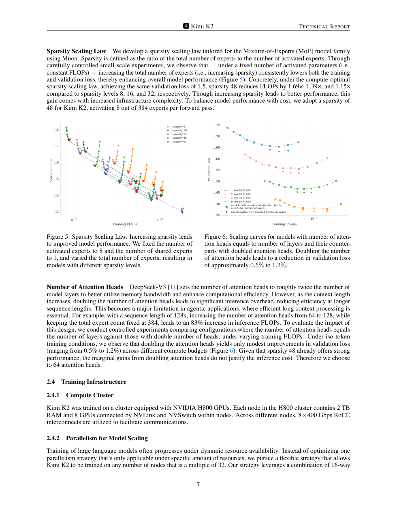

图：Kimi K2 technical report 第 7 页，包含 Figure 5 “Sparsity Scaling Law”、Figure 6 “attention heads scaling curves” 和 K2/DeepSeek-V3 架构对比表。本图支撑本文关于 K2 选择 384 experts、sparsity 48、64 attention heads 的取舍分析。

**参考链接**  
- 主来源：[K2 HF](https://huggingface.co/moonshotai/Kimi-K2-Instruct)，[K2 GitHub](https://github.com/MoonshotAI/Kimi-K2)，[K2 技术报告](https://github.com/MoonshotAI/Kimi-K2/blob/main/tech_report.pdf)，[K3 HF](https://huggingface.co/moonshotai/Kimi-K3)
- 理论背景：[Switch Transformer](https://arxiv.org/abs/2101.03961)，[GShard](https://arxiv.org/abs/2006.16668)
- 辅助来源：[知乎第二章](https://zhuanlan.zhihu.com/p/2061492527589494896)

**待验证问题**  
K2/K3 的真实 expert load 分布、专家并行通信开销、K3 LatentMoE 的路由细节和 vLLM 支持状态仍需要代码、报告或实验补证。

### 3.4 Stable LatentMoE

**提出位置与演进状态**  
Stable LatentMoE 是 K3 明确提出的 MoE 稳定化框架。K2.x 使用普通 routed experts 叙事，K3 在 896 experts、Top-16、104B active 参数下引入 Stable LatentMoE，说明专家池扩大后，稳定路由和服务形态成为第一等问题。

**理论背景**  
MoE 的训练不稳定常来自三个方向：router 过早偏向少数专家、token dispatch 不均导致容量溢出、专家梯度稀疏导致部分专家欠训练。传统做法会加入 auxiliary load balancing loss、capacity factor 或 router z-loss，但这些方法会带来额外超参，并可能和主任务 loss 拉扯。

**原理机制**  
K3 技术报告把 Stable LatentMoE 的动机讲得很明确：普通 MoE 中每个被选 routed expert 接收完整 $d$ 维 token 表示，专家数量和激活专家数扩大后，通信量和 expert-weight traffic 会随路由倍数上升。LatentMoE 把 full model width 和 routed-expert width 分离，shared experts 保留全宽路径，routed experts 在更紧凑的 latent width $\ell$ 上工作。K3 报告给出的形式是：

$$
u=\sum_{i\in T_k(x)} p_i E_i^{\text{routed}}(W_\downarrow x)
$$

$$
y=\sum_{j=1}^{N_s}E_j^{\text{shared}}(x)+W_\uparrow \operatorname{RMSNorm}(u)
$$

其中 $W_\downarrow x\in \mathbb{R}^{\ell}$ 是 routed path 的 latent 表示，$u$ 是聚合后的 routed representation，$N_s=2$ 是 K3 每层固定的 shared experts 数。K3 在 $W_\uparrow$ 前加入 RMSNorm，并使用 SiTU-GLU 抑制 activation explosion，再用 Quantile Balancing 处理负载均衡。

**Kimi 中的实现和创新**  
K3 的创新点在“896 experts 还能服务化”。Top-k MoE 只是选择机制，Stable LatentMoE 更接近大规模 MoE 的稳定训练方案。它和 KDA、AttnRes 一起出现，也说明 K3 不再只是 K2.x 的后训练版，而是重新设计了架构层。

**效果与证据**  
K3 HF 声明 Stable LatentMoE 激活 16/896 experts，并带来约 2.5 倍 overall scaling efficiency over Kimi K2。K3 技术报告 Table 1 给出 K2 到 K3 的结构变化：routed experts 384 到 896、active experts 8 到 16、shared experts 1 到 2、MoE hidden dimension 2048 到 3072、latent MoE dimension 3584。Figure 7 给出 K2/K3 scaling-law 曲线。

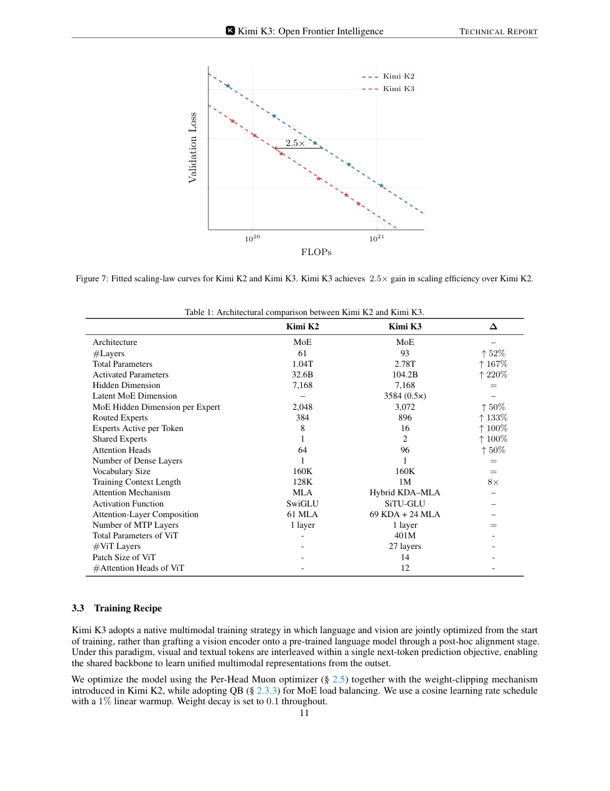

图：Kimi K3 technical report 第 11 页，包含 Figure 7 “2.5x scaling efficiency” 和 Table 1 架构对比。该图用于支撑 K3 是架构跳变而非 K2.x 后训练迭代的判断。

**工程影响**  
如果 K3 的 LatentMoE 需要特殊路由或专家并行策略，本仓库的服务脚本在接入 K3 时不能只按普通 MoE 模型加载。需要检查 vLLM 是否已支持对应 config、专家并行切分、量化格式和 prefix cache。

**参考链接**  
- 主来源：[K3 HF](https://huggingface.co/moonshotai/Kimi-K3)，[K3 blog](https://www.kimi.com/blog/kimi-k3)，[K3 技术报告](https://github.com/MoonshotAI/Kimi-K3/blob/main/k3_tech_report.pdf)
- 理论背景：[Switch Transformer](https://arxiv.org/abs/2101.03961)，[GShard](https://arxiv.org/abs/2006.16668)

**待验证问题**  
Stable LatentMoE 的逐项消融仍需继续摘录：RMSNorm、SiTU-GLU、Quantile Balancing 各自对 validation loss、下游 benchmark 和 expert load 的贡献需要从 K3 report 表格或附录中拆开。

### 3.5 Quantile Balancing

**提出位置与演进状态**  
Quantile Balancing 是 K3 对专家负载均衡问题的公开技术点。K2 主要强调 MuonClip 与 MoE scaling，K3 则把“router-score quantile 推导专家分配”写进官方说明，说明负载均衡已从训练技巧变成架构/系统联合约束。

**理论背景**  
对一个 batch 内的 token 集合 $\mathcal{T}$，专家 $e$ 的负载可写成：

$$
L_e=\sum_{t\in\mathcal{T}}\mathbf{1}(e\in \operatorname{TopK}(g_t))
$$

其中 $g_t$ 是 token $t$ 的 router scores。理想状态下 $L_e$ 接近 $\frac{|\mathcal{T}|k}{N_{\text{experts}}}$。如果 $L_e$ 长期偏离，训练时会出现部分专家欠训练，推理时会出现部分 expert rank 拥塞。

**原理机制**  
传统 auxiliary loss 会鼓励专家被均匀选择，但 loss 权重需要调参。K3 技术报告明确写出 Quantile Balancing 属于 auxiliary-loss-free routing：它给每个专家的 router score 加一个 expert-specific bias $b_j$ 来做 Top-k 选择，但 mixture weight $p_{i,j}$ 仍只由原始 score $s_{i,j}$ 归一化得到：

$$
T_i=\operatorname{argtopk}(s_i+b),\quad
p_{i,j}=\frac{s_{i,j}}{\sum_{r\in T_i}s_{i,r}},\quad j\in T_i
$$

这样 $b$ 调节 dispatch，不直接改 router 的梯度优化目标。设一个 batch 有 $m$ 个 tokens、$n$ 个 routed experts、Top-k，则目标负载是 $q=mk/n$。QB 用 Top-$k+1$ 得到每个 token 的 cutoff $\alpha_i^{(t)}$，再用 margin $s_{:,j}-\alpha^{(t)}$ 的分位数更新下一步 bias：

$$
\hat{b}_{j}^{(t+1)}\leftarrow
-\operatorname{quantile}_{1-k/n}\left(s_{:,j}-\alpha^{(t)}\right)
$$

$$
b^{(t+1)}\leftarrow \hat{b}^{(t+1)}-\operatorname{mean}(\hat{b}^{(t+1)})\mathbf{1}
$$

最终 bias 在 inference 时冻结。大规模训练时，K3 不精确 gather 全局 margin，而是用 histogram estimator：各 rank 统计 bins 后 all-reduce，再从 pooled counts 恢复近似 quantile。

**Kimi 中的实现和创新**  
K3 把 Quantile Balancing 与 Stable LatentMoE、fully balanced expert-parallel training 放在同一组技术中，创新点是把“训练稳定”和“服务负载”一起优化，而不是只在 loss 上加一个均衡项。

**效果与证据**  
K3 report Figure 5 用 $m=8$ tokens、$n=4$ routed experts、$k=1$ 的例子展示 QB：普通 token-wise Top-k 产生负载 $(4,3,1,0)$，QB 调整后得到 balanced load $(2,2,2,2)$。这不是最终大模型指标，但直观说明 QB 如何把 router-score margin 转成目标负载。

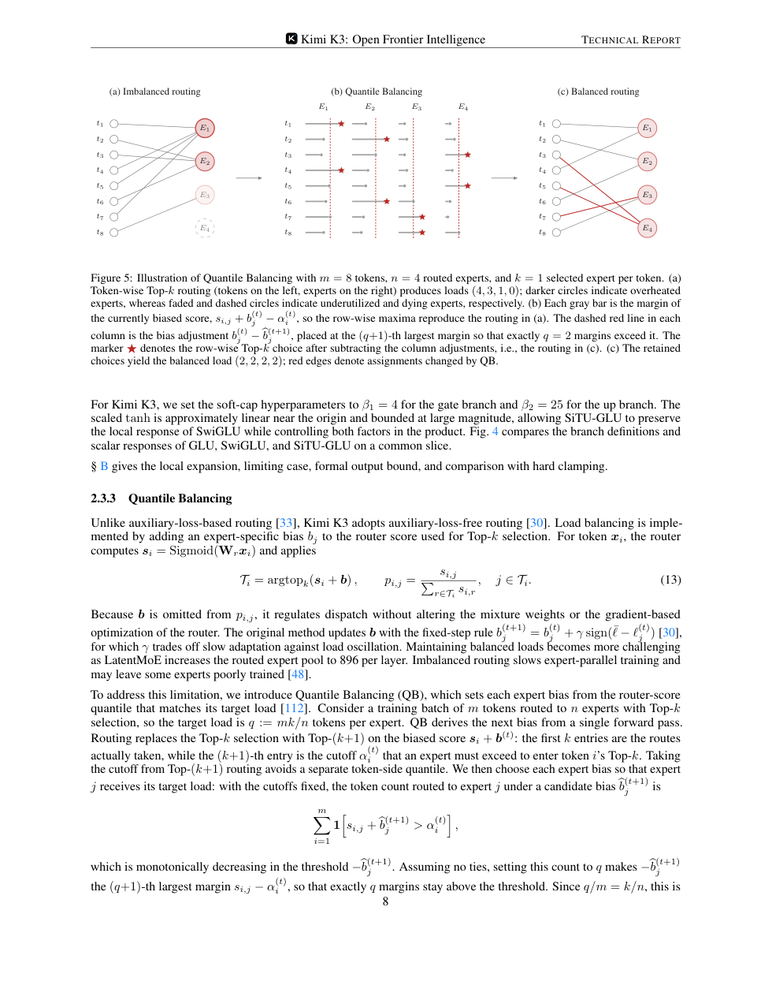

图：Kimi K3 technical report 第 8 页，Figure 5 “Illustration of Quantile Balancing”。该图支撑本文对 QB 的负载均衡机制分析。

**工程影响**  
本仓库如果做 MoE 服务压测，应加入专家负载方差、rank 间 token dispatch 差异和 p95/p99 decode latency。只看平均 tokens/s 会掩盖专家拥塞。

**参考链接**  
- 主来源：[K3 blog](https://www.kimi.com/blog/kimi-k3)，[K3 HF](https://huggingface.co/moonshotai/Kimi-K3)
- 理论背景：[GShard](https://arxiv.org/abs/2006.16668)，[Switch Transformer](https://arxiv.org/abs/2101.03961)

**待验证问题**  
QB 的 histogram bin 宽度、更新频率、与不同 batch size/global batch 的鲁棒性、对下游 benchmark 的单独消融还需要继续摘录。

### 3.6 MLA 与 Gated MLA

**提出位置与演进状态**  
K2 到 K2.7-Code 的公开模型卡都把 attention mechanism 标为 MLA。K3 的模型卡给出 69 KDA + 24 Gated MLA 的层组成，说明 MLA 没被完全替代，而是在 K3 中被 KDA 大比例替换，同时以 Gated MLA 形式保留在部分层。

**理论背景**  
标准 MHA 的 KV cache 大小近似为：

$$
M_{\text{KV}}\propto L \cdot n_{\text{layers}}\cdot n_{\text{heads}}\cdot d_{\text{head}}\cdot 2
$$

其中 $L$ 是上下文长度，$2$ 代表 key 和 value。上下文从 128K 到 1M 时，KV cache 会线性增长。MQA/GQA 通过共享 key/value heads 减少 cache；MLA 则把 K/V 压缩到 latent 表示，再在 attention 中恢复或投影使用。

**原理机制**  
MLA 的直观形式是先把 hidden state $h_t$ 压缩到低维 latent：

$$
c_t = W_c h_t
$$

再由 latent 生成 query/key/value 所需表示。它和 MQA/GQA 的差别是：MQA/GQA 主要减少 head 数，MLA 主要减少保存表示的维度。K3 技术报告给 Gated MLA 的输出门写成：

$$
y_t=W_o[\operatorname{Sigmoid}(W_gx_t)\odot \tilde{o}_t]
$$

其中 $\tilde{o}_t$ 是未加门控的 MLA 输出。这个 full-rank output gate 让每个 token 可以按通道调制从 global attention 读取的信息。

**Kimi 中的实现和创新**  
K2 公开资料显示 MLA 与 64 attention heads 共同出现。知乎第二章提到 K2 曾比较 64 与 128 attention heads：128 heads 可降低 validation loss，但在 128K context 上显著增加 inference FLOPs，因此最终选择 64 heads。这个观点解释了 K2 的训练小亏与推理大赢取舍，细节需以 K2 report 消融表为准。

K3 的 69 KDA + 24 Gated MLA 说明 MLA 从“主 attention 机制”变成“混合架构中的保真 attention 层”。K3 report 进一步说明每个 block 包含 3 个 KDA layer 后接 1 个 Gated MLA layer，最终 backbone 末尾额外放一个 Gated MLA layer，保证最后一层总是 global attention。K3 的 Gated MLA 使用 NoPE，不对 query/key 加显式位置编码；位置敏感和近因信息由中间 KDA 层提供。

**效果与证据**  
DeepSeek-V2 的 MLA 论文给出 KV cache 降低和吞吐提升背景。K2/K2.x 模型卡确认 MLA 是主 attention 机制。K3 模型卡确认 Gated MLA 层数。知乎第二章引用第三方口径称 MLA 相比 64-head MHA 有显著 KV 维度压缩，这一具体倍数应继续从 K2 report 或实现配置核验。

**工程影响**  
服务侧要把 MLA cache 和普通 MHA cache 区分。对 vLLM 来说，支持 MLA 不等于支持 KDA；K3 的 KDA prefix cache 需要额外实现。benchmark 时应分别记录 prefill 显存、decode 显存、batch size 上限和长上下文下 TPOT。

**图表证据**  

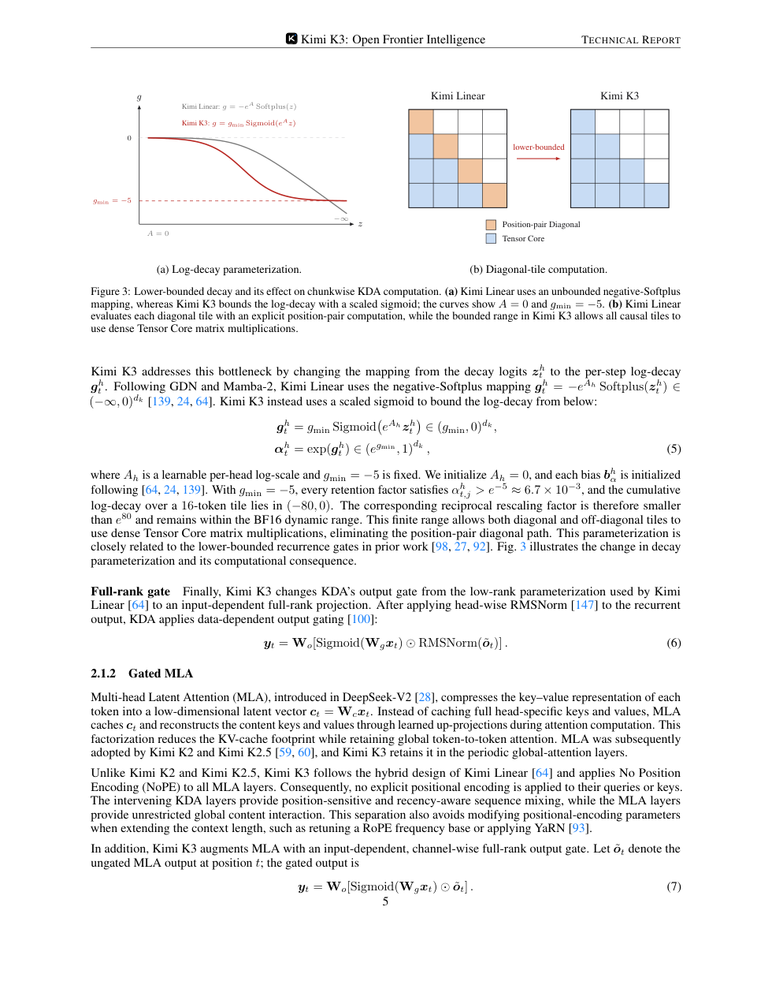

图：Kimi K3 technical report 第 5 页，包含 KDA recurrence、Gated MLA 输出门和 Attention Residuals 公式开头。该图用于支撑 K3 hybrid attention 和跨深度信息流分析。

**参考链接**  
- 主来源：[K2 HF](https://huggingface.co/moonshotai/Kimi-K2-Instruct)，[K2.7-Code HF](https://huggingface.co/moonshotai/Kimi-K2.7-Code)，[K3 HF](https://huggingface.co/moonshotai/Kimi-K3)
- 理论背景：[DeepSeek-V2 MLA](https://arxiv.org/abs/2405.04434)，[Multi-Query Attention](https://arxiv.org/abs/1911.02150)，[Grouped-Query Attention](https://arxiv.org/abs/2305.13245)
- 辅助来源：[知乎第二章](https://zhuanlan.zhihu.com/p/2061492527589494896)

**待验证问题**  
K2 的 MLA latent 维度、RoPE 解耦参数、64 heads 与 128 heads 消融、K3 Gated MLA 的 gating 公式，需要技术报告详细复核。

### 3.7 KDA 与 Kimi Linear

**提出位置与演进状态**  
Kimi Linear 是 K3 前的 KDA 技术公开节点。知乎第二章把 Kimi Linear 放在 2025-11，并描述为 KDA 与 MLA 的 3:1 混合路线。K3 正式把 KDA 写入主模型架构，并在 HF 模型卡中给出 69 KDA + 24 Gated MLA。

**理论背景**  
线性注意力试图把标准 attention 的 $O(L^2)$ 依赖改成可递推状态。一个简化形式是：

$$
S_t = S_{t-1} + \phi(k_t)v_t^\top
$$

$$
o_t = \frac{\phi(q_t)^\top S_t}{\phi(q_t)^\top z_t}
$$

其中 $S_t$ 是随时间更新的状态，$\phi(\cdot)$ 是 kernel feature，$z_t$ 是归一化项。DeltaNet/Gated DeltaNet 进一步用 delta rule 和门控更新有限状态 memory，目标是在效率和表达力之间取平衡。

**原理机制**  
KDA 可以理解为 Kimi 对 Gated DeltaNet 的改进版：它用更细粒度 gating 控制状态更新，使有限状态 memory 不只是被动累加，而是选择性写入、更新和遗忘。K3 report 给出单头 recurrence：

$$
S_t=\left(I-\beta_t k_t k_t^\top\right)\operatorname{Diag}(\alpha_t)S_{t-1}+\beta_t k_t v_t^\top,\quad \tilde{o}_t=S_t^\top q_t
$$

其中 $\alpha_t\in(0,1)^{d_k}$ 是 channel-wise one-step retention factor，$\beta_t\in(0,1)$ 控制 delta-rule write strength。KDA 还采用 chunkwise parallel form：chunk 之间递推，chunk 内并行，从而兼顾训练并行性和长序列状态建模。

**Kimi 中的实现和创新**  
Kimi Linear 公开了 KDA + MLA 的混合架构，K3 report 正式确认 3:1 mixing ratio：每个 block 三层 KDA 后接一层 Gated MLA，并在 backbone 末尾额外加一个 Gated MLA。K3 还把 KDA 的 output gate 从 Kimi Linear 使用的 low-rank parameterization 改成 full-rank gate。这说明 Kimi 没有押注纯 linear attention，而是保留部分 global attention 来补偿有限状态模型对精确检索的弱点。

**效果与证据**  
Kimi Linear README 和技术报告确认：Kimi Linear 是 48B total、3B activated 的研究模型，context length 1M，训练 5.7T tokens，并开源 KDA kernel 与 vLLM implementation。报告摘要称在相同训练 recipe 下，Kimi Linear 相比 full MLA 在所有评估任务上有明显优势，KV cache usage 最多降低 75%，1M context decode throughput 最多提升 6 倍。报告 Figure 1 进一步给出 1M tokens 下 TPOT 为 1.84ms vs MLA 11.48ms，对应 6.3 倍；RULER 128K 上 Kimi Linear 达到 84.3，并有 3.98 倍 speedup。

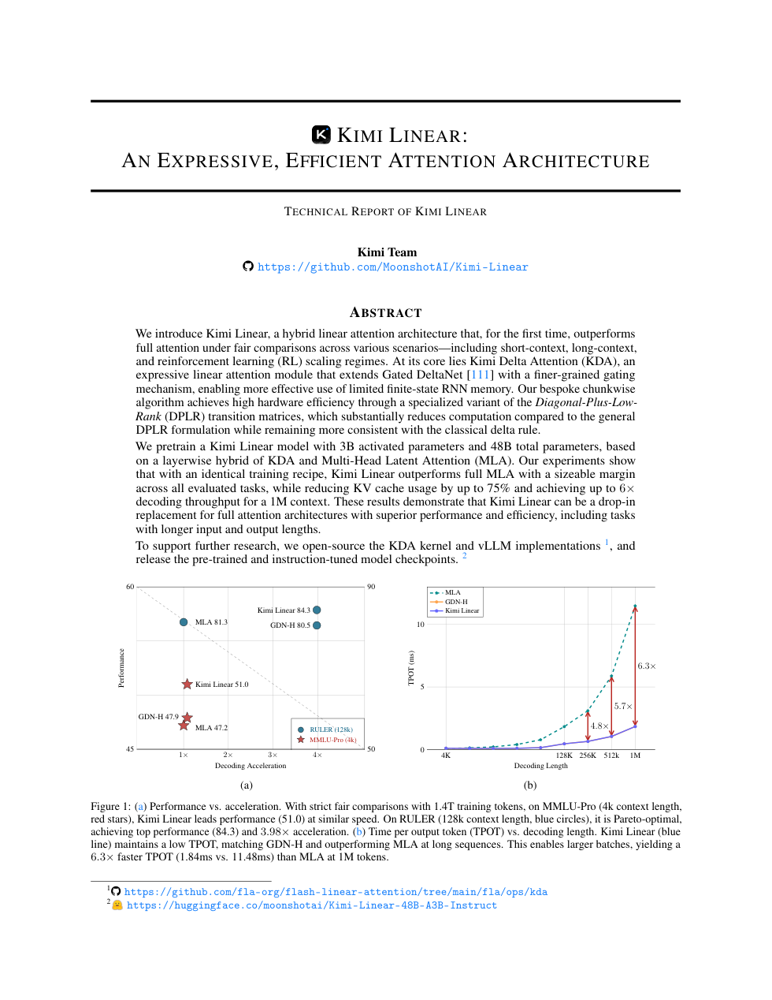

图：Kimi Linear technical report 第 1 页，展示 MMLU-Pro、RULER、1M decode TPOT 和 6.3 倍速度差。该图支撑本文对 KDA 长上下文效率收益的量化说明。

Kimi Linear report Table 1 对 hybrid ratio 做消融：3:1，即 3 个 KDA layers 对 1 个 MLA layer，得到最好的 quality-throughput trade-off；纯 KDA 召回能力不足，纯 full-attention baseline 又牺牲效率。报告还说明 KDA 固定 $a=b=k$ 约束 DPLR 形式，去掉若干矩阵乘，kernel speed 相比一般 DPLR 约提升 2 倍。

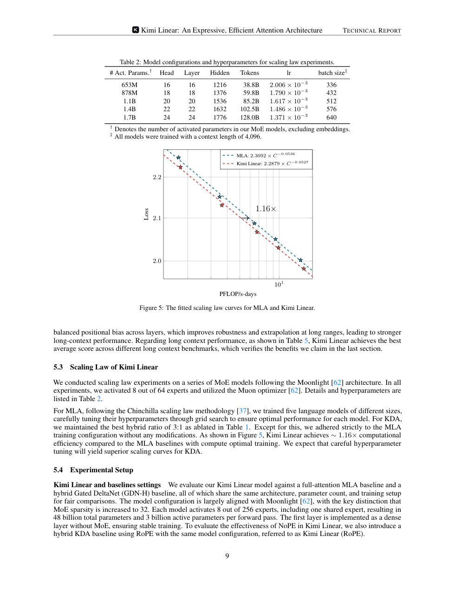

图：Kimi Linear technical report 第 9 页，包含 Table 1 hybrid ratio ablation 和 Figure 5 scaling-law 曲线。该图支撑 3:1 KDA/MLA 混合比例不是随意选择。

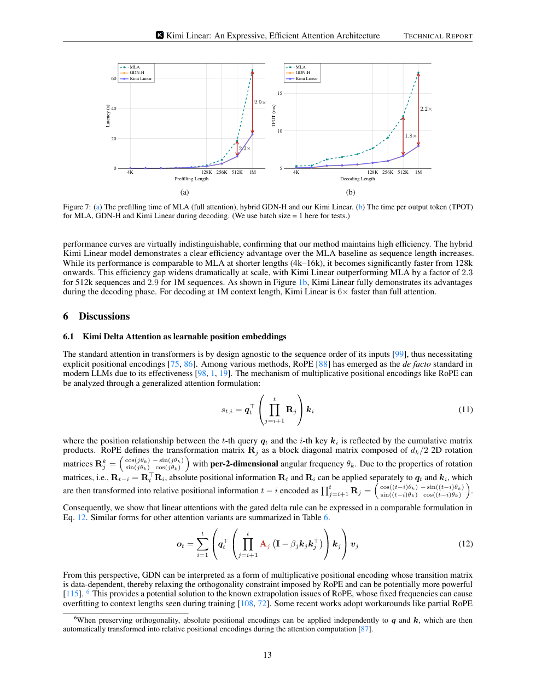

图：Kimi Linear technical report 第 13 页，Figure 7 对比 MLA、GDN-H 和 Kimi Linear 的 prefill time 与 TPOT。该图支撑 128K 以后 Kimi Linear 的长上下文效率优势。

**工程影响**  
KDA 改变 prefix cache 的语义。传统 prefix cache 复用的是每层 KV 张量；KDA 还要复用或重建递推状态。如果本仓库要接 K3，需要确认 vLLM 对 KDA state、prefix sharing、cache eviction 和多请求合批的处理是否稳定。

**图表证据**  

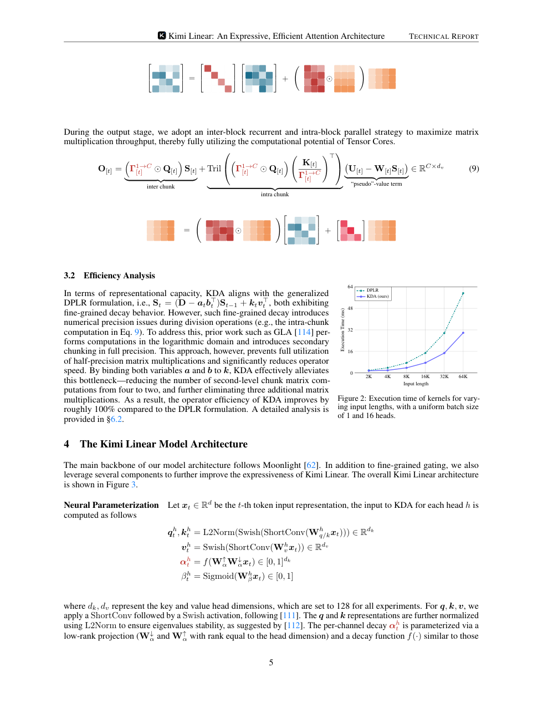

图：Kimi Linear technical report 第 5 页，包含 KDA chunkwise algorithm 相关推导和 kernel/algorithm 说明。该图用于支撑本文对 KDA 从 DeltaNet/Gated DeltaNet 到 chunkwise 并行实现的分析。

**参考链接**  
- 主来源：[Kimi Linear paper](https://huggingface.co/papers/2510.26692)，[Kimi Linear GitHub](https://github.com/MoonshotAI/Kimi-Linear)，[K3 HF](https://huggingface.co/moonshotai/Kimi-K3)
- 理论背景：[Gated Delta Networks](https://arxiv.org/abs/2412.06464)
- 辅助来源：[知乎第二章](https://zhuanlan.zhihu.com/p/2061492527589494896)

**待验证问题**  
KDA 在 K3 中相对 Kimi Linear 的具体改动已经确认包括 lower-bounded decay 和 full-rank output gate；仍需继续摘录 Kimi Linear 的 synthetic task 结果、RLVR 曲线和 K3 的 KDA Context Parallelism 细节。

### 3.8 MoBA：把路由思想搬进块级注意力

**提出位置与演进状态**  
MoBA 在 2025-02 公开，GitHub 描述为 “Mixture of Block Attention for Long-Context LLMs”。知乎第二章把它作为长上下文技术线的一部分，早于 Kimi Linear/KDA。当前公开 K2/K3 模型卡没有把 MoBA 写成主架构名，因此本文把它标为“长上下文效率探索线”。

**理论背景**  
标准 full attention 对长度 $L$ 的复杂度是 $O(L^2)$。块稀疏注意力把上下文拆成 blocks，再只对部分 blocks 做 attention，复杂度取决于被选中的块数。MoBA 的关键思想是把 MoE 的 top-k routing 用在 block attention：token 或 query 不再均匀访问所有历史块，而是选择最相关的块。

**原理机制**  
可以把上下文切成 $B$ 个 block，每个 query 通过 router 选择 $k_b$ 个 block：

$$
\mathcal{B}_q = \operatorname{TopK}(r(q, B_1), \ldots, r(q, B_B))
$$

然后只在 $\mathcal{B}_q$ 内做 attention。这样可以减少长上下文下的 attention 计算，但难点是路由错误会直接丢失证据，尤其在需要精确引用长文档片段时。

**Kimi 中的实现和创新**  
MoBA 的创新在于把“专家路由”类思想迁移到 attention blocks。它和 KDA 的差别是：MoBA 仍然是选择历史块做 attention，KDA 则用递推状态承载长程信息。前者更像稀疏检索，后者更像状态压缩。

**效果与证据**  
当前已确认 MoBA 仓库存在，但本文尚未抽取论文消融和实现细节。它在 Kimi 主线中的地位更像“被后续 KDA/K3 架构吸收的问题域”，而不是已确认的 K3 组件。

**工程影响**  
如果本仓库要验证长上下文稀疏注意力，MoBA 类方法需要额外记录召回损失：只看吞吐会误判。推荐压测指标包括长文 needle 召回、跨文件代码定位、不同 block size 的 TTFT/TPOT 和错误率。

**参考链接**  
- 主来源：[MoBA GitHub](https://github.com/MoonshotAI/MoBA)
- 辅助来源：[知乎第二章](https://zhuanlan.zhihu.com/p/2061492527589494896)
- 理论背景：[Longformer](https://arxiv.org/abs/2004.05150)，[BigBird](https://arxiv.org/abs/2007.14062)

**待验证问题**  
MoBA 是否被 K2/K3 的任何生产模型直接使用、block routing 的训练目标、和 KDA 的迁移关系仍需官方资料确认。

### 3.9 Attention Residuals

**提出位置与演进状态**  
Attention Residuals，简称 AttnRes，是 K3 官方公开的新技术点。K2.x 没有把它作为架构名披露。K3 在 93 层、1M context、KDA/Gated MLA 混合结构下引入 AttnRes，目标是改善深层网络中的信息传递。

**理论背景**  
普通 residual connection 解决深层网络梯度传播和表示累积问题，但它通常是层与层之间的局部加法路径。长上下文和深层模型中，信息可能在多层变换后被稀释，尤其是早期层捕捉到的局部证据或工具状态不一定能被后续层直接检索。

**原理机制**  
K3 blog 的公开描述是 “selectively retrieves representations across depth, rather than uniformly accumulating them”。K3 report 给出更具体的形式：对第 $l$ 层，定义 layer-specific learnable pseudo-query $q_l=w_l$，前面层的输出作为 keys/values。注意力权重为：

$$
\alpha_{i\to l}=
\frac{\phi(q_l,k_i)}{\sum_{j=0}^{l-1}\phi(q_l,k_j)},\quad
h_l=\sum_{i=0}^{l-1}\alpha_{i\to l}v_i
$$

其中 $\phi(q,k)=\exp(q^\top \operatorname{RMSNorm}(k))$。Full AttnRes 需要保留所有前层表示，K3 report 又给出 Block AttnRes：把 $L$ 层分成 $N$ 个 blocks，在 block 级别聚合表示，把 memory/communication overhead 从 $O(Ld)$ 降到 $O(Nd)$。

**Kimi 中的实现和创新**  
AttnRes 与 KDA 结合的意义在于：KDA 压缩长程 token 维度的信息，AttnRes 则补充深度维度的信息通道。K3 同时拉长 context 和加深层数，如果只靠普通 residual，模型可能在跨百万 token、跨多轮工具历史时更容易丢关键状态。K3 report 说明 K3 把层分成 8 个 blocks，每个 block 约 12 层，计入 embedding 后是 9 个 block-level sources。

**效果与证据**  
K3 官方把 AttnRes 与 KDA、Stable LatentMoE 共同列为架构创新，但公开摘要没有给单独消融。K3 的强项 benchmark，如 BrowseComp 91.2、Terminal Bench 2.1 88.3、GPQA-Diamond 93.5，只能说明整体系统有效，不能单独归因给 AttnRes。

**工程影响**  
AttnRes 主要影响模型实现而非调度策略。本仓库接入时需要检查模型 config 和自定义 attention/kernel 是否被 vLLM 支持；否则即使权重开放，也可能不能直接用标准推理路径加载。

**参考链接**  
- 主来源：[K3 blog](https://www.kimi.com/blog/kimi-k3)，[K3 HF](https://huggingface.co/moonshotai/Kimi-K3)
- 理论背景：[ResNet](https://arxiv.org/abs/1512.03385)，[Transformer](https://arxiv.org/abs/1706.03762)

**待验证问题**  
AttnRes 对不同任务的单独消融、Block AttnRes 的具体 block 边界、与 pipeline parallel communication 的实现细节仍需继续从 K3 report 后文和代码中摘录。

### 3.10 长上下文、YaRN、KDA prefix cache

**提出位置与演进状态**  
Kimi 早期以 20 万汉字、200 万字长上下文建立产品差异。K2 使用 128K token context，K2-0905 到 K2.7-Code 提升到 256K，K3 提升到 1048576 tokens。演进方式从“产品可用的长文窗口”逐步变成“模型架构、位置编码、cache 系统、工具历史管理”的组合问题。

**理论背景**  
长上下文通常涉及三类技术：位置编码扩展，例如 YaRN/RoPE scaling；注意力或状态机制，例如 sparse attention、MLA、KDA；系统层 cache 与调度，例如 prefix cache、P-D 分离、KVCache pool。它们不能互相替代。RAG 是检索外部材料后放入上下文，解决召回和证据选择；长上下文解决模型一次可见的材料上限。

**原理机制**  
如果使用标准 attention，prefill 成本和上下文长度关系非常重，KV cache 也随长度线性增长。KDA 把部分长程历史压缩进状态，降低对完整 KV 的依赖；prefix cache 则复用已经计算过的长 prefix。K3 blog 明确提到 KDA 给传统 prefix caching 带来新挑战，并向 vLLM 社区贡献支持。

**Kimi 中的实现和创新**  
Kimi 早期“无损长上下文”强调用户感知层面的不裁剪；K3 的 1M context 则是技术栈层面的重构。K3 report 明确说 K3 使用 NoPE，不使用显式 positional embedding，而是通过 KDA 的 recurrent gating 和 decay 机制隐式编码位置，因此可直接外推到 1M tokens，不需要 RoPE rescaling、interpolation 或 YaRN。训练上，K3 使用 progressive context extension：预训练阶段从 8K 扩到 64K，cooldown 阶段从 256K 扩到 1M，并合成需要在完整 1M context 中跨位置取证的长上下文任务，防止模型退化成本地模式。

**效果与证据**  
K2-0905 的 HF 模型卡确认 context 从 128K 到 256K；K3 HF 确认 1048576 context。Kimi Linear 给出 1M context 的 cache 和 decode 收益。K3 report 把 1M context 归因于 KDA/NoPE、长上下文数据清洗、合成跨全文任务和渐进式扩窗，而不是单纯位置编码技巧。K3 blog 提到 coding workloads cache hit rate 超过 90%，但这属于官方 API 与 Mooncake 系统组合效果。

**工程影响**  
本仓库验证长上下文时，需要分开测：长 prompt prefill、长会话 decode、prefix 复用、RAG 摘要后短 prompt、KDA prefix cache。建议 benchmark 输出至少包含 `prompt_tokens`、`generated_tokens`、`TTFT`、`TPOT`、`cache_hit_rate`、`max_memory_allocated`。

**参考链接**  
- 主来源：[K2-0905 HF](https://huggingface.co/moonshotai/Kimi-K2-Instruct-0905)，[K3 HF](https://huggingface.co/moonshotai/Kimi-K3)，[K3 blog](https://www.kimi.com/blog/kimi-k3)
- 理论背景：[YaRN](https://arxiv.org/abs/2309.00071)，[vLLM](https://github.com/vllm-project/vllm)
- 辅助来源：[知乎第二章](https://zhuanlan.zhihu.com/p/2061492527589494896)

**待验证问题**  
K3 的 1M context 是否在所有部署格式、所有工具 harness、所有 batch size 下可用，需要结合官方 API、vLLM 实现和本地硬件实验确认。

### 3.11 Mooncake：P-D 分离、KVCache 池与早拒

**提出位置与演进状态**  
Mooncake 不是单个 Kimi 模型层，而是支撑 Kimi 长上下文服务的推理系统。知乎第二章把 Mooncake 放在推理基础设施章节，并强调 FAST 2025 最佳论文、P-D 分离、KVCache 池、预测式早拒。K3 blog 也提到官方 API 由 Mooncake 的 disaggregated inference architecture 支撑。

**理论背景**  
LLM serving 中 prefill 和 decode 的资源特征不同：prefill 对长 prompt 做大批量矩阵计算，偏 compute-bound；decode 每步生成一个 token，频繁访问 KV cache，偏 memory-bandwidth 和 latency-bound。把二者拆开调度，可以让 prefill 节点和 decode 节点按不同目标优化。

**原理机制**  
Mooncake 的核心是 KVCache-centric disaggregated architecture：把 KV cache 作为一等资源，使用集中或分层的 cache pool，在 prefill、decode 和 cache storage 之间做调度。Mooncake FAST 论文 Figure 2 中，Conductor 会为请求选择 prefill instance 和 decoding instance，流程是：尽量把可复用 KVCache 传到 prefill 节点；prefill 以 chunks/layers 方式执行并持续把新 KVCache streaming 到 decode 节点；decode 节点加载 KVCache 并进入 continuous batching。

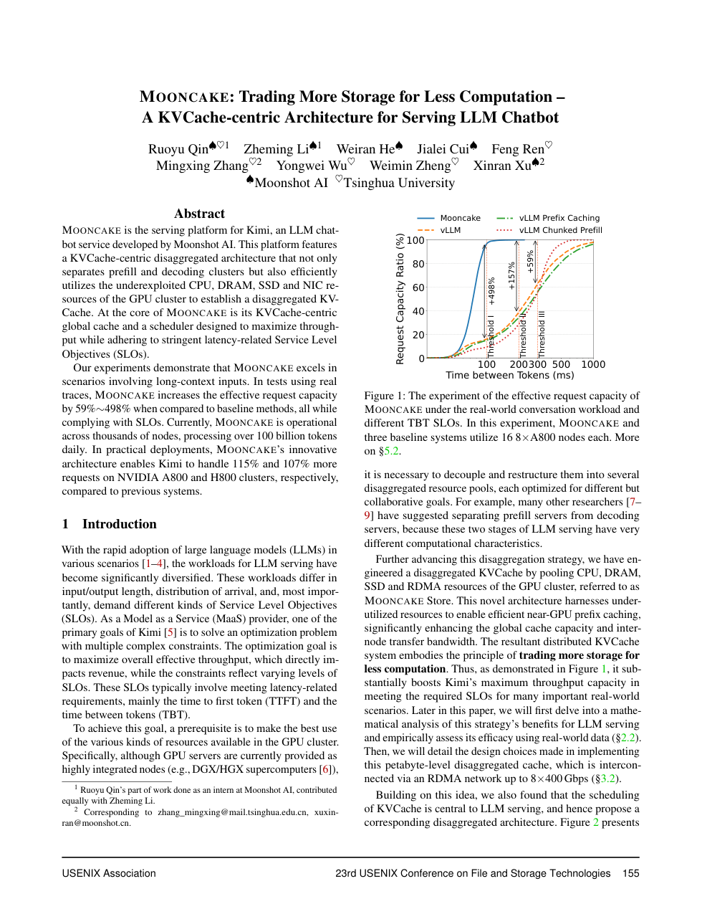

图：Mooncake FAST 2025 paper 第 2 页，Figure 2 “MOONCAKE Architecture”。该图支撑本文对 prefill/decode/cache 三者解耦和 Conductor 调度职责的分析。

论文还给出 prefill FLOPs 估计：

$$
\operatorname{flops}(n)=l\times(an^2d+bnd^2)
$$

如果复用长度为 $p$ 的 KVCache，则可减少约 $l\times(ap^2d+bpd^2)$ 的 prefill 计算，但需要把 cache 从分布式存储加载到 GPU HBM。论文给出一个 TTFT 有益条件：

$$
\frac{B}{G}>\frac{2ds}{gqa\times(apd+bd^2)}
$$

其中 $G$ 是平均计算吞吐，$B$ 是平均 KVCache loading speed，$s$ 是 cache 元素字节数，$gqa$ 与 GQA 分组相关。这个公式说明 cache reuse 不是无条件收益：长 prefix、足够快的 cache transfer、足够高的重复率同时满足时才划算。

**Kimi 中的实现和创新**  
Kimi 的 long-horizon coding、preserved thinking、1M context 和高 cache hit workload 很适合 P-D 分离。官方材料中 coding workloads cache hit rate 超过 90% 的说法，说明 Kimi API 很可能通过稳定 prefix、项目上下文、工具历史和会话状态获得大量复用。

**效果与证据**  
Mooncake FAST 论文摘要确认：在真实 traces 上，Mooncake 相比 baseline 在满足 SLO 的前提下把 effective request capacity 提高 59% 到 498%；生产部署处理超过 100 billion tokens/day，并让 Kimi 在实际部署中可处理 115% 和 107% 更多请求。论文还报告 Mooncake Store 相比 local cache 的 cache hit rate 最高提升 2.36 倍，prefill computation time 最多节省 48%。Mooncake README 记录 Kimi K2 在 128 H200 GPUs 上的 PD disaggregation 和 expert parallel deployment，prefill throughput 224k tokens/s、decode throughput 288k tokens/s。

**工程影响**  
本仓库已有 `mooncake_connector_proxy.py`、`disagg_proxy_demo.py`、`toy_proxy_server.py` 和 vLLM benchmark 脚本，正好可以把 Mooncake 思路落成实验：比较单体 vLLM、手工 P-D 分离、connector proxy、prefix cache 命中和不同并发下的 TTFT/TPOT。

**截图坑位**  
可后续截取 FAST 2025 Mooncake 论文中的架构图和 workload throughput 表。建议文件名：`mooncake_pd_kvcache_fast25_arch.png`。

**参考链接**  
- 主来源：[Mooncake GitHub](https://github.com/kvcache-ai/Mooncake)，[Mooncake FAST 2025 Paper](https://www.usenix.org/system/files/fast25-qin.pdf)，[K3 blog](https://www.kimi.com/blog/kimi-k3)
- 工程背景：[vLLM](https://github.com/vllm-project/vllm)
- 辅助来源：[知乎第二章](https://zhuanlan.zhihu.com/p/2061492527589494896)

**待验证问题**  
Mooncake 的 cache key 设计、跨节点 cache 迁移成本、KDA state 是否进入 cache pool、早拒策略是否适合本仓库 benchmark，需要实际服务压测。FAST 论文中的 115%/107% 两组生产提升还要补全对应硬件和 workload 说明。

### 3.12 checkpoint-engine 与万亿权重热更新

**提出位置与演进状态**  
知乎第二章把 checkpoint-engine 放在推理基础设施中，和 Mooncake、开源生态放在一起。它的定位不是提升单请求速度，而是降低大模型服务迭代时的停机和冷启动成本。

**理论背景**  
万亿参数模型权重巨大。若每次更新都重新拉起服务，成本包括权重分发、GPU 显存加载、通信初始化、cache 失效和流量切换。热更新希望在保持服务可用的前提下，把新 checkpoint 快速写入运行集群。

**原理机制**  
checkpoint-engine 基于 Mooncake P2P Store 思路，通过并行分发、分块传输和就地加载缩短权重更新路径。对 FP8/INT4/MXFP 这类部署格式，checkpoint 文件格式、张量分片和设备端加载路径会直接影响更新时间。

**Kimi 中的实现和创新**  
知乎第二章记录 Kimi K2 1T FP8 量级权重可在约 20 秒热更新到千卡级集群，并提到 K2-Instruct FP8 在 256 H20 上约 21.5 秒。本文把这些作为系统能力线索，后续需以 checkpoint-engine 仓库和 Mooncake 文档核验。

**效果与证据**  
Mooncake README 的 2025-09-10 更新记录写明：高性能 Mooncake P2P Store 以 checkpoint-engine 形式开源，并已用于 K1.5 和 K2 生产训练，可在千卡级 GPU 集群上约 20 秒更新 Kimi-K2 1T 参数模型。README 还记录 SGLang 2026-04-29 使用 Mooncake TransferEngine 做 RDMA P2P weight transfer，把 1T Kimi-K2 权重更新从 53 秒降到 7.2 秒。后一条属于 SGLang 集成案例，不应直接等同于 checkpoint-engine 自身指标，但能证明 Mooncake TransferEngine 已进入大规模 RL/权重同步场景。

**工程影响**  
对本仓库而言，热更新可转化成两个实验：一是权重加载和服务恢复时间统计；二是模型版本切换时 cache 是否保留、请求是否中断、代理层如何 drain 老请求。

**参考链接**  
- 主来源：[Mooncake GitHub](https://github.com/kvcache-ai/Mooncake)，[checkpoint-engine GitHub](https://github.com/MoonshotAI/checkpoint-engine)
- 辅助来源：[知乎第二章](https://zhuanlan.zhihu.com/p/2061492527589494896)

**待验证问题**  
checkpoint-engine 的最新仓库 README、支持的量化格式、P2P Store 与 Mooncake Store 的边界、是否能和 vLLM/Mooncake connector 无缝使用，需要继续复核。

### 3.13 QAT、INT4、MXFP4 与 MXFP8

**提出位置与演进状态**  
K2 Thinking 是 Kimi 主线中明确强调 native INT4 QAT 的节点。K2.7-Code 沿用 native INT4 quantization。K3 则使用 MXFP4 weights / MXFP8 activations，并在官方说明中强调 quantization-aware training。

**理论背景**  
PTQ 是训练后量化，部署简单但低比特时误差较大。QAT 在训练或后训练阶段模拟量化误差，使模型参数适应目标低精度格式。量化误差可以粗略写成：

$$
\hat{x}=s\cdot \operatorname{round}(x/s),\quad \epsilon=x-\hat{x}
$$

其中 $s$ 是 scale，$\epsilon$ 是量化误差。QAT 的目标是让训练过程对 $\epsilon$ 鲁棒。

**原理机制**  
INT4 通常强调 4-bit 整数量化，部署生态成熟度取决于 kernel 和 calibration。MXFP4/MXFP8 是更接近硬件浮点格式的低精度路线，weights 用 MXFP4 降低显存，activations 用 MXFP8 平衡动态范围和吞吐。K3 从 SFT 起纳入 QAT，意味着低精度不是上线前压缩，而是能力对齐阶段的一部分。

**Kimi 中的实现和创新**  
K2 Thinking 的重要点是 benchmark 全部在 INT4 QAT 模型上报告，官方称降低延迟和 GPU 显存，同时达到近似无损效果。K3 的创新是把部署格式进一步前移到训练目标，并和 2.8T/104B、1M context 的服务需求绑定。

**效果与证据**  
K2 Thinking HF 写明 native INT4 quantization model with 256k context window，并称 generation speed-up 约 2 倍。K3 HF 写明 MXFP4 weights / MXFP8 activations。K2.7-Code HF 写明基于 K2.6 的 coding-focused model，并沿用 native INT4 quantization。

**工程影响**  
本仓库在测 K2 Thinking、K2.7 或 K3 时，需要记录量化格式和 kernel 路径。INT4、FP8、MXFP4/MXFP8 的显存和吞吐不能混在同一张表中直接比较。服务脚本应把模型权重格式、activation dtype、KV cache dtype、tensor parallel 和 expert parallel 一并记录。

**参考链接**  
- 主来源：[K2 Thinking HF](https://huggingface.co/moonshotai/Kimi-K2-Thinking)，[K2.7-Code HF](https://huggingface.co/moonshotai/Kimi-K2.7-Code)，[K3 HF](https://huggingface.co/moonshotai/Kimi-K3)
- 理论背景：[Quantization and Training of Neural Networks](https://arxiv.org/abs/1712.05877)，[compressed-tensors](https://github.com/vllm-project/compressed-tensors)

**待验证问题**  
MXFP4/MXFP8 在当前 vLLM、GPU 和驱动组合中的支持成熟度，以及 K3 官方权重是否能直接走本仓库现有脚本，需要实际加载验证。

### 3.14 MuonClip、Per-Head Muon 与训练稳定性

**提出位置与演进状态**  
K2 使用 MuonClip 支撑 1T MoE 训练。K3 进一步提到 Per-Head Muon，把 Muon 路线延伸到 attention head 级学习动态。它们不是推理 kernel 技术，但决定大模型能否稳定训练到可服务形态。

**理论背景**  
AdamW 对参数逐元素更新，Muon 类优化器更强调矩阵更新的正交化和谱性质。对大规模 Transformer，训练不稳定常体现为 loss spike、attention logits 爆炸或某些矩阵更新尺度异常。QK-Clip 类方法会监控 attention logits，并在超过阈值时约束 Q/K 权重尺度。

**原理机制**  
K2 technical report 给出 QK-Clip 的明确定义。对每个 attention head $h$，先定义 batch 内的 per-head max logit：

$$
S^h_{\max}=\frac{1}{\sqrt{d}}\max_{X\in B}\max_{i,j} Q_i^h {K_j^h}^{\top}
$$

当 $S^h_{\max}$ 超过阈值 $\tau$ 时，计算 $\gamma_h=\min(1,\tau/S^h_{\max})$，再按 head 缩放对应 Q/K 权重。对 MLA，报告写明只裁剪 unshared head components：$q_C$ 和 $k_C$ 乘 $\sqrt{\gamma_h}$，$q_R$ 乘 $\gamma_h$，shared rotary $k_R$ 不动。K2 使用的阈值是 $\tau=100$。

**Kimi 中的实现和创新**  
K2 的创新是把 MuonClip 用在 1T MoE、15.5T tokens 训练上，并宣称零 loss spike。K3 的 Per-Head Muon 更进一步，说明优化器粒度开始贴近 attention head 而不是只看整层矩阵。

**效果与证据**  
K2 HF 和 K2 report 确认 K2 使用 Muon optimizer/MuonClip，并在 15.5T tokens 预训练中没有 loss spike。K2 report Figure 2 左图显示 vanilla Muon 在 53B total/9B active 的中等规模 MoE 上 max logits 很快超过 1000，右图显示 K2 使用 MuonClip 后 max logits 被阈值 100 约束并在训练约 30% 后进入稳定范围。Appendix D 的 Figure 12 说明即使使用更激进阈值 $\tau=30$，小规模消融中 QK-Clip 对 loss curve 影响也可忽略；报告还记录初始 70000 steps 中 12.7% attention heads 至少触发过一次 QK-Clip，之后所有 heads 的 $S_{\max}$ 都降到 100 以下，QK-Clip 自停用。

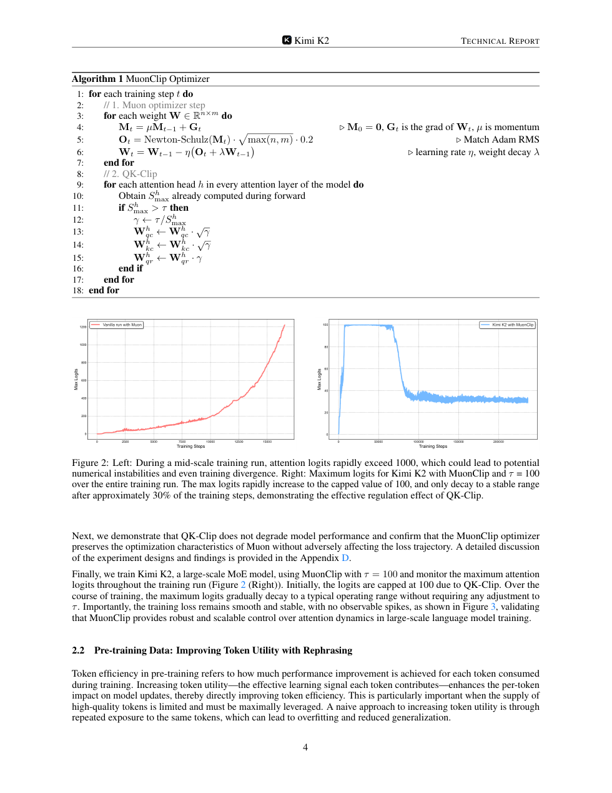

图：Kimi K2 technical report 第 4 页，包含 Algorithm 1 “MuonClip Optimizer”和 Figure 2 的 max logits 曲线。该图支撑本文对 MuonClip 训练稳定性机制的说明。

**工程影响**  
训练稳定性间接影响 serving：只有训练过程稳定，低精度 QAT、MoE 扩容和长上下文能力才可能成为可发布权重。对本仓库而言，这类技术不是短期推理实验对象，但在评估开源权重质量时应记录训练报告中的 loss spike、量化损失和消融。

**参考链接**  
- 主来源：[K2 GitHub](https://github.com/MoonshotAI/Kimi-K2)，[K2 技术报告](https://github.com/MoonshotAI/Kimi-K2/blob/main/tech_report.pdf)，[K3 blog](https://www.kimi.com/blog/kimi-k3)
- 理论背景：[Muon optimizer discussion page](https://kellerjordan.github.io/posts/muon/)，[Transformer](https://arxiv.org/abs/1706.03762)
- 辅助来源：[知乎第二章](https://zhuanlan.zhihu.com/p/2061492527589494896)

**待验证问题**  
MuonClip 的阈值、裁剪触发频率、与 K3 Per-Head Muon 的关系，需要技术报告或训练日志级材料确认。

### 3.15 MoonEP 与全均衡专家执行

**提出位置与演进状态**  
MoonEP 是 K3 技术报告中用于 2.8T MoE 训练和执行的系统组件。它不是 Mooncake serving 的同义词，而是面向 expert-parallel execution 的均衡执行与通信机制。K3 把 896 experts、Top-16 和 Stable LatentMoE 推到生产级规模，MoonEP 负责让专家执行形状稳定、通信路径高效。

**理论背景**  
MoE 的专家并行瓶颈来自 token dispatch 后的负载不均。普通实现中，每个 expert 每步接到的 token 数不同，host 需要同步设备端统计来决定 GEMM shape，导致每层 kernel launch 前出现同步和调度停顿。负载越不均，tail rank 越容易拖慢整个 step。

**原理机制**  
K3 report 说明 MoonEP 使用 perfect balance 让每个 rank 接收固定数量 $S\times K$ tokens，并证明 balanced plan 总能在每个 rank 最多 $E/R$ 个 redundant experts 的条件下存在。其系统实现包含三点：在线 planning kernel 近似 ILP 最优解；zero-copy communication 直接把 tokens 发到 remote ranks 的 expert-grouped positions；sync-free execution with static shapes 消除 per-layer MoE host synchronization。

**Kimi 中的实现和创新**  
K3 的创新是把路由负载均衡和执行系统绑在一起：Quantile Balancing 让专家选择更均衡，MoonEP 让 rank 级执行也保持静态 shape。相比只在模型层做 load balancing，K3 更强调训练系统可预测性。

**效果与证据**  
K3 report 第 5.2.1 节描述 MoonEP 的 exact/offline ILP 参考、GPU online planning、fixed $S\times K$ buffer、静态 shape 和消除 per-layer host synchronization。公开摘要没有给单独吞吐数字，但这些机制直接支撑 K3 的 2.8T/1M context 训练可行性。

**工程影响**  
本仓库短期不训练 K3，但服务 MoE 模型时同样会遇到专家负载和通信问题。后续压测可记录 rank 间 tokens 分布、expert GEMM makespan、all-to-all 时间和 p99 latency；如果使用 SGLang/vLLM 的 expert parallel，也要核对是否支持类似 rank activeness 或 static-shape 优化。

**参考链接**  
- 主来源：[K3 技术报告](https://github.com/MoonshotAI/Kimi-K3/blob/main/k3_tech_report.pdf)，[K3 HF](https://huggingface.co/moonshotai/Kimi-K3)
- 系统背景：[Mooncake GitHub](https://github.com/kvcache-ai/Mooncake)，[DeepEP](https://github.com/deepseek-ai/DeepEP)

**待验证问题**  
MoonEP 是否开源、与 Mooncake EP 的关系、是否进入 K3 推理服务路径、与 vLLM/SGLang expert-parallel 支持的边界，需要继续查证。

### 3.16 Rephrasing 与 token utility

**提出位置与演进状态**  
K2 technical report 把 pre-training data 的主题写成 “Improving Token Utility with Rephrasing”。K3 report 的 pre-training data 章节明确说沿用 K2 的 rephrasing recipe，对 knowledge 和 mathematics corpora 使用 style/perspective-diverse prompting、chunk-wise autoregressive generation 和 fidelity verification。

**理论背景**  
当高质量训练数据成为瓶颈时，继续堆 token 会遇到边际收益下降。token utility 指每个训练 token 带来的有效学习信号。rephrasing 的目标不是简单改写，而是在保持语义和事实一致的前提下增加表达多样性、任务视角和可学习信号密度。

**原理机制**  
K2/K3 的 rephrasing 可以抽象成：

```text
原始高质量资料 -> 多样化 prompt 改写 -> 分块自回归生成 -> fidelity verification -> 进入训练混合
```

其中 fidelity verification 很关键，因为低质量改写会引入噪声，反而降低 token utility。chunk-wise autoregressive generation 则服务于长文 coherence，避免改写后丢掉全局结构。

**Kimi 中的实现和创新**  
K2 把 rephrasing 与 MuonClip、MoE scaling 同放在 pre-training 章节，说明 Moonshot 不只靠模型结构扩展能力，也在提高数据利用率。K3 继续沿用这套 recipe，并扩展到多模态和长上下文数据清洗。

**效果与证据**  
K2 report 明确把 token efficiency/token utility 作为 scaling coefficient；K3 report 说明数据管线覆盖 Web Text、Code、Mathematics、Knowledge 和 vision corpus，并对长文档/视频做 exact/fuzzy dedup、perceptual hashing、heuristic/classifier filtering 和 structural validation。公开报告中需要继续摘录 rephrasing 的消融或质量指标。

**工程影响**  
对本仓库的 benchmark 数据构造，rephrasing 思路可用于生成等价但表达不同的请求，测试 proxy/router/cache 是否过拟合固定 prompt；也可用于构造 long-context coding 任务的多版本输入，测 cache 命中和质量稳定性。

**参考链接**  
- 主来源：[K2 技术报告](https://github.com/MoonshotAI/Kimi-K2/blob/main/tech_report.pdf)，[K3 技术报告](https://github.com/MoonshotAI/Kimi-K3/blob/main/k3_tech_report.pdf)
- 理论背景：[Scaling Laws for Neural Language Models](https://arxiv.org/abs/2001.08361)

**待验证问题**  
rephrasing 的数据占比、自动 fidelity verifier 的准确率、对 downstream benchmark 的消融仍需从 K2/K3 附录中补充。

### 3.17 token-efficient thinking

**提出位置与演进状态**  
K2.7-Code 明确把“相对 K2.6 thinking token usage 降低约 30%”作为核心卖点。K3 进一步引入 reasoning effort 口径，说明 Kimi 的推理成本控制开始从“模型更快”转向“思考预算可控”。

**理论背景**  
thinking token 是隐藏或显式推理过程的一部分。更多 thinking token 可能提高复杂任务成功率，但会拉高延迟、成本和工具调用长度。token-efficient thinking 的目标不是简单短输出，而是在保留必要推理状态的前提下去掉冗余思考。

**原理机制**  
K2.5 技术报告把这条线具体化为 Toggle：训练在 budget limited phase 和 standard scaling phase 之间交替，避免模型只学会“短答”，也避免无约束地消耗 test-time compute。官方给出的奖励形式可写为：

$$
\tilde r(x,y)=
\begin{cases}
r(x,y)\cdot I\left\{\frac{1}{K}\sum_{i=1}^{K} r(x,y_i)<\lambda\ \text{or}\ |y_i|\leq budget(x)\right\}, & \lfloor t/m\rfloor \bmod 2=0\\
r(x,y), & \lfloor t/m\rfloor \bmod 2=1
\end{cases}
$$

其中 $x$ 是问题，$y$ 是当前 rollout，$K$ 是同一问题的采样条数，$r(x,y)$ 是任务奖励，$\lambda$ 是启用预算约束的准确率阈值，$m$ 是相位切换周期。Phase 0 只在模型对该问题已经有足够平均正确率时施加长度预算；Phase 1 允许模型使用最大 token 继续学习 test-time scaling。问题级预算来自正确答案长度分位数：

$$
budget(x)=Percentile(\{|y_j|\mid r(x,y_j)=1,\ j=1,\ldots,K\},\rho)
$$

其中 $\rho$ 是分位数超参数。这个机制的创新点是把“短推理”和“可扩展推理”做成交替优化，而不是只加一个固定长度惩罚。

**Kimi 中的实现和创新**  
K2.7-Code 的创新是把 coding agent 的高成本推理压缩，而不是退回 instant 模型。它仍要求 preserve_thinking，说明 Kimi 想保留长程任务状态，同时降低无效 token。

**效果与证据**  
K2.5 技术报告在 K2 Thinking 上评估 Toggle，报告平均输出 token 下降 25% 到 30%，性能影响很小，并观察到重复验证、机械计算等冗余 CoT 模式减少。K2.7-Code HF 明确声明 thinking token usage 相对 K2.6 降低约 30%，并给出 Kimi Code Bench v2 62.0、Program Bench 53.6、MCP Atlas 76.0、MCP Mark Verified 81.1 等结果。K3 blog 又把 benchmark 口径标为 max reasoning effort，提示未来会有 effort mode。

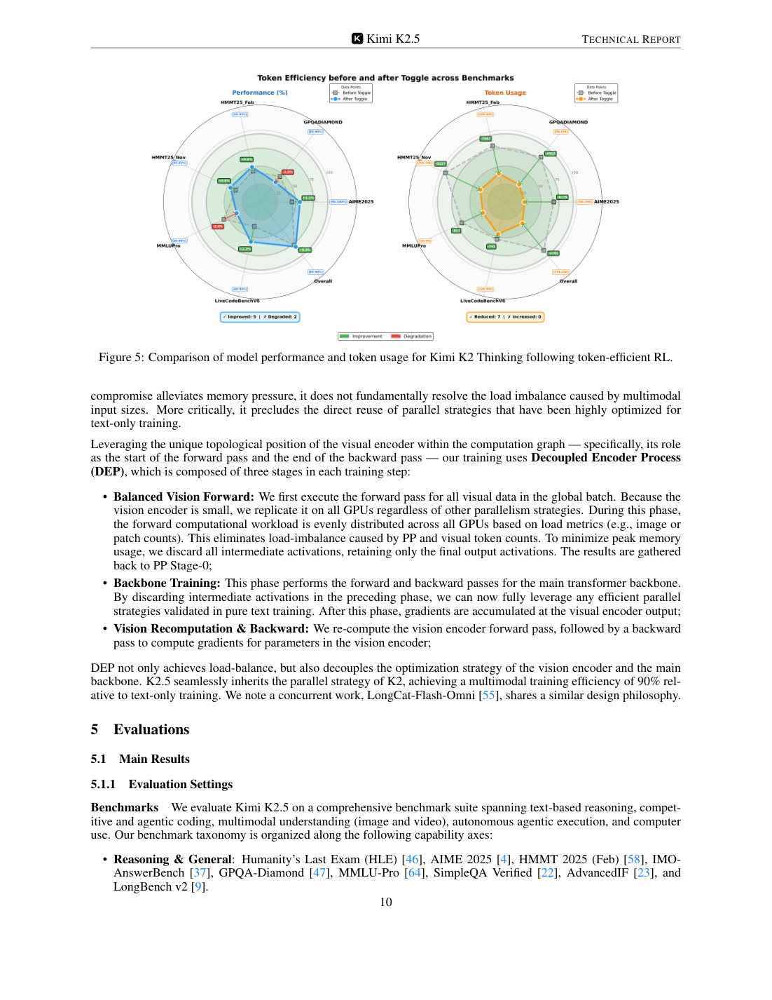

**工程影响**  
本仓库的 benchmark 需要增加“质量/成本比”指标。只看最终分数不够，应记录总输出 token、thinking token、tool calls、wall time、失败重试次数和单位成功任务成本。

**参考链接**  
- 主来源：[K2.5 技术报告](https://arxiv.org/abs/2602.02276)，[K2.7-Code HF](https://huggingface.co/moonshotai/Kimi-K2.7-Code)，[K3 blog](https://www.kimi.com/blog/kimi-k3)
- 理论背景：[Kimi k1.5 long2short](https://arxiv.org/abs/2501.12599)

**待验证问题**  
K2.7 的 30% token 降低是否完整继承 Toggle，还是叠加了数据过滤、解码策略和 harness 压缩，需要继续用 K2.7 资料或实测验证。

## 4. RL 后训练演进

RL 后训练线的核心变化是：从单题推理的 long-CoT，走到工具环境和执行环境中的长程任务学习。Kimi 的公开路线里，K1.5 解决“如何让长思考学出来并压短”；K2 解决“如何让 tool use 和 self-critique 进入模型能力”；K2 Thinking 到 K3 则解决“如何在长任务、动态工具、多模态、Swarm 和 coding 执行反馈中保持状态和质量”。

### 4.1 RL 后训练技术发展脉络图


```mermaid
flowchart LR
    A["2024-11 k0-math：RL 加 CoT"] --> B["2025-01 K1.5：long-CoT RL"]
    B --> C["K1.5 long2short：压缩长推理"]
    C --> D["2025-07 K2：tool-use 数据合成"]
    D --> E["K2 self-critique RL：rubric critic"]
    E --> F["2025-11 K2 Thinking：交错思考和工具 RL"]
    F --> G["2026-01 K2.5：joint text-vision RL"]
    G --> H["K2.5 PARL：Swarm 后训练"]
    H --> I["2026-04 K2.6：long-horizon coding RL"]
    I --> J["2026-06 K2.7：token efficiency reward"]
    J --> K["2026-07 K3：preserved thinking 和 effort"]
```

### 4.2 模型到 RL 后训练技术映射表

| 模型或阶段 | 后训练技术点 | 演进状态 | 代表效果 |
|---|---|---|---|
| k0-math | RL + CoT 数学推理 | K1.5 前置探索 | 知乎记录 MATH 93.8 |
| K1.5 | long-context RL、partial rollouts、long2short | 为 K2 Thinking 的 reasoning 和 token efficiency 提供前置思想 | AIME 77.5、MATH-500 96.2 口径需复核 |
| K2 | tool-use synthetic data、self-critique rubric RL | K2 Thinking 继承并增强 | SWE-bench Verified 65.8 |
| K2 Thinking | thinking SFT、动态工具调用 RL、200 到 300 次 tool calls | K2.7/K3 保留 preserve thinking 方向 | HLE w/tools 44.9、BrowseComp 60.2 |
| K2.5 | joint text-vision pre-training、zero-vision SFT、joint text-vision RL、PARL | 多模态与 Swarm 后训练主线 | BrowseComp Agent Swarm 78.4 |
| K2.6 | long-horizon coding RL、执行反馈、proactive autonomous execution | Swarm 扩到 300 agents | SWE-bench Verified 80.2 |
| K2.7-Code | token-efficient thinking、coding-specific RL | K3 effort 控制的前置 | thinking token 降低约 30% |
| K3 | preserved thinking history、reasoning effort、MOPD、Agentic GRM、多目标 agent 训练 | 新一代 agentic 后训练方向 | max effort 下多项 coding/agent benchmark 提升 |

### 4.3 K1.5：长链推理 RL 与 long2short

**提出位置与演进状态**  
K1.5 是 Kimi reasoning 线的重要早期节点。知乎第二章称 K1.5 采取极简路线：不用 MCTS、value function、PRM，而是通过 128K long-context RL、partial rollouts 和 long2short 提升推理。Kimi k1.5 arXiv 论文已可访问，是本节主证据。

**理论背景**  
RL 后训练把模型看成策略 $\pi_\theta(a_t\mid s_t)$，通过奖励优化任务成功率：

$$
J(\theta)=\mathbb{E}_{\tau\sim \pi_\theta}\left[\sum_t r_t\right]
$$

数学推理中，最终答案 reward 稀疏，长 CoT 会带来更大探索空间。partial rollout 的意义是减少完整长链采样成本，long2short 则把长链推理能力蒸馏或偏好优化到更短轨迹中。

**原理机制**  
Kimi k1.5 report 把 long2short 定义为“Context Compression for Short-CoT Models”，给出四条路径：model merging、shortest rejection sampling、DPO、long2short RL。Shortest rejection sampling 会对同一问题采样 $n=8$ 次，选择最短正确答案做 SFT；DPO 使用最短正确解作为 positive，把更长的答案，包括错误长答案和超过 positive 1.5 倍的正确长答案，作为 negative；long2short RL 在标准 RL 后选择性能与 token efficiency 平衡最好的模型，再用长度惩罚和更短 rollout 上限继续训练。

partial rollout 则解决 long-CoT RL 的系统成本。若某条轨迹超过 token budget，未完成部分写入 replay buffer，下个 iteration 继续；训练时只有当前 iteration 需要 on-policy 计算，历史片段可从 buffer 复用。这样避免单条超长推理霸占 rollout workers。

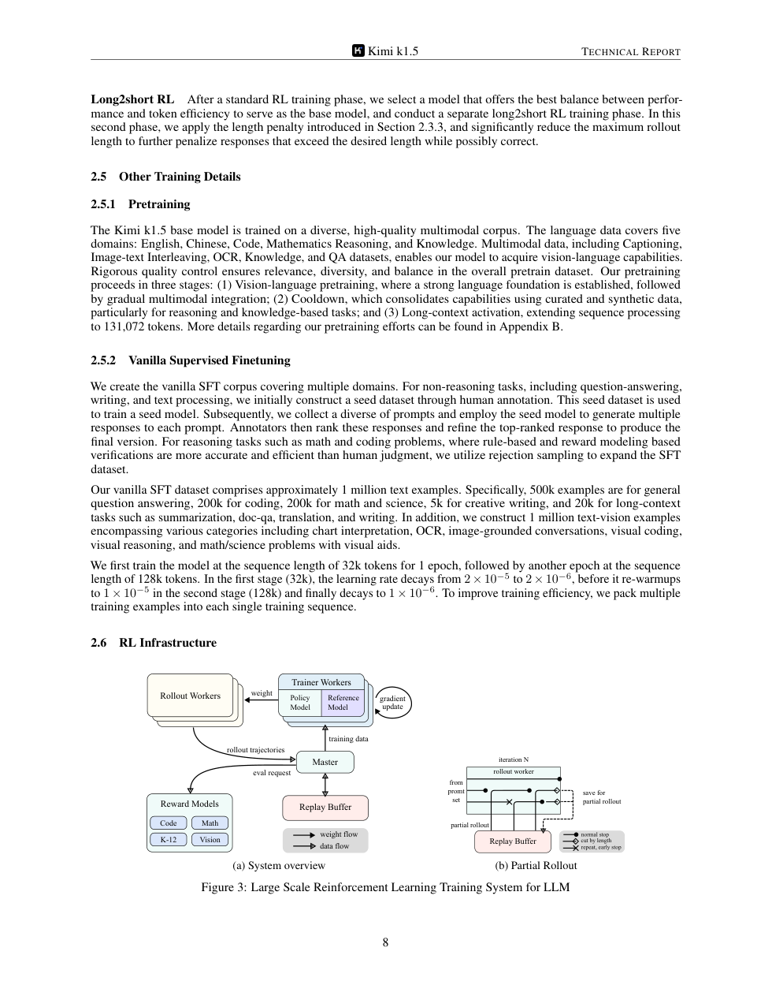

图：Kimi k1.5 technical report 第 8 页，Figure 3 “Large Scale Reinforcement Learning Training System for LLM”。该图支撑本文对 partial rollout、replay buffer 和 rollout/trainer worker 分离的说明。

**Kimi 中的实现和创新**  
Kimi k1.5 的创新不是堆复杂搜索，而是验证“简单 RL + 长上下文 + 长短链压缩”能得到强 reasoning 效果。这和后续 K2.7-Code 的 token-efficient thinking 有连续性：前者压缩数学推理链，后者压缩 coding agent 的 thinking token。

**效果与证据**  
Kimi k1.5 摘要给出 long-CoT 结果：AIME 77.5、MATH 500 96.2、Codeforces 94th percentile、MathVista 74.9；short-CoT long2short 结果：AIME 60.8、MATH500 94.6、LiveCodeBench 47.3。Figure 7 进一步显示 long2short RL 在 token efficiency 上优于 DPO、model merge 和 shortest rejection sampling 等方法；报告正文给出 k1.5-short w/ rl 在 AIME2024 上 Pass@1 60.8，平均 3272 tokens。

**工程影响**  
对本仓库来说，long2short 提醒 benchmark 不能只看 accuracy，还要看 token 成本。长程代码任务可以仿照 long2short 思路，把成功轨迹压成更短的工具调用和修复路径。

**参考链接**  
- 主来源：[Kimi k1.5: Scaling Reinforcement Learning with LLMs](https://arxiv.org/abs/2501.12599)
- 辅助来源：[知乎第二章](https://zhuanlan.zhihu.com/p/2061492527589494896)
- 相近技术：[Direct Preference Optimization](https://arxiv.org/abs/2305.18290)

**待验证问题**  
k0-math 的公开报告、K1.5 length penalty 的具体公式、partial rollout 中被排除 loss 的片段策略、多模态 RL 数据 recipe 仍需继续摘录。

### 4.4 K2：tool-use 数据合成与 self-critique RL

**提出位置与演进状态**  
K2 是 Kimi 从 reasoning 模型转向 agentic open model 的基线。知乎第二章把 K2 的 agentic 后训练概括为三段式 tool-use 数据合成流水线与 self-critique RL。K2 HF 和技术报告确认 K2 被优化用于 agentic capabilities，并覆盖 coding、tool use、reasoning 等任务。

**理论背景**  
工具调用训练和普通指令微调不同。普通 SFT 学的是输入到答案的映射；tool-use SFT/RL 学的是状态、动作、工具结果和下一步规划：

$$
s_t = (x, h_{t-1}, o_{t-1}),\quad a_t \in \{\text{answer}, \text{call tool}, \text{read}, \text{revise}\}
$$

最终奖励往往只在任务结束时出现，credit assignment 要穿过多次工具选择、参数生成、结果读取和错误恢复。

**原理机制**  
K2 report 把 tool-use data synthesis 拆成三段：tool spec generation，agent and task generation，trajectory generation。工具仓库由两部分构成：直接从 GitHub 拉取 3000+ real MCP tools，以及通过层级 domain evolution 合成 20,000+ synthetic tools。随后为不同 toolset 生成 agent 和任务，并生成调用工具完成任务的多轮轨迹。质量过滤由 LLM-based judge 按 task rubrics 评估，只保留满足成功标准的轨迹；对于 coding/software engineering 等真实性关键场景，K2 还使用真实 execution sandboxes 和 unit tests 产生 ground-truth feedback。

self-critique RL 则让 K2 actor 为 general prompts 生成多条响应，再由 K2 critic 基于 core rubrics、prescriptive rubrics 和 human-annotated rubrics 做 pairwise evaluation。critic 还会通过 verifiable-reward prompts 的 on-policy rollouts 继续校准，把 RLVR 的客观信号迁移到主观任务评价中。

**Kimi 中的实现和创新**  
K2 的创新在于把 tool use 作为模型发布定位，而不是只把 function calling 当 API 格式能力。K2 report 明确把 large-scale agentic data synthesis pipeline 和 joint RL stage 放进贡献项，并说明后训练结合 RLVR 与 self-critique rubric reward。和普通 tool calling SFT 相比，K2 的数据覆盖了工具定义、agent persona、任务 rubrics、工具执行环境、失败/部分失败/边界情况和真实 sandbox。

**效果与证据**  
K2 report 给出 Tau2-Bench 66.1、ACEBench 76.5、SWE-bench Verified agentic single-attempt 65.8、LiveCodeBench v6 53.7 等结果，并在工具任务上强调 multi-turn tool-calling capabilities。由于这些评测带有 agentic/harness 成分，不能把分数完全归因于 self-critique RL，但可以说明 K2 的后训练目标已明显面向工具任务。

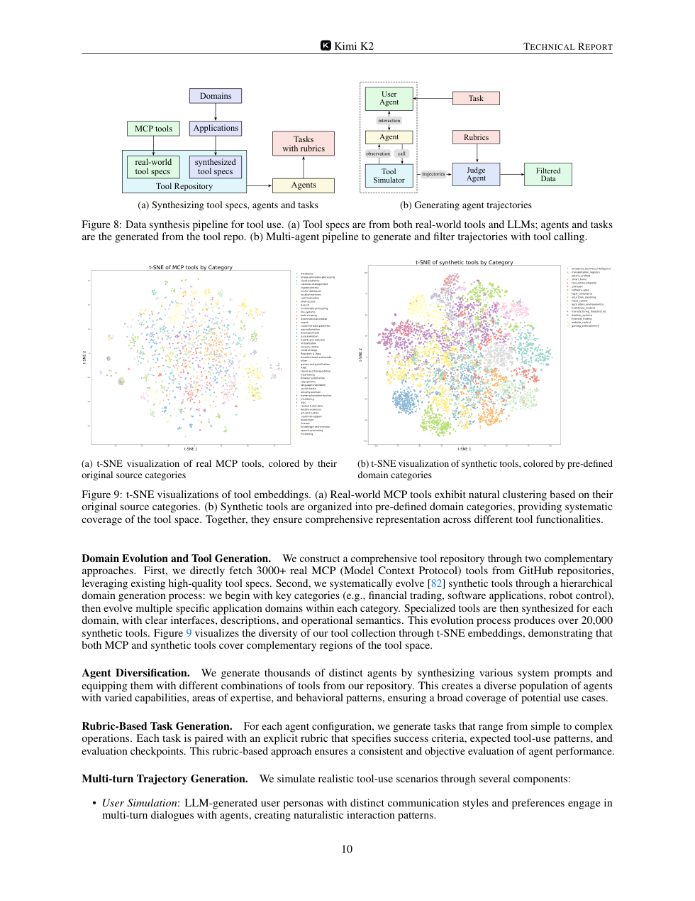

图：Kimi K2 technical report 第 10 页，Figure 8 “Data synthesis pipeline for tool use”。该图支撑本文对 tool specs、agents、tasks、trajectories 和 multi-agent trajectory filtering 的说明。

**工程影响**  
本仓库若要复现类似训练/评测思想，至少要记录工具 schema、工具调用日志、失败轨迹、critic 规则和 replay 数据。服务代理层也应保留 tool-call trace，便于做离线 self-critique 或错误归因。

**参考链接**  
- 主来源：[K2 HF](https://huggingface.co/moonshotai/Kimi-K2-Instruct)，[K2 GitHub](https://github.com/MoonshotAI/Kimi-K2)，[K2 技术报告](https://github.com/MoonshotAI/Kimi-K2/blob/main/tech_report.pdf)
- 辅助来源：[知乎第二章](https://zhuanlan.zhihu.com/p/2061492527589494896)
- 相近技术：[Toolformer](https://arxiv.org/abs/2302.04761)

**待验证问题**  
K2 report 附录中的 tool-calling token template、TypeScript/JSON schema 对比、core/prescriptive rubric 示例还需要继续摘录到 Agent 编排章。

### 4.5 Thinking SFT 与交错思考

**提出位置与演进状态**  
K2 Thinking 是 thinking agent 的明确发布节点。它在 K2 架构基线上加入 deep thinking、tool orchestration、interleaved reasoning 和 200 到 300 次连续工具调用能力。K2.7-Code 和 K3 继续强调 preserve thinking，说明该能力被继承。

**理论背景**  
Thinking SFT 的训练对象不是最终答案，而是中间推理轨迹。轨迹可以帮助模型学习分解问题、检查假设、读工具结果和修复错误。但轨迹也带来成本和隐私/安全问题，因此后续需要 token efficiency 和 reasoning effort 控制。

**原理机制**  
交错思考的状态流不是“先完整想完再调用工具”，而是：

```text
任务理解 -> 思考 -> 工具调用 -> 读取结果 -> 修正计划 -> 再工具调用 -> 结束回答
```

这种训练要求模型在工具结果返回后更新内部计划，而不是把工具结果当成一次性上下文补充。

**Kimi 中的实现和创新**  
K2 Thinking 的创新是把 thinking 和动态工具调用一起训练。官方模型卡强调可稳定处理 200 到 300 次 sequential tool calls，同时使用 native INT4 QAT。也就是说，它不是只提高推理深度，还试图让深推理在服务成本上可接受。

**效果与证据**  
K2 Thinking HF 给出 HLE w/tools 44.9、BrowseComp w/tools 60.2、SWE-bench Verified 71.3，并声明 INT4 QAT 模型带来延迟和显存下降。相比 K2 的 SWE-bench Verified 65.8，K2 Thinking 在 agentic coding 上有明显提升。

**工程影响**  
本仓库 agent harness 需要决定是否保存 thinking history、保存多长、是否回传给模型，以及如何在日志中脱敏。对于 200 到 300 次工具调用，代理层还需要防止工具循环、预算耗尽和不可恢复失败。

**参考链接**  
- 主来源：[K2 Thinking HF](https://huggingface.co/moonshotai/Kimi-K2-Thinking)，[K2 Thinking blog](https://moonshotai.github.io/Kimi-K2/thinking.html)，[Kimi blog](https://www.kimi.com/blog/kimi-k2-thinking)
- 辅助来源：[知乎第二章](https://zhuanlan.zhihu.com/p/2061492527589494896)

**待验证问题**  
K2 Thinking 的 thinking 数据来源、是否使用过程奖励、工具调用失败样本如何处理，需要技术报告或博客正文进一步摘录。

### 4.6 工具调用 RL 与多轮 credit assignment

**提出位置与演进状态**  
K2 开始把 tool use 作为 agentic 能力；K2 Thinking 把工具调用链延长到 200 到 300 步；K2.5/K2.6/K2.7-Code 把工具任务扩展到多模态、Swarm、长程 coding 和 MCP。

**理论背景**  
在多轮工具环境中，最终答案正确并不意味着每一步工具调用都优；一次错误参数可能被后续修复，一次看似无用的搜索可能为后续计划提供证据。credit assignment 要把最终 reward 分摊到动作序列。

**原理机制**  
可以把工具调用看成部分可观测环境中的 RL：

$$
\tau=(s_0,a_0,o_1,s_1,a_1,o_2,\ldots,s_T)
$$

其中 $a_t$ 是工具调用或回答动作，$o_t$ 是环境返回。训练可结合最终奖励、过程奖励、规则校验、执行反馈和 self-critique。难点在于工具结果不可微、环境昂贵、失败类型复杂。

**Kimi 中的实现和创新**  
Kimi 的创新不是“支持函数调用 schema”，而是把动态工具使用写进模型能力评测和后训练闭环。K2 Thinking 的长工具链、K2.6 的 4000 steps、K2.7/K3 的 MCP benchmark 都说明工具环境已经成为后训练对象。

**效果与证据**  
K2 Thinking 在 HLE w/tools 和 BrowseComp w/tools 上给出强结果；K2.5/K2.6 在 BrowseComp Agent Swarm 上提升；K2.7-Code 在 MCP Atlas 和 MCP Mark Verified 上给出指标。

**工程影响**  
本仓库应把 tool-call trace 作为一等日志：工具名、参数、返回、错误、重试、耗时、是否被后续引用。否则无法分析失败来自模型、工具、网络、上下文裁剪还是代理层。

**参考链接**  
- 主来源：[K2 Thinking HF](https://huggingface.co/moonshotai/Kimi-K2-Thinking)，[K2.6 HF](https://huggingface.co/moonshotai/Kimi-K2.6)，[K2.7-Code HF](https://huggingface.co/moonshotai/Kimi-K2.7-Code)
- 理论背景：[Toolformer](https://arxiv.org/abs/2302.04761)，[ReAct](https://arxiv.org/abs/2210.03629)

**待验证问题**  
Kimi 是否使用显式 process reward model、是否对工具参数单独奖励、是否训练工具失败恢复策略，公开资料仍不完整。

### 4.7 joint text-vision RL 与 zero-vision SFT

**提出位置与演进状态**  
K2.5 是 Kimi K2.x 从文本 agent 到原生多模态 agent 的关键节点。技术报告显示，它在接近完成的 K2 checkpoint 上继续约 15T 视觉文本混合 token 联合预训练，并使用 early low-ratio vision fusion、MoonViT-3D、zero-vision SFT、outcome-based visual RL 和 joint multimodal RL。K3 继续使用 MoonViT-V2，说明多模态已经进入 Kimi 后续架构主线。

**理论背景**  
多模态 agent 不只是“文本模型接视觉 encoder”。如果视觉证据只通过 OCR 或外部工具进入文本上下文，模型内部不会直接学习视觉证据与动作选择之间的关系；如果只在训练后期高比例灌入视觉 token，又容易破坏语言能力或让视觉能力成为外挂。K2.5 报告里的关键判断是：在固定视觉文本 token 预算下，更早、更低比例地融合视觉 token，反而比晚期高比例注入更均衡。

**原理机制**  
K2.5 的机制可拆成四层：

| 层 | 做法 | 解决的问题 |
|---|---|---|
| 原生多模态预训练 | 早期开始混合视觉文本 token，采用较低视觉比例，而不是末期高比例注入 | 降低“语言能力已定型后再接视觉”的冲突 |
| MoonViT-3D | 在 MoonViT 原生分辨率和 NaViT packing 基础上，把连续 4 帧作为时空体共享编码，再做时间池化 | 图像和视频共享参数，视频在同一上下文窗口内可处理约 4 倍更长 |
| zero-vision SFT | 只用文本 SFT 数据激活视觉 agentic 能力，把图像操作代理成 IPython 中的程序化操作 | 避免低质量人工视觉轨迹损害泛化，先激活工具推理行为 |
| outcome-based visual RL 与 joint multimodal RL | 视觉 grounding/counting、图表与文档理解、vision-critical STEM 等任务提供结果奖励，再把 text/multimodal query 按能力域共同优化 | 让视觉能力、文本能力和工具能力共享奖励闭环 |

K2.5 的 RL 损失还引入 token-level clipping 来控制 off-policy drift。抽象写法如下：

$$
L_{\text{RL}}(\theta)=
\mathbb{E}_{x\sim D}\left[
\frac{1}{N}\sum_{j=1}^{K}\sum_{i=1}^{|y_j|}
\operatorname{Clip}\left(
\frac{\pi_\theta(y_j^i\mid x,y_j^{0:i})}{\pi_{\text{old}}(y_j^i\mid x,y_j^{0:i})},
\alpha,\beta
\right)
\left(r(x,y_j)-\bar r(x)\right)
-\tau\left(\log\frac{\pi_\theta(y_j^i\mid x,y_j^{0:i})}{\pi_{\text{old}}(y_j^i\mid x,y_j^{0:i})}\right)^2
\right]
$$

其中 $K$ 是每个问题的 rollout 数，$N$ 是 batch 内总生成 token 数，$\bar r(x)$ 是同一问题的平均奖励，$\alpha,\beta,\tau$ 是裁剪和正则超参数。报告强调这个裁剪不同于标准 PPO clipping：它只按 token log-ratio 判断是否屏蔽梯度，用来稳定长程、多步、工具使用任务中的 RL。

**Kimi 中的实现和创新**  
K2.5 的创新是把多模态与 agent 能力绑定，而不是单独做图像问答模型。zero-vision SFT 的反直觉点在于：文本 SFT 足以激活视觉工具链的冷启动，而额外加入人工视觉轨迹反而可能更差；这说明 joint pretraining 已经建立了较强的图文对齐，SFT 阶段更需要保护通用 agentic 行为。visual RL 的奖励也不是单一准确率：grounding/point localization 使用 soft matching，segmentation 使用 mask IoU，OCR 使用 normalized edit distance，counting 使用与真值差距相关的奖励，复杂视觉 puzzle 还使用 K2 verifier。

**效果与证据**  
K2.5 技术报告 Table 1 显示 early 10%:90% vision-text ratio 在多个视觉、文本和代码指标上优于 mid 20%:80% 与 late 50%:50%。Figure 2 显示从 minimal zero-vision SFT 出发，增加 vision RL FLOPs 后 MMMU-Pro、MathVision、CharXiv、OCRBench 继续提升。Table 2 显示视觉 RL 后文本指标也提升：MMLU-Pro 84.7 到 86.4，GPQA-Diamond 84.3 到 86.4，LongBench v2 56.7 到 58.9。K2.5 HF 还给出 MMMU-Pro 78.5、HLE-Full 30.1、HLE w/tools 50.2、SWE-bench Verified 76.8、BrowseComp Agent Swarm 78.4 等结果。

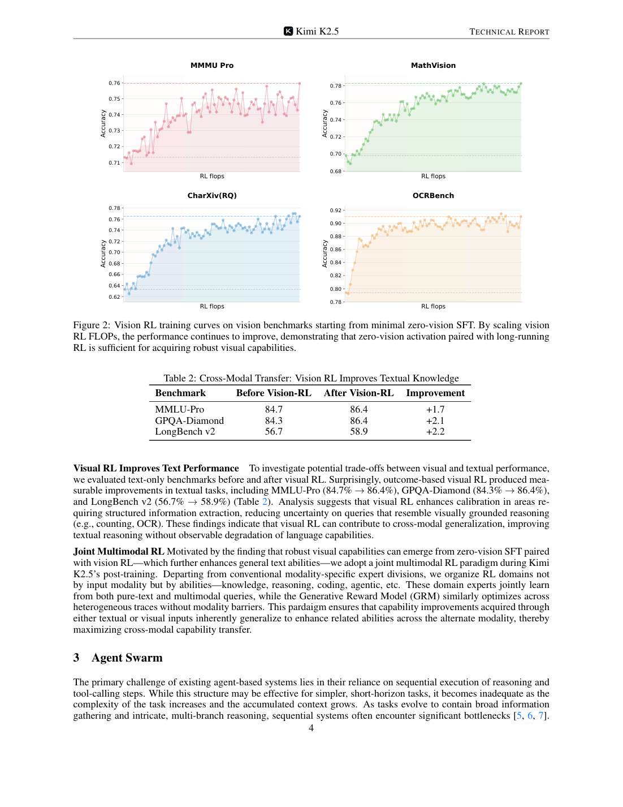

**工程影响**  
对本仓库，如果未来加入多模态请求，需要同时测图像 token、vision encoder 延迟、图文上下文拼接、工具调用和 cache 复用。不能把多模态视为普通文本 prompt 的简单扩展。

**参考链接**  
- 主来源：[K2.5 HF](https://huggingface.co/moonshotai/Kimi-K2.5)，[K2.5 技术报告](https://arxiv.org/abs/2602.02276)，[K3 HF](https://huggingface.co/moonshotai/Kimi-K3)
- 相近技术：[Florence-2](https://arxiv.org/abs/2311.06242)，[Pixtral](https://mistral.ai/news/pixtral-our-new-vision-model/)

**待验证问题**  
zero-vision SFT 的具体样本占比、joint multimodal RL 的 domain mixing 比例、MoonViT 到 MoonViT-V2 的结构改动，公开资料仍未完整披露。

### 4.8 PARL 与 Agent Swarm 后训练

**提出位置与演进状态**  
K2.5 技术报告正式引入 Agent Swarm 和 PARL，K2.6 把 Swarm 扩到 300 sub-agents 和 4000 coordinated steps。知乎第二章把 PARL 解释为把 agent 数量变成扩展轴；官方报告进一步确认：PARL 使用 trainable orchestrator 与 frozen subagents 的解耦架构，subagent 轨迹不进入优化目标，训练只更新 orchestrator。

**理论背景**  
单 agent 的长任务搜索受限于串行探索深度和上下文长度，工具调用越多，wall-clock latency 越接近线性增长。多 agent 并行可以扩大搜索宽度，但会引入 credit assignment、调度、冲突、重复工作和合并问题。PARL 的核心是把 parallelism 作为可学习对象，而不是依赖人工规则预设什么时候并行。

**原理机制**  
官方报告给出的 PARL reward 为：

$$
r_{\text{PARL}}(x,y)=
\lambda_1 r_{\text{parallel}}+
\lambda_2 r_{\text{finish}}+
r_{\text{perf}}(x,y)
$$

其中 $r_{\text{perf}}(x,y)$ 是任务级结果奖励，$r_{\text{parallel}}$ 用于缓解 serial collapse，即 orchestrator 退化成单 agent 串行执行；$r_{\text{finish}}$ 奖励子任务完成率，用于抑制 spurious parallelism，即为了拿并行奖励而无意义地创建大量 subagents。报告还说明 $\lambda_1$ 和 $\lambda_2$ 会在训练过程中 anneal 到 0，让最终策略回到任务效果主目标。

PARL 还引入 critical steps 作为并行 agent 的时间成本度量。设 episode 有 $T$ 个执行 stage，第 $t$ 个 stage 中主 agent 步数为 $S_{\text{main}}^{(t)}$，并行子 agent 中第 $i$ 个步数为 $S_{\text{sub},i}^{(t)}$，则：

$$
CriticalSteps=\sum_{t=1}^{T}
\left(
S_{\text{main}}^{(t)}+
\max_i S_{\text{sub},i}^{(t)}
\right)
$$

它模仿计算图 critical path：并行组的耗时由最长分支决定。这个指标避免简单统计 total steps，因为 total steps 会惩罚有效并行；同时它也不会奖励无意义扩张，因为只有能缩短最长分支的拆分才真正降低 critical steps。

**Kimi 中的实现和创新**  
K2.5 的 Swarm 是从单 agent 到多 agent 的转折；K2.6 的 300 sub-agents/4000 steps 则把并行规模显著拉大。K2.5 报告明确写到 orchestrator 动态创建异构、领域专用的 frozen subagents，并把 subagent 输出当作环境 observation，而不是端到端联合优化。这解决了两个实际难题：最终答案正确不代表每个 subagent 都正确，最终失败也不代表每个 subagent 都失败；如果端到端训练，credit assignment 会非常噪声且不稳定。

训练数据也服务于并行能力诱导：报告提到构造 wide search、deep search、长上下文文档分析、大规模文件下载等 synthetic prompts，但不显式要求模型并行，而是让任务分布自然偏好并行拆解和调度。

**效果与证据**  
K2.5 技术报告 Table 6 显示 Agent Swarm 在 BrowseComp 上从单 agent 60.6 提升到 78.4，WideSearch item-F1 从 72.7 提升到 79.0，In-house Swarm Bench 从 41.6 提升到 58.3。报告还给出 runtime 证据：WideSearch 上达到目标性能的执行时间相比 single-agent baseline 降低约 3 倍到 4.5 倍；抽象中也写明 Swarm 在 wide-search 场景中把 item-level F1 从约 72.8 提升到 79.0，同时 latency 最高降低 4.5 倍。K2.6 HF 进一步记录 BrowseComp Agent Swarm 86.3。

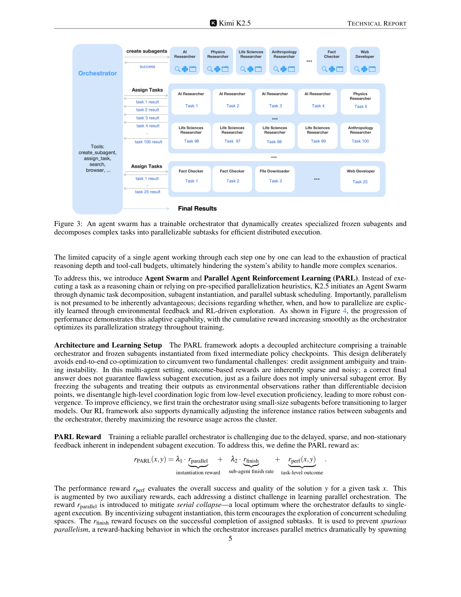

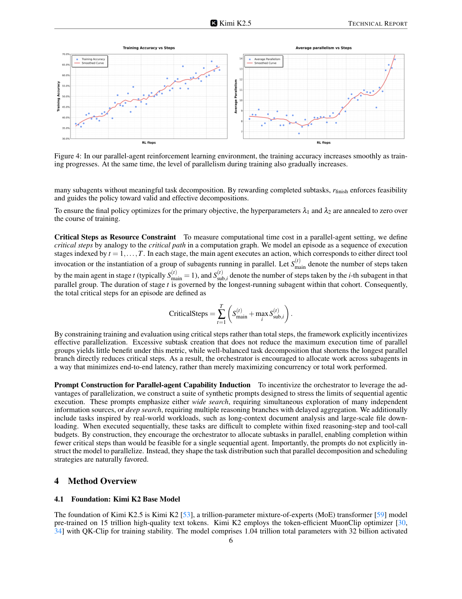

**工程影响**  
本仓库可以把 Swarm 视为代理层扩展实验：不同 sub-agent 数、并发工具数、上下文共享方式、结果仲裁策略，对成功率和成本的影响都可量化。P-D 分离和 cache 复用也会影响多 agent 场景的经济性。

**截图坑位**  
已补充 K2.5 技术报告 Figure 3、Figure 4；后续可裁剪 Figure 8 的 execution time 曲线，建议文件名：`kimi_k25_swarm_time_savings_fig8.png`。

**参考链接**  
- 主来源：[K2.5 HF](https://huggingface.co/moonshotai/Kimi-K2.5)，[K2.5 技术报告](https://arxiv.org/abs/2602.02276)，[K2.6 HF](https://huggingface.co/moonshotai/Kimi-K2.6)
- 辅助来源：[知乎第二章](https://zhuanlan.zhihu.com/p/2061492527589494896)

**待验证问题**  
公开报告尚未完整披露 orchestrator 与 subagent 的具体模型权重关系、结果归并 prompt、子任务状态格式、失败重试策略和线上资源调度实现。

### 4.9 long-horizon coding RL 与执行反馈

**提出位置与演进状态**  
K2.6 把 long-horizon coding、coding-driven design 和 proactive autonomous execution 写成核心能力。K2.7-Code 基于 K2.6 专门强化真实世界长程 coding。K3 继续面向长工程任务，并在 Kimi Code harness 中报告多项 coding benchmark。

**理论背景**  
长程 coding 不是单题代码生成。它包含仓库理解、跨文件修改、测试运行、失败日志读取、二次修复、版本一致性和最终交付。RL 信号可以来自测试是否通过、静态检查、benchmark harness、人工偏好和自验证。

**原理机制**  
执行反馈闭环可以写成：

```text
生成修改 -> 执行测试 -> 读取日志 -> 定位失败 -> 生成修复 -> 再验证
```

训练时如果只奖励最终通过率，模型可能学不到中间调试策略；如果加入过程奖励，则需要区分有效测试、无效重试、误修复和环境错误。

**Kimi 中的实现和创新**  
K2.6 的创新是把主动执行和长程 coding 作为模型行为，而不是只靠外层 agent 脚本。K2.7-Code 则把这个方向压缩成 coding-focused 模型，同时减少 thinking token。K3 的 Kimi Code harness 进一步说明模型、工具和执行器是一体评测。

**效果与证据**  
K2.6 HF 记录 SWE-bench Verified 80.2、SWE-bench Pro 58.6、Terminal-Bench 2.0 66.7、LiveCodeBench v6 89.6。K2.7-Code HF 记录 Kimi Code Bench v2 62.0、Program Bench 53.6、MLS Bench Lite 35.1。K3 blog 记录 DeepSWE 67.5、Terminal Bench 2.1 88.3、Program Bench 77.8 等。

**工程影响**  
本仓库的 benchmark 脚本应记录“任务完成质量”和“执行过程成本”：shell 命令次数、失败测试次数、日志读取次数、代码 diff 大小、端到端时间和 token。只测 API concurrency 不足以解释 coding agent 能力。

**参考链接**  
- 主来源：[K2.6 HF](https://huggingface.co/moonshotai/Kimi-K2.6)，[K2.7-Code HF](https://huggingface.co/moonshotai/Kimi-K2.7-Code)，[K3 blog](https://www.kimi.com/blog/kimi-k3)
- Benchmark：[SWE-bench](https://www.swebench.com/)，[TerminalBench](https://www.tbench.ai/)，[Program Bench](https://www.vals.ai/benchmarks/programbench)

**待验证问题**  
Kimi long-horizon coding RL 的训练环境、是否使用真实仓库 replay、测试失败如何计分、和 Kimi Code harness 的耦合程度仍需补充。

### 4.10 preserve thinking 与 reasoning effort

**提出位置与演进状态**  
K2.7-Code 强制 thinking 与 preserve_thinking，不支持 instant mode。K3 limitations 继续强调 preserved thinking history mode，并说明如果 harness 未正确保留 thinking history，质量可能不稳定。K3 同时引入 reasoning effort 口径，发布时 benchmark 用 max effort。

**理论背景**  
长任务中，thinking history 是模型的隐式工作记忆。若客户端裁剪掉关键中间推理，模型可能失去计划、已尝试步骤、失败原因和工具结果的解释。reasoning effort 则把推理深度变成可调预算，类似把“成本控制”纳入推理接口。

**原理机制**  
preserve thinking 的核心是状态连续性：模型下一轮输入不只包含用户可见对话，还应包含必要的推理轨迹和工具轨迹。effort 控制则可能通过解码预算、停止策略、内部思考长度或模型条件控制来实现，公开资料尚未给出具体接口。

**Kimi 中的实现和创新**  
Kimi 的创新在于承认 thinking history 是产品协议的一部分，而不是纯模型内部细节。K2.7-Code 到 K3 都把 preserve_thinking 写进使用限制，说明 agent harness 必须配合模型训练假设。

**效果与证据**  
K2.7-Code 的 token 降低和 K3 的 max effort benchmark 都说明思考预算会影响质量、成本和分数。K3 blog 对 benchmark 口径的标注非常关键，后续任何横向对比都要记录 effort。

**工程影响**  
本仓库代理层应显式区分 user/assistant visible messages、hidden thinking、tool trace 和 summary memory，并提供可配置裁剪策略。内部压测要比较 preserve_thinking on/off 对成功率和成本的影响。

**参考链接**  
- 主来源：[K2.7-Code HF](https://huggingface.co/moonshotai/Kimi-K2.7-Code)，[K3 blog](https://www.kimi.com/blog/kimi-k3)
- 辅助来源：[知乎第一章](https://zhuanlan.zhihu.com/p/2061491373937791328)

**待验证问题**  
K3 reasoning effort 的 API 参数、thinking history 的最小保留字段、裁剪策略对不同任务的影响，需要官方 API 文档和本地实验确认。

### 4.11 K3 multi-effort RL、Agentic GRM 与 MOPD

**提出位置与演进状态**  
K3 技术报告把 post-training 明确写成三阶段：SFT 建立 baseline agent capabilities；RL 在不同 reasoning effort 上训练 domain experts；Multi-Teacher On-Policy Distillation，简称 MOPD，把多领域、多 effort 的专家策略合并回单一模型。这是 K2.x 后训练线到 K3 的关键升级。

**理论背景**  
test-time scaling 的问题不只是“多想更久”，而是不同任务、不同预算下应有不同策略。数学题、深度研究、coding agent 和视觉任务需要的 reasoning effort 不同。把 effort 固定在 max 会浪费成本，把 effort 固定太低又会损伤复杂任务质量。

**原理机制**  
K3 report 把 RL 分成三个广域 domain：general tasks、general agents、coding agents；再和 low/high/max 三个 reasoning effort 交叉，得到 9 个 expert models。Reasoning Effort RL 使用 per-problem budget control：先由 cold-start model 估计初始 token budget $b_0(x)$，如果轨迹总预算 $T(y)$ 超过 $\tau b_0(x)$，则把任务 reward 覆盖为 $-1$。对 general tasks，$T(y)$ 衡量 thinking tokens；对 agentic tasks，$T(y)$ 衡量包含 reasoning traces 和 tool-call arguments 在内的累计输出 tokens。

对非可验证 general tasks，K3 使用 Agentic Generative Reward Model，要求 judge 遵循固定协议：读取 outcome/product/text output，生成 rubric，按 rubric 给候选打分，再把分数写入 scorepad。为了抑制 reward hacking 到冗长输出，K3 对 judge 也使用类似 effort 的 verbosity budget 控制。

MOPD 阶段使用 domain/effort 对应的 teacher 指导 student。K3 report 给出的 per-token OPD reward 是：

$$
r_{\text{opd}}^{d}(y_t\mid e,x,y_{<t})=
\operatorname{clip}\left(
\operatorname{sg}\left(
\log\frac{\pi_{\text{teacher}}^{(d,e)}(y_t\mid x,y_{<t})}
{\pi_{\theta}(y_t\mid e,x,y_{<t})}
\right),-R_{\max},R_{\max}
\right)
$$

其中 $\operatorname{sg}$ 是 stop-gradient，$R_{\max}$ 用于裁剪极端 advantage，提升训练稳定性。

**Kimi 中的实现和创新**  
K3 的创新是把 effort、domain expert、agentic reward judge 和 distillation 组合成一个统一后训练框架，而不是为每类任务发布一堆互不相干的模型。这解释了为什么 K3 发布时强调 max effort benchmark，同时预告 low/high effort mode：effort 已进入训练目标。

**效果与证据**  
K3 report Figure 8 说明随着 RL FLOPs 扩展，多类 public 和 in-house evaluation 分数提升，同时 average assistant steps 也随之扩展。K3 的 benchmark，如 BrowseComp 91.2、DeepSearchQA 95.0、Terminal Bench 2.1 88.3、GPQA-Diamond 93.5，都是 max effort 口径下的整体结果，不能单独归因于 MOPD。

**工程影响**  
本仓库如果要比较 K3 或类似模型，必须把 `effort` 作为 benchmark 维度。一个合理的实验表应包含 low/high/max 或等价预算设置下的 score、tokens、tool calls、wall time 和 cost。否则“高分模型”和“低成本模型”会被混在一起比较。

**参考链接**  
- 主来源：[K3 技术报告](https://github.com/MoonshotAI/Kimi-K3/blob/main/k3_tech_report.pdf)，[K3 blog](https://www.kimi.com/blog/kimi-k3)，[K3 HF](https://huggingface.co/moonshotai/Kimi-K3)
- 理论背景：[Kimi k1.5](https://arxiv.org/abs/2501.12599)，[DPO](https://arxiv.org/abs/2305.18290)

**待验证问题**  
K3 的 9 个 expert models 是否都保留独立 checkpoint、MOPD 训练数据量、GRM judge 的 rubrics 示例、不同 effort 的 API 暴露方式，需要继续读报告后文和 API 文档。

### 4.12 多目标奖励与安全约束

**提出位置与演进状态**  
K3 以后，agent 模型的后训练不能只优化 benchmark 分数。K3 limitations 提到模型可能在困难任务训练下过度主动，需要通过 system prompt 或 AGENTS.md 约束行为。这说明能力、成本、稳定性和权限边界都需要进入训练或 harness 目标。

**理论背景**  
多目标 RL 可以写成加权奖励：

$$
R=\alpha R_{\text{success}}-\beta C_{\text{token}}-\gamma C_{\text{tool}}-\delta R_{\text{risk}}
$$

其中 success、token 成本、工具成本和风险惩罚需要平衡。真实 agent 中，风险不只是有害内容，还包括误删文件、错误执行命令、泄露凭据、越权调用和不可回滚修改。

**原理机制**  
安全约束可以在三层实现：训练层让模型学会请求确认和遵守工具边界；harness 层做权限、预算、审计和回滚；系统提示层用项目规则限制行为。K3 limitations 推荐 AGENTS.md，说明 Moonshot 已把项目级规则纳入 agent 使用假设。

**Kimi 中的实现和创新**  
Kimi 的 long-horizon coding 和 proactive execution 能力越强，越需要多目标约束。K3 的公开限制不是负面补丁，而是 agent 产品化的必要接口：模型需要知道什么时候不该主动做。

**效果与证据**  
公开 benchmark 通常更关注成功率，不充分覆盖权限和安全。K3 limitations 是本节主要证据，后续需要补充 Kimi API 的工具权限、Kimi Code 的审批机制和 MCP 安全实践。

**工程影响**  
本仓库已有 AGENTS.md，应继续把“不要提交 secrets、不要破坏用户改动、执行命令需记录”等规则固化到 agent harness。对自动化 coding agent，建议加入 dry-run、diff preview、失败回滚和命令 allowlist。

**参考链接**  
- 主来源：[K3 blog](https://www.kimi.com/blog/kimi-k3)，[Kimi Code](https://www.kimi.com/code)
- 相近实践：[MCP](https://modelcontextprotocol.io/)，[OpenAI Agents SDK docs](https://platform.openai.com/docs/guides/agents)

**待验证问题**  
Kimi Code/Kimi Work 的权限模型、工具沙箱、审批节点和日志审计是否公开，需要继续搜索。

## 5. Agent 编排演进

Agent 编排线要和 RL 后训练区分：RL 后训练回答“模型怎么学会这些行为”，Agent 编排回答“运行时如何组织工具、上下文、子 agent、权限和评测”。Kimi 系列的 agent 能力不是单一 function calling，而是逐步形成 thinking history、工具循环、Swarm、MCP、Kimi Code/Kimi Work 和 Mooncake 服务系统的组合。

### 5.1 Agent 编排技术发展脉络图

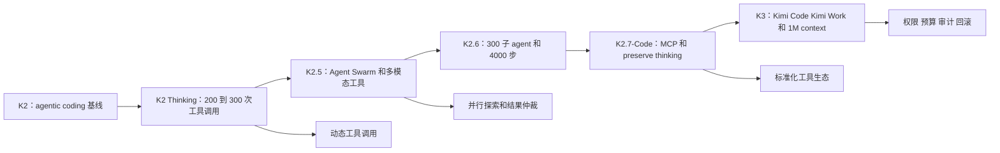
```mermaid
flowchart LR
    A["K2：agentic coding 基线"] --> B["K2 Thinking：200 到 300 次工具调用"]
    B --> C["K2.5：Agent Swarm 和多模态工具"]
    C --> D["K2.6：300 子 agent 和 4000 步"]
    D --> E["K2.7-Code：MCP 和 preserve thinking"]
    E --> F["K3：Kimi Code Kimi Work 和 1M context"]
    F --> G["权限 预算 审计 回滚"]
    B --> H["动态工具调用"]
    C --> I["并行探索和结果仲裁"]
    E --> J["标准化工具生态"]
```

### 5.2 模型到 Agent 编排技术映射表

| 模型或产品 | 编排技术点 | 演进状态 | 代表证据 |
|---|---|---|---|
| K2 | agentic coding、tool use 基线 | 后续被 Thinking/Swarm 强化 | SWE-bench Verified 65.8 |
| K2 Thinking | 动态工具调用、200 到 300 次连续 tool call | 被 K2.7/K3 的 preserve thinking 继承 | HLE w/tools 44.9 |
| K2.5 | Agent Swarm、context management、多模态工具 | 被 K2.6 扩展 | BrowseComp Agent Swarm 78.4 |
| K2.6 | 300 sub-agents、4000 coordinated steps、proactive execution | K2.7 coding 特化，K3 融合 | BrowseComp Agent Swarm 86.3 |
| K2.7-Code | Kimi Code harness、MCP、preserve thinking、token-efficient coding | K3 继续作为 coding 产品入口 | MCP Mark Verified 81.1 |
| K3 | Kimi Code、Kimi Work、1M context、Mooncake API、reasoning effort | 下一代 agent 产品底座 | BrowseComp 91.2、Toolathlon-Verified 73.2 |

### 5.3 动态工具调用：普通 function calling 不等于 agent

**提出位置与演进状态**  
K2 已强调 agentic coding 和 tool use，K2 Thinking 把动态工具调用提升为核心能力，并宣称可稳定处理 200 到 300 次连续 tool call。后续 K2.5/K2.6/K2.7-Code/K3 都在此基础上扩展。

**理论背景**  
function calling 解决的是“模型能否输出符合 schema 的调用”。Agent 解决的是“模型是否能在任务进展中选择、调用、读取、修复、继续规划并最终交付”。两者差别类似一次 RPC 与一个长期工作流执行器。

**原理机制**  
动态工具调用至少包含四个状态：计划状态、工具 schema、工具返回、错误恢复。工具返回会改变下一步动作，因此 agent harness 必须支持多轮状态回传和错误日志保留。

**Kimi 中的实现和创新**  
K2 Thinking 把 deep thinking 与 tool orchestration 一起训练和评测，这是 Kimi agent 线的关键节点。它的创新在于把连续工具调用作为能力指标，而不是只提供 API function call。

**效果与证据**  
K2 Thinking HF 记录 200 到 300 次 sequential tool calls，HLE w/tools 44.9、BrowseComp w/tools 60.2。K3 的 Toolathlon-Verified 73.2 和 MCP Atlas 84.2 进一步说明工具生态成为评测变量。

**工程影响**  
本仓库代理层需要为每次工具调用保存 trace，并支持限流、超时、重试和回滚。对服务 benchmark 来说，tool latency 与 model latency 要拆开统计。

**参考链接**  
- 主来源：[K2 Thinking HF](https://huggingface.co/moonshotai/Kimi-K2-Thinking)，[K3 blog](https://www.kimi.com/blog/kimi-k3)
- 理论背景：[ReAct](https://arxiv.org/abs/2210.03629)，[Toolformer](https://arxiv.org/abs/2302.04761)

**待验证问题**  
Kimi 工具调用训练是否使用标准 function schema、是否有 tool-call verifier、是否支持工具发现，需要官方 API 文档补充。

### 5.4 200 到 300 次工具调用与长程状态管理

**提出位置与演进状态**  
K2 Thinking 明确提出 200 到 300 次连续工具调用稳定性。K2.6 的 4000 coordinated steps 把这个状态长度继续拉大，K3 的 1M context 和 preserve thinking 则给长状态提供更大窗口。

**理论背景**  
长工具链的失败风险不是线性增加，而是会累积：早期计划错误、工具结果误读、上下文裁剪、重复搜索、权限失败都会在后续放大。长程状态管理需要保存“为什么这样做”和“已经试过什么”。

**原理机制**  
运行时状态可以拆成：

| 状态 | 内容 | 风险 |
|---|---|---|
| 任务状态 | 目标、约束、验收标准 | 目标漂移 |
| 推理状态 | 计划、假设、失败原因 | 裁剪后丢失 |
| 工具状态 | 调用参数、返回、错误 | 日志过长 |
| 产物状态 | 文件 diff、测试结果、网页证据 | 冲突和过期 |

**Kimi 中的实现和创新**  
Kimi 的创新是把长程状态变成模型训练假设和产品限制。K2.7/K3 都强调 preserve_thinking，说明简单把上下文总结成短文本可能会损伤质量。

**效果与证据**  
K2 Thinking 的 HLE w/tools、BrowseComp w/tools 和 200 到 300 次工具调用是主证据。K2.6/K3 的 long-horizon coding 和 agent benchmark 是后续证据。

**工程影响**  
本仓库应实现可回放的 agent trace，而不是只保存最终回答。建议日志字段包括 `turn_id`、`tool_name`、`args_hash`、`duration_ms`、`status`、`tokens_before`、`tokens_after`、`cache_hit`。

**参考链接**  
- 主来源：[K2 Thinking HF](https://huggingface.co/moonshotai/Kimi-K2-Thinking)，[K2.6 HF](https://huggingface.co/moonshotai/Kimi-K2.6)，[K3 blog](https://www.kimi.com/blog/kimi-k3)
- 辅助来源：[知乎第一章](https://zhuanlan.zhihu.com/p/2061491373937791328)

**待验证问题**  
200 到 300 次工具调用的测试环境、工具类型、失败率和平均成本需要原始 benchmark 或技术报告补证。

### 5.5 Agent Swarm 与结果仲裁

**提出位置与演进状态**  
K2.5 引入 Agent Swarm，K2.6 扩大到 300 sub-agents 和 4000 coordinated steps。K2.7-Code 把能力聚焦到 coding，K3 把 Swarm 结果和 1M context、Kimi Code/Kimi Work 产品结合。

**理论背景**  
多 agent 编排能提高覆盖率，因为不同子 agent 可以并行探索不同路径。但它需要解决三类问题：任务怎么拆、资源怎么分、结果怎么合并。没有仲裁机制，多 agent 很容易重复工作或产生互相冲突的结论；没有 critical path 约束，多 agent 也可能只是把总 token 和工具调用数放大。

**原理机制**  
一个可落地的 Swarm 运行时通常包含：

```text
任务规划器 -> 子任务队列 -> sub-agent 并行执行 -> 结果归并 -> 冲突仲裁 -> 最终验证
```

其中归并器需要读取每个 sub-agent 的证据、成本和置信度，并决定是否继续搜索或结束。

**Kimi 中的实现和创新**  
Kimi 的 Swarm 创新在于规模和后训练绑定：K2.5 不是只在产品层 fork 多个模型调用，而是把 PARL 作为训练/优化线索。K2.5 技术报告的架构是 trainable orchestrator 加 frozen subagents，orchestrator 动态决定是否创建、何时创建、创建多少、创建什么专长的子 agent；subagent 的输出成为后续 observation，再由 orchestrator 聚合和继续调度。K2.6 的 300 sub-agents/4000 steps 则显示 Moonshot 把并行 agent 数量当成 scaling axis。

从工程抽象看，Swarm 不是“多开几个会话”，而是把任务拆分、预算分配、并行执行、证据合并、冲突仲裁和最终验证变成同一个运行时协议。PARL 的 $r_{\text{finish}}$ 对应“分出去的子任务真的收敛”，critical steps 对应“并行确实缩短 wall-clock path”，这两个约束共同避免无效并行。

**效果与证据**  
K2.5 HF 记录 BrowseComp context-managed 74.9、Agent Swarm 78.4。K2.5 技术报告 Table 6 进一步给出 BrowseComp 78.4 vs 60.6、WideSearch 79.0 vs 72.7、In-house Swarm Bench 58.3 vs 41.6，并说明 WideSearch 执行时间在目标性能下相对单 agent 降低约 3 倍到 4.5 倍。K2.6 HF 记录 BrowseComp Agent Swarm 86.3。知乎第二章记录 K2.5/K2.6 Swarm 扩展关系。

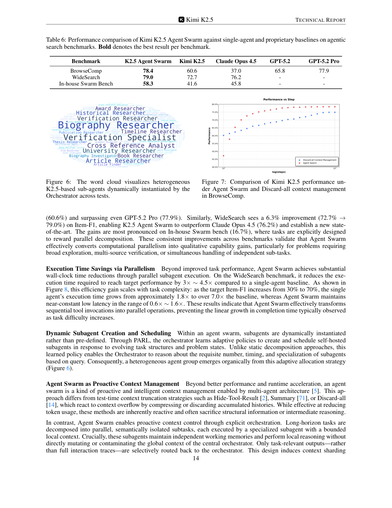

**工程影响**  
本仓库若实现 Swarm，要先定义结果仲裁规则。coding 场景中可用测试通过率、diff 最小化、lint、覆盖率和失败日志作为仲裁信号；搜索场景中可用来源可信度、证据重复度和矛盾检测。

**参考链接**  
- 主来源：[K2.5 HF](https://huggingface.co/moonshotai/Kimi-K2.5)，[K2.5 arXiv](https://arxiv.org/abs/2602.02276)，[K2.6 HF](https://huggingface.co/moonshotai/Kimi-K2.6)
- 辅助来源：[知乎第二章](https://zhuanlan.zhihu.com/p/2061492527589494896)

**待验证问题**  
Agent Swarm 的结果仲裁是否完全由 orchestrator 模型完成、subagent 输出是否被结构化压缩、不同 agent 是否共享 memory 和 cache、线上资源调度是否按 critical steps 优化，需要官方资料补充。

### 5.6 300 sub-agents 与 4000 steps

**提出位置与演进状态**  
K2.6 把 Agent Swarm 提升到 300 sub-agents 和 4000 coordinated steps，是 Kimi agent 编排线的规模化节点。K2.7-Code 没继续强调更大 agent 数，而是强调 coding token efficiency；这说明 Swarm 规模并不是唯一方向。

**理论背景**  
大规模 Swarm 的瓶颈包括调度开销、上下文膨胀、工具并发、重复探索、结果冲突和最终一致性。agent 数越多，边际收益可能递减，甚至因协调成本超过收益而下降。

**原理机制**  
Swarm 扩展需要分层：顶层 planner 控制任务分解，中层 orchestrator 分配预算，底层 sub-agent 执行并返回结构化证据。4000 steps 意味着需要压缩和索引执行历史，否则上下文和工具日志会不可控。

**Kimi 中的实现和创新**  
K2.6 的创新是把“主动长程编码任务”放在 Swarm 扩展目标中，而不是只用 Swarm 做并行搜索。长程 coding 的反馈更复杂，因为子 agent 的修改可能冲突，需要最终 repo 一致性。

**效果与证据**  
K2.6 HF 给出相对 K2.5 的多项提升，包括 Terminal-Bench 2.0、SWE-Bench Pro、BrowseComp Agent Swarm。具体 300/4000 的运行设置来自 K2.6 模型卡和官方博客。K2.5 HF 的评测脚注也给出 Swarm 预算口径：BrowseComp Swarm Mode 中 main agent 最多 15 steps、sub-agents 最多 100 steps；WideSearch Swarm Mode 中 main 和 sub-agents 都最多 100 steps。这些数字说明公开 benchmark 的 Swarm 分数必须连同 step budget 一起解读。

**工程影响**  
本仓库如果压测多 agent，应设置强预算：最大 agent 数、最大工具步、最大 wall time、最大 diff、最大并发 shell、最大 context retention。没有预算控制的 Swarm 不适合生产。对多 agent 实验，建议同时记录 total steps 与 critical steps：前者反映总成本，后者更接近用户感知延迟。

**参考链接**  
- 主来源：[K2.6 HF](https://huggingface.co/moonshotai/Kimi-K2.6)，[K2.6 blog](https://www.kimi.com/blog/kimi-k2-6)
- 辅助来源：[知乎第二章](https://zhuanlan.zhihu.com/p/2061492527589494896)

**待验证问题**  
300 sub-agents 是 benchmark 最大值、产品最大值还是训练设置；4000 steps 是否包含工具调用、内部步骤或消息轮次，需要补证。

### 5.7 Kimi Code harness

**提出位置与演进状态**  
K2.7-Code 是 coding-focused agentic model，K3 发布页也把 Kimi Code 作为主要体验入口之一。Kimi Code harness 影响 coding benchmark，因为工具协议、终端、文件系统、测试命令、上下文保留和模型 effort 都会改变最终分数。

**理论背景**  
coding agent 的能力由三层组成：模型提出修改、harness 执行和验证、上下文/历史系统支持长期任务。裸模型 API 的代码补全分数不能等价于 Kimi Code 中的 agentic coding 分数。

**原理机制**  
Kimi Code harness 至少需要提供文件读写、shell 执行、测试输出回传、diff 管理、任务状态和 thinking history。K3 blog footnotes 对 benchmark 设置、temperature、top-p、max effort 做了说明，说明 harness 变量已进入评测口径。

**Kimi 中的实现和创新**  
K2.7-Code 的创新是为真实世界长程 coding 做专门后训练和推理预算优化。K3 则把 Kimi Code 作为 2.8T/1M context 模型的应用载体。

**效果与证据**  
K2.7-Code HF 给出 Kimi Code Bench v2、Program Bench、MLS Bench Lite、Kimi Claw、MCP Atlas、MCP Mark 等分数。K3 blog 给出 DeepSWE、Terminal Bench、FrontierSWE、SWE Marathon 等。

**工程影响**  
本仓库对外暴露 vLLM 服务时，应明确“裸 chat completion”“工具增强 agent”“coding harness”三种评测模式。否则同一个模型的分数和吞吐不可比。

**参考链接**  
- 主来源：[K2.7-Code HF](https://huggingface.co/moonshotai/Kimi-K2.7-Code)，[K3 blog](https://www.kimi.com/blog/kimi-k3)，[Kimi Code](https://www.kimi.com/code)
- Benchmark：[DeepSWE](https://deepswe.datacurve.ai/)，[TerminalBench](https://www.tbench.ai/)，[FrontierSWE](https://www.frontierswe.com/)

**待验证问题**  
Kimi Code harness 的工具接口、是否兼容 MCP、是否公开任务 replay、benchmark 是否可复现，需要继续搜索。

### 5.8 MCP 与外部工具生态

**提出位置与演进状态**  
K2.7-Code 明确给出 MCP Atlas 和 MCP Mark Verified 结果，K3 继续报告 MCP Atlas、Toolathlon-Verified 等工具类 benchmark。MCP 代表 agent 工具生态从私有 function schema 向标准化协议演进。

**理论背景**  
工具生态标准化解决三个问题：工具发现、参数 schema、权限边界。没有标准协议时，每个 agent harness 都要写私有适配层；有 MCP 后，工具可以作为独立 server 被发现、调用和审计。

**原理机制**  
MCP 类协议把工具能力、输入 schema、资源和执行结果显式化。agent 在运行时选择工具，harness 负责执行、权限校验和结果回传。benchmark 则可以构造标准工具任务，评估模型是否会正确使用工具生态。

**Kimi 中的实现和创新**  
K2 report 已经把 MCP 写入 tool-use 数据合成：Moonshot 直接从 GitHub 拉取 3000+ real MCP tools，并通过层级 domain evolution 生成 20,000+ synthetic tools，用于构造工具仓库、agent、任务和轨迹。K2.7-Code 把 MCP Atlas 和 MCP Mark 结果列入模型卡，说明标准化工具调用从训练数据走到了模型评测。K3 继续强化工具 benchmark，说明 agent 编排不再是产品私有逻辑，而是模型能力评估的一部分。

**效果与证据**  
K2 report Figure 9 展示了 real MCP tools 和 synthetic tools 的 t-SNE 分布，用于说明工具覆盖面。K2.7-Code HF 记录 MCP Atlas 76.0、MCP Mark Verified 81.1。K3 blog 记录 MCP Atlas 84.2、Toolathlon-Verified 73.2。

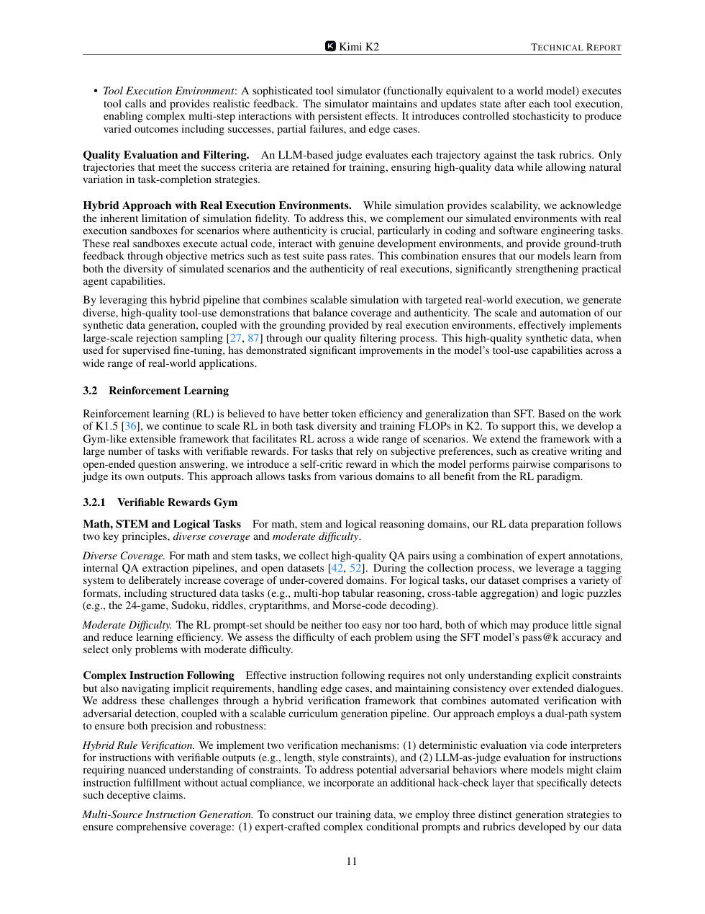

图：Kimi K2 technical report 第 11 页，Figure 9 “t-SNE visualizations of tool embeddings”。该图支撑本文对 3000+ real MCP tools 与 20,000+ synthetic tools 的覆盖分析。

**工程影响**  
本仓库如果接入 MCP，需要在代理层记录 server、tool、schema version、权限、返回大小和错误。对 vLLM 服务端，MCP 不直接改变模型推理 kernel，但会显著改变请求序列长度和 cache 命中。

**参考链接**  
- 主来源：[K2.7-Code HF](https://huggingface.co/moonshotai/Kimi-K2.7-Code)，[K3 blog](https://www.kimi.com/blog/kimi-k3)
- Benchmark：[MCP Atlas](https://labs.scale.com/leaderboard/mcp_atlas)，[MCPMark](https://mcpmark.ai/)
- 协议背景：[Model Context Protocol](https://modelcontextprotocol.io/)

**待验证问题**  
Kimi API 是否原生暴露 MCP 工具调用、MCP benchmark 的工具集合和评分规则、与 Kimi Code 内部工具的关系，需要继续核验。

### 5.9 Kimi Work：知识工作 agent

**提出位置与演进状态**  
K3 发布页展示 Kimi Work 相关能力，包括 research with interactive visualization、widgets/dashboard、video editing 等。Kimi Work 代表 Kimi agent 从 coding 任务扩展到知识工作、多模态 artifact 和可视化协同。

**理论背景**  
知识工作 agent 与 coding agent 的差别在于产物类型更杂：文档、表格、网页、可视化、视频、dashboard、图片证据。它更依赖多模态理解、文件管理、浏览器、artifact 渲染和用户确认。

**原理机制**  
Kimi Work 类产品需要把模型、工具、文件、UI artifact 和长期任务状态编排起来。模型负责计划和生成，harness 负责工具执行和产物呈现，权限层负责防止越权访问和错误提交。

**Kimi 中的实现和创新**  
K3 的原生多模态、1M context 和 Mooncake 支撑，使知识工作 agent 能处理更大的资料包和更长的工作流。其创新更多在“模型能力 + 产品 harness”的组合，而不是单一模型层。

**效果与证据**  
K3 blog 中的 Kimi Work 场景是主要公开证据。当前没有独立 benchmark 能完整衡量 Kimi Work 的知识工作效率，因此本节作为产品形态分析，不把场景展示等同于可复现实验结果。

**工程影响**  
本仓库若服务知识工作类任务，需要引入文件上传、OCR/视觉、检索、artifact 生成和权限审计。它和纯 vLLM concurrency benchmark 是不同问题。

**参考链接**  
- 主来源：[K3 blog](https://www.kimi.com/blog/kimi-k3)，[Kimi Work](https://www.kimi.com/products/kimi-work)
- 相近背景：[Florence-2](https://arxiv.org/abs/2311.06242)

**待验证问题**  
Kimi Work 是否使用 K3 全能力、是否有独立工具 runtime、artifact 执行是否沙箱化，需要继续搜索官方文档。

### 5.10 上下文管理：1M context 不能替代检索和摘要

**提出位置与演进状态**  
Kimi 从 20 万汉字、200 万字，到 K2 128K、K2.x 256K、K3 1M context，一直把长上下文作为核心能力。但 Agent Swarm、Kimi Code 和 Kimi Work 都说明，长上下文只是编排系统的一部分。

**理论背景**  
长上下文提高模型可见材料上限，RAG 提高材料选择效率，摘要降低历史成本，cache 降低重复 prefill。四者解决的问题不同。1M context 如果不做检索和摘要，仍会带来更高延迟、成本和错误证据干扰。

**原理机制**  
可行的上下文管理通常是：

```text
原始资料 -> 分块和索引 -> 检索或筛选 -> 长上下文合并 -> prefix cache -> thinking history 裁剪
```

其中检索负责选择，长上下文负责保真阅读，cache 负责成本，thinking history 负责任务连续性。

**Kimi 中的实现和创新**  
Kimi 的创新是把长上下文和 agent 状态结合。K3 1M context 不是让 RAG 消失，而是让 agent 能在更大窗口内整合项目、工具历史和多模态证据。K2.5 的模型卡脚注进一步说明，HLE w/tools 使用简单 context management：当上下文超过阈值时，只保留最新一轮 tool messages；BrowseComp 中 K2.5 和 DeepSeek-V3.2 使用 discard-all 策略；其他没有 context management 的任务，如果超过模型支持长度就直接计为失败。

**效果与证据**  
K3 HF 确认 1048576 context；K3 blog 提到 coding workloads cache hit rate 超过 90%；K2.5 的 BrowseComp 从 60.6 提升到 context-managed 74.9，再到 Agent Swarm 78.4，说明上下文管理会显著影响结果。K2.5 HF 还说明 Terminal-Bench 2.0 在 non-thinking mode 下评估，因为当前 thinking mode 的 context management strategy 与 Terminus-2 不兼容，这进一步说明 benchmark 分数不是裸模型能力的单变量结果。

**工程影响**  
本仓库应同时保留 RAG 版、长上下文直塞版、摘要版和 prefix cache 版 benchmark。对于相同任务，记录召回率、TTFT、TPOT、总 token、cache hit 和最终质量。

**参考链接**  
- 主来源：[K3 HF](https://huggingface.co/moonshotai/Kimi-K3)，[K3 blog](https://www.kimi.com/blog/kimi-k3)，[K2.5 HF](https://huggingface.co/moonshotai/Kimi-K2.5)，[K2.5 技术报告](https://arxiv.org/abs/2602.02276)
- 理论背景：[RAG](https://arxiv.org/abs/2005.11401)，[YaRN](https://arxiv.org/abs/2309.00071)

**待验证问题**  
Kimi 官方 API 的 1M context 与 retrieval/context management 是否有默认策略、是否影响计费和 cache hit，需要继续看 API 文档。

### 5.11 主动执行、权限与失败恢复

**提出位置与演进状态**  
K2.6 提出 proactive autonomous execution。K3 limitations 提醒模型可能过度主动，建议通过 system prompt 或 AGENTS.md 约束。说明 agent 编排必须包含权限和失败恢复。

**理论背景**  
主动执行是长程 agent 的能力，也是生产风险。风险包括误改文件、误删数据、泄露 secret、无限循环、调用高成本工具、忽视用户新指令。强模型越会主动完成任务，越需要外层约束。

**原理机制**  
权限层可以分成四类：

| 层 | 做法 |
|---|---|
| 预算 | 限制 token、工具次数、wall time、费用 |
| 权限 | 对文件写入、网络、shell、部署、删除操作做 allowlist 或确认 |
| 审计 | 保留 tool trace、diff、命令输出摘要 |
| 回滚 | 对代码改动、部署、环境变量变更提供恢复路径 |

**Kimi 中的实现和创新**  
K3 把 AGENTS.md 这类项目规则写进 limitations，说明模型使用方式已进入技术设计边界。K3 report 还把 agent harness 表示为一组 configurable、composable modules，包括 tool interfaces、system prompts、context management strategies、skills、memories、subagents 等；训练时在多种 agent scaffolds 下 rollout，而不是固定单一 harness，目标是减少对某个工具 schema 或上下文策略的过拟合。对 coding agent 来说，项目规范不是文档装饰，而是行为控制输入。

**效果与证据**  
K2.6/K3 的主动执行和长程 coding benchmark 是能力证据；K3 limitations 是风险证据。K3 report 的 Autonomous Execution Tasks，简称 AET，定义了 initial state、constrained goal、tool-based action space、execution budgets 和 independent verifier，让 agent 通过 verify-in-the-loop 学习规划、工具选择、错误恢复和终止。K3 report 还提到 AgentENV 使用 Firecracker microVM 提供高保真隔离 sandbox，并支持 pause/resume 和 checkpoint 生命周期，这把权限、隔离和失败恢复从产品约束推进到训练基础设施。

**工程影响**  
本仓库的 AGENTS.md 已要求不覆盖用户改动、不提交 secrets、谨慎执行 destructive commands。后续如果用 Kimi/K3 类 agent，应把这些规则映射到工具权限，而不是只写在 prompt 中。

**参考链接**  
- 主来源：[K2.6 blog](https://www.kimi.com/blog/kimi-k2-6)，[K3 blog](https://www.kimi.com/blog/kimi-k3)，[K3 技术报告](https://github.com/MoonshotAI/Kimi-K3/blob/main/k3_tech_report.pdf)
- 协议背景：[Model Context Protocol](https://modelcontextprotocol.io/)

**待验证问题**  
Kimi Code 是否内建审批、回滚、命令 allowlist 和 diff 审查机制，需要进一步查产品文档。

### 5.12 Agent 评测体系

**提出位置与演进状态**  
Kimi 从 K2 开始大量报告 coding 和 agentic benchmark，K2.5/K2.6/K2.7/K3 进一步加入 BrowseComp、DeepSearchQA、TerminalBench、MCP Atlas、MCP Mark、Toolathlon 等。评测体系本身成为技术路线的一部分。

**理论背景**  
不同 benchmark 看的是不同能力：SWE-bench 看真实 issue 修复；TerminalBench 看终端任务；BrowseComp/DeepSearchQA 看搜索浏览和信息综合；MCP benchmark 看工具协议和多工具使用；HLE w/tools 看高难知识任务加工具能力。

**原理机制**  
Agent benchmark 必须记录 hidden variables：模型版本、工具集合、最大工具步数、上下文长度、是否 preserve thinking、effort mode、temperature、top-p、是否多 agent、是否有人类提示。缺少这些变量，跨模型分数不可直接比较。

**Kimi 中的实现和创新**  
K3 blog 对 max reasoning effort、temperature 1.0、top-p 1.0 等做脚注，说明 Moonshot 已意识到 agent 评测需要披露 harness 变量。K2.7-Code 报告 MCP 类指标，则说明协议级工具 benchmark 进入主流。

**效果与证据**  
K2 到 K3 的表格中可见，Kimi 从单纯 SWE/LiveCodeBench，逐渐扩展到 Terminal、Browse、MCP、Toolathlon、DeepSearchQA、HLE w/tools。这个扩展本身说明能力目标从“会答题”转为“会执行复杂任务”。

**工程影响**  
本仓库应把 benchmark 输出结构化，避免只保存日志。建议统一字段：`model`、`quant`、`context_limit`、`effort`、`harness`、`tools`、`max_steps`、`cache_policy`、`score`、`cost`、`latency`。

**参考链接**  
- 主来源：[K2.7-Code HF](https://huggingface.co/moonshotai/Kimi-K2.7-Code)，[K3 blog](https://www.kimi.com/blog/kimi-k3)
- Benchmark：[SWE-bench](https://www.swebench.com/)，[TerminalBench](https://www.tbench.ai/)，[MCP Atlas](https://labs.scale.com/leaderboard/mcp_atlas)，[MCPMark](https://mcpmark.ai/)，[DeepSWE](https://deepswe.datacurve.ai/)

**待验证问题**  
Kimi 各 benchmark 是否使用同一 Kimi Code harness、工具预算是否一致、是否有 hidden retries，需要官方 benchmark harness 说明。

## 6. Kimi-K4 可能创新点预测

本章是技术假设，不是事实。K4 未发布，以下判断只能基于 K2 到 K3 已发生趋势、公开论文/系统路线和本仓库 serving/agent 实验需要来预测。

### 6.1 三线预测图

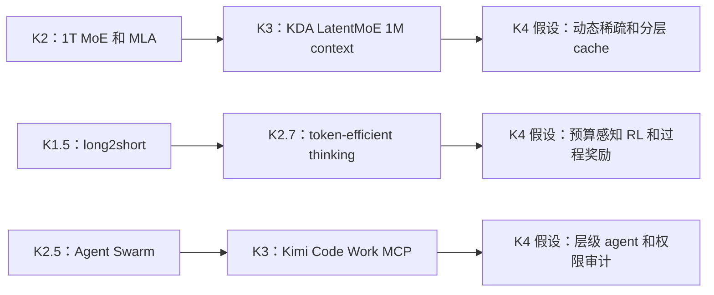
```mermaid
flowchart LR
    A["K2：1T MoE 和 MLA"] --> B["K3：KDA LatentMoE 1M context"]
    B --> C["K4 假设：动态稀疏和分层 cache"]
    D["K1.5：long2short"] --> E["K2.7：token-efficient thinking"]
    E --> F["K4 假设：预算感知 RL 和过程奖励"]
    G["K2.5：Agent Swarm"] --> H["K3：Kimi Code Work MCP"]
    H --> I["K4 假设：层级 agent 和权限审计"]
```

### 6.2 K4 技术假设表

| 角度 | K4 可能创新 | 继承自 Kimi 哪条线 | 外部技术趋势 | 预期收益 | 实现难点 | 可验证指标 | 风险 |
|---|---|---|---|---|---|---|---|
| 推理效率 | KDA/MLA/稀疏 attention 的动态混合 | Kimi Linear、K3 69 KDA + 24 Gated MLA | linear attention、state space、hybrid attention | 进一步降低 1M 以上 context 的 decode 和 cache 成本 | 纯状态模型精确检索弱，混合层比例难调 | 1M/2M context TTFT、TPOT、needle、多跳检索准确率 | 可能只是 K3 的工程优化，不一定改模型结构 |
| 推理效率 | 分层 prefix cache 和跨会话 cache reuse | Mooncake、KDA prefix cache、K3 coding cache hit | KV cache offloading、P-D 分离、semantic cache | 长程 coding 和知识工作成本下降 | cache key、权限隔离、失效策略复杂 | cache hit、cache memory、重复任务 TTFT、p99 latency | 跨用户 cache 有隐私和一致性风险 |
| 推理效率 | 动态 MoE 激活和专家热度自适应 | K2/K3 MoE、Quantile Balancing | adaptive computation、conditional compute | 简单 token 少激活，困难 token 多激活 | 训练和推理调度更复杂，tail latency 可能上升 | active params/token、质量成本比、expert load 方差 | 公开硬件/kernel 未必支持 |
| 推理效率 | 低精度训练格式继续前移 | K2 Thinking INT4 QAT、K3 MXFP4/MXFP8 | FP4/FP8 kernel、QAT、mixed precision | 显存下降，吞吐提升，部署更稳 | 低比特下 reasoning 和 tool use 易受损 | benchmark delta、perplexity delta、GPU memory、tokens/s | 可能被硬件生态限制 |
| RL 后训练 | 预算感知 reasoning effort RL | K1.5 long2short、K2.7 token-efficient thinking、K3 effort | process reward、length penalty、test-time compute scaling | 用户按任务调成本，减少无效 thinking | 奖励要同时保质量和成本，容易过度压缩 | success/token、success/second、effort 分档曲线 | 分档不透明会影响可复现评测 |
| RL 后训练 | 工具环境过程奖励和自验证 reward | K2 self-critique、K2.6 执行反馈 | verifier、PRM、execution feedback RL | 长程 coding 更少无效修复，失败恢复更强 | 工具环境昂贵，reward 噪声高 | pass rate、失败后修复率、重试次数 | 训练可能过拟合 benchmark harness |
| RL 后训练 | 多模态工具 RL | K2.5 joint text-vision RL、K3 MoonViT-V2 | multimodal agents、visual grounding | 图表、视频、网页、文档任务更稳 | 视觉证据和工具动作 credit assignment 难 | MMMU-Pro、OmniDocBench、视觉工具任务成功率 | 可能被产品工具增强掩盖模型贡献 |
| Agent 编排 | 层级化 Agent Swarm | K2.5 PARL、K2.6 300 sub-agents | hierarchical planning、多 agent systems | 大任务并行更可控，减少重复探索 | 结果仲裁和全局一致性难 | 成功率、wall time、冲突率、重复工具调用率 | agent 数增加可能带来成本爆炸 |
| Agent 编排 | 持久化项目记忆和任务 replay | preserve thinking、Kimi Code、Kimi Work | memory-augmented agents、workspace state | 跨会话 coding 和知识工作连续性更强 | 隐私、过期信息、错误记忆污染 | 跨会话任务成功率、replay 命中、纠错次数 | 需要严格权限和清除机制 |
| Agent 编排 | 计划、执行、审计分离的权限沙箱 | K3 limitations、MCP、AGENTS.md | tool sandbox、policy engine、audit log | 主动 agent 更适合生产 | 用户体验和安全边界冲突 | 未授权动作率、回滚成功率、人工确认次数 | 太保守会损失 agent 效率 |

### 6.3 对本仓库可转化的实验

| 实验方向 | 对应 Kimi 趋势 | 建议落地 |
|---|---|---|
| P-D 分离压测 | Mooncake、K3 1M context | 用 `disagg_proxy_demo.py` 和 `mooncake_connector_proxy.py` 对比单体 vLLM、P-D 分离、prefix cache 命中下的 TTFT/TPOT |
| 长上下文 cache 经济性 | KDA prefix cache、Mooncake cache hit | 构造重复代码仓库 prompt，记录 cache hit、显存、prefill tokens/s、decode tokens/s |
| token-efficient coding | K2.7-Code、K3 effort | 对相同 coding 任务记录最终成功率、thinking tokens、tool calls、wall time |
| Swarm 编排 | K2.5/K2.6 Agent Swarm | 实现 1、4、16 个 sub-agent 的小规模对比，记录重复工作、冲突率和成本 |
| 权限审计 | K3 limitations、MCP | 对工具调用增加 allowlist、budget、diff preview 和 trace log |

## 7. 总结

### 7.1 核心创新矩阵

| 创新 | 为什么重要 | Kimi 演进位置 | 对服务成本的影响 | 对能力的影响 | 证据强度 |
|---|---|---|---|---|---|
| 长上下文产品化 | 让长文档、长会话、长任务成为 Kimi 的早期产品心智 | 2023 Kimi Chat、2024 200 万字 | 成本上升，需要后续 cache 和架构优化 | 提升长文阅读和任务连续性 | 知乎已复核，需官方历史补证 |
| 1T/32B 稀疏 MoE 基座 | 用大总容量和低激活计算兼顾能力与部署 | K2 到 K2.7-Code | 相比 dense 扩参更可服务化，但增加专家并行复杂度 | 支撑 coding、tool use、reasoning 基线 | HF/GitHub 已核验 |
| MuonClip 稳定万亿训练 | 降低 loss spike，使大 MoE 训练可完成 | K2 | 间接降低训练失败成本 | 支撑 15.5T tokens 训练 | 官方报告待深入摘表 |
| MLA 到 KDA/Gated MLA | 解决长上下文 KV cache 和 decode 成本 | K2 MLA、Kimi Linear、K3 | 显著降低 cache 和长上下文 decode 成本 | 支撑 256K 到 1M context | K3/Kimi Linear 已核验，公式需读论文 |
| Stable LatentMoE 和 Quantile Balancing | 让 896 experts 的 K3 可训练、可服务 | K3 | 降低专家负载不均和 tail latency 风险 | 支撑 2.8T/104B 规模 | 官方声明，消融需补 |
| INT4/MXFP QAT | 把低精度部署纳入训练目标 | K2 Thinking、K2.7、K3 | 降显存、提吞吐 | 减少低精度质量损失 | HF 已核验 |
| Thinking 和 tool-use RL | 让模型能在工具环境中长程执行 | K2、K2 Thinking | 工具链成本上升，需要预算控制 | HLE、BrowseComp、coding 提升 | HF/官方博客已核验 |
| Agent Swarm/PARL | 把多 agent 并行作为扩展轴 | K2.5、K2.6 | 提高并发成本，也可能降低端到端时间 | 提升复杂搜索和长任务覆盖 | PARL 奖励、critical steps、Table 6 已补；线上归并和调度实现待公开 |
| preserve thinking 与 effort | 把推理历史和预算变成协议变量 | K2.7、K3 | 可控 thinking 成本，但需要 harness 配合 | 提升长任务连续性 | HF/K3 blog 已核验 |
| Mooncake P-D 分离 | 把长上下文服务成本从模型问题转成 cache 调度问题 | K3 API、Mooncake | 降低重复 prefill，改善容量和延迟 | 支撑 coding workload 复用 | Mooncake/FAST 已核验，Kimi 指标需补 |

### 7.2 Kimi 系列最重要的技术路线

Kimi 系列最重要的创新不是某一个模型结构名，而是把“长上下文任务”持续推进到模型、后训练、agent harness 和推理系统四层。早期 Kimi 用长上下文建立产品入口；K2 用 1T/32B MoE 和 MLA 做开源 agentic 基座；K2 Thinking/K2.5/K2.6/K2.7-Code 用 thinking、tool-use RL、Swarm、多模态和 coding-specific 后训练把能力推向长程执行；K3 再用 KDA、Stable LatentMoE、MXFP QAT、1M context 和 Mooncake 把能力与服务成本重新平衡。

### 7.3 对本仓库 vLLM / disaggregated inference 的启发

| 本仓库方向 | 需要从 Kimi 路线吸收的点 |
|---|---|
| vLLM serving | 记录模型架构、量化格式、context limit、cache dtype、prefix cache 支持状态；KDA/MLA/MoE 不能按普通 dense MHA 模型假设处理 |
| P-D 分离实验 | 长上下文 coding workload 是最适合验证 P-D 分离的场景；应分别测 prefill tokens/s、decode tokens/s、TTFT、TPOT、cache hit |
| proxy/router | MoE 和 Swarm 都会放大 tail latency；代理层应记录请求长度、工具链长度、cache 命中和后端队列 |
| benchmark 脚本 | 增加 quality/cost ratio，不只测并发吞吐；thinking token、tool calls、失败重试、wall time 都是必要指标 |
| agent harness | preserve thinking、工具 trace、权限预算、diff 审查和回滚要成为一等设计，而不是提示词附属品 |

### 7.4 仍需继续验证的问题

| 问题 | 下一步 |
|---|---|
| K2 report 中 sparse scaling、MuonClip、MLA head 数消融的原始图表 | 逐页读 K2 技术报告，补截图和表号 |
| Kimi Linear 的 KDA 公式、状态维度、3:1 混合结构 | 读完整论文并抽取核心公式与消融 |
| K3 report 中 Stable LatentMoE、Quantile Balancing、AttnRes 的精确定义 | 读 K3 技术报告，补架构图和消融 |
| Agent Swarm 的线上 runtime、结果仲裁和资源调度 | 继续查 K2.5/K2.6 官方博客或后续报告，确认 subagent 输出格式、归并策略、失败恢复和 cache/memory 共享方式 |
| Mooncake 与 checkpoint-engine 的生产指标 | 读 FAST 论文、README 更新和 checkpoint-engine 仓库，确认数值口径 |
| 141 上知乎专栏后续章节 | 继续用 141 Chrome 读取第三到第五章，补横向对比和学习路径参考 |

## 8. 外部链接索引

### 8.1 Kimi 官方与模型卡

| 来源 | 链接 |
|---|---|
| Kimi K2 Instruct HF | https://huggingface.co/moonshotai/Kimi-K2-Instruct |
| Kimi K2 GitHub | https://github.com/MoonshotAI/Kimi-K2 |
| Kimi K2 技术报告 | https://github.com/MoonshotAI/Kimi-K2/blob/main/tech_report.pdf |
| Kimi K2 Instruct 0905 HF | https://huggingface.co/moonshotai/Kimi-K2-Instruct-0905 |
| Kimi K2 Thinking HF | https://huggingface.co/moonshotai/Kimi-K2-Thinking |
| Kimi K2 Thinking 技术页 | https://moonshotai.github.io/Kimi-K2/thinking.html |
| Kimi K2 Thinking blog | https://www.kimi.com/blog/kimi-k2-thinking |
| Kimi K2.5 HF | https://huggingface.co/moonshotai/Kimi-K2.5 |
| Kimi K2.5 blog | https://www.kimi.com/blog/kimi-k2-5 |
| Kimi K2.5 技术报告 | https://arxiv.org/abs/2602.02276 |
| Kimi K2.6 HF | https://huggingface.co/moonshotai/Kimi-K2.6 |
| Kimi K2.6 blog | https://www.kimi.com/blog/kimi-k2-6 |
| Kimi K2.7-Code HF | https://huggingface.co/moonshotai/Kimi-K2.7-Code |
| Kimi K3 HF | https://huggingface.co/moonshotai/Kimi-K3 |
| Kimi K3 blog | https://www.kimi.com/blog/kimi-k3 |
| Kimi K3 GitHub | https://github.com/MoonshotAI/Kimi-K3 |
| Kimi K3 技术报告 | https://github.com/MoonshotAI/Kimi-K3/blob/main/k3_tech_report.pdf |

### 8.2 Kimi 相关论文和仓库

| 来源 | 链接 |
|---|---|
| Kimi k1.5 | https://arxiv.org/abs/2501.12599 |
| Kimi Linear paper | https://huggingface.co/papers/2510.26692 |
| Kimi Linear GitHub | https://github.com/MoonshotAI/Kimi-Linear |
| Kimi Linear 48B-A3B Base | https://huggingface.co/moonshotai/Kimi-Linear-48B-A3B-Base |
| Kimi Linear 48B-A3B Instruct | https://huggingface.co/moonshotai/Kimi-Linear-48B-A3B-Instruct |
| KDA kernel in FLA | https://github.com/fla-org/flash-linear-attention/tree/main/fla/ops/kda |
| MoBA GitHub | https://github.com/MoonshotAI/MoBA |
| Mooncake GitHub | https://github.com/kvcache-ai/Mooncake |
| Mooncake FAST 2025 paper | https://www.usenix.org/system/files/fast25-qin.pdf |
| checkpoint-engine | https://github.com/MoonshotAI/checkpoint-engine |

### 8.3 相近技术论文

| 技术 | 链接 |
|---|---|
| Switch Transformer | https://arxiv.org/abs/2101.03961 |
| GShard | https://arxiv.org/abs/2006.16668 |
| DeepSeek-V2 MLA | https://arxiv.org/abs/2405.04434 |
| Multi-Query Attention | https://arxiv.org/abs/1911.02150 |
| Grouped-Query Attention | https://arxiv.org/abs/2305.13245 |
| Gated Delta Networks | https://arxiv.org/abs/2412.06464 |
| YaRN | https://arxiv.org/abs/2309.00071 |
| Longformer | https://arxiv.org/abs/2004.05150 |
| BigBird | https://arxiv.org/abs/2007.14062 |
| RAG | https://arxiv.org/abs/2005.11401 |
| ReAct | https://arxiv.org/abs/2210.03629 |
| Toolformer | https://arxiv.org/abs/2302.04761 |
| DPO | https://arxiv.org/abs/2305.18290 |
| QAT 背景论文 | https://arxiv.org/abs/1712.05877 |
| ResNet | https://arxiv.org/abs/1512.03385 |
| Transformer | https://arxiv.org/abs/1706.03762 |

### 8.4 产品、协议与 benchmark

| 分类 | 链接 |
|---|---|
| Kimi Code | https://www.kimi.com/code |
| Kimi Work | https://www.kimi.com/products/kimi-work |
| Kimi Platform | https://platform.kimi.ai/ |
| Model Context Protocol | https://modelcontextprotocol.io/ |
| AgentENV | https://github.com/kvcache-ai/AgentENV |
| vLLM | https://github.com/vllm-project/vllm |
| compressed-tensors | https://github.com/vllm-project/compressed-tensors |
| SWE-bench | https://www.swebench.com/ |
| TerminalBench | https://www.tbench.ai/ |
| Program Bench | https://www.vals.ai/benchmarks/programbench |
| DeepSWE | https://deepswe.datacurve.ai/ |
| FrontierSWE | https://www.frontierswe.com/ |
| MCP Atlas | https://labs.scale.com/leaderboard/mcp_atlas |
| MCPMark | https://mcpmark.ai/ |

### 8.5 知乎专栏来源

| 章节 | 链接 | 本文用途 |
|---|---|---|
| 第一章：Kimi 与 DeepSeek 大模型技术路线图 | https://zhuanlan.zhihu.com/p/2061491373937791328 | 三条技术轴背景 |
| 第二章：Kimi 技术演进路线图与核心创新 | https://zhuanlan.zhihu.com/p/2061492527589494896 | 时间线主来源和 Kimi 技术演进观点 |
| 专栏：大模型初探 | https://zhuanlan.zhihu.com/c_2061491184288245579 | 系列文章入口 |
