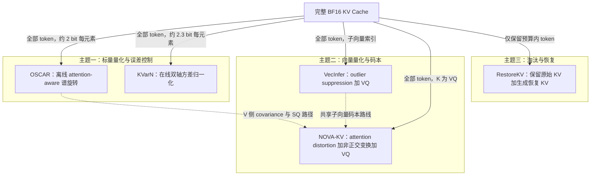
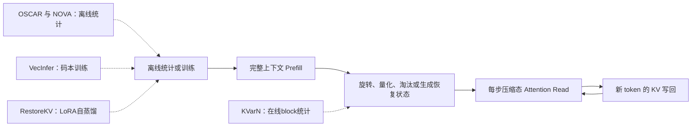

# KV Cache 压缩的三个方向：OSCAR、KVarN、VecInfer、NOVA-KV 与 RestoreKV

> 调研日期：2026-09-10
>
> 论文范围：OSCAR、KVarN、VecInfer、NOVA-KV、RestoreKV
>
> 核心问题：五篇论文分别观察到了什么、核心创新是什么、解决了什么、取得了什么效果，又留下了哪些尚未解决的问题？

## 0. 名称、范围与阅读结论

本文将用户所称的 `verinfer` 解释为 **VecInfer**：

- [VecInfer: Efficient LLM Inference with Low-Bit KV Cache via Outlier-Suppressed Vector Quantization](https://arxiv.org/abs/2510.06175)
- 官方代码：[ydyhello/VecInfer](https://github.com/ydyhello/VecInfer)

需要特别区分两个名字：

- **OSCAR**：本文讨论的 arXiv:2605.17757，2-bit KV Cache 量化方法；
- **OScaR**：arXiv:2605.19660，是另一篇不同论文，不在本文范围内。

五篇论文并不是同一方向上的五个替代品，而是三个技术主题：

| 主题 | 核心问题 | 论文 | 压缩后是否保留所有历史 token |
|---|---|---|---|
| 主题一：低比特标量量化与误差控制 | 如何让每个 KV 标量在约 2 bit 下仍可用 | OSCAR、KVarN | 是 |
| 主题二：向量量化与变换编码 | 如何用码本联合编码多个坐标，提高极低码率的表达能力 | VecInfer、NOVA-KV | 是 |
| 主题三：淘汰后的信息恢复 | 删除大部分 token 后，如何补回仅靠“选谁留下”无法保存的信息 | RestoreKV | 否；保留少量原始 KV，并生成恢复 KV |

结论先行：

1. **OSCAR** 把 attention-aware covariance、离线谱旋转、INT2 和压缩态 kernel 连成完整链路，解决的是“量化前怎样旋转，才能把有限精度放到重要方向”。
2. **KVarN** 发现静态 prefill 误差不能代表真实长生成，关键失败源是少数 token 的 norm/scale 被错误量化；它用双轴方差归一化抑制自回归误差累积。
3. **VecInfer** 发现 K outlier 会让低码率 VQ 码本利用率恶化；它用 Smooth + Hadamard 摊平分布，并实现融合 VQ attention kernel。
4. **NOVA-KV** 不再把 outlier 或原始 MSE 当最终目标，而是从 attention-product distortion 推导非正交 K transform，再以等体积分组实现固定宽 VQ。
5. **RestoreKV** 不再只优化“哪些原始 token 应保留”，而是让少量 learned restore tokens 在淘汰前读取完整上下文，生成上下文相关的补偿 KV。
6. 三个主题可以组合，但论文并未证明简单叠加后仍保持各自收益。特别是“淘汰率 × 量化 bit”看似能乘法压缩，实际会引入恢复状态量化、码本访问和双重误差传播。

## 1. 三个主题之间的关系



这三个主题分别改变 KV Cache 的不同轴：

| 压缩轴 | 典型控制量 | 代表论文 | 核心风险 |
|---|---|---|---|
| 每元素精度 | bit/element、group size、scale | OSCAR、KVarN | 量化误差传播、scale/outlier、kernel 解包 |
| 多坐标联合表示 | subvector dimension、codebook size、index width | VecInfer、NOVA-KV | 码本训练、lookup、shared memory、写入时最近邻搜索 |
| token 数量 | retention ratio、restore-token 数 | RestoreKV | 不可逆信息丢失、未来 query 不可知、恢复状态容量有限 |

因此，统一物理内存不能只看 payload bit 或 token retention ratio。更完整的口径应为：

$$
B_{\mathrm{physical}}
=B_K+B_V+B_{\mathrm{scale}}+B_{\mathrm{zero}}
+B_{\mathrm{index}}+B_{\mathrm{codebook}}
+B_{\mathrm{restore}}+B_{\mathrm{band}}+B_{\mathrm{padding}}.
$$

其中：

- $B_{\mathrm{codebook}}$：VQ 码本、变换矩阵及均值等模型级状态；
- $B_{\mathrm{restore}}$：RestoreKV 合成的恢复 KV；
- $B_{\mathrm{band}}$：sink/recent 等高精度保护带；
- $B_{\mathrm{padding}}$：block/page 对齐与实现填充。

## 2. 主题一：低比特标量量化与误差控制

主题一的共同点是：**所有历史 token 仍然存在，只降低每个 K/V 元素的存储精度。** OSCAR 主要处理“重要方向”，KVarN 主要处理“长生成中的 token-scale 累积”。

### 2.1 OSCAR：离线谱协方差感知旋转

论文与代码：

- 论文：[OSCAR: Offline Spectral Covariance-Aware Rotation for 2-bit KV Cache Quantization](https://arxiv.org/abs/2605.17757)
- 代码：[FutureMLS-Lab/OSCAR](https://github.com/FutureMLS-Lab/OSCAR)

#### 2.1.1 主要观察

OSCAR 的起点不是“所有 K/V 坐标同等重要”。KV 重构误差最终通过 attention 使用：

$$
S=\operatorname{softmax}\left(\frac{QK^\top}{\sqrt d}\right),
\qquad O=SVW_O.
$$

因此：

- K 误差的关键影响是 $QK^\top$ 和 softmax 分布；
- V 误差的关键影响是 $S\Delta V$，而不是 raw $\lVert \Delta V\rVert^2$；
- 直接最小化 K/V 欧氏 MSE，可能把精度浪费在下游不敏感的方向。

论文还观察到 INT2 下单纯 Hadamard/随机旋转仍可能留下 attention-score divergence、attention-output error 和跨层传播误差。

#### 2.1.2 核心创新

OSCAR 的核心是为每层分别构造 attention-aware K/V rotation：

- K 侧使用 query covariance 的谱方向，保护 $QK^\top$ 敏感子空间；
- V 侧使用 attention-weighted second moment：

$$
C_S=V^\top S^\top S V=(SV)^\top(SV),
$$

把量化精度优先放在真正影响 attention output 的方向；
- 使用 Hadamard 与 bit-reversal permutation，把重要谱方向分散到量化 group；
- 离线学习每层 rotation 和 clipping threshold；
- 在线将逆变换折叠到 Q 路径或 $W_O$，并实现 INT2 paged-attention kernel；
- 使用 64 个 sink token 和 256 个 recent token 的 BF16 保护带。

OSCAR 的 `Offline Spectral Covariance-Aware Rotation` 可以拆为：

| 词 | 含义 |
|---|---|
| Offline | 旋转和 clipping 在部署前由校准集计算，不在每个请求上训练 |
| Spectral | 对 covariance/second-moment 矩阵做特征值分解，利用其谱方向 |
| Covariance-Aware | 旋转由 Q、attention-weighted V 的统计量决定，而非纯随机 |
| Rotation | 使用可折叠的线性基变换改善 INT2 坐标分布和重要方向保护 |

#### 2.1.3 取得的效果

OSCAR 原论文报告：

- 在 Qwen3、GLM-4.7 等模型上，以约 **2.28 effective BPE** 接近 BF16；
- KV Cache 名义压缩约 $16/2.28\approx7.0\times$；
- 覆盖 reasoning、coding 和最长 128K 的 RULER-NIAH；
- 在特定长上下文、高 batch 配置下报告最高约 7 倍 throughput 提升；
- 从 4B 扩展到超大模型配置，说明离线旋转具有一定模型规模可扩展性。

但 NOVA-KV 在统一 chunked-prefill harness 中重新比较时，暴露出 OSCAR 的模型依赖性：

| 模型与任务 | BF16 | OSCAR | NOVA-KV |
|---|---:|---:|---:|
| Qwen3-8B，RULER 128K | 83.4 | 25.3 | 75.4 |
| GPT-OSS-20B，RULER 8K | 95.8 | 0.5 | 89.6 |
| GPT-OSS-20B，五任务均值 | 76.5 | 13.9 | 72.4 |

这不是对 OSCAR 原论文结果的简单否定，而说明 chunked prefill、模型架构和每层信息密度会改变极低 bit 的稳定边界。

#### 2.1.4 解决的问题

- 将 INT2 从通用 outlier flattening 推进到 attention-sensitive direction protection；
- 给出 K/V 不同统计目标，而不是把二者当相同张量处理；
- 将离线算法、paged cache、压缩态读取和吞吐验证连成端到端链路；
- 证明 raw K/V MSE 不是判断 attention 质量的充分指标。

#### 2.1.5 尚未解决的问题

- 仍是固定宽 SQ；在 GPT-OSS 这类高信息密度层中，2-bit 每坐标分辨率可能不足；
- 主要使用正交 rotation，不能像非正交 transform coding 那样主动压缩能量；
- 依赖校准集、per-layer rotation、clipping 和 BF16 sink/recent band；
- 原论文与后续 chunked-prefill 复现存在明显结果差异，需要统一 prefill 语义；
- Figure 2 的 caption 写 relative MSE，但主图和补充公式实际是 absolute per-element MSE，误差口径存在文档不一致；
- V raw absolute MSE 仍随层增大，OSCAR降低其影响但没有消除层间尺度异质性；
- 没有给出对所有新架构都稳定的 2-bit 精度保证。

### 2.2 KVarN：面向真实长生成的方差归一化

论文与代码：

- 论文：[KVarN: Variance-Normalized KV-Cache Quantization Mitigates Error Accumulation in Reasoning Tasks](https://arxiv.org/abs/2606.03458)
- 代码：[huawei-csl/KVarN](https://github.com/huawei-csl/KVarN)

#### 2.2.1 主要观察

KVarN 指出，许多 KV 量化实验更像静态 prefill：先产生完整 BF16 KV，再单次量化和测误差。但真实自回归 decode 是：

```text
旧 KV 被量化
    ↓
当前 token 读取量化 KV 并生成 hidden state
    ↓
由偏移后的 hidden state 生成新 K/V
    ↓
新 K/V 再写回量化 cache
```

所以误差会沿时间步反馈。作者进一步把 K 误差分为 magnitude 与 direction，观察到：

- 最大量化错误主要来自 token norm/scale 错误，而不只是方向错误；
- 修复最坏 5% outlier error，对端到端 KL 的帮助大于修复其余 95%；
- Hadamard 只能缓解 channel outlier，不能充分修正 token 轴的尺度失真。

#### 2.2.2 核心创新

KVarN 采用：

1. channel 维 Hadamard rotation；
2. 对每个 KV block 在 token 与 channel 两个轴上，进行交替的 log-domain variance normalization；
3. 最后执行普通 round-to-nearest quantization；
4. 除常规 scale/zero-point 外，再存一个高精度 scale，解码时多一次逐元素缩放。

其目标是让归一化后的 K/V 在两个轴上都有更均匀的方差，避免某些 token 被 rounding 错误地放大或缩小。

#### 2.2.3 取得的效果

| 模型与任务 | FP16 | KIVI | QuaRot | KVarN |
|---|---:|---:|---:|---:|
| Qwen3-4B AIME24 | 61.1 | 55.5 | 56.7 | 60.0 |
| Phi-4-14B MATH500 | 84.9 | 74.4 | 77.0 | 84.8 |
| Qwen3-4B HumanEval | 88.8 | 86.4 | 86.3 | 88.4 |
| Phi-4-14B HumanEval | 88.9 | 74.6 | 87.0 | 88.2 |

这些量化方法的 K/V payload 均为 2/2 bit；KVarN 计入第二 scale 后约 **2.3 effective BPE**。

长线检索 600 lines 时：

| 模型 | FP16 | KIVI | KVarN |
|---|---:|---:|---:|
| Qwen3-4B | 90 | 74 | 85 |
| Llama-3.1-8B | 92 | 83 | 89 |
| Phi-4-14B | 95 | 82 | 95 |

运行开销方面，Qwen3-4B 每生成 128 token 约 1050 ms，8 轮 VarN 约 1.9 ms，即相对 KIVI 量化流程增加约 0.18%；双 scale dequantization 约再增加 1%。

#### 2.2.4 解决的问题

- 把 KV 量化评测从一次性静态误差推进到 autoregressive accumulation；
- 找到少数 token-scale error 对长推理退化的主导作用；
- calibration-free，不需要离线任务数据和特征分解；
- 使用均匀精度，不依赖稀疏 mixed-precision outlier table；
- 给出 vLLM 后端，在线归一化开销较小。

#### 2.2.5 尚未解决的问题

- 仍然是固定宽标量量化，不能利用多个坐标之间的联合码本增益；
- 2.3 BPE 并非纯 2-bit，第二 scale 和量化元数据必须纳入物理内存；
- 论文没有与稍后/同期的 OSCAR、NOVA-KV 在同一 harness 中做完整比较；
- 不适用于不使用 KV Cache 的 SSM；
- MLA 等训练期已压缩注意力结构对 VarN 的影响仍不明确；
- 在线 block 归一化引入状态与调度约束，跨 backend、分页布局和 CUDA Graph 的成熟度仍需验证；
- 论文作者明确指出，公开 serving 框架对 INT2 KV 的支持仍限制完整端到端评测。

### 2.3 OSCAR 与 KVarN：互补而非简单替代

| 维度 | OSCAR | KVarN |
|---|---|---|
| 主要问题 | 哪些方向最影响 attention | 哪些 token 的 scale error 会随生成累积 |
| 统计位置 | 部署前离线校准 | 推理中按 block 在线统计 |
| 变换 | attention-aware谱旋转 + Hadamard/置换 | Hadamard + token/channel双轴VarN |
| 量化器 | asymmetric INT2 SQ | RTN INT2 SQ + 第二 scale |
| 主要优点 | 下游目标明确、系统链完整 | calibration-free、直接针对decode累积 |
| 主要风险 | 跨模型和prefill语义鲁棒性 | 在线状态、双scale与backend集成 |

一个自然研究方向是把 OSCAR 的离线敏感方向与 KVarN 的在线 token-scale 修正结合，但当前没有论文证明二者叠加不会破坏 scale、rotation folding 或 kernel layout。

## 3. 主题二：向量量化与变换编码

标量量化独立编码每个坐标；向量量化将 $g$ 个坐标组成 subvector，用一个 index 指向码字：

$$
j^*=\arg\min_{j\in\{1,\dots,|\mathcal C|\}}
\lVert x-\mathcal C_j\rVert_2^2.
$$

若每组维度为 $g$、平均每坐标为 $b$ bit，则：

$$
|\mathcal C|=2^{gb}.
$$

VQ 能利用坐标相关性，低码率表达能力通常强于 SQ；代价是码本训练、index gather、shared-memory压力和写入时的最近邻搜索。

### 3.1 VecInfer：先抑制 K outlier，再让码本覆盖数据空间

论文与代码：

- 论文：[VecInfer: Efficient LLM Inference with Low-Bit KV Cache via Outlier-Suppressed Vector Quantization](https://arxiv.org/abs/2510.06175)
- 代码：[ydyhello/VecInfer](https://github.com/ydyhello/VecInfer)

#### 3.1.1 主要观察

VecInfer 观察到，已有 VQ 在超低 bit 下并不稳定，关键原因是 K cache 的 channel variation 和 outlier：

- 少数极值会占据码本表示范围；
- 码字集中服务 outlier，普通区域覆盖不足；
- 低码率时 codebook utilization 急剧恶化；
- 直接增大码本会提高表示能力，却增加 shared-memory 和查表开销。

#### 3.1.2 核心创新

VecInfer 对 Q/K 使用保持点积等价的 dual transform：

$$
Q\leftarrow Q\operatorname{diag}(\lambda),
\qquad
K\leftarrow K\operatorname{diag}(\lambda)^{-1},
$$

再对二者施加相同 Hadamard：

$$
Q\leftarrow QH,
\qquad K\leftarrow KH.
$$

因为 $HH^\top=I$，attention logit 在无量化时保持不变。Smooth 先减少 channel range 差异，Hadamard 再把残余 outlier扩散到各坐标。

其工程创新包括：

- K/V 都支持 subvector VQ；
- 支持 K/V 不同比特分配；
- 用离线 K-means 训练可跨任务复用的 codebook；
- 将 dequantization、codebook lookup 与 attention 融合为 CUDA kernel；
- 用细粒度 tiled computation 和异步流水降低全局内存访问。

#### 3.1.3 取得的效果

LongBench 平均分：

| 模型 | BF16 | VecInfer 2 bit | 1.5 bit | 1.25 bit |
|---|---:|---:|---:|---:|
| Llama-3.1-8B | 53.7 | 52.7 | 51.8 | 50.3 |
| Mistral-7B | 51.5 | 50.3 | 48.0 | 46.5 |

这说明 VecInfer 在 1.25–1.5 bit 下是渐进退化，而 KIVI/MILLION 等基线在 1.5 bit 下出现接近崩塌的结果。

效率方面，论文在 Llama-3.1-8B、H100、约 196K sequence 上报告：

- 2-bit self-attention 最高约 2.0–2.7 倍加速，取决于 batch；
- 单 batch、192K input、129 output 时，2-bit 配置相对论文所用对照实现取得约 $8.3\times$ 端到端 decoding 加速，即延迟约降至对照的 $1/8.3$；
- 变换本身开销很小，主要收益来自压缩读取和融合 kernel。

这些倍数是 VecInfer 自己的硬件、baseline 和 196K 场景，不能直接与 NOVA-KV/OSCAR 的 SGLang 数字横比。

#### 3.1.4 码本大小观察

VecInfer 在相同平均 bit 下改变 subvector 维度和码本大小：

| 平均 bit | 配置 | 码本数 | Llama平均分 | Mistral平均分 |
|---:|---|---:|---:|---:|
| 2 | d8b16 | 65,536 | 52.8 | 50.5 |
| 2 | d4b8 | 256 | 52.7 | 50.3 |
| 2 | d2b4 | 16 | 52.6 | 49.7 |
| 1.5 | d8b12 | 4,096 | 51.8 | 48.0 |
| 1.5 | d4b6 | 64 | 50.2 | 47.1 |
| 1.5 | d2b3 | 8 | 49.1 | 45.1 |

2 bit 时扩大码本收益很小，因此 d4b8 是更合理的精度/硬件折中；1.5 bit 时大码本更重要，但 4096 个8维码字会显著增加 shared-memory 压力。

#### 3.1.5 解决的问题

- 把 VQ 在超低 bit 下的失败定位到 K outlier 与码本覆盖不足；
- 给出 1.25–4 bit 的较完整 rate-quality ladder；
- 证明 2 bit 以下不一定必然崩塌；
- 把 VQ 从离线压缩推进到融合 attention kernel；
- 验证 codebook 在不同任务校准数据之间具有一定迁移性。

#### 3.1.6 尚未解决的问题

- transform 以 outlier suppression 和分布 flattening 为启发式目标，没有直接优化 query/attention-product sensitivity；
- `Avg. bit` 主要表示 VQ index payload，不能直接等同于含全部元数据的有效 BPE；
- 大码本带来 shared-memory、lookup 和 occupancy 代价；
- 写路径仍需 VQ encoding，在线新 token 的最近邻搜索成本不可忽略；
- 作者明确指出与 sparse attention/mixed precision 的组合尚未系统研究；
- 尚未无缝集成通用 vLLM/SGLang 接口，部署依赖定制 kernel；
- 没有覆盖 NOVA-KV 所测试的 GPT-OSS hybrid-attention/MoE 失败场景。

### 3.2 NOVA-KV：让 bit 花在 query 真正关注的方向

论文与代码：

- 论文：[Spend Bits Where Queries Look: KV Cache Vector Quantization with Attention-Preserving Transforms](https://arxiv.org/abs/2608.04074)
- 代码：[Amir-zsh/nova-kv](https://github.com/Amir-zsh/nova-kv)

#### 3.2.1 主要观察

NOVA-KV 的两个关键观察是：

1. 原始 K MSE 最低的 basis，不一定最能保持 attention top-1 key；真正相关的是 query-weighted K error；
2. 正交 rotation只能重排/摊平能量，不能实现经典 transform coding 的能量压缩；但非正交能量压缩后，如果仍给每个坐标相同 bit 的 SQ，又会因为系数尺度差异而崩塌。

论文还用 GPT-OSS-20B 展示了“相同 raw K reconstruction SNR，不同模型 attention-logit error 可差数倍”的现象：高信息密度的少数 full-attention layer 和 MoE router 对量化噪声更敏感。

#### 3.2.2 核心创新

NOVA-KV 从 attention output error 出发，将一阶主项分为 K 路径和 V 路径：

$$
\lVert SV-\widehat S\widehat V\rVert_F^2.
$$

K 侧用 query second moment：

$$
M_q=Q^\top Q,
$$

推导非正交变换：

$$
R_K=M_q^{1/2}E,
$$

并满足 generalized Parseval relation：

$$
\lVert r-\widehat r\rVert_2^2
=\lVert k-\widehat k\rVert_{M_q}^2.
$$

这意味着在 transform domain 中使用普通 MSE-optimal VQ，等价于控制原空间的 query-weighted key error。

V 侧推导结果为：

$$
M_o=V^\top S^\top SV,
$$

其特征向量与 OSCAR 的 V covariance rotation 本质一致。因此 NOVA 在 V 侧继承并理论化了 OSCAR 的设计，而核心新增主要位于 K 侧。

为满足 serving 的固定宽 layout，NOVA 不采用串行 entropy coding，而是：

- 将 transform coefficients 按 $g=4$ 分组；
- 根据每组协方差体积做 volume-equalizing partition；
- 所有组使用同样大小的 256-entry codebook；
- 分组置换折叠进 transform，不增加在线读路径操作。

部署版实际是混合方案：

- K：4维 VQ，256-entry codebook，8-bit index，即平均 2 bit/coordinate；
- V：沿用 OSCAR 风格的 per-token affine INT2 SQ；
- sink/recent 64/256 token 保持 BF16。

#### 3.2.3 BPE 与效果

NOVA-KV 在 Qwen/Llama 的 128K 条件下给出：

$$
\begin{aligned}
K &: 2+16/128=2.125\ \text{BPE},\\
V &: 2+32/128=2.250\ \text{BPE},\\
\operatorname{Avg}(K,V)&=2.1875,\\
\text{含 BF16 band}&\approx2.22\ \text{BPE}.
\end{aligned}
$$

OSCAR 同条件为 2.28 BPE；差值只有0.06 BPE，来自 OSCAR 的 K 侧 zero-point，而不是 VQ 带来了大幅额外压缩：

$$
1-\frac{2.22}{2.28}\approx2.6\%.
$$

主要质量结果：

| 模型 | 指标 | BF16 | OSCAR | NOVA-KV |
|---|---|---:|---:|---:|
| Qwen3-4B-Thinking | RULER 128K | 89.9 | 34.7 | 79.2 |
| Qwen3-8B | RULER 128K | 83.4 | 25.3 | 75.4 |
| Llama-3.1-8B | RULER 128K | 84.2 | 36.7 | 63.3 |
| GPT-OSS-20B | RULER 128K | 80.4 | 0.0 | 54.0 |
| GPT-OSS-20B | 五任务均值 | 76.5 | 13.9 | 72.4 |

将 V 也改为 VQ 后，Qwen3-8B 的有效 BPE 可降到2.16，RULER 128K为76.1–76.7，与部署版2.22 BPE/75.4相近；作者为简化 read path 没有采用该配置。

#### 3.2.4 变换与量化器交叉消融

| Transform | Quantizer | BPE | RULER 64K | RULER 128K |
|---|---|---:|---:|---:|
| OSCAR | SQ | 2.28 | 60.6 | 25.3 |
| OSCAR | VQ | 2.22 | 68.1 | 62.7 |
| NOVA | SQ | 2.28 | 0.0 | 0.0 |
| NOVA | VQ | 2.22 | 76.4 | 75.4 |

该表说明：

- VQ 本身贡献很大；
- NOVA 非正交 transform 在 VQ 下继续提供增益；
- NOVA transform会做能量压缩，若错误地接固定 rate SQ，反而完全崩塌；
- 所以 NOVA 不是可以把任意 rotation 与任意 quantizer随意拼装的“综合版”。

#### 3.2.5 速度与码本成本

单 H100、Qwen3-8B、8K context 的每步 kernel time：

| Batch | OSCAR | NOVA CUDA | NOVA相对OSCAR |
|---:|---:|---:|---:|
| 1 | 8.2 ms | 9.0 ms | 慢约10% |
| 32 | 15.5 ms | 18.3 ms | 慢约18% |
| 64 | 23.1 ms | 28.8 ms | 慢约25% |
| 128 | 39.3 ms | 49.7 ms | 慢约26% |

原因包括：codebook indirect gather、更多反量化指令、每步 query preparation，以及写路径的最近邻 VQ encoding。手写 CUDA 已将 batch 128 attention read 从 Triton 的48.9 ms降到36.4 ms，但仍高于 OSCAR 的31.6 ms。

另一方面，在主文 30K/60K/90K decode-only throughput 中，长 cache 的显存带宽占主导，作者报告 NOVA 与 OSCAR多数配置只差几个百分点。因此不能概括成“NOVA总是更慢”；准确说法是：**两者长上下文吞吐接近，但 NOVA 的 VQ 路径确实更重，短 context或大batch micro-profile差距明显。**

模型级 transform和codebook不计入主表2.22 BPE。Qwen3-8B约需0.30 Gbit，即37.5 MB；单条128K请求摊销约0.03 BPE，较大batch时低于0.01 BPE。

#### 3.2.6 解决的问题

- 将 KV 量化正式写成 attention-product rate-distortion 问题；
- 给出 K 侧非正交、query-aware transform，而非经验式正交旋转；
- 用 generalized Parseval 将 attention-weighted误差转成普通VQ MSE；
- 用等体积分组解决能量压缩与固定宽 layout 的冲突；
- 在 GPT-OSS 上展示 VQ 相比 2-bit SQ 的表达能力优势；
- 实现 codebook lookup、反量化与 attention 的融合读路径。

#### 3.2.7 尚未解决的问题

- 没有 NOVA 自身 1/1.5-bit 的完整任务精度阶梯；
- 16/64/256/1024码字实验主要报告离线失真，没有完整 accuracy/latency/memory 联合消融；
- K/V joint quantization被作者明确列为 future work，部署版仍只有K使用VQ；
- high-resolution、independent-Gaussian理论在2 bit下只是设计原则，不是有限码率保证；
- 每层、每KV head、每group独立码本增加校准、存储和部署复杂度；
- main throughput排除了prefill/TTFT，并关闭跨请求prefix sharing；
- chunked prefill存在dequantization leak，严格关闭时需在prefill完成前保留接近BF16的in-flight副本，牺牲部分峰值内存；
- 尚未证明在通用vLLM、多GPU backend和更大模型上具有同样收益。

### 3.3 VecInfer 与 NOVA-KV：不是简单的前后代关系

| 维度 | VecInfer | NOVA-KV |
|---|---|---|
| 主要观察 | K outlier浪费码本覆盖 | raw MSE与attention fidelity不一致 |
| K transform | Smooth + Hadamard，目标是flatten | query-aware非正交变换，目标是energy compaction |
| K量化 | VQ | VQ |
| V量化 | VQ | 部署版仍为SQ |
| 码本 | 强调task-independent迁移 | 每层、每KV-head、每group专用 |
| 固定rate处理 | 直接选择subvector/index组合 | volume-equalized grouping理论 |
| rate ladder | 1.25–4 bit任务结果较完整 | 任务主结果集中于约2.22 BPE |
| 系统 | 定制融合CUDA | SGLang研究分支，Triton/CUDA lookup kernel |

可以把 NOVA 理解为“attention-aware transform + VQ”的更理论化版本，但不能称为“VecInfer + OSCAR”的直接合并：

- NOVA论文没有在同一 harness中直接比较VecInfer；
- VecInfer主动摊平能量，NOVA主动压缩能量，两种transform目的相反；
- NOVA的V侧与OSCAR高度一致，但K侧是全新的非正交推导；
- VQ是经典量化工具，使用VQ不等于继承了VecInfer的全部设计。

## 4. 主题三：Query-Agnostic 淘汰后的学习式信息恢复

### 4.1 RestoreKV：从“选谁留下”转向“补回丢失信息”

论文与代码：

- 论文：[RestoreKV: Recovering Full-Cache Behavior Under Aggressive Query-Agnostic KV Cache Eviction](https://arxiv.org/abs/2608.01247)
- 代码：[cvsp-lab/RestoreKV](https://github.com/cvsp-lab/RestoreKV)

#### 4.1.1 主要观察

Query-agnostic eviction需要把同一个压缩prefix cache复用于任意future query。在这种条件下，未来问题不可见，单纯改进 importance scorer 仍有基本限制：

- 被删除的信息依赖具体上下文；
- 一个原始 KV pair是否“当前不重要”，不代表对未来query不重要；
- 极紧预算下，无论选择策略多聪明，都可能无法用少量原始token覆盖上下文全部语义；
- 但“如何把丢失信息生成成紧凑补码”的机制，可以跨context共享。

#### 4.1.2 核心创新

RestoreKV 在完整context prefill后、真正eviction前执行一次restore pass：

1. 加入默认8个learned restore-token embeddings；
2. restore tokens位于$T+1,\dots,T+n$，通过一次causal pass读取完整KV；
3. 仅这一次pass启用LoRA，生成每层、每KV head的context-conditioned restore KV；
4. base evictor仍负责原始KV打分和保留；
5. restore cache与retained original KV共享同一总slot预算；
6. 后续所有query和decode关闭LoRA，恢复原始冻结backbone。

预算匹配为：

$$
\widetilde{\mathcal C}
=\operatorname{Retain}(\mathcal C,B-nLH)
\cup\mathcal C_{\mathrm{restore}},
$$

其中$n$是restore token数，$L$是层数，$H$是KV head数。因此结果不是通过偷偷增加KV预算获得。

训练采用冻结full-cache模型自蒸馏：

- teacher先用full cache产生答案；
- full-cache teacher与restored-cache student评估同一答案；
- 最小化token平均的symmetric KL；
- 只训练restore embeddings和LoRA，约0.4% backbone参数；
- query和teacher answer只用于离线蒸馏target，生成restore cache本身不观察query，仍保持query-agnostic。

#### 4.1.3 取得的效果

在Qwen3-4B上，RestoreKV与五个base eviction方法、四个任务、三个预算组成60组matched-budget比较，提升59组。典型结果：

| 方法 | RULER-4K，20%预算 | 10%预算 | 5%预算 |
|---|---:|---:|---:|
| KVzip | 91.4 | 80.1 | 38.2 |
| KVzip + RestoreKV | 93.5 | 88.8 | 73.2 |
| KVzip+ | 91.3 | 84.8 | 51.6 |
| KVzip+ + RestoreKV | 93.3 | 89.7 | 70.7 |

在KVPress benchmark中，RestoreKV应用到KVzip+后，在16倍压缩下达到86.4 RULER accuracy。

机制分析显示，在Qwen3-4B、5%预算下：

- final query对非sink context的attention mass从0.56%恢复到1.30%；
- 相对full-cache attention的KL从0.198降到0.167，下降约16%；
- 从full cache生成restore states比从已evicted cache生成高8.8点，即73.2 vs 64.4。

restore token数量并非越多越好：

| restore tokens | 1 | 2 | 4 | 8 | 16 |
|---:|---:|---:|---:|---:|---:|
| RULER 5%预算 | 65.3 | 70.4 | 68.5 | 73.2 | 69.1 |

更多restore token会挤占原始retained KV的slot，默认8是当前实验的折中，而非普适最优值。

效率方面，Llama-3.1-8B、32K、RTX PRO 6000上：

- restore pass增加0.03–0.04秒，不到含prefill cache construction的0.5%；
- LoRA常驻使prefill峰值显存增加84 MB，约0.4%；
- decode阶段总KV预算、attention latency与base KVzip近乎相同；
- 预算从100%降到5%时，KV显存对两者都从4.20 GB降至0.20 GB。

#### 4.1.4 解决的问题

- 给query-agnostic eviction增加“信息恢复”维度，不再只优化原始token选择；
- restore cache由full context条件化，能编码随后被删除token的信息；
- 与KVzip、KVzip+、ContrastKV、SnapKV、H2O等不同evictor组合；
- 保持相同query-time KV预算，不增加decode cache大小；
- LoRA只在一次restore pass启用，不改变后续每步backbone；
- 自蒸馏只训练0.4%参数，无任务特定fine-tuning。

#### 4.1.5 尚未解决的问题

- 不是training-free：每个backbone需要restore embeddings、LoRA和离线蒸馏；
- restore pass前必须先形成完整KV，因此不消除full-context prefill峰值；
- 固定少量restore states没有对任意future query的无损保证；
- 训练时的evictor、budget range与推理时配置可能mismatch；
- 默认8个restore token只在当前模型/任务上较优；
- 只验证query-agnostic eviction，没有验证restore states再做INT2/VQ后的质量；
- 没有证明与OSCAR、KVarN、VecInfer或NOVA叠加后仍能保持attention恢复；
- 相比纯eviction，增加了模型级LoRA权重、训练流程和一次cache-construction pass。

### 4.2 RestoreKV 与前两个主题的关系

RestoreKV与量化在理论上是正交的：

$$
C_{\mathrm{total}}
\approx C_{\mathrm{token}}\times C_{\mathrm{bit}}.
$$

例如只保留1/8 token，再把保留KV量化到约2 bit，看起来可能达到约$8\times8=64\times$名义压缩。但这个乘法只对payload近似成立，质量和系统代价不会自动相乘：

- restore KV本身是否量化；
- 量化噪声是否破坏restore states浓缩的信息；
- eviction与量化是否同时改变attention分布；
- codebook、LoRA、索引、BF16 band是否计入；
- prefill峰值是否仍需full cache；
- 稀疏索引与低bit kernel能否融合。

因此，RestoreKV可以视为潜在的上层token compressor，OSCAR/KVarN/VecInfer/NOVA是底层representation compressor，但当前五篇论文没有闭合这一组合的端到端证据。

## 5. 五篇论文横向总表

| 论文 | 主方向 | 最关键观察 | 核心创新 | 代表效果 | 最大遗留问题 |
|---|---|---|---|---|---|
| OSCAR | attention-aware INT2 SQ | raw K/V MSE不等于attention误差 | 离线谱covariance rotation、Hadamard/置换、per-layer clip、INT2 kernel | 约2.28 BPE；原论文多模型接近BF16并报告高吞吐 | 固定SQ在GPT-OSS/chunked-prefill等条件可崩塌，跨模型稳定边界不清 |
| KVarN | autoregressive INT2 SQ | 长生成退化由少数token-scale error累积主导 | Hadamard + token/channel双轴VarN + 第二scale | 约2.3 BPE；AIME/MATH/HumanEval接近FP16；VarN新增约0.18%量化开销 | MLA/新架构与跨backend适配；仍是SQ；未与OSCAR/NOVA同harness比较 |
| VecInfer | outlier-suppressed VQ | K outlier导致超低bit码本利用率差 | Smooth + Hadamard，K/V VQ，融合CUDA attention | 2 bit接近BF16；1.25–1.5 bit渐进退化；196K报告显著加速 | 非attention-aware目标；码本/shared-memory/部署接口复杂 |
| NOVA-KV | attention-preserving VQ | MSE最优basis不一定保持attention；正交rotation限制能量压缩 | 非正交K transform、generalized Parseval、等体积分组、固定宽VQ | Qwen约2.22 BPE；GPT-OSS五任务72.4 vs OSCAR13.9 | 只有K部署VQ；缺sub-2bit任务阶梯；write/gather更慢；理论为渐近近似 |
| RestoreKV | eviction + learned restoration | 紧预算下只优化“留下谁”不足以保存未知future-query信息 | full-context restore pass、LoRA自蒸馏、budget-matched恢复KV | 5%预算KVzip RULER38.2→73.2；16×时86.4；一次开销<0.5% | 需训练和full-cache prefill；任意future query无保证；未验证与低bit量化组合 |

## 6. 五篇论文共同推动了什么

### 6.1 从统一 MSE 转向“误差在哪里真正重要”

五篇论文分别给出五种重要性：

| 论文 | 认为“重要”的对象 |
|---|---|
| OSCAR | attention covariance的主谱方向 |
| KVarN | 会造成长生成反馈的少数token-scale outlier |
| VecInfer | 影响码本覆盖与利用率的K outlier/channel variation |
| NOVA-KV | query-weighted K误差和attention-weighted V误差 |
| RestoreKV | 无法由少量retained original tokens表达的上下文补充信息 |

共同结论是：平均raw MSE已经不足以评价KV压缩。

### 6.2 从单次量化转向完整生命周期



OSCAR/NOVA强调读路径，VecInfer同时处理码本读写，KVarN强调反复写回后的时间累积，RestoreKV强调prefill后cache construction。它们合在一起说明：KV压缩不再只是一个tensor quantization函数，而是完整的serving lifecycle设计。

## 7. 尚未被五篇论文共同解决的问题

### 7.1 缺少统一、可公平横比的实验合同

当前不同论文混用了：

- payload bit 与effective BPE；
- 是否计scale、zero-point、codebook、LoRA、索引和BF16 band；
- single-pass prefill与chunked prefill；
- decode-only throughput与端到端TTFT/latency；
- 不同GPU、模型、context、batch和kernel成熟度；
- 一次性静态误差与真实autoregressive generation。

所以不能用单个headline数字给五篇论文排绝对名次。

### 7.2 低于2 bit的可靠边界仍不清楚

- VecInfer给出了1.25–1.5 bit的较完整任务结果，但统计口径偏index payload；
- NOVA只给出低rate的离线失真曲线，没有完整任务阶梯；
- OSCAR/KVarN仍主要集中在约2.3 effective BPE；
- RestoreKV改变的是token数，不回答每元素低bit问题。

### 7.3 组合压缩尚未闭环

仍缺以下受控组合：

| 组合 | 需要回答的问题 |
|---|---|
| RestoreKV + OSCAR/KVarN | 高信息密度restore states能否承受INT2 SQ |
| RestoreKV + VecInfer/NOVA | restore cache是否需要独立码本或更高bit |
| OSCAR + KVarN | 离线谱方向与在线双轴scale是否相互破坏 |
| NOVA K-VQ + V-VQ | K/V联合优化是否优于当前K-VQ、V-SQ |
| eviction + VQ fused kernel | 稀疏索引、分页和codebook lookup能否同时高效 |

### 7.4 Prefill峰值与prefix复用没有完全解决

- RestoreKV必须先让restore tokens读取full cache；
- NOVA关闭chunked-prefill leak时需要临时保留精确in-flight rows；
- OSCAR/NOVA吞吐常在预热prefix后只测decode；
- VecInfer主要展示超长decode kernel；
- KVarN关注生成累计，但prefix cache多租户复用仍缺完整评测。

### 7.5 架构迁移仍是开放问题

GPT-OSS已经证明，相同2-bit量化器在不同架构上可能从“接近BF16”变为“完全失效”。需要继续覆盖：

- MLA与latent KV；
- hybrid attention + sliding window；
- MoE router对attention扰动的离散放大；
- GQA/MQA不同KV head共享方式；
- SSM/attention hybrid；
- 100B以上模型与多GPU paged cache。

## 8. 建议的统一复现矩阵

### 8.1 质量与误差

| 层级 | 必测指标 |
|---|---|
| Tensor | absolute MSE、NMSE、SQNR、token norm error、clipping rate、codebook utilization |
| Attention | $QK^\top$相对误差、softmax KL、top-1 agreement、$S\Delta V$误差、post-$W_O$误差 |
| Propagation | hidden-state NMSE、逐decode-step KL、router expert-set变化 |
| Task | reasoning、coding、RULER/LongBench、SCBench多query与真实长生成 |

### 8.2 物理内存与速度

| 层级 | 必测指标 |
|---|---|
| 常驻内存 | payload、scale/zero、index、codebook/transform、restore state、page/padding分项 |
| 峰值 | prefill峰值、cache construction峰值、chunked-prefill临时副本 |
| 写路径 | rotation/VarN、SQ pack、VQ nearest-neighbor、restore pass |
| 读路径 | bit unpack、codebook gather、稀疏索引、attention combine |
| 服务 | TTFT、TPOT/ITL、decode tok/s、goodput、最大batch、prefix-sharing命中率 |

### 8.3 最小公平配置

建议至少固定：

- 同一模型：Qwen3-8B与GPT-OSS-20B；
- 同一硬件和 serving commit；
- context：8K、32K、128K；
- batch：1、8、32、最大可容纳batch；
- prefill：single-pass与真实chunked-prefill各一组；
- 生成：至少8K真实autoregressive reasoning；
- 预算：统一physical bytes，而不是只统一payload bit或retention ratio；
- 分别报告本地方法最佳配置和严格matched-budget配置。

## 9. 工程选型建议

| 场景 | 优先候选 | 原因 | 必须补测 |
|---|---|---|---|
| 希望最小改动接入INT2 | OSCAR或KVarN | 都保留全token，表示固定宽；KVarN无需离线校准 | 当前模型的chunked-prefill和长生成累计 |
| 模型对2-bit SQ高度敏感 | NOVA-KV | VQ在GPT-OSS上显示明显表达能力优势 | 写入开销、码本常驻、目标backend融合 |
| 希望探索1.25–1.5 bit | VecInfer | rate ladder和K/V VQ配置更完整 | metadata后的真实BPE、大码本occupancy |
| prefix会被多个未知query复用且允许淘汰 | RestoreKV | query-agnostic且同budget恢复明显 | LoRA训练成本、future-query最坏样例、prefill峰值 |
| 追求极端组合压缩 | RestoreKV + 低bit量化的研究原型 | token轴与bit轴理论互补 | 不应直接上线；先验证restore state敏感度和联合kernel |

最终建议不是选出一个“全局冠军”，而是按故障模式选方法：

- **方向敏感性问题**：优先OSCAR/NOVA；
- **token-scale与长生成累积问题**：优先KVarN；
- **码本覆盖与低于2-bit问题**：优先VecInfer；
- **极低token预算的信息缺失问题**：优先RestoreKV。

## 10. 证据边界与最终判断

本文数字来自各论文自己的实验或NOVA-KV对OSCAR的同harness复现。除明确标出的NOVA-KV对OSCAR表格外，不把不同论文的speedup、BPE和accuracy当作严格横向排名。

五篇论文构成了一个清楚的演进链：

```text
随机/经验式低bit量化
    ↓
OSCAR：保护attention敏感谱方向
    ↓
KVarN：处理真实decode中的token-scale累积

普通VQ在极低bit下失效
    ↓
VecInfer：抑制outlier，提高码本利用率
    ↓
NOVA-KV：直接推导attention-product rate-distortion与固定宽VQ

单纯选择要保留的token
    ↓
RestoreKV：用学习式恢复状态补偿被删信息
```

最重要的共同启示是：

> KV Cache 压缩已经从“把数值压小或删掉token”，转向“识别模型真正敏感的信息、控制误差在生成过程中的传播，并让压缩表示能被serving kernel直接消费”。

但统一物理预算、真实chunked prefill、长生成误差、prefix复用和组合压缩，仍然是这五篇论文共同没有完全解决的部分。

## 11. 一手来源

| 论文 | arXiv | 官方代码/项目 |
|---|---|---|
| OSCAR | [2605.17757](https://arxiv.org/abs/2605.17757) | [FutureMLS-Lab/OSCAR](https://github.com/FutureMLS-Lab/OSCAR) |
| KVarN | [2606.03458](https://arxiv.org/abs/2606.03458) | [huawei-csl/KVarN](https://github.com/huawei-csl/KVarN) |
| VecInfer | [2510.06175](https://arxiv.org/abs/2510.06175) | [ydyhello/VecInfer](https://github.com/ydyhello/VecInfer) |
| NOVA-KV | [2608.04074](https://arxiv.org/abs/2608.04074) | [Amir-zsh/nova-kv](https://github.com/Amir-zsh/nova-kv) |
| RestoreKV | [2608.01247](https://arxiv.org/abs/2608.01247) | [cvsp-lab/RestoreKV](https://github.com/cvsp-lab/RestoreKV) |

补充入口：

- [NOVA-KV HTML：主实验与消融](https://arxiv.org/html/2608.04074#S5)
- [NOVA-KV HTML：kernel breakdown](https://arxiv.org/html/2608.04074#A2.T7)
- [VecInfer HTML：codebook size ablation](https://arxiv.org/html/2510.06175#S4.T5)
- [RestoreKV HTML：跨evictor结果](https://arxiv.org/html/2608.01247#S4.T1)
- [KVarN HTML：reasoning结果](https://arxiv.org/html/2606.03458#S4.T1)
