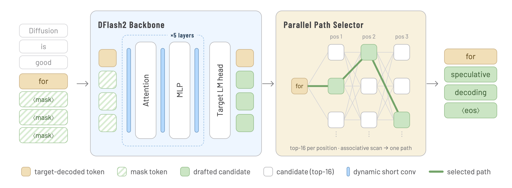
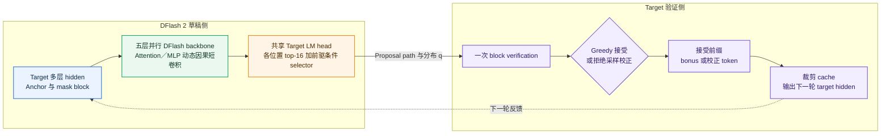
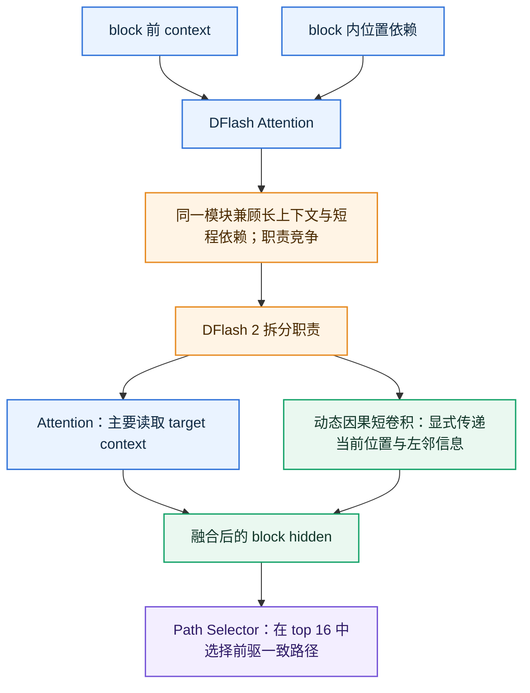
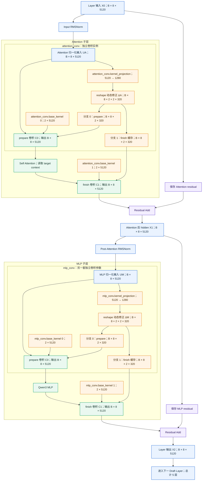
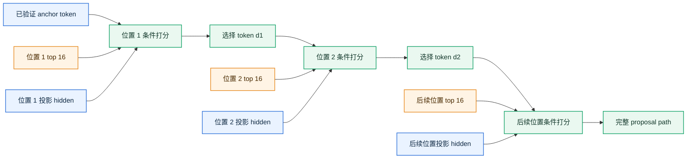
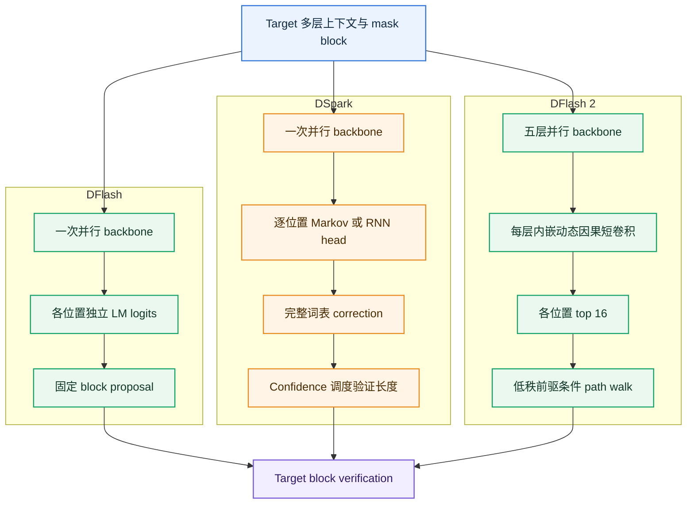

# DFlash 2 技术分析报告：保持并行草稿，同时补足块内因果依赖

> 日期：2026-08-24 CST
> 代码基线：`z-lab/dflash` main commit `07ebd93db9f472af339b644bb70221ad8428328a`（2026-08-18）
> 主要公开资料：Inco AI《DFlash 2: Keep Drafting Parallel》、DFlash 2 官方模型卡、DFlash 2 上游 serving 实现

## 1. 结论摘要

DFlash 2 的核心并不是把 DFlash 重新改成自回归 drafter，而是用两项低成本机制，在保留 **单次 block-parallel backbone forward** 的前提下补足块内依赖：

1. 在每个 draft Transformer 层的 Attention 和 MLP 周围加入 **分组动态因果短卷积**，让位置 $i$ 在一次并行 forward 内读取同一 block 中已经位于其左侧的 hidden states。
2. 每个位置先保留 target LM head 给出的 top-$K$ 候选，再用 **前驱 token 条件化的候选选择器**滚动出一条连贯路径；顺序依赖只存在于轻量 selector，不需要逐 token 重跑 draft backbone。

| 结论项 | 判断 |
|---|---|
| DFlash 2 要解决的首要问题 | DFlash 1 虽然 drafting 快，但各位置缺少已选前驱 token 条件，block 后段容易发生多模态组合冲突和 acceptance decay。 |
| 核心设计取舍 | 大计算继续并行；局部因果依赖由短卷积和低秩 selector 补入。 |
| 是否无损 | 是。Greedy 模式由 target top-1 验证保证结果一致；sampling 模式把真实 proposal 分布 $q$ 交给拒绝采样，保持 target 分布 $p$。 |
| 官方效果 | 单张 H200、SGLang、并发 1 下，Muse-Glimmer-30B 五任务为 `3.08×–4.62×`，Qwen3.8-27B 为 `2.67×–3.43×`；并发 32 时仍分别为 `1.15×–1.68×` 与 `1.01×–1.45×`。 |
| 相对 DFlash 1 / DSpark / MTP | 在两张官方模型卡的同框测试中，DFlash 2 的 acceptance length 和吞吐均为表内最高；该结论只适用于对应 checkpoint、模型、采样参数和 H200/SGLang 口径。 |
| 额外成本 | vLLM 的 Qwen3.8 profiler 中，动态卷积加 selector 占完整 serving step 的 `0.67%–0.84%`；SGLang 的 Muse 增量测试估算净成本为 `1.5%–2.7%`。 |
| 当前工程成熟度 | Transformers、MLX 和 OpenAI-compatible server 路径已在本仓库公开；SGLang 与 vLLM PR 已合并，llama.cpp PR 截至本报告日期仍为 open。 |

一句话概括：**DFlash 1 证明“整块并行草稿可以很快”，DFlash 2 进一步证明“块内依赖不一定要靠昂贵的逐 token backbone rollout 才能补回来”。**

## 2. 官方架构图、证据范围与版本边界

### 2.1 官方原始架构图

> 原图来自 [DFlash 2 官方模型卡](https://huggingface.co/z-lab/Muse-Glimmer-30B-DFlash2/blob/main/assets/dflash2-figure.png)，本报告按原始分辨率保留，未重绘或裁切。图中上半部分是带动态短卷积的五层 DFlash backbone，下半部分是从各位置 top-16 候选中滚动选择路径的 selector。

### 2.2 资料来源

| 类型 | 资料 | 本报告用途 |
|---|---|---|
| 官方博客 | [DFlash 2: Keep Drafting Parallel](https://inco.ai/blog/dflash2/) | 技术定位、动机、消融和命名。本机直连受 TLS 出口限制，已通过 141 只读获取全文，并用同团队模型卡和已合并 PR 交叉核验数字。 |
| 本地代码 | [DFlash README](../../dflash/README.md)、[PyTorch model.py](../../dflash/dflash/model.py)、[MLX model_mlx.py](../../dflash/dflash/model_mlx.py) | 生成循环、动态卷积、selector、cache 裁剪、greedy/sampling 验证。 |
| 官方模型卡 | [Inco AI Muse-Glimmer-30B-DFlash2](https://huggingface.co/incoai/Muse-Glimmer-30B-DFlash2)、[Inco AI Qwen3.8-27B-DFlash2](https://huggingface.co/incoai/Qwen3.8-27B-DFlash2) | checkpoint 配置、评测条件、acceptance length 和完整吞吐表。 |
| 官方镜像 | [z-lab Muse 模型卡](https://huggingface.co/z-lab/Muse-Glimmer-30B-DFlash2)、[z-lab Qwen 模型卡](https://huggingface.co/z-lab/Qwen3.8-27B-DFlash2) | 与 Inco AI 主模型卡交叉验证；正文和评测表一致。 |
| Serving 实现 | [SGLang PR #35371](https://github.com/sgl-project/sglang/pull/35371)、[vLLM PR #52816](https://github.com/vllm-project/vllm/pull/52816)、[llama.cpp PR #27342](https://github.com/ggml-org/llama.cpp/pull/27342) | production kernel、组件成本、集成状态和补充 benchmark。 |
| 对比资料 | [DFlash 论文](https://arxiv.org/abs/2602.06036)、[本地 DSpark 论文](../../DeepSpec/DSpark_paper.pdf)、[Medusa](https://arxiv.org/abs/2401.10774)、[EAGLE-3](https://arxiv.org/abs/2503.01840)、[AngelSpec](https://arxiv.org/abs/2607.25852) | 比较各类 drafter 的条件依赖方式、draft latency、验证调度和公开效果。 |

### 2.3 三类结论的标记方式

| 标记 | 含义 | 示例 |
|---|---|---|
| 代码事实 | 可以从冻结 commit 的实现直接读出。 | `DFlash2DraftModel` 给每个 draft layer 同时挂接 `attention_conv` 和 `mlp_conv`。 |
| 官方结果 | 来自 Inco AI/z-lab 模型卡或上游合并 PR，保留原测试条件。 | 单 H200、并发 1、Muse MATH-500 为 `295.5 output tok/s`、`4.62×`。 |
| 分析判断 | 基于代码和结果进行的工程解释，不冒充论文原文。 | DFlash 2 更适合“需要较长 proposal，但不希望 draft backbone 串行增长”的场景。 |

本文不会把不同 target、硬件、量化、并发和 sampling 配置下的 headline speedup 直接排成统一榜单。

## 3. 提出动机

官方博客先从 agent workload 出发：agent 会长时间阅读、规划并调用工具，生成 token 的规模显著高于传统聊天，decode 因而成为持续成本。DFlash 1 已把 drafter 从逐 token 生成改成一次 block-parallel forward；DFlash 2 关注的是下一层瓶颈——如何在不放弃这一并行优势的情况下，让每次 target verification 推进更多 token。

### 3.1 投机解码的三个速度杠杆

将一次 speculative cycle 的平均单 token 时延近似写成：

$$
L_{token}\approx\frac{T_{draft}+T_{verify}+T_{schedule}}{\tau}
$$

| 符号 | 含义 |
|---|---|
| $T_{draft}$ | 生成 proposal block 的耗时。 |
| $T_{verify}$ | target 并行验证 proposal 的耗时。 |
| $T_{schedule}$ | 候选组织、采样、cache 维护和调度等额外开销。 |
| $\tau$ | 每次 target verification 实际推进的平均 token 数，通常包含至少一个 target bonus token。 |

因此，真正的加速需要同时做到：draft 足够快、proposal 足够准、验证与调度不过度浪费。

### 3.2 自回归 drafter 与 DFlash 1 的矛盾

| 路线 | 优势 | 核心代价 |
|---|---|---|
| 小模型 / EAGLE 类自回归 drafter | 第 $i$ 个 proposal 明确依赖已选择的 $d_{1:i-1}$，路径连贯性强。 | 生成 $\gamma$ 个 token 通常需要 $\gamma$ 次轻量 rollout，$T_{draft}$ 随 block 长度增长。 |
| DFlash 1 block-parallel drafter | 大部分 drafting 只需一次 backbone forward，长 block 的 latency 上限更好。 | 同一 block 内各位置主要从共享 target context 和 mask 表示并行预测，不直接条件化于最终选择的前驱 token。 |

DFlash 1 的问题不是单个位置完全没有上下文，而是 **没有看到当前这条候选路径上已经选中的前驱 token**。当上下文同时允许多条合理续写，例如 `of course` 和 `no problem`，独立位置预测可能组合成 `of problem`。第一个不一致位置会使后续 proposal 全部失效，block 越长，suffix decay 越明显。

### 3.3 DFlash 2 的设计目标

DFlash 2 将问题拆成两个层次：

| 层次 | 目标 | 方案 |
|---|---|---|
| hidden 表示层 | 让后位置在一次并行 backbone 内看到左侧局部表示。 | 分组动态因果短卷积。 |
| token 路径层 | 避免每个位置独立 argmax 导致组合冲突。 | 每位置 top-$K$ 候选加前驱条件 selector。 |
| 正确性层 | proposal 更强，但最终分布仍由 target 决定。 | target 并行验证和标准拒绝采样校正。 |

这就是标题 “Keep Drafting Parallel” 的准确含义：**保留重计算的并行性，只让很轻的路径选择带有顺序依赖。**

### 3.4 官方博客如何量化两个问题

博客先在五层 Qwen3-4B DFlash、GSM8K 上测量“正确 token 是否已在候选列表中”。下表中的位置指标以此前所有位置均正确为条件，acceptance length 包含 verifier 的下一个 token：

| Metric | 位置 0 | 位置 1 | 位置 2 | 位置 3 | 位置 4 | 位置 5 | 位置 6 | Acceptance length |
|---|---:|---:|---:|---:|---:|---:|---:|---:|
| Recall@1 | 85.4% | 80.3% | 79.4% | 78.3% | 77.5% | 75.9% | 72.9% | 4.27 |
| Recall@16 | 99.5% | 97.3% | 94.8% | 92.6% | 90.8% | 89.4% | 87.8% | 6.79 |

这组数据揭示了两个不同问题：

| 现象 | 说明 | 对应 DFlash 2 模块 |
|---|---|---|
| Recall@16 远高于 Recall@1 | 正确 token 通常已经在 DFlash 候选集中，存在很大的 selection headroom；不必重写完整词表分布。 | Candidate selector。 |
| Recall@16 也从 99.5% 降到 87.8% | 即使有 oracle selector，block 后段候选集合本身仍在退化，选择器无法补回不存在的正确候选。 | Dynamic causal convolution。 |

因此，DFlash 2 不是用一个模块同时模糊处理所有问题：selector 解决“候选在，但没选对”，convolution 解决“后段候选质量本身下降”。

## 4. DFlash 2 整体流程

### 4.1 架构图

### 4.2 一轮 decode 的数据流

| 阶段 | 输入 | 主要计算 | 输出 |
|---|---|---|---|
| Target 上下文 | 已确认 token 与 KV cache | Prefill 或上一轮验证，并抽取指定层 hidden | 多层 target features 与 anchor。 |
| 并行 backbone | Target features 与整块 mask slots | 五层 draft Transformer；每层 Attention、MLP 前后各经过动态短卷积 | 所有 draft 位置的 hidden，一次 forward 完成。 |
| Candidate selector | 各位置 hidden 与共享 LM head logits | 先并行求 top-16，再用前驱 token 逐位置走出一条路径 | Proposal block；sampling 时同时输出稀疏 proposal 分布 $q$。 |
| Target verification | Proposal block | Target 一次 block forward，执行 greedy prefix match 或 rejection sampling | 接受前缀、bonus 或校正 token、新 hidden 和 cache 边界。 |

这里的“并行 drafting”指 draft backbone 不按 proposal token 数重复执行。selector 的最终 path walk 确实按位置传递 predecessor token，但它只处理 $K=16$、rank 256 的低秩分数；SGLang/vLLM 将其放进每个请求一个 Triton program，不为每个位置重跑 backbone，也不为每个位置启动独立 kernel。

## 5. 核心机制

### 5.1 Target context 注入与并行 mask block

代码先从 target 的指定层抽取 hidden states，并融合为 drafter context：

$$
H_{ctx}=\operatorname{RMSNorm}\left(W_c[H^{(l_1)};\ldots;H^{(l_m)}]\right)
$$

| 符号 | 含义 |
|---|---|
| $H^{(l_j)}$ | target 第 $l_j$ 层的 hidden states。 |
| $W_c$ | 把多层拼接特征投影回 draft hidden size 的线性层。 |
| $H_{ctx}$ | 每一层 draft attention 可读取的 target 上下文。 |

公开 checkpoint 都是 5 层 drafter：

| 配置项 | Muse-Glimmer-30B-DFlash2 | Qwen3.8-27B-DFlash2 |
|---|---:|---:|
| Draft layers | 5 | 5 |
| Block size | 16 | 8 |
| 每轮 draft token 数 | 15 | 7 |
| Target layer IDs | `1, 13, 25, 37, 49` | `5, 19, 33, 47, 61` |
| Dynamic convolution kernel | 2 | 2 |
| Convolution group size | 16 | 16 |
| Selector rank | 256 | 256 |
| Selector top-$K$ | 16 | 16 |

需要特别说明：本地 `dflash_generate` 每轮只调用一次 draft model forward。这里的 block diffusion 是“以 mask block 为输入做整块并行预测”的建模方式，不表示推理时要执行多轮昂贵的逐步扩散去噪。

### 5.2 分组动态因果短卷积

#### 5.2.1 为什么需要注入动态因果短卷积

DFlash 的并行 Attention 同时承担两项不同尺度的工作：

| 工作 | 需要建模的信息 | 对 draft block 的作用 |
|---|---|---|
| 读取 block 前上下文 | 已验证 prefix、target 多层 hidden、问题与历史语义 | 决定整个 block 接下来大致应该生成什么 |
| 建模 block 内依赖 | 当前 block 内不同 mask slot，尤其是相邻位置之间的关系 | 让后位置延续前位置，减少 suffix 位置相互不一致 |

这两项工作共用同一组 Attention head。可将官方博客统计的某层某个 head 的 block 内注意力比例理解为：

$$
r_{l,h}
=
\frac{
\sum_{q\in\mathcal B}\sum_{k\in\mathcal B}A_{l,h}(q,k)
}{
\sum_{q\in\mathcal B}\sum_{k\in\mathcal C\cup\mathcal B}A_{l,h}(q,k)
},
$$

其中 $\mathcal B$ 表示当前 draft block，$\mathcal C$ 表示 block 之前的上下文，$A_{l,h}(q,k)$ 表示第 $l$ 层、第 $h$ 个 head 从 query $q$ 分配给 key $k$ 的注意力。$r_{l,h}$ 越大，说明该 head 越多参与 block 内位置关系建模；这里的公式用于解释指标语义，不替代博客未公开的具体聚合代码。

官方博客的 [Figure 3](https://inco.ai/blog/dflash2/#figure-3) 展示五层 Qwen3-4B DFlash 的逐 head 结果：

| 图中元素 | 含义 | 应该怎样阅读 |
|---|---|---|
| 横轴 1～32 | 32 个 Attention head | 每一列是一个 head，不是一个 draft token |
| 纵轴 Layer 1～5 | 五个 draft Transformer layer | 从上到下观察深度增加后的职责变化 |
| 单元格亮度 | 对当前 draft block 的 attention share | 越亮表示越关注 block 内部；越暗表示越偏向 block 前上下文 |
| 整行平均趋势 | block 内 attention mass | 从 Layer 1 的约 30% 降到 Layer 5 的约 8% |

因此 Figure 3 **不是 token 对 token 的 Attention 矩阵**。它的一个方格代表“某层的某个 head”，而不是两个 token 之间的一条注意力边。图中有两个同时发生的现象：

1. 越到深层，整行总体越暗，说明 Attention 越来越偏向读取 block 前的 target context。
2. 剩余的 block 内 attention 集中到越来越少的亮格，即原文所说的 `a shrinking handful of heads`。它表示局部关系越来越依赖少数专门化 head，不是模型真的删除了 Attention head。

30% 降到 8% 不能单独证明模型错误，也不表示这个比例越高越好；它揭示的是职责分配不稳定：DFlash 希望后续 mask slot 获得前驱信息，但深层网络没有为这项短程工作保留一条稳定、专用的计算通路。若少数专门化 head 没有捕获正确的邻接关系，后段 hidden 与 logits 就更容易失配，表现为 suffix Recall 和 acceptance 衰减。

这正是引入局部卷积的直接动机。一个 draft block 通常只有 4～16 个位置，最紧密的依赖集中在相邻位置，因此不必增加昂贵的完整自回归 drafter；两点卷积即可提供显式的左邻信息通路：

$$
\operatorname{Conv}_{k}(x)_i
=k_{i,0}\odot x_i+k_{i,1}\odot x_{i-1}.
$$

DFlash 2 将其实现为随输入变化的分组动态因果短卷积，并放在每层 Attention 与 MLP 的前后。它只读取当前位置和左侧位置，不读取未来位置；因此既补充 block 内 hidden-space 局部依赖，又不会把一次并行 backbone forward 退化成逐 token 重跑 Transformer。下一节的 $\beta+\Delta$ 公式是这一两点卷积的完整实现形式。

一个看似反直觉但非常关键的结果是：加入 convolution 后，Layers 4～5 的平均 block 内 Attention 反而从 9.4% 进一步降到 0.5%，同时后段 Recall 与 acceptance 改善。官方解释不是“Attention 更不会看 block 了”，而是局部卷积已经接管短程信息传播，Attention 可以把更多容量用于 target context。这说明目标不是提高 block attention share，而是为局部依赖指定一个稳定且低成本的负责模块；该结果是支持职责拆分的行为证据，不应扩张成严格的因果证明。

动态卷积与 selector 解决的也不是同一个问题：

| 模块 | 所在空间 | 解决的问题 | 无法单独解决的问题 |
|---|---|---|---|
| 动态因果短卷积 | Hidden space | 把 anchor/左邻表示逐层注入后位置，提高 block 后段表示与候选集合质量 | 不决定 top-16 中最终选择哪个离散 token |
| Path Selector | Candidate space | 用实际已选 predecessor 在每个位置的 top-16 中选择条件一致的 token | 若正确 token 已掉出 top-16，selector 无法把它重新召回 |

因此，局部卷积负责“让正确延续仍有机会进入候选集合”，selector 负责“在已有候选中走出一条连贯 path”。两者分别处理表示质量和离散路径一致性，不能互相替代。

#### 5.2.2 严谨算子定义

对一个 `GroupedDynamicCausalConv` 实例，设其 `prepare` 输入为
$U\in\mathbb{R}^{B\times L\times D}$。先由无偏置线性层生成两条分支的动态修正：

$$
\Delta
=
\operatorname{reshape}\!\left(UW_{proj}^{\mathsf T}\right)
\in\mathbb{R}^{B\times L\times 2\times k\times G},
\qquad
W_{proj}\in\mathbb{R}^{2kG\times D},
\qquad
G=\frac{D}{S}
$$

定义分支 $r\in\{0,1\}$ 的分组动态因果卷积算子：

$$
\boxed{
\left[\mathcal C_r\!\left(Z;\Delta\right)\right]_{b,i,g,s}
=
\sum_{t=0}^{k-1}
\left(
\beta_{r,t,g,s}
+
\Delta_{b,i,r,t,g}
\right)
Z_{b,i-t,g,s}
}
$$

$$
Z_{b,j,g,s}=0\qquad\text{if }j<0
$$

同一个卷积实例对一个 Attention 或 MLP 子层 $F$ 的完整包裹为：

$$
\widetilde U=\mathcal C_0\!\left(U;\Delta\right),
\qquad
V=F\!\left(\widetilde U\right),
\qquad
\widetilde V=\mathcal C_1\!\left(V;\Delta\right)
$$

| 符号 | 含义 |
|---|---|
| $B,L,D$ | Batch、卷积序列长度和 hidden size。 |
| $S$ | 每组 channel 数；公开配置为 16。 |
| $G=D/S$ | Channel group 数。 |
| $r$ | 卷积分支；$r=0$ 为 prepare，$r=1$ 为 finish。 |
| $b,i$ | Batch 索引和 block 内位置索引。 |
| $g,s$ | Channel group 索引和组内 channel 索引；原 channel 为 $c=gS+s$。 |
| $t$ | 向左查看的 offset；公开配置 $k=2$，因此 $t\in\{0,1\}$。 |
| $\beta_{r,t,g,s}$ | `base_kernel` 中按分支、offset、channel 取出的静态标量。 |
| $\Delta_{b,i,r,t,g}$ | `kernel_projection` 根据位置 $i$ 的输入生成的动态标量，在组内 $S$ 个 channel 间共享。 |

简略地说，$\beta$ 是每个 channel 的默认局部混合权重，$\Delta$ 是根据当前输入生成的上下文相关修正；二者在索引后都是标量。Prepare 使用分支 0 先混合子层输入，finish 使用 prepare 时已经生成并缓存的分支 1 再混合子层输出。

#### 5.2.3 张量如何组织

Qwen3.8-27B-DFlash2 的公开配置为：

$$
D=5120,\qquad S=16,\qquad G=\frac{5120}{16}=320,
\qquad k=2
$$

正常一轮使用 block size 8，因此卷积输入的 $L=8$ 包含 1 个已验证 anchor 和 7 个 mask slots。$B$ 保留为运行时 batch size。

| 张量或参数 | 通用形状 | Qwen3.8 实际形状 | 作用 |
|---|---|---|---|
| Prepare 输入 $U$ | $[B,L,D]$ | $[B,8,5120]$ | 当前子层经过 LayerNorm 后的 hidden。 |
| 分组输入 | $[B,L,G,S]$ | $[B,8,320,16]$ | 把 5120 个 channel 重排为 320 组，每组 16 个；元素总数不变。 |
| `base_kernel` | $[2,k,D]$ | $[2,2,5120]$ | 两个分支、两个 offset、每个 channel 一份静态基础权重。 |
| `kernel_projection.weight` | $[2kG,D]$ | $[1280,5120]$ | 把每个位置的 5120 维 hidden 映射成动态修正系数。 |
| Projection 输出 | $[B,L,2kG]$ | $[B,8,1280]$ | 尚未拆分分支、offset 和 group。 |
| 动态核重排 $\Delta$ | $[B,L,2,k,G]$ | $[B,8,2,2,320]$ | 两个分支、两个 offset、320 个 group 的动态修正。 |
| 单个分支/offset 的基础核 | $[1,1,G,S]$ | $[1,1,320,16]$ | 由 `base[offset]` reshape 得到。 |
| 单个分支/offset 的动态修正 | $[B,L,G,1]$ | $[B,8,320,1]$ | 最后一维为 1，表示组内 16 个 channel 共用一个修正。 |
| 广播后的有效权重 | $[B,L,G,S]$ | $[B,8,320,16]$ | 基础核和动态修正广播相加后的逐位置、逐 channel 权重。 |
| 卷积输出 | $[B,L,D]$ | $[B,8,5120]$ | 分组结果 reshape 回原 hidden 形状。 |

对固定的分支 $r$ 和 offset $t$，张量级相加实际是：

$$
\underbrace{[1,1,G,S]}_{\text{base}}
+
\underbrace{[B,L,G,1]}_{\text{dynamic}}
\xrightarrow{\text{broadcast}}
\underbrace{[B,L,G,S]}_{\text{effective kernel}}
$$

在 Qwen3.8 中就是：

$$
[1,1,320,16]+[B,8,320,1]\rightarrow[B,8,320,16]
$$

`base` 沿 batch 和位置维广播，`dynamic` 沿组内 16 个 channel 广播。因此完整张量 shape 虽然不同，但公式中的 $\beta_{r,t,g,s}$ 与 $\Delta_{b,i,r,t,g}$ 在完成索引后都是标量。

#### 5.2.4 prepare 与 finish 如何包裹子层

下面给出 Qwen3.8-27B-DFlash2 **单个 `Qwen3DFlashDecoderLayer`** 的完整数据流。其 hidden size 为 5120，正常 block 长度为 8；图中所有主干 hidden 的 shape 均保持 $[B,8,5120]$。

完整调用顺序如下：

| 步骤 | Attention 路径 | MLP 路径 |
|---:|---|---|
| 1 | 保存 layer 输入 $X_0$ 作为 residual，再执行 `input_layernorm` 得到 $U_A$。 | 保存 Attention 残差相加后的 $X_1$，再执行 `post_attention_layernorm` 得到 $U_M$。 |
| 2 | `attention_conv.prepare(U_A)` 只执行一次 `kernel_projection`，产生 $\Delta_A[B,8,2,2,320]$。 | `mlp_conv.prepare(U_M)` 使用另一套投影参数，产生 $\Delta_M[B,8,2,2,320]$。 |
| 3 | 分支 0 与 `attention_conv.base_kernel[0]` 卷积 $U_A$，结果送入 Attention；分支 1 被缓存。 | 分支 0 与 `mlp_conv.base_kernel[0]` 卷积 $U_M$，结果送入 MLP；分支 1 被缓存。 |
| 4 | Attention 输出进入 `attention_conv.finish`，使用 `attention_conv.base_kernel[1]` 和缓存的 $\Delta_{A,1}$；**不重新运行 projection**。 | MLP 输出进入 `mlp_conv.finish`，使用 `mlp_conv.base_kernel[1]` 和缓存的 $\Delta_{M,1}$；**不重新运行 projection**。 |
| 5 | Finish 输出与 $X_0$ 做 residual add，得到 $X_1$。 | Finish 输出与 $X_1$ 做 residual add，得到当前 layer 输出 $X_2$。 |

需要区分两个层次：

- `attention_conv` 和 `mlp_conv` 是 **两个独立的 `GroupedDynamicCausalConv` 实例**，各自拥有一套 `base_kernel[2,2,5120]` 和 `kernel_projection.weight[1280,5120]`。
- 每个实例内部的第一个维度 2 才是 **prepare/finish 两条分支**；它不是 Attention/MLP 的编号。
- Qwen3.8 drafter 有 5 个 decoder layers，因此一共存在 10 个动态卷积实例。每个实例在一次 layer forward 中只做一次动态核投影，但执行 prepare 和 finish 两次长度为 2 的分组因果卷积。

该设计有四个关键点：

1. 只读当前位置及左侧位置，block 边界外补零，因此保持因果性。
2. 动态核随输入变化，比固定 depthwise convolution 更能适应当前上下文。
3. group 内共享动态系数，避免为每个 channel 生成完整动态核。
4. 每层 Attention 和 MLP 都有 prepare/finish 两次短卷积路径，依赖注入不只发生在最终 logits。

它补的是 **hidden-space 局部依赖**。即便 selector 尚未运行，后位置的表示已经不再是完全独立的 mask-slot 表示。

实现序列还包含已验证 anchor：第一个 drafted position 可读取最后一个已验证 token 的表示，后续 drafted position 读取各自左邻。这里的边界补零发生在 anchor 之前，而不是把第一个 proposal 与 anchor 隔开。

博客的 matched ablation 说明为什么选择短卷积而不是简单加深 drafter：

| 方案 | 参数增量 | Draft–verify cycle latency 增量 | 观察 |
|---|---:|---:|---|
| 五层 DFlash 加 convolution | `+16.5M`，约 `+3%` | `+0.7%` | 后段 Recall@1 接近十五层 DFlash。 |
| 五层扩到十五层 DFlash | Drafter 约 `3×` 参数 | `+15.2%` | 后段更好，但大量容量也花在早段，破坏轻量性。 |

#### 5.2.5 参数量边界

单个动态卷积包含两条长度为 $k$ 的静态核，以及一个 $D\rightarrow 2kG$ 的无偏置投影：

$$
P_{conv}=2kD+D\left(2kG\right),\qquad G=\frac{D}{S}
$$

每层对 Attention 和 MLP 各放一个卷积，因此 $L_d$ 层的卷积总参数为：

$$
P_{conv,total}=2L_d\left(2kD+2kDG\right)
$$

按公开 checkpoint 的 safetensors header 直接统计：

| Checkpoint | $D$ | $L_d$ | 单个 `base_kernel` | 单个 `kernel_projection.weight` | 全部卷积参数 |
|---|---:|---:|---|---|---:|
| Qwen3.8-27B-DFlash2 | 5,120 | 5 | $[2,2,5120]$ | $[1280,5120]$ | 65,740,800 |
| Muse-Glimmer-30B-DFlash2 | 6,656 | 5 | $[2,2,6656]$ | $[1664,6656]$ | 111,022,080 |

博客中的 `+16.5M` 来自五层 Qwen3-4B matched ablation，不是上述 27B/30B 发布 checkpoint 的参数量。不同 hidden size 下动态投影的主项近似按 $D^2/S$ 增长，不能把 ablation 数字直接套到发布模型。

### 5.3 前驱条件候选选择器

Draft backbone 输出 hidden $h_i$ 后，先通过共享 target LM head 得到每个位置的 unary logits，再保留候选集：

$$
\mathcal{C}_i=\operatorname{TopK}(u_i,K),\qquad K=16
$$

对于候选 $c\in\mathcal{C}_i$ 和上一位置已选择 token $p$，selector 计算：

$$
s_i(c\mid p)=u_i(c)+\left\langle A_p\odot P h_i, B_c\right\rangle
$$

| 符号 | 含义 |
|---|---|
| $u_i(c)$ | Draft hidden 经共享 target LM head 得到的候选基础分数。 |
| $A_p$ | predecessor token $p$ 的低秩 codebook embedding。 |
| $B_c$ | successor 候选 $c$ 的低秩 codebook embedding。 |
| $P h_i$ | 把 hidden 投影到 rank 256 的表示。 |
| $\odot$ | 逐元素乘法，使当前 hidden 调制 predecessor 表示。 |

#### 5.3.1 从完整词表到一条条件路径

源码中的 selector 输入为 hidden $H\in\mathbb{R}^{B\times L\times D}$ 和共享 target LM head logits $U\in\mathbb{R}^{B\times L\times V}$，具体分成两个阶段：

| 阶段 | 张量形状 | 并行性 |
|---|---|---|
| 词表 top-$K$ | `unary, candidates = topk(logits)`，二者均为 $[B,L,K]$ | 所有位置并行；这是 selector 的主要耗时。 |
| Hidden 投影 | $PH$ 为 $[B,L,R]$ | 所有位置并行。 |
| 候选 codebook lookup | $B_{\mathcal C_i}$ 为 $[B,K,R]$ | 当前位置的 $K$ 个候选并行。 |
| 前驱条件打分 | `einsum("br,bkr->bk")` 得到 $[B,K]$ | 当前槽内 $K$ 个候选并行。 |
| Path walk | 选出的 token 成为下一槽 predecessor | 位置之间顺序执行，但不再做 $D\rightarrow V$ 投影或 backbone forward。 |

路径的第一个 predecessor 是最后一个已验证的 `anchor_ids`。第 $i$ 槽选出的 token 立即成为第 $i+1$ 槽的 predecessor，因此组合 `of course` 会获得与 `of problem` 不同的条件分数。所有位置的 backbone hidden、完整词表 logits、top-$K$ 与 hidden projection 已经提前并行算好；只有绿色路径上的轻量选择存在链式依赖。

#### 5.3.2 Greedy 与 sampling

Greedy 时取当前条件分数最高的候选；sampling 时在 top-$K$ 条件分数上构造 $q_i$ 并采样，然后把实际 $q_i$ 返回给 target verification。

这不是完整 $V\times V$ token 转移矩阵，也不是对 top-$K$ lattice 做昂贵的全局 Viterbi 搜索。它是一个低秩、前驱条件的逐位置 path walk：

$$
d_i\sim q_i(\cdot\mid d_{i-1},h_i),\qquad d_i\in\mathcal{C}_i
$$

大计算已经在一次 backbone forward 完成；selector 只在 $K=16$ 的小候选集上传播路径状态。

PyTorch reference 返回三个对象：选择路径 $[B,L]$、原始候选索引 $[B,L,K]$，以及 sampling 模式下的条件概率 $q\in\mathbb{R}^{B\times L\times K}$。候选索引和 $q$ 必须同时进入拒绝采样，才能把稀疏 proposal 概率准确扣回完整 target 分布。

博客在五层 Qwen3-4B、GSM8K 上单独比较 selector 与 DSpark-style full-vocabulary correction：

| 方法 | 新增参数 | Draft–verify cycle latency 增量 | Acceptance length，$T=0$ | Acceptance length，$T=1$ |
|---|---:|---:|---:|---:|
| DFlash | — | — | 4.27 | 3.78 |
| 加 DSpark correction | `+77.8M` | `+9.6%` | 4.49 | 4.08 |
| 加 path selector | `+2.0M` | `+0.6%` | **4.61** | **4.25** |

在这组 matched ablation 中，selector 用约 40 倍更少的新增参数、约 16 倍更低的 latency overhead 超过 DSpark correction。该结果证明“在已有 top-16 中选择”可以比“顺序重写全词表 logits”更便宜；它不等同于 DFlash 2 全系统普遍优于所有 DSpark checkpoint。

#### 5.3.3 参数量与公开 checkpoint

当前公开实现包含 hidden projection、predecessor codebook 和 successor codebook，参数量为：

$$
P_{selector}=DR+VR+VR=R\left(D+2V\right)
$$

| Checkpoint | $D$ | $V$ | $R$ | Selector 参数 |
|---|---:|---:|---:|---:|
| Qwen3.8-27B-DFlash2 | 5,120 | 248,320 | 256 | 128,450,560 |
| Muse-Glimmer-30B-DFlash2 | 6,656 | 202,048 | 256 | 105,152,512 |

这些数字来自公开 safetensors header 的实际权重形状。它们明显大于博客 Qwen3-4B 消融表中的 `+2.0M`；公开资料没有解释消融配置与 rank-256 发布 checkpoint 在 selector 参数化上的差异。因此本报告只把 `+2.0M` 用作 matched ablation 的原始数字，不把它当成发布模型的参数量。发布实现虽然 codebook 参数多，但在线计算只 lookup 一个 predecessor 和 $K$ 个 successors，不做 $V\times V$ 转移。

### 5.4 为什么“有顺序依赖”仍能称为并行 drafting

| 组件 | 是否随 proposal 位置顺序执行 | 是否重跑 Transformer backbone | 成本特征 |
|---|---|---|---|
| DFlash 2 backbone | 否，整块并行 | 只跑一次 | 主体矩阵计算与 block 长度不再一比一增长。 |
| Dynamic causal convolution | GPU 张量级并行 | 否 | kernel size=2，局部且分组。 |
| Candidate path walk | 是，传递 predecessor token | 否 | top-16、rank 256；production 中融合为每请求一个 Triton program。 |
| Target verification | 对 proposal block 并行 | Target 跑一次 block forward | 最终决定接受前缀和 bonus token。 |

因此，DFlash 2 不是“完全没有顺序操作”，而是把顺序操作压缩到不需要 backbone rollout 的廉价部分。

### 5.5 Target verification 与无损性

#### Greedy decoding

Target 对 proposal block 一次性算出各位置 top-1。只有从 block 起点连续相等的 draft prefix 被提交；第一个不一致位置提交 target 自己的 top-1。最终序列与普通 greedy target decode 一致。

#### Sampling decoding

若 draft 在位置 $i$ 采到 $d_i$，target 分布为 $p_i$，selector proposal 分布为 $q_i$，接受概率为：

$$
a_i(d_i)=\min\left(1,\frac{p_i(d_i)}{q_i(d_i)}\right)
$$

若拒绝，则从残差分布采样：

$$
r_i(x)=\frac{\left[p_i(x)-q_i(x)\right]_+}
{\sum_z\left[p_i(z)-q_i(z)\right]_+}
$$

代码中的 `_rejection_sample` 对 top-$K$ candidate indices 做 `scatter_add` 扣除 $q$，再执行 clamp、归一化和 residual sampling。若全部 draft token 接受，则从 target block 最后一个位置采样 bonus token。

设第 $i$ 个 draft token 的条件接受概率为 $a_i$，每轮期望推进量可写成：

$$
\tau=1+\sum_{i=1}^{\gamma}\prod_{j=1}^{i}a_j
$$

其中 $1$ 对应 target 至少推进的 bonus 或校正 token，$\gamma$ 是 draft token 数。DFlash 2 提升速度的直接路径，就是以很小的 $T_{draft}$ 增量抬高后段 $a_i$，从而增加 $\tau$。

### 5.6 代码实现映射

| 代码位置 | 实现事实 |
|---|---|
| [`_rejection_sample`](https://github.com/z-lab/dflash/blob/07ebd93db9f472af339b644bb70221ad8428328a/dflash/model.py#L94-L124) | 按 $p/q$ 接受，拒绝时从 $(p-q)_+$ residual distribution 采样。 |
| [`dflash_generate`](https://github.com/z-lab/dflash/blob/07ebd93db9f472af339b644bb70221ad8428328a/dflash/model.py#L180-L324) | Target prefill、draft proposal、target block verification、cache crop、hidden feedback 和统计。 |
| [`GroupedDynamicCausalConv`](https://github.com/z-lab/dflash/blob/07ebd93db9f472af339b644bb70221ad8428328a/dflash/model.py#L478-L512) | `_grouped_dynamic_convolve` 执行动态分组短卷积，只使用当前位置和左侧 offset。 |
| [`CandidateSelector`](https://github.com/z-lab/dflash/blob/07ebd93db9f472af339b644bb70221ad8428328a/dflash/model.py#L515-L547) | target LM head top-$K$、低秩 predecessor/successor codebook 和路径滚动。 |
| [`DFlash2DraftModel`](https://github.com/z-lab/dflash/blob/07ebd93db9f472af339b644bb70221ad8428328a/dflash/model.py#L630-L659) | 给每层挂接 attention/MLP convolution，并启用 candidate selector。 |

PyTorch 本地 reference 使用 Python position loop，适合说明语义；SGLang/vLLM production backend 把 path walk 融合到 Triton kernel，因此不能用 reference loop 的解释器开销估算线上成本。

## 6. 官方效果

### 6.1 评测口径

| 条件 | Muse-Glimmer-30B | Qwen3.8-27B |
|---|---|---|
| Runtime | SGLang，单张 NVIDIA H200 | SGLang，单张 NVIDIA H200 |
| Attention | Target 和 draft 均为 FlashAttention 3 | Target 和 draft 均为 FlashAttention 3 |
| Block size | 16，包含 15 个 draft token | 8，包含 7 个 draft token |
| Sampling | temperature 1.0、top-p 0.95、top-k 64、high reasoning strength | temperature 1.0、top-p 0.95、top-k 20、xhigh reasoning effort |
| 最大生成 | 4096 token | 4096 token |
| 对比方案 | Autoregressive、Meta 官方 DFlash、community DSpark、DFlash 2 | Autoregressive、模型内置 MTP、community DSpark、DFlash 2 |
| 并发 | 1、8、32 | 1、8、32 |

所有 speculative 方法在各自模型内使用相同 draft token 数。模型卡把 acceptance length 定义为“每请求 completion token 数除以 verification steps，再对请求取平均”，因此该值包含每轮由 target 推进的 token，不应误读为纯 draft accepted count。

### 6.2 Qwen3.5-4B matched-training 结果

官方博客还给出了 Qwen3.5-4B 的 matched setup：DFlash 和 DSpark 由团队在相同设置下训练，MTP 使用模型自带权重；thinking 开启，temperature 1.0、top-p 0.95、top-k 20、presence penalty 1.5，并使用无损拒绝采样。

| Dataset | MTP | DFlash | DSpark | DFlash 2 |
|---|---:|---:|---:|---:|
| GSM8K | 4.78 | 4.99 | 5.69 | **6.20** |
| MATH-500 | 5.04 | 5.42 | 6.20 | **6.76** |
| HumanEval | 4.84 | 5.43 | 5.80 | **6.28** |
| MBPP | 4.16 | 4.49 | 4.96 | **5.41** |
| MT-Bench | 3.90 | 4.26 | 4.77 | **5.20** |
| Mean | 4.54 | 4.92 | 5.49 | **5.97** |

DFlash 2 五任务全部最高，平均比 DFlash 多 `1.05` token、约 `21%`，比 DSpark 多 `0.48` token；完整 convolution+selector 相对五层 DFlash 的 draft–verify cycle latency 增量为 `1.3%`。这组数据比跨社区 checkpoint 更适合回答“两个新增模块本身是否有效”。

### 6.3 发布模型 Acceptance length 同框对比

| Dataset | Muse DFlash 1 | Muse DSpark | Muse DFlash 2 | Qwen MTP | Qwen DSpark | Qwen DFlash 2 |
|---|---:|---:|---:|---:|---:|---:|
| GSM8K | 5.43 | 5.45 | **6.57** | 5.02 | 4.36 | **5.46** |
| MATH-500 | 5.39 | 5.01 | **6.56** | 4.72 | 3.92 | **5.28** |
| HumanEval | 4.11 | 4.33 | **5.66** | 3.91 | 3.30 | **4.39** |
| MBPP | 3.74 | 4.02 | **5.30** | 3.99 | 3.51 | **4.79** |
| MT-Bench | 3.52 | 3.59 | **4.42** | 3.74 | 3.01 | **4.10** |
| 五任务算术平均 | 4.438 | 4.480 | **5.702** | 4.276 | 3.620 | **4.804** |

按五任务算术平均计算：

| 同框比较 | DFlash 2 acceptance length 增幅 |
|---|---:|
| Muse：相对官方 DFlash 1 | `+28.5%` |
| Muse：相对 community DSpark | `+27.3%` |
| Qwen：相对内置 MTP | `+12.3%` |
| Qwen：相对 community DSpark | `+32.7%` |

这些平均值是本报告基于模型卡五行结果做的算术汇总，不是博客新增指标。

三种 DFlash-family 方法在发布模型卡中的结果可压缩为：

| Target | 方法 | 五任务平均 acceptance length | 并发 1 加速范围 | 并发 32 加速范围 |
|---|---|---:|---:|---:|
| Muse-Glimmer-30B | DFlash | 4.438 | 2.57×–3.88× | 0.97×–1.42× |
| Muse-Glimmer-30B | DSpark | 4.480 | 2.49×–3.70× | 0.95×–1.35× |
| Muse-Glimmer-30B | **DFlash 2** | **5.702** | **3.08×–4.62×** | **1.15×–1.68×** |
| Qwen3.8-27B | DSpark | 3.620 | 2.00×–2.69× | 0.74×–1.13× |
| Qwen3.8-27B | **DFlash 2** | **4.804** | **2.67×–3.43×** | **1.01×–1.45×** |

Muse 是唯一同时公开 DFlash、DSpark、DFlash 2 三者同框结果的 target；Qwen 模型卡没有 DFlash checkpoint，因此不补造该列。在 Muse 上，DSpark 相对 DFlash 的平均 acceptance 仅小幅变化，而 DFlash 2 同时提高平均 acceptance 与低/高并发吞吐；这说明两项新增模块的收益确实转化到了端到端 serving，但不能据此否定 DSpark 在其论文 production scheduler 口径下的结果。

### 6.4 DFlash 2 吞吐与自回归相对加速

每个单元格为 `output tok/s（相对 autoregressive speedup）`。

| Target | Dataset | 并发 1 | 并发 8 | 并发 32 |
|---|---|---:|---:|---:|
| Muse-Glimmer-30B | GSM8K | 293.7（4.59×） | 1,816.6（3.81×） | 2,818.3（1.65×） |
| Muse-Glimmer-30B | MATH-500 | 295.5（4.62×） | 1,859.3（3.99×） | 2,869.6（1.68×） |
| Muse-Glimmer-30B | HumanEval | 266.2（4.09×） | 1,784.9（3.57×） | 2,780.2（1.55×） |
| Muse-Glimmer-30B | MBPP | 264.8（4.14×） | 1,719.7（3.50×） | 2,685.4（1.56×） |
| Muse-Glimmer-30B | MT-Bench | 197.4（3.08×） | 1,288.9（2.74×） | 1,975.5（1.15×） |
| Qwen3.8-27B | GSM8K | 236.1（3.43×） | 1,328.7（2.84×） | 1,922.5（1.45×） |
| Qwen3.8-27B | MATH-500 | 230.7（3.34×） | 1,368.3（2.85×） | 1,951.8（1.30×） |
| Qwen3.8-27B | HumanEval | 214.6（3.11×） | 1,291.5（2.67×） | 1,799.0（1.16×） |
| Qwen3.8-27B | MBPP | 226.9（3.29×） | 1,328.0（2.78×） | 1,886.8（1.25×） |
| Qwen3.8-27B | MT-Bench | 184.0（2.67×） | 1,090.2（2.27×） | 1,525.3（1.01×） |

| Target | 并发 1 五任务平均加速 | 并发 8 五任务平均加速 | 并发 32 五任务平均加速 |
|---|---:|---:|---:|
| Muse-Glimmer-30B | 4.104× | 3.522× | 1.518× |
| Qwen3.8-27B | 3.168× | 2.682× | 1.234× |

关键观察：

1. 数学任务的 acceptance 和加速最高，开放式 MT-Bench 最低，说明 proposal 难度仍强烈依赖 workload。
2. 并发提高后 target 自回归 baseline 的 GPU 利用率上升，投机解码相对加速自然下降；DFlash 2 不是“并发越高倍率不变”。
3. 两套模型在并发 32、五个任务上仍全部高于 `1.0×`，但 Qwen MT-Bench 已接近盈亏平衡的 `1.01×`。
4. 模型卡同框中，Muse 的 DFlash 1/DSpark 在并发 32 MT-Bench 已为 `0.97×/0.95×`，Qwen 的 MTP/DSpark 在 MATH、HumanEval、MBPP、MT-Bench 多项低于 `1.0×`；DFlash 2 的更长 acceptance 延后了高并发失速点。

### 6.5 动态卷积与 selector 的额外成本

vLLM PR 在 Qwen3.8-27B、5 层、hidden 5120、vocab 248320、block 8、top-$K=16$ 上给出的组件 profiler：

| Batch | Dynamic convolution | Selector | 二者合计 | 完整 serving step | Step 占比 |
|---:|---:|---:|---:|---:|---:|
| 1 | 0.113 ms | 0.061 ms | **0.174 ms** | 20.70 ms | **0.84%** |
| 8 | 0.121 ms | 0.106 ms | **0.227 ms** | 31.80 ms | **0.71%** |
| 32 | 0.173 ms | 0.197 ms | **0.370 ms** | 54.93 ms | **0.67%** |

其中 selector 的 lattice 与 walk 数学本身约 `0.020 ms`，主要 selector 成本来自大词表 top-$K$。SGLang PR 另以 Muse、block 16、四个 H200 shard 做 DFlash 1→DFlash 2 增量测试，估算额外 step cost 为 `1.5%–2.7%`；sampling 下 acceptance 增幅约 `24%`、吞吐增幅约 `21%`。

两组数值定义不同：vLLM 表是组件耗时占完整 step 的比例，SGLang 表是根据 acceptance 与 throughput 增益反推的净 step cost，不能逐项直接相减。但两者共同证明新增依赖模块不是主耗时。

## 7. 与其他投机采样模型的机制对比

### 7.1 DFlash、DSpark 与 DFlash 2 的机制演进

三者都保留 DFlash 的核心前提：整块 mask slots 只通过一次主要 draft backbone。差异不是“并行或串行”二选一，而是顺序依赖放在哪里、是否对完整词表重新打分、是否同时调度 verification budget。

| 维度 | DFlash | DSpark | DFlash 2 |
|---|---|---|---|
| 并行骨干 | DFlash block-parallel backbone | 继承 DFlash 式并行骨干 | 继承 DFlash backbone |
| Hidden 层块内依赖 | 无专用补偿模块 | 主要交给骨干后的 sequential head | 每层 Attention、MLP 前后使用分组动态因果短卷积 |
| Token 路径依赖 | 各位置 LM logits 基本独立 | Markov、gated Markov 或 RNN head 顺序传播 | Top-$K$ candidate selector 顺序传播 |
| 每槽打分范围 | 一次共享 LM head 得到全词表 | 顺序产生完整词表 correction | 全词表 top-$K$ 只做一次；顺序阶段只打分 $K=16$ 个候选 |
| 典型顺序公式 | $d_i=\arg\max u_i$ | $\ell_i=u_i+W_2W_1[d_{i-1}]$ | $s_i(c\mid d_{i-1})=u_i(c)+\langle A_{d_{i-1}}\odot Ph_i,B_c\rangle$ |
| 验证长度 | 固定 block | Confidence head 加 hardware-aware prefix scheduling | 固定 block |
| Sampling proposal 分布 | 来自各位置独立 logits | 来自 correction 后完整词表分布 | 来自 top-$K$ 条件分布，并返回稀疏 $q$ 做拒绝采样 |
| 解决重点 | 先把 draft latency 降下来 | 同时改善 proposal coherence 与验证预算利用率 | 用两项局部模块改善 coherence，同时保持主要骨干并行 |
| 系统复杂度 | 最低 | 三者中最高，包含 head、confidence 与 scheduler | 中等，新增 convolution 与 selector kernel |

### 7.2 DSpark sequential head 与 DFlash 2 selector 的实现级区别

本地 DSpark `VanillaMarkov` 使用一个 token embedding 和一个 $R\rightarrow V$ 线性层：

$$
\ell_i=u_i+W_2W_1[d_{i-1}]
$$

它在每个 proposal 槽根据上一个 token 生成完整词表 bias，再对修正后的完整 logits 采样。Gated 版本再用当前 hidden 调制 predecessor embedding；RNN 版本维护 block 内 recurrent state，使当前位置可读取更长的已选路径。DFlash 2 则不改写完整词表，只在 DFlash 已给出的 top-$K$ 集合中重新排序：

| 对比项 | DSpark sequential head | DFlash 2 candidate selector |
|---|---|---|
| 输入 | Base logits、前驱 token；gated/RNN 版本还读 hidden | Base logits、hidden、anchor token |
| 词表操作 | 每个槽顺序执行 $R\rightarrow V$ correction | 完整词表 top-$K$ 对所有槽并行完成；顺序阶段只处理 $K$ 个候选 |
| 单槽顺序主计算 | 约 $O(VR)$ | 约 $O(KR)$，其中 $K=16$ |
| 路径记忆 | Vanilla 为一阶 Markov；RNN 可保留长前缀状态 | 一阶 predecessor token 加当前位置 hidden |
| 输出分布 | Correction 后的完整词表分布 | Top-$K$ 上的稀疏条件分布 $q$ |
| Hidden coherence | 不修改已完成的 backbone hidden | 动态短卷积已在每一层先改善 hidden |
| Verification 调度 | 另有 confidence head 和 hardware-aware scheduler | 无 confidence head，固定 block verification |
| 适合解决的问题 | Proposal coherence 与高并发验证浪费联合优化 | 候选已存在但排序错误，以及后段 hidden 候选质量衰减 |

因此二者的关键差异不是“是否有串行 head”——两者都有轻量 path dependence——而是 **DSpark 在每槽顺序修正完整词表，DFlash 2 把完整词表计算留在并行阶段，顺序阶段只选择候选集**。DFlash 2 的代价是 selector 无法选出 top-$K$ 外的 token，所以必须再用动态卷积提高后段 Recall@$K$。

### 7.3 与其他 draft 路线的机制边界

| 方法 | Draft 机制 | 路径依赖 | 与 DFlash 2 的主要差异 |
|---|---|---|---|
| 小自回归 draft model | 小模型逐 token rollout | 完整自回归 | 通用但 $γ$ 个 proposal 通常要执行 $γ$ 次轻量 backbone。 |
| Medusa | Target 顶部多个 future-token heads 组成候选树 | 各 future head 早期相对独立 | 无独立 draft backbone，但依赖 tree attention 验证多分支。 |
| EAGLE-3 | 融合 target features 的轻量 drafter 自回归 rollout | 完整已生成前缀 | 路径条件更强，draft latency 随 rollout steps 增长。 |
| Native MTP / NextN | 模型原生多 token prediction modules | 由前一 token embedding 或 step state 递推 | 与 target 同源，但只适用于原生带对应权重的模型。 |
| DFly 加 D-cut | Shared context、逐层 target fusion、可选 hidden correction；D-cut 分配验证预算 | 由 correction 与调度策略决定 | 更强调 target feature 利用和高并发验证预算，不采用 DFlash 2 的卷积加 top-$K$ selector 组合。 |

### 7.4 效果数字应该怎样比较

| 方法 | 公开效果 | 可比性说明 |
|---|---|---|
| Medusa | 官方仓库概括在多种 LLM 上为 `2.2×–3.6×`。 | 主要为早期模型、不同 runtime 和 batch 口径，不能与 DFlash 2 H200 表逐格对比。 |
| EAGLE-3 | 官方仓库概括 13B 模型最高 `5.6×`。 | 模型、硬件、候选树和 workload 不同，只能说明自回归 feature drafter 的潜力。 |
| DFlash 1 | Muse 同框中并发 1 为 `2.57×–3.88×`，并发 32 为 `0.97×–1.42×`。 | 与 Muse DFlash 2 同 target、相同 draft 数、相同 H200/SGLang 口径，可直接比较。 |
| Native MTP | Qwen 同框中并发 1 为 `1.96×–2.59×`，并发 32 为 `0.77×–1.04×`。 | 与 Qwen DFlash 2 同框，可直接比较；不能代表所有模型的 native MTP。 |
| Community DSpark | Muse/Qwen 两张卡均给出同框数据；acceptance 和 throughput 低于对应 DFlash 2。 | 只代表被测 community checkpoint，不等价于 DSpark 论文中的 DeepSeek-V4 production 系统。 |
| DSpark 论文 | Qwen3 4B/8B/14B macro accepted length 相对 EAGLE-3 提升 `30.9%/26.7%/30.0%`，相对 DFlash 提升 `16.3%/18.4%/18.3%`；DeepSeek-V4 live traffic 在 matched throughput 下 per-user speed 提升 `57%–85%`。 | 这是 DSpark 自身论文的不同 target 和生产 scheduler 口径，不可用 DFlash 2 模型卡直接反驳或替代。 |
| DFly 加 D-cut | AngelSpec 报告中，DFly 在 Hy3-A21B 相对 DFlash 平均 accepted length 提高约 `29.8%`；D-cut 在 live traffic 并发 64 相对 DFly throughput 提高 `15.7%`。 | Target、runtime 与 workload 不同；重点体现 per-layer fusion、hidden correction 和动态验证预算的价值。 |
| **DFlash 2** | 本报告第 6 节：单 H200 并发 1 最高 `4.62×`，并发 32 全部测试仍不低于 `1.01×`。 | 当前最可信结论来自 Muse/Qwen3.8 两张同口径模型卡；还没有跨更多 target 的论文级系统评估。 |

“DFlash 2 在模型卡中超过 community DSpark”与“DSpark 在 DeepSeek-V4 production 中很强”可以同时成立。决定结果的除了机制，还有 target family、训练数据、checkpoint 收敛质量、draft block、sampling、kernel 和 scheduler。

## 8. 公开实现与技术边界

### 8.1 已公开支持

| 路径 | 2026-08-24 状态 | 说明 |
|---|---|---|
| 本地 Transformers reference | 已公开 | 支持 Muse-Glimmer-30B DFlash 2，便于语义验证和小规模测试。 |
| MLX / Apple Silicon | 已公开 | 支持 Qwen3.8-27B；README 提醒量化 matmul 在较大 verify width 下效率会下降，量化时建议 `block_size <= 5`。 |
| SGLang | PR #35371 已合并 | Selector 融入 draft CUDA graph，path walk 使用 Triton kernel。 |
| vLLM | PR #52816 已合并 | DFlash 2 使用 V2 model runner；V1 DFlash proposer 不含 selector。 |
| oMLX | README 给出单独发行版 | 需要按项目发行版本部署。 |
| llama.cpp | PR #27342 仍为 open | PR 内 Qwen3.8-27B 在 M5 Pro 有量化实验，但尚不能写成主干已支持。 |

### 8.2 当前限制

| 限制 | 影响 |
|---|---|
| 公开 DFlash 2 checkpoint 目前只有 Muse-Glimmer-30B 和 Qwen3.8-27B | Checkpoint 与 target 的 hidden size、词表、抽取层、mask token 和 LM head 绑定，不是可跨模型直接复用的通用插件。 |
| 公开主结果集中在单 H200 与 SGLang | 多卡 TP、不同 GPU、量化和不同 serving engine 需要重新 profile。 |
| 高并发相对收益下降 | 并发 32 的 Qwen MT-Bench 只有 `1.01×`；上线必须覆盖真实并发分布。 |
| 固定 block，没有 confidence scheduler | 难样本或高负载时可能验证低收益 suffix；可考虑未来与 adaptive verification 结合。 |
| 大词表 top-$K$ 是 selector 主要成本 | 需要 FlashInfer radix top-k 或等价优化；fallback `torch.topk` 可能改变成本。 |
| Sampling 正确性依赖 $p/q$ 口径一致 | Temperature、top-p、top-k、candidate indices 和 rejection residual 必须严格匹配。 |
| Reference 与 production kernel 不同 | 不应以 Python loop benchmark 代表 SGLang/vLLM 性能，也不应只验证 production 吞吐而跳过分布一致性测试。 |
| 公开仓库以 inference/benchmark 为主 | 当前代码和模型卡没有披露完整 DFlash 2 训练 recipe、数据配比及全部超参数；报告不推测未公开训练细节。 |

### 8.3 公开代码与实现链接

| 内容 | 公开链接 | 技术定位 |
|---|---|---|
| DFlash 2 reference | [z-lab/dflash](https://github.com/z-lab/dflash) | PyTorch、MLX、生成循环、两个新增模块和 benchmark 入口。 |
| DFlash 论文 | [arXiv:2602.06036](https://arxiv.org/abs/2602.06036) | DFlash block diffusion backbone 的原始定义。 |
| DSpark 代码与权重 | [deepseek-ai/DeepSpec](https://github.com/deepseek-ai/DeepSpec) | Markov/gated/RNN head、confidence head、训练代码与公开 checkpoint。 |
| 官方技术文章 | [DFlash 2: Keep Drafting Parallel](https://inco.ai/blog/dflash2/) | 动机、Recall@$K$、selector/conv 消融和 matched 对比。 |
| Muse checkpoint | [Muse-Glimmer-30B-DFlash2](https://huggingface.co/incoai/Muse-Glimmer-30B-DFlash2) | Block 16、五层 drafter 的公开权重与结果。 |
| Qwen checkpoint | [Qwen3.8-27B-DFlash2](https://huggingface.co/incoai/Qwen3.8-27B-DFlash2) | Block 8、五层 drafter 的公开权重与结果。 |
| SGLang backend | [PR #35371](https://github.com/sgl-project/sglang/pull/35371) | CUDA graph、Triton path walk 与生产 benchmark。 |
| vLLM backend | [PR #52816](https://github.com/vllm-project/vllm/pull/52816) | V2 proposer、radix top-k 与组件 profiler。 |
| llama.cpp backend | [PR #27342](https://github.com/ggml-org/llama.cpp/pull/27342) | Apple Silicon/量化实现；截至报告日期尚未合并。 |

## 9. 技术评价

DFlash 2 的技术价值在于找到一个很实用的中间点：

- 它不像传统小模型或 EAGLE 那样为每个 draft token 重跑轻量 backbone。
- 它不像 DFlash 1 那样主要依赖各位置独立 logits。
- 它不像 DSpark 那样把 confidence estimation 和 hardware-aware scheduler 一并纳入必要路径。
- 它用 dynamic causal convolution 改善 hidden coherence，再用 predecessor-conditioned selector 改善 token path coherence，最后仍由标准 target verification 保证无损。

官方同框结果表明，这种设计不只是提高 acceptance 指标：在 Muse-Glimmer-30B 与 Qwen3.8-27B 上，它把接受长度提升转化成了低并发到高并发的实际吞吐收益，而且新增模块成本只占完整 step 的低个位数百分比。

当前最稳妥的结论应限定为：**DFlash 2 已在两套现代 27B/30B target 上证明“并行草稿加廉价因果补偿”有效。它的主要创新不是新的 verifier，也不是新的 scheduler，而是把 hidden coherence 与 token-path coherence 分别交给动态短卷积和 top-$K$ selector，并把顺序计算压缩到无需重跑 backbone 的候选选择阶段。**

## 10. 参考资料

1. Inco AI, [DFlash 2: Keep Drafting Parallel](https://inco.ai/blog/dflash2/), 2026-08.
2. Jian Chen, Yesheng Liang, Zhijian Liu, [DFlash: Block Diffusion for Flash Speculative Decoding](https://arxiv.org/abs/2602.06036), ICML 2026.
3. z-lab, [DFlash GitHub repository](https://github.com/z-lab/dflash), code baseline `07ebd93db9f472af339b644bb70221ad8428328a`.
4. Inco AI, [Muse-Glimmer-30B-DFlash2 model card](https://huggingface.co/incoai/Muse-Glimmer-30B-DFlash2).
5. Inco AI, [Qwen3.8-27B-DFlash2 model card](https://huggingface.co/incoai/Qwen3.8-27B-DFlash2).
6. SGLang, [DFlash 2 integration PR #35371](https://github.com/sgl-project/sglang/pull/35371).
7. vLLM, [DFlash 2 integration PR #52816](https://github.com/vllm-project/vllm/pull/52816).
8. DeepSeek-AI, `DSpark: Confidence-Scheduled Speculative Decoding with Semi-Autoregressive Generation`, [DeepSpec repository](https://github.com/deepseek-ai/DeepSpec), [本地 PDF](../../DeepSpec/DSpark_paper.pdf).
9. Tianle Cai et al., [Medusa: Simple LLM Inference Acceleration Framework with Multiple Decoding Heads](https://arxiv.org/abs/2401.10774), 2024.
10. Yuhui Li et al., [EAGLE-3: Scaling up Inference Acceleration of Large Language Models via Training-Time Test](https://arxiv.org/abs/2503.01840), 2025.
11. Tencent Hunyuan AI Infra, [AngelSpec: Towards Real-World High Performance Inference with Speculative Decoding](https://arxiv.org/abs/2607.25852), 2026.
