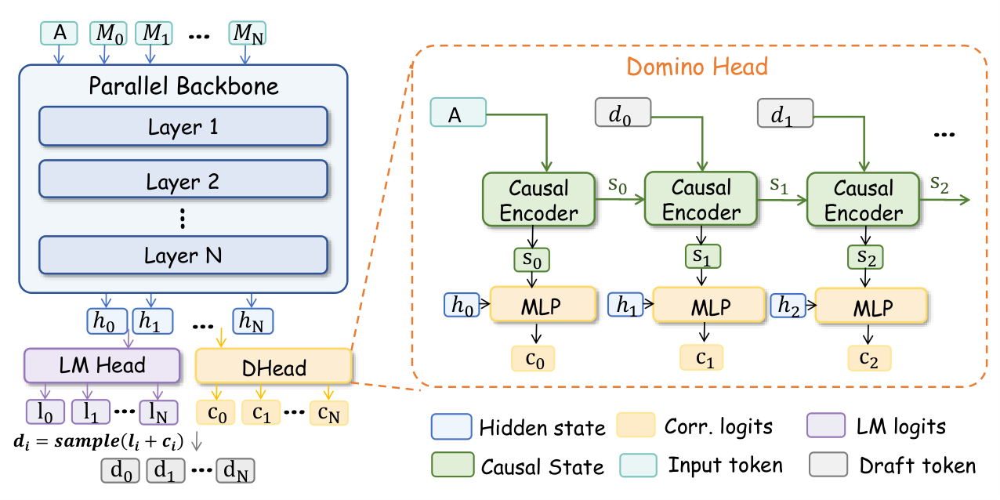
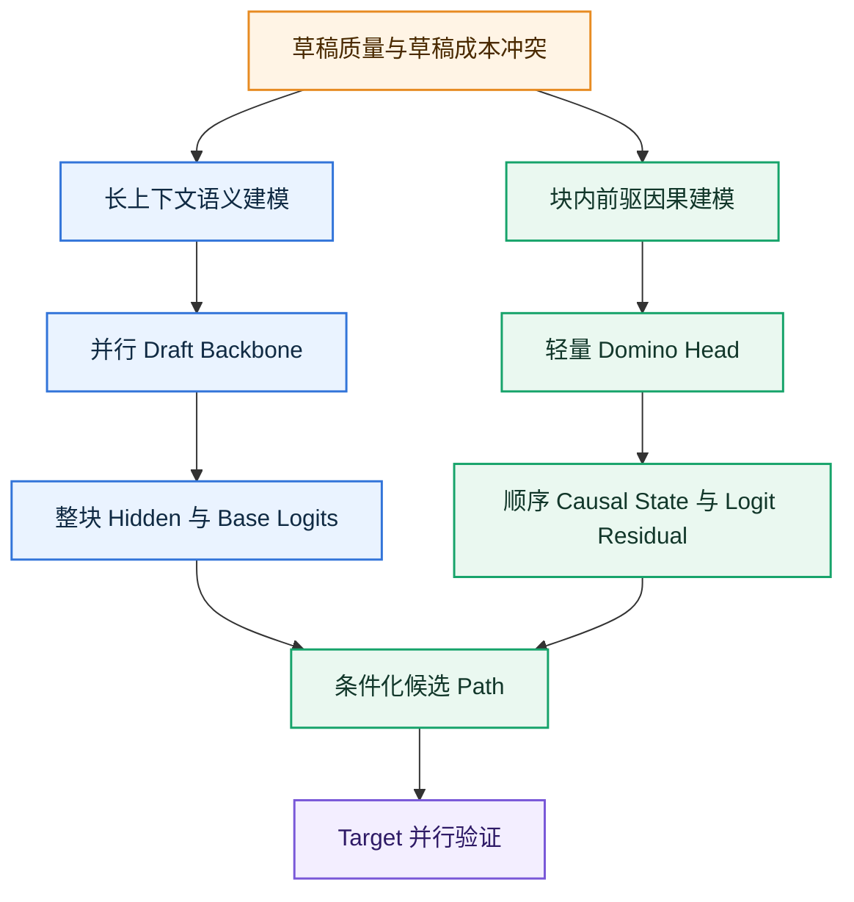
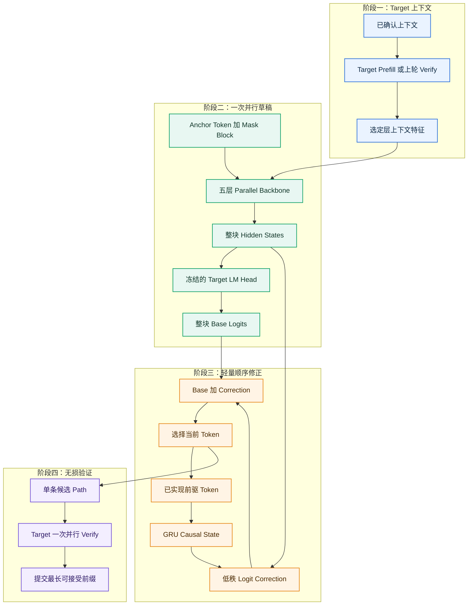
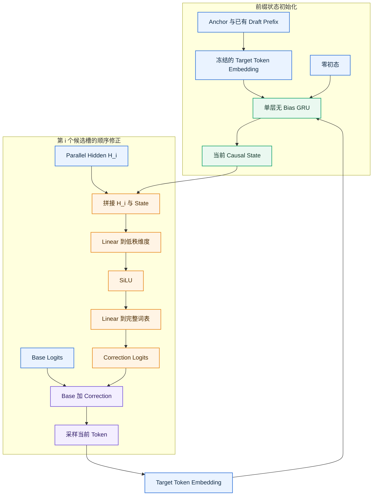
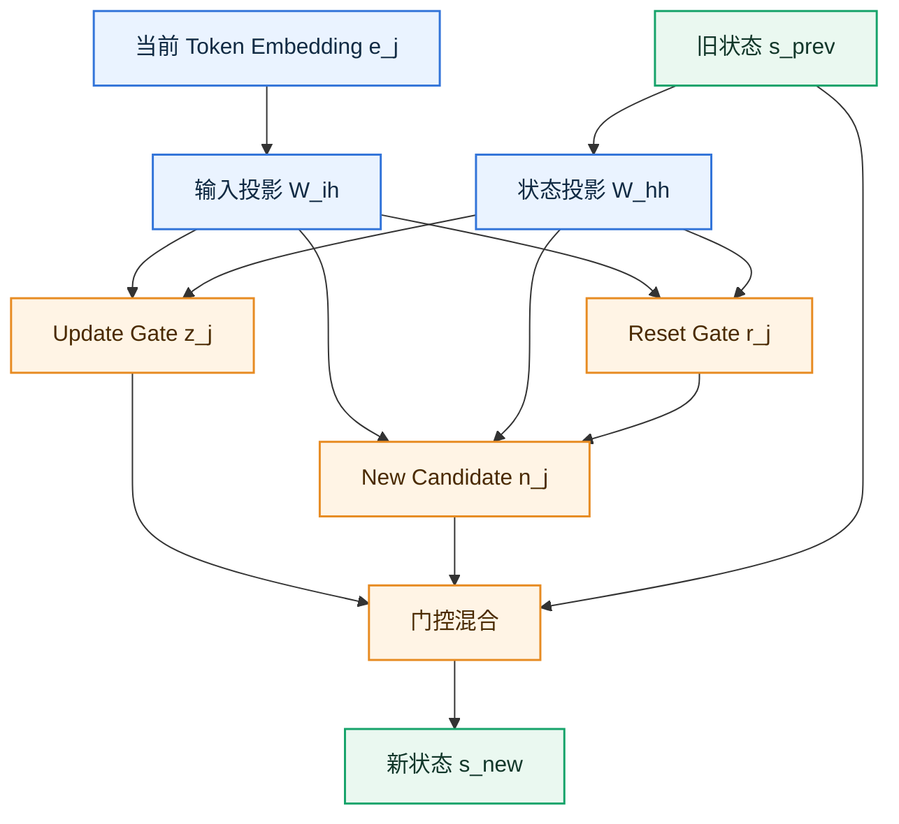
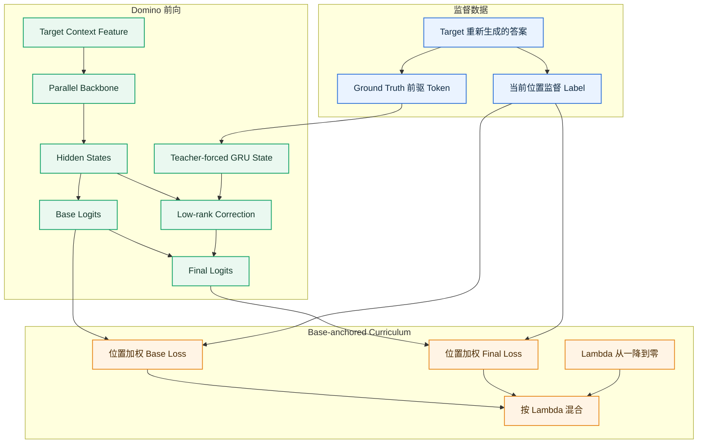
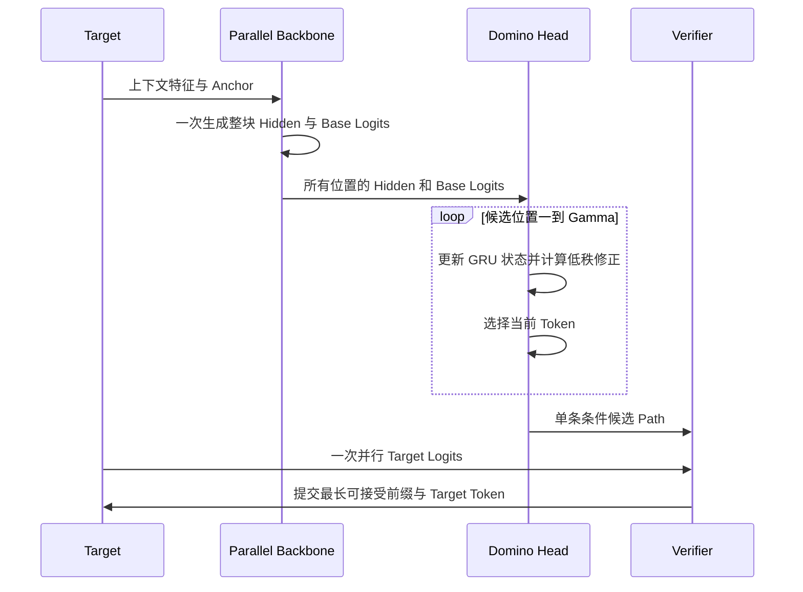
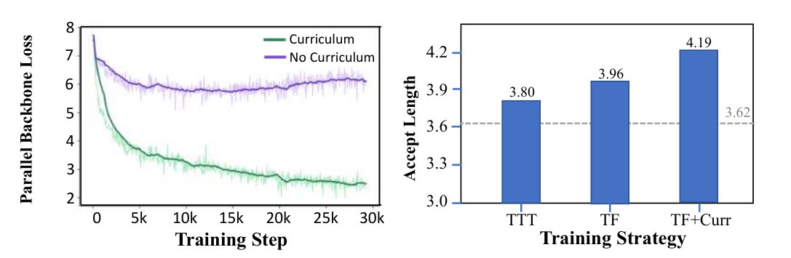
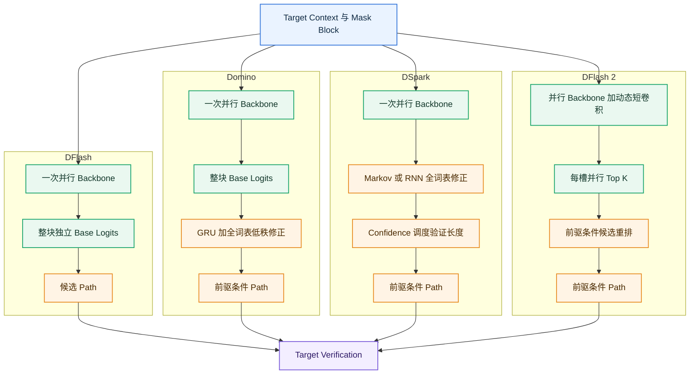

# Domino 技术分析报告：从自回归 Drafting 中解耦因果建模

> 论文：[Domino: Decoupling Causal Modeling from Autoregressive Drafting in Speculative Decoding](https://arxiv.org/abs/2605.29707)
>
> 版本边界：arXiv v1，2026-05-28；重点核对论文第 4、5 节与附录 A
>
> 报告日期：2026-08-26
>
> 分析范围：只讨论 Domino 的技术动机、结构、训练、推理、系统优化、实验和方法边界，不展开具体业务模型适配

## 1. 结论摘要

Domino 的核心不是“把并行 drafter 改回自回归”，而是把两个原本绑定在一起的工作拆开：

- **长上下文与整块语义建模**仍由 DFlash 风格的 block-parallel backbone 一次完成；
- **块内前驱依赖**交给一个轻量 GRU 和低秩 logit correction head 顺序补入；
- 顺序阶段不重复运行 draft backbone，也不重复执行基础 LM head，只更新小状态并计算残差；
- 最终生成的是一条 predecessor-conditioned **path**，不是 tree；target 仍按标准 speculative decoding 验证最长前缀，因此不改变 target 的输出分布。

| 问题 | Domino 的处理 | 论文证据 |
|---|---|---|
| 自回归 drafter 质量高但顺序成本随候选长度增长 | Backbone 只运行一次，把顺序依赖压缩到轻量 Domino head | 第 3、4 节 |
| DFlash 并行快，但各位置缺少真实前驱条件 | GRU 汇总已选择 token，低秩 head 对当前位置 base logits 做全词表残差修正 | 第 4.1 节、Figure 3 |
| 直接训练 correction 容易让 backbone 退化 | Teacher forcing 对齐 accepted-prefix 场景，再用 base-anchored curriculum 先稳住 base prediction | 第 4.2 节、Figure 4 |
| 轻量顺序循环容易被 kernel launch 和小算子开销吞没 | Triton 融合 correction 与 argmax，并用 CUDA Graph 固定执行图 | 第 4.3 节 |
| 收益是否来自更多数据或更大模型 | 论文给出同数据对比、训练策略消融和 head 消融 | 第 5.3 节、Tables 3–4 |

论文在 Figure 1 的统一 Qwen3-8B 设置下报告：Domino 相对 DFlash 增加 **56M 参数（+5.3%）**、总 draft-then-verify 延迟增加 **2.8%**，但平均接受长度提高 **16.6%**、端到端加速提高 **12.3%**。这一结果说明其有效点不只是“多加一个 GRU”，而是把因果质量增益放在远小于 backbone 的顺序路径上。

> **一句话判断：** Domino 找到了 DFlash 与 EAGLE 类方法之间的中间点——保留一次并行 backbone 的低 draft latency，同时用小型顺序状态恢复真正的前驱条件；其主要剩余问题是 full-vocabulary correction 仍有带宽成本，而且原始方法只有一条 path，早期候选错误会使后续整段失去验证价值。

## 2. 官方架构图、证据范围与版本边界

### 2.1 论文原始架构图



图源：论文 arXiv v1 Figure 3。上半部分表示 parallel backbone 一次产生整块 hidden states 与 base logits；下半部分表示 Domino head 根据此前已经采样的 draft token 更新 causal state，并生成 correction logits $c_i$，当前位置最终从 $l_i+c_i$ 中选择 token。

### 2.2 一手资料与核验版本

| 资料 | 本报告用途 | 核验边界 |
|---|---|---|
| [arXiv HTML v1](https://arxiv.org/html/2605.29707v1) | 公式、图表、实验、消融和限制的事实主源 | 论文首版，不把后续代码新增模型写成论文实验 |
| [arXiv PDF v1](https://arxiv.org/pdf/2605.29707v1) | 版面、公式和表格交叉核对 | 与 HTML 同一版本 |
| [官方 Domino 仓库](https://github.com/jianuo-huang/Domino) | 模型张量流、Transformers/SGLang 推理入口、Triton/CUDA Graph 实现 | 核验 commit `44e1e6912ba9d301899739a54bfda2ce8826980a` |
| [Domino 模型集合](https://huggingface.co/collections/Huang2020/domino) | 公开 checkpoint 与模型支持状态 | 页面状态截至 2026-08-26 |
| [SpecForge](https://github.com/sgl-project/SpecForge) | Domino 公开训练实现与配置入口 | 核验 HEAD `cb0ebfa5ab1cac81031d917150f15dd4e81f0833` |

论文第 5 节只评测 Qwen3-4B 与 Qwen3-8B。官方仓库在论文发布后又列出 Qwen3.6 checkpoint，这说明代码继续演进，但不能倒推为 arXiv v1 已验证的实验结论。

### 2.3 结论标记

| 标记 | 含义 |
|---|---|
| **论文事实** | 论文正文、附录、表格或图中直接给出 |
| **代码事实** | 在上述固定 commit 的实现中可直接定位 |
| **分析推导** | 由论文公式或代码形状推导，文中明确写出前提 |

## 3. 提出动机：因果依赖有用，但不必由 Backbone 顺序执行

### 3.1 投机解码的质量—成本平衡

设 target 自回归生成一个 token 的平均延迟为 $L_{\text{target}}$，一轮 speculative decoding 的 draft 与 verification 时间分别为 $T_{\text{draft}}$、$T_{\text{verify}}$，一轮平均推进 token 数为 $\tau$。论文使用的单 token 延迟与加速比可写为：

$$
L_{\text{spec}}
=
\frac{T_{\text{draft}}+T_{\text{verify}}}{\tau},
$$

$$
\eta
=
\frac{\tau L_{\text{target}}}
{T_{\text{draft}}+T_{\text{verify}}}.
$$

这两个式子说明，优化只提高接受长度并不够：如果为了增加 $\tau$ 而显著抬高 $T_{\text{draft}}$，端到端加速仍可能下降。

### 3.2 自回归 Drafter 与并行 Drafter 的矛盾

给定上下文 $x_{\le t}$ 和候选预算 $\gamma$，自回归 drafter 显式建模：

$$
q_{\text{AR}}\left(x_{t+1:t+\gamma}\mid x_{\le t}\right)
=
\prod_{i=1}^{\gamma}
q\left(x_{t+i}\mid x_{<t+i}\right).
$$

它的主要 draft 时间近似为：

$$
T_{\text{draft}}^{\text{AR}}
\approx
\gamma\left(t_{\text{net}}+t_{\text{head}}\right).
$$

其中 $t_{\text{net}}$ 是一次 draft network forward，$t_{\text{head}}$ 是一次词表投影。因果条件完整，但两项都随 $\gamma$ 顺序重复。

并行 drafter 则一次生成整块：

$$
q_{\text{PAR}}\left(x_{t+1:t+\gamma}\mid x_{\le t}\right),
$$

$$
T_{\text{draft}}^{\text{PAR}}
\approx
t_{\text{net}}^{\text{block}}
+t_{\text{head}}^{\text{block}}.
$$

它消除了 $\gamma$ 次 backbone/head 调用，却弱化了第 $i$ 个位置对真实已选择前驱 $x_{t+1:t+i-1}$ 的条件依赖。

论文 Figure 1 在 Qwen3-8B、A100、context length 1024、speculative budget 16、相同训练数据的设置下给出这个矛盾：

| 方法 | Draft 依赖方式 | 平均接受长度 | 端到端加速 |
|---|---|---:|---:|
| EAGLE-3 | 自回归 rollout，并构造候选树 | 4.86 | 3.28× |
| DFlash | 整块并行生成 | 4.03 | 3.42× |

EAGLE-3 的候选质量更高，但 draft 与 tree 开销抵消了一部分收益；DFlash 更便宜，但缺少块内真实前驱条件。Domino 的问题定义因此非常精确：**保留 DFlash 的一次 block-parallel backbone，只把因果依赖补回来。**

### 3.3 “解耦”具体解耦了什么



这里不是把因果建模删除，而是改变它的承载模块：

| 职责 | 原自回归 Drafter | Domino |
|---|---|---|
| 读取长上下文 | 每个候选位置重复运行 backbone | 并行 backbone 一次完成 |
| 产生基础词表分布 | 每个位置重复 LM head | 整块批量执行一次 frozen target LM head |
| 读取已生成前驱 | Backbone 自回归 attention | 小型 GRU state |
| 根据前驱改变当前位置分布 | 整个 drafter 重新 forward | 低秩 logit residual |

## 4. 整体架构与一轮推理数据流

### 4.1 中文重绘架构图



图中真正昂贵的 Draft Backbone 和基础 LM Head 都在阶段二整块运行一次。阶段三虽然有顺序反馈环，但反馈环只包含 GRU、低秩 correction 和采样，不包含完整 backbone。

### 4.2 一轮 Decode 的操作顺序

| 顺序 | 操作 | 是否整块并行 | 是否随候选位置顺序重复 |
|---:|---|---|---|
| 1 | 从 target 获取上下文特征 $C_t$ | 是 | 否 |
| 2 | 构造 anchor token 与 mask block | 是 | 否 |
| 3 | Parallel backbone 产生 $H_1,\ldots,H_\gamma$ | 是 | 否 |
| 4 | Frozen target LM head 产生全部 $L_i^{\text{base}}$ | 是 | 否 |
| 5 | GRU 读取已知前驱，产生状态 $S_{i-1}$ | 否 | 是，但模块很小 |
| 6 | 计算 $\Delta L_i$，从 $L_i^{\text{base}}+\Delta L_i$ 选择 $y_i$ | 否 | 是，但不重跑 backbone |
| 7 | Target 验证整条 $y_{1:\gamma}$ | 是 | 否 |
| 8 | 接受最长前缀并继续下一轮 | — | — |

### 4.3 Domino 是 Path，不是 Tree

Domino 在深度 $i$ 只保留一个已经实现的前驱序列：

$$
y_{1:i-1}=(y_1,y_2,\ldots,y_{i-1}).
$$

GRU state $S_{i-1}$ 只对应这条序列，当前位置再选择一个 $y_i$。最终候选拓扑是：

$$
y_1\rightarrow y_2\rightarrow\cdots\rightarrow y_\gamma.
$$

| 容易混淆的现象 | 正确解释 |
|---|---|
| 每个位置都有完整词表 logits | 这只是下一 token 分布，不等于保留多个分支 |
| 论文对比 EAGLE-3 tree | EAGLE-3 的验证候选是 tree；Domino 的原始候选是 path |
| GRU 能根据不同前驱得到不同状态 | 原始推理只沿已选择 path 更新一个状态，不同时展开多个状态 |
| 后续存在 DominoTree | DominoTree 才沿多个真实父路径复制或更新 correction state，不能反写进 Domino 原方法 |

## 5. 核心机制

### 5.1 Parallel Backbone 与 Base Logits

论文先构造带 anchor 的 masked block：

$$
\widetilde{x}_{t:t+B-1}
=
[x_t,[\mathrm{MASK}],\ldots,[\mathrm{MASK}]],
$$

再把 target 上下文特征 $C_t$ 与 masked block embedding 输入并行 backbone：

$$
H_{t:t+B-1}
=
\operatorname{Backbone}
\left(C_t,\operatorname{Embed}(\widetilde{x}_{t:t+B-1})\right).
$$

所有候选位置的基础 logits 由冻结的 target LM head 一次计算：

$$
L_i^{\text{base}}
=
\operatorname{LMHead}(H_i).
$$

这里冻结 target LM head 有两个作用：

1. 让 draft hidden state 对齐 target 原始词表空间；
2. 使基础词表投影可以整块批量完成，而不是塞进后续顺序循环。

为了避免论文的下标约定造成 shape 理解困难，下表统一用：batch size 为 $N$、候选长度为 $\gamma$、hidden size 为 $d$、词表大小为 $V$。

| 张量 | Shape | 含义 |
|---|---|---|
| 论文 masked block ids | $[N,B]$ | 一个 anchor 与其余 mask slots；$B$ 是论文输入块长度 |
| target context feature $C_t$ | 实现相关，末维通常为多个 target layer hidden 的拼接 | 给 draft backbone 注入长上下文信息 |
| 对齐后的 candidate hidden $H$ | $[N,\gamma,d]$ | 去除 anchor/shift 对齐后，$\gamma$ 个候选槽一次产生 |
| base logits $L^{\text{base}}$ | $[N,\gamma,V]$ | Frozen target LM head 的整块输出 |

这里刻意区分 $B$ 与 $\gamma$：论文公式用 $B$ 描述含 anchor 的 masked 输入区间，runtime 的 `block_size`、`shift_label` 决定如何把它对齐成 $\gamma$ 个 proposal slots。讨论 head shape 时只使用对齐后的 $[N,\gamma,d]$，避免把 anchor 误算成一个候选 token。

### 5.2 Domino Head 到底长什么样

论文把 Domino head 概括为“causal encoder + low-rank correction head”。官方代码把这两个部件具体实现为：

```python
self.prefix_gru = nn.GRU(
    input_size=config.hidden_size,
    hidden_size=self.gru_hidden_dim,
    num_layers=1,
    batch_first=True,
    bias=False,
)

self.embed_proj = nn.Sequential(
    nn.Linear(config.hidden_size + self.gru_hidden_dim, self.emb_dim, bias=False),
    nn.SiLU(),
    nn.Linear(self.emb_dim, config.vocab_size, bias=False),
)
```

因此 Domino head 不是一个 attention block，也不是另一套小 Transformer。它只有：

1. 一个单层、单向、无 bias 的 GRU；
2. 一个 $d+d_s\rightarrow r\rightarrow V$ 的两层 MLP；
3. 推理时把当前采样 token 反馈给 GRU 的顺序控制流。

代码变量名 `embed_proj` 容易造成误解：它并不负责生成 token embedding，而是把“parallel hidden 与 GRU state 的拼接”投影成词表维度的 **correction logits**。Token embedding 直接复用冻结 target 的 `target.model.embed_tokens`。

#### 5.2.1 Domino Head 完整张量流



在第 $i$ 个槽，parallel backbone 已经给出当前位置 hidden $H_i$ 和 base logits $L_i^{\text{base}}$。GRU 不重新读取长上下文，而只把“anchor 之后已经实际选择了什么”压缩成 state $S_{i-1}$。两者在低秩 MLP 中汇合：

$$
H_i\quad\text{负责当前位置的并行语义，}
\qquad
S_{i-1}\quad\text{负责已实现候选路径的因果历史。}
$$

#### 5.2.2 Qwen3-8B Domino Head 的真实权重 Shape

公开 Qwen3-8B Domino checkpoint 的配置为：

$$
d=4096,
\qquad
d_s=1024,
\qquad
r=256,
\qquad
V=151936.
$$

本报告不仅根据配置推导 shape，还直接读取了公开 `model.safetensors` 的 header。四个权重张量均为 BF16：

| Checkpoint Key | 一般 Shape | Qwen3-8B 实际 Shape | 作用 |
|---|---:|---:|---|
| `prefix_gru.weight_ih_l0` | $[3d_s,d]$ | $[3072,4096]$ | Token embedding 到三组 GRU 门的输入投影 |
| `prefix_gru.weight_hh_l0` | $[3d_s,d_s]$ | $[3072,1024]$ | 旧 state 到三组 GRU 门的递归投影 |
| `embed_proj.0.weight` | $[r,d+d_s]$ | $[256,5120]$ | 拼接特征压缩到低秩维度 |
| `embed_proj.2.weight` | $[V,r]$ | $[151936,256]$ | 低秩表示恢复为完整词表 residual |

Checkpoint 中没有 `prefix_gru.bias_*` 或 `embed_proj.*.bias`，与代码中的 `bias=False` 一致。冻结 target token embedding 的 shape 为 $[V,d]=[151936,4096]$，但它是 target 参数复用，不计入 Domino head 的 56M 新增参数。

普通 PyTorch 路径中的主要张量 shape 为：

| 阶段 | 输入 Shape | 输出 Shape |
|---|---:|---:|
| Prefix token embedding | ids $[N,P]$ | embeddings $[N,P,d]$ |
| `prefix_gru` | $[N,P,d]$ | sequence output $[N,P,d_s]$，final hidden $[1,N,d_s]$ |
| 当前槽 state 对齐 | final hidden $[1,N,d_s]$ | $S_{i-1}:[N,1,d_s]$ |
| 与 parallel hidden 拼接 | $H_i:[N,1,d]$、$S_{i-1}:[N,1,d_s]$ | $[N,1,d+d_s]$ |
| 第一层 projection | $[N,1,d+d_s]$ | $[N,1,r]$ |
| 第二层 projection | $[N,1,r]$ | $\Delta L_i:[N,1,V]$ |

其中 $P$ 是初始化 GRU 时已经实现的 prefix token 数，包含 anchor；公开 checkpoint 还会包含一个 base-only draft token，详见 5.2.4。

#### 5.2.3 GRU Cell 内部的三组门

设 GRU 当前读入的 token embedding 为：

$$
e_j\in\mathbb{R}^{N\times d},
$$

读入它之前的旧状态为：

$$
s_{j-1}\in\mathbb{R}^{N\times d_s}.
$$

代码先做两次线性投影：

$$
g_j^{(x)}
=
e_jW_{ih}^{\mathsf T}
\in\mathbb{R}^{N\times3d_s},
$$

$$
g_j^{(h)}
=
s_{j-1}W_{hh}^{\mathsf T}
\in\mathbb{R}^{N\times3d_s}.
$$

再严格按 PyTorch GRU 的 reset、update、new 顺序切成三块：

$$
g_j^{(x)}=[g_{ir},g_{iz},g_{in}],
\qquad
g_j^{(h)}=[g_{hr},g_{hz},g_{hn}].
$$

由于所有 bias 都关闭，实际门控公式就是：

$$
r_j
=
\sigma(g_{ir}+g_{hr}),
$$

$$
z_j
=
\sigma(g_{iz}+g_{hz}),
$$

$$
n_j
=
\tanh\left(g_{in}+r_j\odot g_{hn}\right),
$$

$$
s_j
=
(1-z_j)\odot n_j+z_j\odot s_{j-1}.
$$

这里 $r_j$ 是 reset gate，决定旧状态的哪些信息参与候选状态 $n_j$；$z_j$ 是 update gate，决定保留多少旧状态。若 $z_j$ 接近 1，$s_j$ 主要沿用 $s_{j-1}$；若接近 0，则主要采用新候选 $n_j$。

> 注意：本小节的 $r_j$ 表示 reset gate，不是 correction MLP 的低秩维度 $r=256$。



这个 state 不是 KV cache，也不是一串 token 的无损存储。它是一个 1024 维的有损因果摘要：通过门控选择，保留对后续候选分布最有用的 path 信息。

#### 5.2.4 Anchor、初态和第一个候选如何进入 GRU

`nn.GRU` 调用没有显式传入 $h_0$ 时，PyTorch 使用全零初态。设当前 target 已确认的最后一个 token 为 anchor $a=x_t$，则论文抽象结构的第一步是：

$$
S_A
=
\operatorname{GRUCell}(E(a),0).
$$

如果所有未来槽都使用 Domino correction，则第 0 个候选可写为：

$$
\Delta L_0
=
W_2\operatorname{SiLU}\left(W_1[H_0;S_A]\right),
$$

$$
d_0
\sim
\operatorname{Categorical}\!\left(
\operatorname{Softmax}\left(L_0^{\text{base}}+\Delta L_0\right)
\right).
$$

但公开 Qwen3-4B/8B checkpoint 的实际配置是：

```text
shift_label = true
pure_draft_prefix_len = 1
```

因此真实代码会先用第 0 槽 base logits 直接得到一个 pure-draft token：

$$
d_0
\sim
\operatorname{Categorical}\!\left(
\operatorname{Softmax}\left(L_0^{\text{base}}\right)
\right),
$$

然后一次性把 $[a,d_0]$ 的 embedding 输入 `prefix_gru`：

$$
S_A
=
\operatorname{GRUCell}(E(a),0),
$$

$$
S_0
=
\operatorname{GRUCell}(E(d_0),S_A).
$$

第一轮 correction 从槽 1 开始：

$$
\Delta L_1
=
W_2\operatorname{SiLU}\left(W_1[H_1;S_0]\right).
$$

后续每一步遵循“先用旧 state 选 token，再把新 token 写入 state”：

| 顺序 | 当前已知内容 | 操作 | 得到的结果 |
|---:|---|---|---|
| 0 | Verified anchor $a$ | 第 0 槽只读 base logits | $d_0$ |
| 1 | $a,d_0$ | 从零初态运行 prefix GRU | $S_0$ |
| 2 | $H_1,L_1^{\text{base}},S_0$ | 计算 correction 并采样 | $d_1$ |
| 3 | $d_1,S_0$ | 单步 GRU 更新 | $S_1$ |
| 4 | $H_2,L_2^{\text{base}},S_1$ | 计算下一槽 correction | $d_2$ |
| … | … | 重复 correction、采样、状态更新 | 单条条件 path |

`pure_draft_prefix_len=1` 是公开 checkpoint 的实现选择，不改变 Domino 的核心定义。它的直接效果是让最前槽保持 base-only，并省去一次 correction；所核对的论文和代码没有单独给出“为什么固定为 1”的消融，因此不能把进一步的动机推测写成论文事实。报告实验或复现时必须记录该配置，不能只写“block size 16”。

#### 5.2.5 训练与推理为什么使用同一个 GRU，却有不同执行形态

| 阶段 | 前驱 Token 是否已知 | GRU 调用方式 | Correction 计算方式 |
|---|---|---|---|
| Teacher-forced training | 是，全部来自 ground truth/target answer | 把 $[N,\text{blocks},\gamma,d]$ reshape 为 $[N\cdot\text{blocks},\gamma,d]$，一次 batched sequence call 返回全部 states | 对所有 block/位置批量计算 |
| 普通 inference | 否，下一前驱取决于当前采样结果 | Prefix 一次初始化；之后每采样一个 token 调一次单步 GRU | 按 path 逐槽计算 |
| Fused greedy inference | 否 | 手写 GRUCell kernel，逐槽更新 | Triton 融合 correction、base add 与 argmax |

Teacher forcing 使一整段 GRU 输入在 forward 开始前就已知，因此训练代码可以一次提交整段 tensor；但 GRU 在时间维上的数学递推仍然存在，只是由框架内部实现，不应误写成各时间位置完全独立。

SpecForge 的训练实现还严格对齐 previous token 与 label。`shift_label=true` 时：

- `target_ids` 收集 anchor 之后的监督 token；
- `prev_ids` 从 anchor 开始收集同样长度的真实前驱序列；
- 第 $j$ 个 correction state 只读取到该 label 的真实前驱，不读取当前 label 或未来 token。

这正是论文所说的 teacher forcing，而不是把完整答案提前泄漏给当前位置。

#### 5.2.6 Fused Runner 如何保持与 PyTorch GRU 等价

Correction 第一层权重可以按输入拼接边界拆成：

$$
W_1=[W_H,W_S],
$$

因此：

$$
W_1[H_i;S_{i-1}]
=
W_H\,H_i+W_S\,S_{i-1}.
$$

官方 fused runner 先对全部候选槽并行预计算：

$$
Z_H
=
H\,W_H^{\mathsf T}
\in\mathbb{R}^{N\times\gamma\times r},
$$

顺序循环中只增加当前 state 分支：

$$
Z_{S,i}
=
S_{i-1}W_S^{\mathsf T}
\in\mathbb{R}^{N\times r}.
$$

随后将以下操作融合：

$$
\operatorname{SiLU}(Z_{H,i}+Z_{S,i})
\rightarrow W_2
\rightarrow +L_i^{\text{base}}
\rightarrow \arg\max.
$$

GRU 输入侧也预计算：

$$
T_{\text{GRU-in}}
=
E_{\text{vocab}}W_{ih}^{\mathsf T}
\in\mathbb{R}^{V\times3d_s}.
$$

运行时只根据新 token id gather 一行 $g^{(x)}$，再实时计算旧 state 的 $g^{(h)}$，最后调用与 5.2.3 完全相同的四个门控公式。对 Qwen3-8B，预计算表为 $[151936,3072]$，若按 BF16 保存约占 890 MiB；它是以显存换逐 token GEMV 的 runtime buffer，不是 checkpoint 参数。

| 普通 PyTorch 路径 | Fused Greedy 路径 | 数学语义 |
|---|---|---|
| `nn.GRU` | 手写 Triton GRUCell | 相同 reset/update/new 门与相同权重 |
| `torch.cat` 后执行第一层 Linear | 预拆 $W_H/W_S$ 并分别投影 | 由线性可加性严格等价 |
| SiLU、第二层 Linear、base add、argmax 分开 | 两级 Triton kernel 融合 | 输出 token 相同 |
| Python 循环发起小算子 | CUDA Graph 固定 buffer 与 steps | 只改变调度开销 |

这条 fused 路径当前明确假设 greedy decoding、固定 batch size 和固定 steps；sampling 仍需保留 proposal 概率与拒绝采样语义，不能直接套用只输出 argmax token 的 runner。

### 5.3 低秩 Logit Correction

5.2 已经从代码角度展开了完整 head；这里用统一代数形式总结 GRU state 如何进入词表修正。

对第 $i$ 个候选位置，Domino 拼接并行 hidden 与此前的 GRU state：

$$
Z_i=[H_i;S_{i-1}]
\in\mathbb{R}^{d+d_s}.
$$

随后用两层低秩 MLP 产生词表维度残差：

$$
\Delta L_i
=
W_2\operatorname{SiLU}\left(W_1Z_i\right),
$$

$$
L_i
=
L_i^{\text{base}}+\Delta L_i.
$$

其 shape 为：

| 对象 | Shape | 作用 |
|---|---|---|
| $H_i$ | $[N,d]$ | 当前槽的并行语义表示 |
| $S_{i-1}$ | $[N,d_s]$ | 已实现前驱 path 的因果状态 |
| $Z_i$ | $[N,d+d_s]$ | 两类信息的拼接 |
| $W_1$ | $[r,d+d_s]$ | 压缩到低秩瓶颈 $r$ |
| 中间表示 | $[N,r]$ | 论文实现 $r=256$ |
| $W_2$ | $[V,r]$ | 恢复为词表残差 |
| $L_i$ | $[N,V]$ | 最终 proposal 分布的 logits |

论文选择在 logit space 修正，而不是先顺序修正 hidden 再调用完整 target LM head。二者的关键成本差异是：

- base LM head 的大矩阵乘已经对 $\gamma$ 个位置批量完成一次；
- 顺序阶段只处理维度为 $r=256$ 的中间表示；
- $W_2$ 仍输出完整词表，因此它不是零成本，但相比重新运行 backbone 和 $d\rightarrow V$ 的完整 head 更轻。

### 5.4 候选 Path 如何逐位置产生

在 greedy 模式下，一轮 Domino head 可抽象为：

```text
输入：整块 H，整块 BaseLogits，anchor
配置：prefix_len = pure_draft_prefix_len

prefix_tokens = sample(BaseLogits[0:prefix_len])
state = GRU(Embedding([anchor] + prefix_tokens), zero_state)

for i = prefix_len ... gamma - 1:
    correction_i = LowRankHead(H_i, state)
    logits_i = BaseLogits_i + correction_i
    y_i = argmax(logits_i)
    if i + 1 < gamma:
        state = GRUCell(Embedding(y_i), state)

输出：base-only prefix 加 corrected suffix 组成的单条候选 path
```

公开 Qwen3 checkpoint 中 `prefix_len=1`；若配置为 0，prefix 只含 anchor，correction 从第 0 个候选槽开始。Sampling 模式把 `argmax` 换成从 proposal $q_i$ 采样；后续 target 仍使用标准 rejection sampling 保证分布正确。关键点是 corrected suffix 的 $q_i$ 依赖此前实际采样的 $y_{<i}$，不再是各位置互不相干的 marginal proposal。

### 5.5 参数量为什么约为 56M

**分析推导：** 代码与 checkpoint 均确认 `bias=False`，因此单层 GRU 与 correction MLP 的新增参数为：

$$
P_{\text{GRU}}
=
3\left(dd_s+d_s^2\right),
$$

$$
P_{\text{corr}}
=
r(d+d_s)+Vr.
$$

对论文 Qwen3-8B 对应的 $d=4096$、$d_s=1024$、$r=256$、$V=151936$：

$$
P_{\text{GRU}}
=
15{,}728{,}640,
$$

$$
P_{\text{corr}}
=
40{,}206{,}336,
$$

$$
P_{\text{Domino head}}
\approx
55{,}934{,}976
\approx
56\text{M}.
$$

这与论文 Figure 1 的 56M 一致。论文所说的 **+5.3%** 是相对对应 draft model 的参数增量，不是相对 8B target 的增量。

### 5.6 计算复杂度与真正的顺序临界路径

Domino 的 draft 时间可以概括为：

令 $p$ 为 `pure_draft_prefix_len`，则更精确的关键路径近似为：

$$
T_{\text{draft}}^{\text{Domino}}
\approx
t_{\text{net}}^{\text{block}}
+t_{\text{head}}^{\text{block}}
+t_{\text{prefix-state}}
+p\,t_{\text{sample}}
+(\gamma-p)\left(t_{\text{GRU}}+t_{\text{corr}}+t_{\text{sample}}\right).
$$

其中 $t_{\text{prefix-state}}$ 包括 anchor 与 base-only prefix 的初始 GRU 扫描。该式把每个 corrected slot 的状态更新统一计入近似项；最后一个槽无需再为本轮生成下一状态，因此真实调用数会少一个边界更新。

| 成本项 | 是否顺序 | 规模 |
|---|---|---|
| Parallel backbone | 否 | 主要网络计算，只运行一次 |
| Base LM head | 否 | $[N,\gamma,d]\rightarrow[N,\gamma,V]$ 批量执行 |
| GRU update | 是 | 每个 corrected suffix 槽约 $O(dd_s+d_s^2)$，实现可预计算输入侧投影 |
| Correction first projection | 是，但 $H$ 分支可预计算 | 每个 corrected suffix 槽约 $O(r(d+d_s))$ |
| Correction vocabulary projection | 是 | 每个 corrected suffix 槽约 $O(Vr)$ |
| 采样或 argmax | 是 | 词表 reduction 或 sampling kernel |

因此 Domino 的技术判断应写成“**把顺序成本从完整网络降为小状态加低秩词表修正**”，而不是“完全没有顺序成本”。这也解释了为何论文必须专门做 Triton 与 CUDA Graph 优化。

### 5.7 论文公式到公开代码的映射

| 论文对象 | 核验代码位置 | 代码含义 |
|---|---|---|
| Parallel backbone | [`dflash.py` 的 `DFlashDraftModel.layers`](https://github.com/jianuo-huang/Domino/blob/44e1e6912ba9d301899739a54bfda2ce8826980a/code/dflash.py) | 五层 DFlash 风格 decoder layers |
| Domino 模块定义 | [`dflash.py` L261–L274](https://github.com/jianuo-huang/Domino/blob/44e1e6912ba9d301899739a54bfda2ce8826980a/code/dflash.py#L261-L274) | 单层无 bias GRU 与两层无 bias correction MLP |
| Base-only prefix | [`dflash.py` L424–L443](https://github.com/jianuo-huang/Domino/blob/44e1e6912ba9d301899739a54bfda2ce8826980a/code/dflash.py#L424-L443) | 先采样 pure prefix，再用 anchor 与 prefix 初始化 GRU |
| 逐槽 correction | [`dflash.py` L445–L458](https://github.com/jianuo-huang/Domino/blob/44e1e6912ba9d301899739a54bfda2ce8826980a/code/dflash.py#L445-L458) | 拼接 hidden/state、加 residual、采样并反馈 token |
| Fused GRU 门 | [`kernel/domino.py` L178–L226](https://github.com/jianuo-huang/Domino/blob/44e1e6912ba9d301899739a54bfda2ce8826980a/code/kernel/domino.py#L178-L226) | 显式实现 reset、update、new 与 state 混合 |
| Fused 权重与 lookup table | [`kernel/domino.py` L314–L327](https://github.com/jianuo-huang/Domino/blob/44e1e6912ba9d301899739a54bfda2ce8826980a/code/kernel/domino.py#L314-L327) | 提取 PyTorch GRU 权重并预计算 embedding 输入投影 |
| Fused correction rollout | [`kernel/domino.py` L379–L431](https://github.com/jianuo-huang/Domino/blob/44e1e6912ba9d301899739a54bfda2ce8826980a/code/kernel/domino.py#L379-L431) | 预计算 hidden 分支，逐槽补 state 分支并更新 GRU |
| Teacher-forced training | [SpecForge `domino.py` L124–L150](https://github.com/sgl-project/SpecForge/blob/cb0ebfa5ab1cac81031d917150f15dd4e81f0833/specforge/modeling/draft/domino.py#L124-L150) | 整段真实前驱进入同一 GRU，再与 suffix hidden 对齐 |
| 公开权重 shape | [Qwen3-8B Domino checkpoint](https://huggingface.co/Huang2020/Qwen3-8B-Domino-b16) | Safetensors header 与代码推导一致，且不存在 bias tensor |

## 6. 训练方法：只学习“可被接受的前缀”

### 6.1 为什么采用 Teacher Forcing

训练顺序模块有两种直觉方案：

| 方案 | 前驱来自哪里 | Domino 论文判断 |
|---|---|---|
| Training-time testing | Drafter 自己生成的 token | 会频繁进入错误前缀后的状态 |
| Teacher forcing | Ground-truth 或 target-generated token | 与“此前 token 已通过 target 验证”的状态对齐 |

Speculative decoding 一旦在位置 $j$ 发生不一致，只提交 $j$ 之前的候选；$j$ 之后基于错误前驱生成的 suffix 不会被接受。因此 correction head 真正需要做好的状态是：

$$
y_{<i}=x_{<i}^{\text{target}}.
$$

让模型花容量学习“错误前缀之后如何继续”不会直接提高这一轮的接受长度，因为第一个错误已经截断整条 suffix。论文据此采用 teacher forcing，把训练输入限制在 accepted-prefix regime。

### 6.2 为什么 Teacher Forcing 还不够

如果只优化最终 logits：

$$
L_i=L_i^{\text{base}}+\Delta L_i,
$$

强 correction head 可能替代 parallel backbone 的预测职责，使 $L_i^{\text{base}}$ 自身变差。这会形成错误分工：本应负责整块语义的 backbone 退化，而轻量 head 被迫同时承担语义和因果建模。

Domino 因此联合优化 final loss 与 base loss：

$$
\mathcal{L}_t
=
(1-\lambda_t)\mathcal{L}_{\text{final}}
+\lambda_t\mathcal{L}_{\text{base}},
$$

其中 $\lambda_t$ 随训练从 1 线性下降到 0：

- 训练早期：先要求 parallel backbone 独立产生可靠 base logits；
- 训练后期：逐渐把重心移到 correction 后的最终 logits；
- 结果：head 学的是增量因果残差，而不是绕过 backbone 的主预测器。

两个 loss 都采用位置指数衰减权重：

$$
w_k
=
\exp\left(-\frac{k}{\gamma}\right),
$$

$$
\mathcal{L}_{\star}
=
\frac{\sum_{k=1}^{\gamma}w_k\operatorname{CE}
\left(L_k^{\star},x_{t+k}\right)}
{\sum_{k=1}^{\gamma}w_k},
\qquad
\star\in\{\text{base},\text{final}\}.
$$

较早位置权重更高的原因是：一次早期不一致会让后面全部候选失去可接受性，因此前段精度对最终 $\tau$ 的影响更大。

### 6.3 训练流程图



### 6.4 论文训练配置

| 配置项 | 论文设置 |
|---|---|
| Target models | Qwen3-4B、Qwen3-8B，训练时冻结 |
| 数据 | `mlabonne/open-perfectblend`，1.42M 样本 |
| 答案来源 | 使用对应 target 重新生成全部答案 |
| Draft backbone | 5 layers |
| Block size | 16 |
| GRU hidden dimension | 1024 |
| Correction bottleneck | 256 |
| 最大序列长度 | 3072 |
| Epoch | 3 |
| 训练硬件 | 8×A100 80GB |
| Batch | 每 GPU 2，全局 16，无 gradient accumulation |
| Optimizer | AdamW，learning rate $6\times10^{-4}$，weight decay 0 |
| Schedule | Cosine，warmup ratio 0.04 |
| 其他 | BF16、gradient clip 1、FSDP 与 gradient sharding |

这个 recipe 并未降低 target answer regeneration 或 draft training 的成本；Domino 的主要节省发生在部署推理阶段。

## 7. 推理、验证与系统优化

### 7.1 Greedy 验证为何保持结果一致

Domino 产生候选 path $y_{1:\gamma}$ 后，target 在一次 forward 中得到每个位置的真实预测。设第一个不一致位置为 $j$：

$$
j
=
\min\left\{i:y_i\neq\arg\max p_i\right\}.
$$

系统提交 $y_{1:j-1}$，并在位置 $j$ 提交 target token；若全部一致，则提交整个候选块并按标准实现推进。Domino 只改变 proposal，最终 token 仍由 target 验证规则决定。

### 7.2 Sampling 验证为何保持分布一致

在 sampling 模式中，Domino 给出条件 proposal $q_i(\cdot\mid y_{<i})$，target 给出 $p_i$。标准 rejection sampling 以：

$$
a_i
=
\min\left(1,\frac{p_i(y_i)}{q_i(y_i)}\right)
$$

接受候选；拒绝时从归一化残差分布：

$$
p_i'(x)
\propto
\max\left(p_i(x)-q_i(x),0\right)
$$

采样替代 token。只要 runtime 正确保留 proposal 概率，输出分布就与 target 原始 sampling 一致。

### 7.3 一轮验证时序



### 7.4 Triton 与 CUDA Graph 做了什么

论文报告在 Figure 1 的设置下，Domino head latency 从 **2.64 ms** 降至 **1.20 ms**。官方 kernel 实现对应三类优化：

| 优化 | 具体做法 | 减少的成本 |
|---|---|---|
| Correction 融合 | 融合 SiLU、第二层词表 GEMV、base-logit 加法和局部 argmax | 中间张量写回和 kernel launch |
| 两级 Argmax | 每个 vocabulary block 先局部 reduction，再做最终 reduction | 完整词表选择开销 |
| GRU 输入预计算 | 预先计算 embedding table 与 $W_{ih}^{\mathsf T}$ 的乘积 | 每步 embedding 后的输入 GEMV |
| 手写 GRUCell | 直接更新单步 hidden state | 通用 `nn.GRU` 单 token 调用开销 |
| CUDA Graph | 固定 batch、steps 和 buffer 后 capture 顺序 rollout | Python dispatch 与重复 launch overhead |

代码中的融合 runner 当前明确假设 greedy/argmax、固定 batch size 和固定 steps。Sampling、动态 batch 或其他 backend 是否能获得同等收益，需要分别验证，不能直接用 1.20 ms 代表所有部署形态。

## 8. 论文第 5 节实验与消融分析

### 8.1 评测口径

| 维度 | 设置 |
|---|---|
| Target | Qwen3-4B、Qwen3-8B |
| 数学 | GSM8K、MATH、AIME25 |
| 代码 | HumanEval、MBPP、LiveCodeBench |
| 对话 | MT-Bench、Alpaca |
| Baselines | Autoregressive、EAGLE-3、DFlash、DART、FR-Spec |
| 最大生成长度 | 2048 |
| 主硬件 | A100-SXM4-80GB |
| 主后端 | Transformers；另给 SGLang 高并发吞吐 |
| 候选预算说明 | 表中括号对 tree 方法表示 tree size，对 block 方法表示 block size |

跨方法结果必须同时看 acceptance 与 latency。EAGLE-3 的 tree size、DFlash/Domino 的 block size 虽都属于验证预算，但候选拓扑和 draft 成本并不相同。

### 8.2 Transformers 主结果：Domino 对 DFlash

下表汇总论文 Table 1 的八个任务平均值：

| 采样设置 | Target | 方法 | 平均加速 | 平均接受长度 | Domino 相对 DFlash |
|---|---|---|---:|---:|---|
| Temperature 0 | Qwen3-4B | DFlash | 4.70× | 6.11 | 基线 |
| Temperature 0 | Qwen3-4B | **Domino** | **5.47×** | **7.08** | 加速 +16.4%，接受长度 +15.9% |
| Temperature 0 | Qwen3-8B | DFlash | 4.66× | 6.06 | 基线 |
| Temperature 0 | Qwen3-8B | **Domino** | **5.49×** | **7.17** | 加速 +17.8%，接受长度 +18.3% |
| Temperature 1 | Qwen3-4B | DFlash | 4.03× | 5.33 | 基线 |
| Temperature 1 | Qwen3-4B | **Domino** | **4.61×** | **6.00** | 加速 +14.4%，接受长度 +12.6% |
| Temperature 1 | Qwen3-8B | DFlash | 3.96× | 5.18 | 基线 |
| Temperature 1 | Qwen3-8B | **Domino** | **4.46×** | **5.91** | 加速 +12.6%，接受长度 +14.1% |

这个表的可靠结论是：在相同 target、数据、后端和 block 设置下，因果 correction 的接受长度增益足以覆盖其顺序开销。它不能证明换到任意 GPU、任意 batch 或任意 serving engine 后仍保持相同比例。

### 8.3 Figure 1 与 Figure 2 的 Headline 结果

| 结果 | 数值 | 口径 |
|---|---:|---|
| Domino head 参数增量 | 56M，+5.3% | 相对对应 draft model |
| 总 draft-then-verify 延迟增量 | +2.8% | Figure 1 的 Qwen3-8B/A100/context 1024/budget 16 |
| 平均接受长度增益 | +16.6% | Figure 1，同训练数据 |
| 端到端加速增益 | +12.3% | Figure 1，同训练数据 |
| GSM8K 峰值示例 | DFlash 5.21× → Domino 7.92× | Figure 2，Qwen3-8B、Transformers |

7.92× 是单任务 headline，不是 Table 1 的八任务平均值。报告或复现时应同时保留任务、后端、温度、候选预算和最大生成长度，不能只引用最大数字。

### 8.4 同数据对比：排除训练数据优势

论文第 5.3.1 节在同一数据设置下比较 Qwen3-8B、greedy、budget 16：

| 方法 | GSM8K 接受长度 | HumanEval 接受长度 | LiveCodeBench 接受长度 |
|---|---:|---:|---:|
| EAGLE-3 | 5.01 | 4.84 | 4.38 |
| FR-Spec | 4.79 | 4.54 | 4.21 |
| DFlash | 3.90 | 3.78 | 3.66 |
| **Domino** | **4.65** | **4.35** | **4.24** |

Domino 仍稳定高于 DFlash，说明增益不是由额外训练样本单独造成；同时 EAGLE-3 在部分任务仍有更长接受长度，说明 Domino 的优势来自接受长度与更低 draft latency 的组合，而不是在所有任务上单纯最大化 acceptance。

### 8.5 Training Strategy 消融



图源：论文 arXiv v1 Figure 4。左图展示 base-anchored curriculum 对 parallel backbone loss 的保护，右图比较三种训练策略的平均接受长度。

| 训练策略 | 平均接受长度 | 相对含义 |
|---|---:|---|
| Training-time testing | 3.80 | 自生成错误前缀带来无效状态学习 |
| Teacher forcing | 3.96 | 对齐 accepted-prefix regime |
| **Teacher forcing + Curriculum** | **4.19** | 同时保护 base backbone，结果最好 |

这一消融分别支持两个设计判断：teacher forcing 解决训练状态与验证状态错位，curriculum 解决 correction head 对 base backbone 的替代问题。

### 8.6 Domino Head 消融

论文 Table 4/6 在八个任务上移除或加入 Domino head：

| 指标 | 无 Domino Head | 有 Domino Head | 相对变化 |
|---|---:|---:|---:|
| 平均接受长度 | 3.49 | 4.19 | +20.1% |
| 平均加速 | 2.84× | 3.31× | +16.5% |

各任务明细为：

| 任务 | 无 Head 接受长度 / 加速 | 有 Head 接受长度 / 加速 |
|---|---:|---:|
| GSM8K | 3.82 / 3.17× | 4.80 / 3.84× |
| MATH | 3.76 / 3.08× | 4.66 / 3.74× |
| AIME | 3.68 / 3.03× | 4.29 / 3.47× |
| HumanEval | 3.69 / 3.04× | 4.35 / 3.51× |
| MBPP | 3.30 / 2.70× | 3.94 / 3.16× |
| LiveCodeBench | 3.36 / 2.64× | 3.92 / 2.98× |
| MT-Bench | 2.84 / 2.21× | 3.39 / 2.46× |
| 平均 | 3.49 / 2.84× | 4.19 / 3.31× |

接受长度提升 20.1%，加速提升 16.5%，差额就是 correction 本身的时间成本和系统非线性开销。该结果比只报告 acceptance 更有说服力。

### 8.7 SGLang 高并发吞吐

论文 Table 2 给出不同 concurrency 下的总 TPS。下表保留 Qwen3-8B 的代表点：

| 任务 | 方法 | Concurrency 2 | Concurrency 8 | Concurrency 32 |
|---|---|---:|---:|---:|
| GSM8K | Autoregressive | 184 | 655 | 1713 |
| GSM8K | DFlash | 672（3.7×） | 1915（2.9×） | 2801（1.6×） |
| GSM8K | **Domino** | **942（5.1×）** | **2678（4.1×）** | **3650（2.1×）** |
| MBPP | Autoregressive | 183 | 635 | 1428 |
| MBPP | DFlash | 649（3.6×） | 1889（3.0×） | 2800（2.0×） |
| MBPP | **Domino** | **701（3.8×）** | **2035（3.2×）** | **3027（2.1×）** |

并发升高后，target batching 本身更充分，所有 speculative 方法相对 AR 的倍数都会收缩；Domino 在这些点仍高于 DFlash，但增益在 GSM8K 比 MBPP 更明显，说明 workload 的 acceptance 分布仍是决定因素。

### 8.8 第 5 节实验能证明什么、不能证明什么

| 可以支持的结论 | 不能外推的结论 |
|---|---|
| Domino correction 在统一 DFlash backbone 上提高 acceptance | 任意 target family 都有相同收益 |
| 收益在 greedy 与 temperature 1 下都存在 | 任意 sampling 参数都同样有效 |
| 同数据对比排除了主要数据量混淆 | 训练数据质量完全不影响最终差异 |
| Head 消融证明额外模块净提升端到端加速 | 56M head 在所有硬件上都只增加 2.8% 延迟 |
| SGLang 结果表明收益可进入 serving runtime | 已在 vLLM、TensorRT-LLM 等所有引擎系统验证 |

## 9. 与其他 Draft 方法的机制对比

### 9.1 DFlash、Domino、DSpark 与 DFlash 2



| 维度 | DFlash | Domino | DSpark | DFlash 2 |
|---|---|---|---|---|
| 主要 backbone | Block-parallel | Block-parallel | Block-parallel | Block-parallel |
| Hidden 层块内专用因果模块 | 无 | 无，依赖最终 correction | 无，依赖最终 sequential head | 每层动态因果短卷积 |
| Token path 依赖 | 各槽基础 logits 近似独立 | GRU 汇总完整已选前缀 | Markov、gated 或 RNN head | 前一 token 条件 selector |
| 顺序阶段词表范围 | 无额外顺序修正 | 低秩投影到完整词表 | 低秩修正到完整词表 | 只在每槽 Top-$K$ 内重排 |
| Verification budget | 固定 block | 固定 block | Confidence 加 hardware-aware prefix scheduling | 固定 block |
| 原始候选拓扑 | Path | Path | Path | Path |
| 重点解决问题 | 降低 draft latency | 用低成本恢复块内 causal dependency | 同时改善 coherence 与验证预算利用率 | 同时修复 hidden coherence 与候选排序 |

Domino 与 DSpark 最接近：两者都在并行 backbone 后加入顺序、全词表 correction。Domino 的独特重点是 accepted-prefix teacher forcing 与 base-anchored curriculum；DSpark 还显式预测 confidence，并把硬件感知 verification prefix 调度纳入系统。

DFlash 2 则把问题拆成两个模块：动态短卷积在 backbone 内改善 hidden coherence，selector 只在并行 Top-$K$ 内做顺序重排。它减少了 Domino 的 $O(Vr)$ 顺序词表投影，但也引入“真实 token 必须先进入 Top-$K$”的候选召回约束。

### 9.2 与 EAGLE-3 的根本区别

| 维度 | EAGLE-3 | Domino |
|---|---|---|
| Draft 生成 | 轻量 drafter 自回归 rollout | Backbone 整块并行，只有小 head 顺序 |
| 因果条件 | 每步重跑 draft network，条件最完整 | GRU state 加当前位置并行 hidden |
| LM head | 随 rollout 多次参与 | Base head 整块一次，correction head 顺序 |
| 候选拓扑 | 通常构造 tree | 原始方法为单 path |
| 候选长度扩大时 | Draft latency 近似线性增加 | 只增加 GRU/correction 顺序成本 |
| 论文 Figure 1 现象 | 接受长度更高，但 tree 与顺序成本限制加速 | 目标是用更低成本换取接近的 causal gain |

Domino 并不声称 GRU state 等价于完整自回归 backbone；它只要求这个低维状态能恢复足够多的块内依赖，使接受长度增益超过 correction 成本。

### 9.3 与 DominoTree 的边界

Domino 的 correction 是 path-dependent：同一深度若父 token 不同，GRU state 和最终 logits 都不同。DominoTree 后续利用这个性质，对多条真实 root-to-node path 分别维护状态并展开 conditional tree。

| 方法 | 状态数量 | 候选结构 | 早期错误后的备选分支 |
|---|---:|---|---|
| Domino | 每个请求一条当前 path state | Chain | 无 |
| DominoTree | 每个保留父路径各有 state | Conditional tree | 有 |

因此 DominoTree 是对候选搜索拓扑的扩展，不是 Domino 论文第 4、5 节已经包含的模块。

### 9.4 效果数字为什么不能跨论文直接排名

| 变量 | 对结果的影响 |
|---|---|
| Target family 与规模 | Target 单步延迟、词表大小、feature 难度不同 |
| Draft block 或 tree budget | 改变接受上限、draft 成本和 verification 成本 |
| Greedy 或 sampling | Proposal 接受概率与 rejection sampling 成本不同 |
| Hardware | 小 GEMV、带宽、kernel launch 与 target compute 比例不同 |
| Backend | Transformers、SGLang、vLLM 的 batching 和 graph capture 不同 |
| 数据与 target regeneration | 直接决定 draft-target distribution alignment |
| 并发与请求长度 | 改变 target batching 收益和 speculative 相对价值 |

所以本报告只把 Domino 论文内部的 DFlash/EAGLE-3 matched results 作为直接数值证据；与 DSpark、DFlash 2 的比较限定为机制层，不用不同论文的最大 speedup 排名。

## 10. 公开实现与复现状态

### 10.1 官方 Domino 仓库

核验 commit 中共有 9 个 Python 文件，覆盖：

| 能力 | 状态 | 入口 |
|---|---|---|
| Qwen3 Transformers 单序列推理 | 已公开 | `code/dflash.py::spec_generate` |
| Greedy Domino fused correction | 已公开 | `code/kernel/domino.py` |
| Hugging Face benchmark | 已公开 | `run_hf_benchmark.sh`、`code/benchmark.py` |
| SGLang benchmark | 已公开 | `run_sglang_benchmark.sh`、`code/benchmark_sglang.py` |
| 公开 checkpoint | 已公开 | Hugging Face Domino collection |
| 训练代码 | 不在该仓库，已进入 SpecForge | README 明确链接 SpecForge |

官方 Transformers `spec_generate` 当前明确限制 batch shape 为 `[1, seq_len]` 且 draft/target 在同一设备。README 说明 Transformers backend 当前支持 Qwen3 checkpoint，Qwen3.6-27B 使用 SGLang 路径。

### 10.2 SpecForge 训练实现

核验的 SpecForge HEAD 已包含：

- `specforge/algorithms/domino/` algorithm 与 provider；
- `specforge/core/domino_loss.py` 与 Triton loss；
- `specforge/modeling/draft/domino.py`；
- Domino model、loss、runtime launch tests；
- Qwen3 的 offline、online、external/managed-local disaggregated 配置。

这意味着 Domino 已具备公开训练与推理代码，不是只有论文伪代码。但复现实验仍应钉住 paper/model/code revision，并核对数据 regeneration、target hidden layer、block size、runtime branch 和 kernel 参数。

## 11. 技术优势、局限性与风险

### 11.1 技术优势

| 优势 | 原因 |
|---|---|
| 改动集中 | 不改 target verifier，只在并行 draft backbone 后加入 correction head |
| 职责清晰 | Backbone 负责语义，GRU 负责已选前驱，低秩 head 负责 residual |
| 训练目标与接受机制一致 | Teacher forcing 直接优化 accepted-prefix regime |
| 有端到端净收益证据 | Head 消融同时提高 acceptance 和真实 speedup |
| 系统实现完整 | 作者不仅给结构，还给 fused Triton、CUDA Graph 与 serving benchmark |

### 11.2 论文明确或可以直接推出的局限

| 局限 | 影响 |
|---|---|
| 不降低训练成本 | 仍需 target regeneration、target feature 和完整 draft 训练 |
| Full-vocabulary correction 仍顺序执行 | $W_2\in\mathbb{R}^{V\times r}$ 对大词表有显存带宽压力 |
| 原始方法只有一条 path | 早期 mismatch 后面的候选全部失去验证价值 |
| 高性能 kernel 假设较强 | Greedy fused runner 依赖固定 batch、固定 steps 和 CUDA Graph |
| 论文 target 范围有限 | arXiv v1 只系统评测 Qwen3-4B/8B |
| Serving 覆盖有限 | 论文主要集成 SGLang，其他框架未系统评价 |
| 平台收益不固定 | 不同 GPU 上 correction overhead 占比可能显著变化 |

### 11.3 复现时最容易犯的错误

1. 把 56M 写成相对 8B target 的 +5.3%；正确口径是相对 draft model。
2. 只复现 acceptance，不记录 correction、draft、verification 和端到端 latency。
3. 用 drafter 自生成错误前缀训练，却仍称为论文 teacher forcing recipe。
4. 只优化 final loss，漏掉 base-anchored curriculum，导致 backbone loss 退化。
5. 把 full-vocabulary logits 当成 tree，或把后续 DominoTree 写入原始 Domino。
6. 把 Transformers 单序列结果外推为高并发 serving 吞吐。
7. 不固定 target-regenerated 数据、target revision 与 hidden-layer 选择，导致 checkpoint 不可比。

## 12. 技术评价

Domino 的价值在于给“并行 drafting 是否必须牺牲因果依赖”提供了一个干净答案：不必。昂贵的上下文建模与低成本的块内因果修正可以分别执行，并在 logit space 汇合。

它最有说服力的三点是：

1. **结构上最小化顺序路径。** 顺序循环不含 draft backbone，base LM head 也已整块完成；
2. **训练状态与验证语义一致。** Teacher forcing 不是常规选择的机械复用，而是基于“第一个错误截断 suffix”的 acceptance 逻辑；
3. **算法与 kernel 联合设计。** 论文没有把 56M head 当作免费模块，而是明确测量 2.64 ms，并通过 Triton/CUDA Graph 降到 1.20 ms。

它也不是终点。全词表 residual 使顺序成本仍随 $\gamma$ 增长；单 path 无法抵抗早期分支错误；训练仍需要大规模 target-generated 数据。后续 DominoTree、Top-$K$ selector 或动态 verification budget 都可以看作对这三个问题的不同延伸。

> **最终结论：** Domino 证明了“因果建模”与“自回归重跑 backbone”不是同一件事。其最佳适用前提是 parallel backbone 已经能给出较强 base logits，而轻量前驱状态足以修正块内 coherence；当这个条件成立时，接受长度提升可以明显超过 head overhead，并转化为真实端到端加速。

## 13. 公开链接与参考资料

1. Jianuo Huang et al., [Domino: Decoupling Causal Modeling from Autoregressive Drafting in Speculative Decoding](https://arxiv.org/abs/2605.29707), arXiv:2605.29707, 2026.
2. Domino 论文 [HTML v1](https://arxiv.org/html/2605.29707v1)、[PDF v1](https://arxiv.org/pdf/2605.29707v1)、[第 5 节](https://arxiv.org/html/2605.29707v1#S5)。
3. Jianuo Huang, [Domino 官方 GitHub](https://github.com/jianuo-huang/Domino).
4. Huang2020, [Domino Hugging Face 模型集合](https://huggingface.co/collections/Huang2020/domino).
5. SGLang Project, [SpecForge](https://github.com/sgl-project/SpecForge)，Domino 训练实现。
6. Jian Chen, Yesheng Liang, Zhijian Liu, [DFlash: Block Diffusion for Flash Speculative Decoding](https://arxiv.org/abs/2602.06036), 2026.
7. DeepSeek-AI, [DSpark: Confidence-Scheduled Speculative Decoding with Semi-Autoregressive Generation](https://arxiv.org/abs/2607.05147)；[DeepSpec 官方代码](https://github.com/deepseek-ai/DeepSpec).
8. Yuhui Li et al., [EAGLE-3: Scaling up Inference Acceleration of Large Language Models via Training-Time Test](https://arxiv.org/abs/2503.01840), 2025.
9. Inco AI, [DFlash 2: Keep Drafting Parallel](https://inco.ai/blog/dflash2/), 2026.
