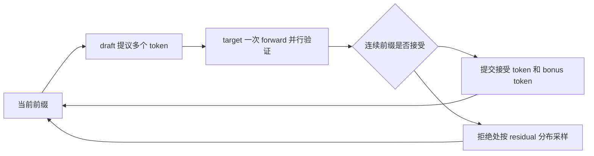
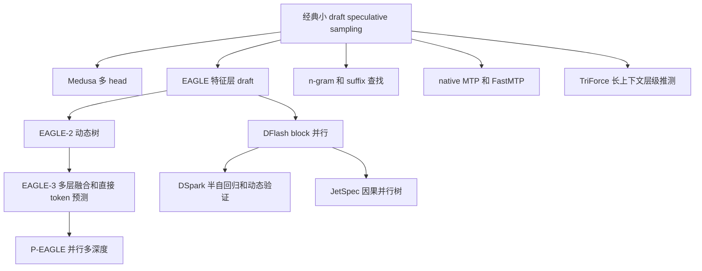
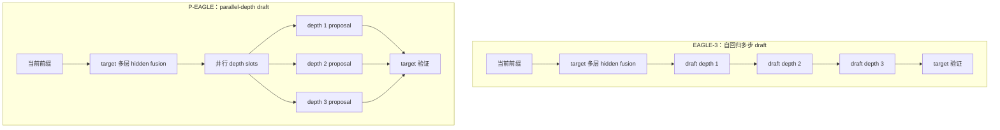
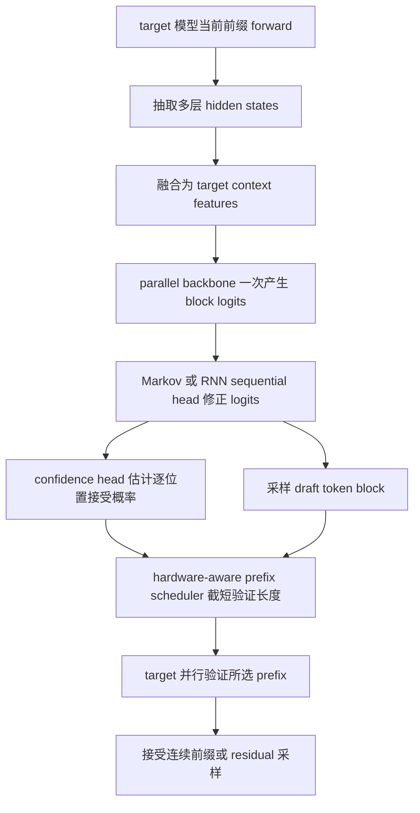
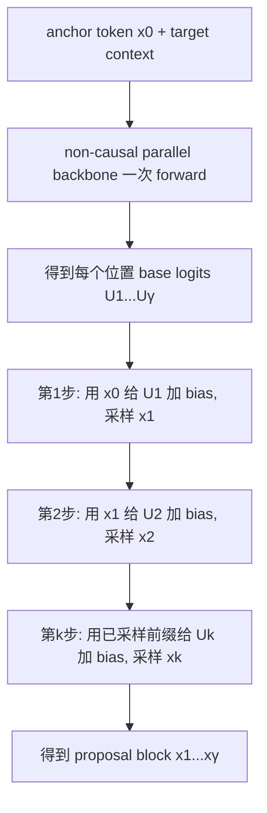
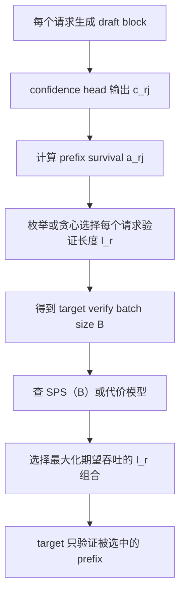
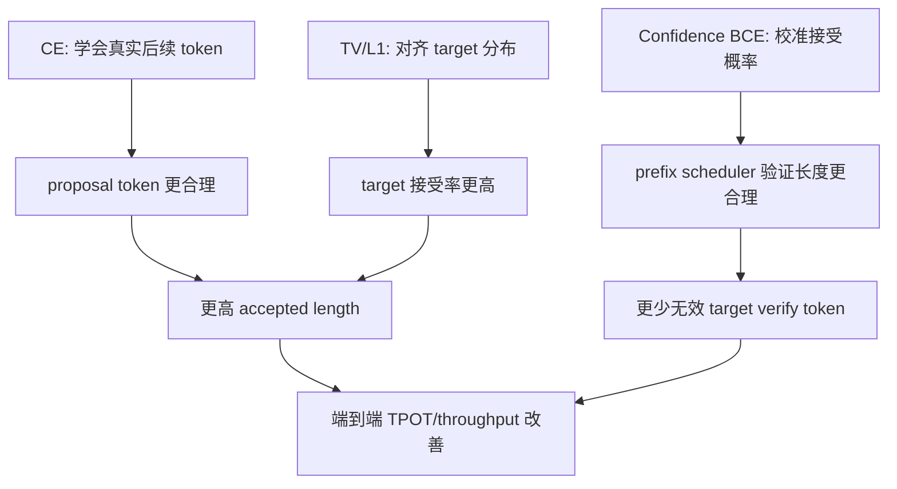
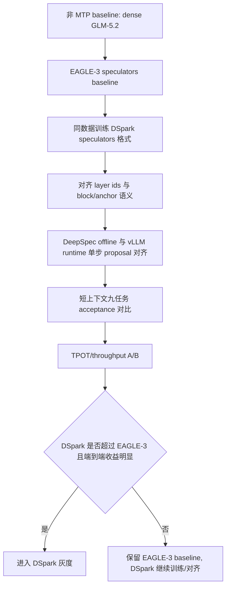

# 投机采样解码技术报告：原理、算法演进、测试对比与 GLM-5.2 选型

记录时间：2026-07-21 CST

## 1. 结论摘要

这份文档不是项目进展说明，而是对 speculative sampling / speculative decoding 技术的系统梳理。项目内的 GLM-5.2 和 DeepSpec/DSpark 数据只作为“先进模型上的实测案例”使用。

| 问题 | 结论 |
|---|---|
| 什么是投机采样解码 | 用一个更便宜的 draft / speculator 先提出多个 token，再让 target model 一次 forward 并行验证；采样场景通过 rejection sampling 和 residual sampling 保持目标模型分布不变。 |
| 加速来自哪里 | 自回归 decode 原本每个 token 要跑一次 target forward；投机解码把多 token 验证合并为一次 target forward。核心收益由 accepted length $\tau$、draft 成本和 verification 开销共同决定。 |
| 当前主流技术路线 | 小 draft model、prompt lookup / n-gram / suffix、Medusa、EAGLE 系列、native MTP / FastMTP、DFlash、DSpark、P-EAGLE、JetSpec、TriForce 等。 |
| 没有 native MTP 时的稳妥 baseline | EAGLE-3。开源工具链和 vLLM/speculators 支持最成熟，适合作为通用基线。 |
| 论文上限最高的方向 | DSpark、DFlash、JetSpec 这类 block-parallel / causal-parallel drafter。它们试图降低 draft latency，并扩大每轮可验证 token 数。 |
| GLM-5.2 当前最好方案 | 当前生产优先 **native MTP / NextN**。GLM-5.2 checkpoint 原生携带 MTP 权重，本仓库 vLLM runtime 已跑通，接受长度明显高于目前本地 DSpark 结果。 |
| DSpark 对 GLM-5.2 的定位 | 不是当前默认上线方案，但仍是最值得继续攻关的高上限路线。下一步应按 speculators/vLLM 原生格式重训，并用同一批 GLM-5.2 workload 与 native MTP 做 TPOT / throughput A/B。 |

一句话判断：

> 对 GLM-5.2 这类已经带 NextN/MTP 的先进 MoE/FP8 模型，当前最佳生产路线是 native MTP；从长期技术上限看，DSpark/JetSpec 代表的“并行 proposal + 更强因果建模 + 动态验证调度”更值得研究，但必须用 GLM-5.2 实测证明能超过 native MTP。

## 2. 资料来源

| 来源 | 使用方式 |
|---|---|
| 知乎文章《推测解码：速通medusa、eagle、dflash、HyperDFlash、dspark、JetSpec》 | 207 直连受限；参考 `contexts/207_169_shadow_to_141_main_sync.md` 后，通过 141 独立 headless Chrome 访问成功。本文参考其技术演进脉络。 |
| DeepSpec 本地代码 | 使用 `DeepSeek_technique/DeepSpec` 中 DSpark/EAGLE-3/DFlash 的配置、模型、loss、eval 代码理解实现细节。 |
| 本仓库 GLM-5.2 报告 | 使用 native MTP、RedHatAI DSpark、本地 DSpark step10000 等已有实测指标。 |
| speculators / vLLM 文档和源码 | 使用本地 `DeepSeek_technique/speculators` 和 `INfra_technique/vllm_v0.23.0` 判断工程成熟度。 |
| 公开论文和资料 | 参考 speculative decoding、speculative sampling、Medusa、EAGLE/EAGLE-3、DFlash、DSpark paper、FastMTP、P-EAGLE、TriForce、JetSpec、HyperDFlash 等。 |

## 3. 什么是投机采样解码

### 3.1 基本问题

标准大语言模型 decode 是自回归过程：

$$
p_{\theta}(x_{1:T}\mid x_0)=\prod_{t=1}^{T}p_{\theta}(x_t\mid x_0,x_{<t})
$$

每生成一个 token 都要完整跑一次 target model forward。对于大模型，单 token decode 常常受 HBM 访存、KV cache 和 batch 调度限制，GPU 算力利用不充分。

投机解码把一次生成拆成两个角色：

| 角色 | 作用 |
|---|---|
| draft / speculator | 便宜地提出多个候选 token。 |
| target / verifier | 使用原始大模型一次 forward 并行验证候选 token。 |

流程如下：



#### 3.1.1 target 一次 forward 如何并行验证多个 draft token

所谓“使用原始大模型一次 forward 并行验证候选 token”，不是让 target model 一次凭空生成多个 token，而是把 draft 已经提出的 token 当成一段已知输入接到当前前缀后面，让 target 用 causal mask 一次算出每个位置的 next-token 分布。

设当前前缀为：

$$
x_{1:t}=x_1,\ldots,x_t
$$

draft 一次提出 $K=4$ 个 token：

$$
d_{1:4}=d_1,d_2,d_3,d_4
$$

target 验证时构造输入：

$$
[x_1,\ldots,x_t,d_1,d_2,d_3,d_4]
$$

由于 Transformer causal mask 的限制，位置 $t+1$ 只能看 $x_{1:t}$ 和 $d_1$ 之前的信息，位置 $t+2$ 能看 $x_{1:t},d_1$，位置 $t+3$ 能看 $x_{1:t},d_1,d_2$，依此类推。因此一次 target forward 会同时给出这些验证分布：

| target 输出位置 | 用来验证 |
|---|---|
| 前缀最后位置 $t$ 的 logits | $p(d_1\mid x_{1:t})$，验证第 1 个 draft token |
| draft 第 1 个位置 $t+1$ 的 logits | $p(d_2\mid x_{1:t},d_1)$，验证第 2 个 draft token |
| draft 第 2 个位置 $t+2$ 的 logits | $p(d_3\mid x_{1:t},d_1,d_2)$，验证第 3 个 draft token |
| draft 第 3 个位置 $t+3$ 的 logits | $p(d_4\mid x_{1:t},d_1,d_2,d_3)$，验证第 4 个 draft token |
| draft 第 4 个位置 $t+4$ 的 logits | 若前 4 个都接受，用于采样 bonus token |

这里有一个常见的“错位”关系：第 $i$ 个 draft token $d_i$ 是用它前一个位置的 target logits 来验证的。这个机制和普通 teacher forcing / prefill 一样，只是这里输入的后半段来自 draft proposal。

greedy decoding 下，拒绝位置由 target top-1 决定。对每个位置从左到右比较：

$$
d_i \stackrel{?}{=} \arg\max_v p_i(v)
$$

第一个不相等的位置就是拒绝位置。例如：

| 位置 | draft token | target top-1 | 结果 |
|---|---|---|---|
| 1 | $d_1$ | $d_1$ | 接受 |
| 2 | $d_2$ | $d_2$ | 接受 |
| 3 | $d_3$ | $z_3$ | 拒绝 |

此时提交 $d_1,d_2$，在第 3 个位置提交 target top-1 $z_3$，丢弃 $d_3$ 及其后的所有 draft token。下一轮从新前缀 $x_{1:t},d_1,d_2,z_3$ 继续。

sampling decoding 下，拒绝位置由接受概率和随机数共同决定。第 $i$ 个 draft token $d_i$ 的接受概率为：

$$
A_i(d_i)=\min\left(1,\frac{p_i(d_i)}{q_i(d_i)}\right)
$$

其中 $p_i$ 是 target 在该位置的分布，$q_i$ 是 draft 生成 $d_i$ 时的分布。采样一个随机数：

$$
u_i\sim U(0,1)
$$

若 $u_i\le A_i(d_i)$，则接受；否则拒绝。第一个未通过该检验的位置就是拒绝位置。

| 位置 | draft token | $q_i(d_i)$ | $p_i(d_i)$ | $A_i(d_i)$ | $u_i$ | 结果 |
|---|---|---:|---:|---:|---:|---|
| 1 | $d_1$ | `0.30` | `0.45` | `1.00` | `0.62` | 接受 |
| 2 | $d_2$ | `0.20` | `0.10` | `0.50` | `0.31` | 接受 |
| 3 | $d_3$ | `0.40` | `0.04` | `0.10` | `0.73` | 拒绝 |

若第 $i$ 个位置拒绝，则接受 $d_{1:i-1}$，丢弃 $d_i$ 及后续 draft token，并在第 $i$ 个位置从 residual distribution 采样：

$$
r_i(v)=\frac{\max(0,p_i(v)-q_i(v))}
{\sum_u\max(0,p_i(u)-q_i(u))}
$$

后续 draft token 必须丢弃，因为它们是基于已经被拒绝的错误前缀生成的。若 $d_3$ 被拒绝，并从 residual 分布采样出 $r_3$，真实前缀变成 $d_1,d_2,r_3$；而 draft 的 $d_4$ 原本基于 $d_1,d_2,d_3$ 生成，前缀条件已经不同，因此不能继续使用。

如果所有 $K$ 个 draft token 都被接受，target 这次 forward 最后一个位置还给出了：

$$
p_{K+1}(v)=p(v\mid x_{1:t},d_{1:K})
$$

可以直接从该 target 分布采样或取 greedy top-1，得到一个额外 token，即 bonus token。它不是 draft token，而是 target 自己给出的下一个 token，因此不需要再验证。

### 3.2 Speculative decoding 和 speculative sampling 的区别

| 场景 | 验证方式 | 是否保持 target 分布 |
|---|---|---|
| Greedy decoding | draft token 等于 target top-1 就接受；遇到不同则回退到 target token。 | 保持 greedy 结果一致。 |
| Sampling decoding | 对 draft token 使用接受概率；拒绝时从 residual distribution 采样。 | 在理论采样算法成立、数值实现正确时，保持 target sampling 分布。 |

很多工程文档把两者统称 speculative decoding；严格讲，带 rejection/residual 的采样版才是 speculative sampling。

#### 3.2.1 对模型精度和输出质量的影响

投机解码本身不改 target model 的权重，也不是量化、剪枝或蒸馏；它改变的是 decode 调度方式。因此这里的“精度影响”主要指最终输出是否仍等价于 target model 原始 decode。

| 技术 | 理论影响 | 单次输出关系 | 主要风险 |
|---|---|---|---|
| Greedy speculative decoding | 不改变 target greedy 结果。 | 正确实现时应逐 token 等于普通 target greedy decode。 | top-1 比较、position id、attention mask、KV cache 或停止条件实现错误。 |
| Speculative sampling | 不改变 target sampling 分布。 | 单次文本不要求相同，但长期统计分布应等价于普通 target sampling。 | 接受概率、temperature/top-p、residual sampling、随机数和词表对齐实现错误。 |

greedy 场景下，target 本来输出：

$$
x_t=\arg\max_v p(v\mid x_{<t})
$$

draft 只是提前猜候选。验证时若 draft token 等于 target top-1 就接受；若不同，就丢弃 draft token，提交 target top-1。因此每个位置最终仍以 target top-1 为准，理论上 benchmark accuracy 应和不开投机完全一致。

sampling 场景下，target 原本从：

$$
x_t\sim p(\cdot\mid x_{<t})
$$

采样。若直接使用 draft 分布 $q$ 的样本，会改变输出分布。speculative sampling 通过接受概率：

$$
A(x)=\min\left(1,\frac{p(x)}{q(x)}\right)
$$

和拒绝时的 residual distribution：

$$
r(v)=\frac{\max(0,p(v)-q(v))}
{\sum_u\max(0,p(u)-q(u))}
$$

把最终采样分布校正回 target 分布 $p$。所以正确实现时，它是 lossless sampling acceleration：单次输出可能不同，但分布不应偏离 target sampling。

需要区分两类问题：

| 问题 | 影响 |
|---|---|
| draft / speculator 训练差 | 接受率低、加速比低；只要 target 严格验证，理论上不降质。 |
| 验证或采样实现不等价 | 会改变输出分布，可能导致精度或质量回归。 |

常见工程风险如下：

| 风险点 | 可能后果 |
|---|---|
| draft 和 target tokenizer / vocab 对齐错误 | 接受概率无意义，输出可能错误。 |
| tree attention mask 或 causal mask 错误 | target 验证看到不该看的兄弟节点或未来 token，破坏分布。 |
| position id / RoPE offset 错误 | 长上下文或多 token 验证 logits 偏移，精度下降。 |
| KV cache 拼接、裁剪、回滚错误 | 后续 token 基于错误历史生成。 |
| temperature、top-p、top-k 在 $p$ 和 $q$ 上处理不一致 | 接受概率不再对应同一个采样空间。 |
| residual sampling 省略或近似错误 | sampling 分布偏向 draft 或 target 的错误剩余质量。 |
| bonus token 提交逻辑错误 | 多提交、少提交或提交了未按 target 分布采样的 token。 |
| 使用 confidence-only accept / relaxed accept | 不再是 lossless，会用速度换分布偏差。 |

因此，标准 speculative decoding / sampling 的目标是 **lossless acceleration**：draft 只负责提出候选，最终结果仍由 target 的 greedy 决策或 target sampling 分布决定。若线上或评测中发现 accuracy drop，优先排查验证路径、mask、KV、position、采样归一化和停止条件，而不是先归因于 draft 模型能力不足。

## 4. 投机采样核心公式

设 target 分布为 $p(\cdot)$，draft 分布为 $q(\cdot)$。在当前前缀 $x_{<t}$ 下，draft 一次提出 $K$ 个 token：

$$
\tilde{x}_{t:t+K-1}\sim \prod_{i=1}^{K}q_i(\tilde{x}_{t+i-1}\mid x_{<t},\tilde{x}_{t:t+i-2})
$$

target 并行计算每个位置的验证分布：

$$
p_i(v)=p(v\mid x_{<t},\tilde{x}_{t:t+i-2})
$$

第 $i$ 个 draft token 的接受概率为：

$$
A_i(\tilde{x}_i)=\min\left(1,\frac{p_i(\tilde{x}_i)}{q_i(\tilde{x}_i)}\right)
$$

如果第 $i$ 个 token 被拒绝，则从 residual distribution 采样：

$$
r_i(v)=\frac{\max(0,p_i(v)-q_i(v))}
{\sum_{u\in\mathcal{V}}\max(0,p_i(u)-q_i(u))}
$$

如果 $K$ 个 draft token 全部接受，则 target 再从：

$$
p_{K+1}(v)=p(v\mid x_{<t},\tilde{x}_{t:t+K-1})
$$

采样一个 bonus token。这个 bonus token 是很多评测里 accepted length 包含的那个 $+1$。

平均每轮提交 token 数记为 $\tau$：

$$
\tau = 1 + \sum_{i=1}^{K}\Pr(\tilde{x}_{1:i}\text{ 全部被接受})
$$

端到端每 token 延迟可以粗略写成：

$$
L_{\text{token}}
\approx
\frac{T_{\text{draft}}(K)+T_{\text{verify}}(K')+T_{\text{schedule}}}{\tau}
$$

| 符号 | 含义 |
|---|---|
| $K$ | draft 最多提议 token 数。 |
| $K'$ | 实际进入 target verification 的 token 数，可能被 confidence scheduler 截短。 |
| $\tau$ | accepted length，每轮平均提交 token 数。 |
| $T_{\text{draft}}$ | draft 生成 proposal 的耗时。 |
| $T_{\text{verify}}$ | target 批量验证 proposal 的耗时。 |
| $T_{\text{schedule}}$ | 调度、KV、采样和 batch 扩展开销。 |

关键含义：投机解码不是只追求更长的 proposal。若 draft 太慢、验证太多低概率 suffix、或 $\tau$ 不高，端到端 TPOT 仍可能没有收益。

## 5. 评价指标

| 指标 | 含义 | 用途 |
|---|---|---|
| `accept_len` / $\tau$ | 每轮平均提交 token 数，通常包含 target bonus token。 | 离线质量核心指标。 |
| `accept_rate@k` | 第 $k$ 个 proposal token 的接受率或分布重叠度。 | 判断 block 后段是否退化。 |
| `verify_rate` | 有效提交 token 与验证 token 的比例。 | 判断 target batch 容量是否被浪费。 |
| TPOT | Time Per Output Token，用户感知 decode 延迟。 | 生产最终指标。 |
| throughput | 单位时间生成 token 或请求数。 | 高并发服务指标。 |
| 精度/质量回归 | 输出分布或 greedy 结果是否与 target 对齐。 | 防止工程实现破坏 lossless 假设。 |

训练期常见的分布重叠指标为：

$$
\operatorname{overlap}(p,q)
= 1-\operatorname{TV}(p,q)
=1-\frac{1}{2}\sum_{v\in\mathcal{V}}|p(v)-q(v)|
=\sum_{v\in\mathcal{V}}\min(p(v),q(v))
$$

这个值越高，draft 和 target 在该位置的分布越接近，理论接受概率越高。

### 5.1 TV 和 overlap 的含义

这里的 $\operatorname{TV}(p,q)$ 是 Total Variation distance，中文通常叫总变差距离，用来衡量两个概率分布相差多远：

$$
\operatorname{TV}(p,q)=\frac{1}{2}\sum_{v\in\mathcal{V}}|p(v)-q(v)|
$$

| 符号 | 含义 |
|---|---|
| $p$ | target model 在当前位置的 token 分布。 |
| $q$ | draft / speculator 在同一位置的 token 分布。 |
| $\mathcal{V}$ | 词表。 |
| $\operatorname{TV}(p,q)$ | 两个分布的距离；越小表示越接近。 |
| $\operatorname{overlap}(p,q)$ | 两个分布重叠的概率质量；越大表示越接近。 |

$\frac{1}{2}$ 的作用是避免重复计算概率质量移动。若某个 token 上 $p$ 比 $q$ 多出来一部分概率，必然会在其它 token 上少掉同样的概率；直接求 $\sum_v |p(v)-q(v)|$ 会把“多出来”和“少掉”各算一次，所以要除以 2。

TV 和 overlap 的关系是：

$$
\operatorname{overlap}(p,q)=1-\operatorname{TV}(p,q)
=\sum_{v\in\mathcal{V}}\min(p(v),q(v))
$$

也就是说，overlap 就是两个分布在每个 token 上共同拥有的概率质量。

示例：假设词表只有三个 token，target 分布 `p` 与 draft 分布 `q` 如下：

| token | target p | draft q | min(p, q) | abs(p - q) |
|---|---:|---:|---:|---:|
| A | $0.5$ | $0.4$ | $0.4$ | $0.1$ |
| B | $0.3$ | $0.1$ | $0.1$ | $0.2$ |
| C | $0.2$ | $0.5$ | $0.2$ | $0.3$ |

则：

$$
\operatorname{TV}(p,q)=\frac{1}{2}(0.1+0.2+0.3)=0.3
$$

$$
\operatorname{overlap}(p,q)=0.4+0.1+0.2=0.7=1-\operatorname{TV}(p,q)
$$

在 speculative decoding / sampling 中，TV 越小、overlap 越大，说明 draft 分布越贴近 target 分布，该位置的 draft token 越容易被 target 接受。它主要用于衡量 speculator 训练质量和各 depth 的退化情况；但最终线上收益仍要结合 `accept_len`、draft latency、target verification 开销和调度成本一起看。

## 6. 技术演进图



可以从两个维度理解这些方法：

| 维度 | 代表方法 | 核心取舍 |
|---|---|---|
| draft 来源 | 小模型、Medusa、EAGLE、MTP、DFlash、DSpark | 越贴近 target，接受率越高；越轻量，draft latency 越低。 |
| proposal 并行度 | 自回归、multi-head、block-parallel、tree-parallel | 并行度越高，draft latency 越低；但位置间因果依赖越难建模。 |
| 验证策略 | 固定长度、动态树、confidence scheduler | 验证越长可能 $\tau$ 越高，但也更消耗 target batch 容量。 |
| 适用场景 | 通用聊天、代码、数学、RAG、长上下文 | 任务越结构化，proposal 越容易被接受。 |

## 7. 主流技术横向对比

### 7.1 技术演进时间线

下面按公开论文 / 技术报告 / GitHub 首次公开的大致时间排序。时间主要依据 arXiv 编号、论文页和开源仓库记录；团队名按公开资料中的代表团队或项目组织标注，部分新论文仍以论文作者团队 / GitHub 组织为准。


时间线可以粗略分成四个阶段：

| 阶段 | 时间 | 代表方法 | 核心变化 |
|---|---|---|---|
| 小 draft 模型阶段 | 2022-2023 | Speculative Decoding / Speculative Sampling | 用较小 draft model 先提议 token，target 一次 forward 并行验证。 |
| 多 head / feature drafter 阶段 | 2024 | Medusa、EAGLE、EAGLE-2 | 从独立小模型转向外挂 head 或 feature-level drafter，并开始优化验证树。 |
| 模型原生与成熟 EAGLE 阶段 | 2024-2025 | native MTP / NextN、EAGLE-3、FastMTP | 一方面模型自身带 MTP head，另一方面 EAGLE-3 成为成熟外部 speculator baseline。 |
| block-parallel / scheduler 阶段 | 2026 起 | DFlash、DSpark、P-EAGLE、JetSpec、HyperDFlash | 重点转向降低 draft latency、并行生成 block/tree proposal，并用 confidence / scheduler 减少无效验证。 |

| 方法 | 提出时间 | 代表团队 / 公开归属 | 备注 |
|---|---|---|---|
| Speculative Decoding | 2022-11 | Google Research | `Fast Inference from Transformers via Speculative Decoding`。 |
| Speculative Sampling | 2023-02 | DeepMind | `Accelerating Large Language Model Decoding with Speculative Sampling`。 |
| Medusa | 2024-01 | Medusa authors / LMSYS ecosystem | 多 decoding heads + tree attention。 |
| EAGLE | 2024-01 | SafeAILab | feature-level speculative sampling。 |
| TriForce | 2024-04 | CMU / Meta 等 | 长上下文层级 speculative decoding。 |
| EAGLE-2 | 2024-06 | SafeAILab | 动态 draft tree。 |
| native MTP / NextN | 2024-12 起 | DeepSeek-AI 等模型团队 | 以 DeepSeek-V3/GLM/Qwen 等模型原生 MTP/NextN 路线为代表。 |
| EAGLE-3 | 2025-03 | SafeAILab | 多层 feature fusion + direct token prediction。 |
| FastMTP | 2025-09 | Tencent BAC | 对 native MTP head 做增强微调。 |
| P-EAGLE | 2026-02 | P-EAGLE 作者团队 / Red Hat AI 生态 | 将 EAGLE-3 多 depth draft 并行化。 |
| DFlash | 2026-02 | DFlash 作者团队 / z-lab | block diffusion / non-causal block drafter。 |
| DSpark | 2026 | DeepSeek-AI / DeepSpec | 在 DFlash 式 parallel backbone 上加 sequential head 和 confidence scheduler。 |
| JetSpec | 2026-06 | Hao AI Lab 等 | parallel tree drafting + Tree-Causal Mask。 |
| HyperDFlash | 2026-06 | HyperDFlash 作者团队 | 针对 Hyper-Connection 架构的 block speculative decoding。 |

| 技术 | 关键创新 | 重点机制或公式 | 优点 | 主要限制 |
|---|---|---|---|---|
| 小 draft model | 用小模型先生成 $K$ 个 token，target 批量验证。 | 接受概率 $\min(1,p/q)$ 和 residual sampling。 | 原理最清晰，分布无损证明完整。 | 小模型仍自回归；tokenizer 和分布偏移会拉低接受率。 |
| prompt lookup / n-gram | 从 prompt 或历史文本中查找重复片段，直接提议后续 token。 | 后缀匹配：若 suffix 出现在上下文，取其后续 token 作为 proposal。 | 不训练、低风险、对 RAG/代码模板有效。 | 泛化弱，重复率低时收益接近 0。 |
| suffix decoding | 用全局或请求级 suffix tree 复用历史输出。 | 对历史后缀做最长匹配并提议 continuation。 | 重复请求、模板化服务有收益。 | 依赖业务重复率，通用任务不稳定。 |
| Medusa | 在 target 顶部加多个轻量 head，一次预测多个未来位置，并用 tree attention 验证多路径。 | $q_k(x_{t+k}\mid h_t)=\operatorname{softmax}(W_k f_k(h_t))$。 | 不需要独立小模型，部署比双模型简单。 | 各 head 独立预测，远位置质量下降；tree verification 占 batch。 |
| EAGLE | 在 feature 层做自回归 draft，复用 target embedding/lm head。 | 用 target second-to-top feature 和前一 token 预测下一 feature/token。 | 比直接 token head 更准，公开结果 2x 级以上。 | draft 仍有自回归成本，早期静态树浪费分支。 |
| EAGLE-2 | 根据 draft confidence 动态构造验证树。 | 用路径概率排序，优先扩展高置信节点。 | 减少低概率分支验证浪费。 | 仍受 feature prediction 上限限制。 |
| EAGLE-3 | 取消 feature distribution 数值约束，改为多层 feature fusion + direct token prediction，并引入 training-time test。 | $z_t=W[H_t^{(l_1)};\ldots;H_t^{(l_m)}]$，直接优化 token/KL。 | 通用 baseline 成熟，vLLM/speculators 支持好。 | draft 仍逐步生成，极限 draft latency 不如 block-parallel。 |
| native MTP / NextN | 模型预训练时自带 multi-token prediction head。 | 多步损失 $\mathcal{L}_{\text{MTP}}=\sum_k \lambda_k CE(x_{t+k},q_k)$。 | 与 target 同 tokenizer/embedding/lm head，集成风险低。 | 只适用于带 MTP 的模型；head 能力受预训练质量限制。 |
| FastMTP | 对 native MTP head 做自蒸馏微调和动态词表压缩。 | 常用指数步权重 $\lambda_k\propto\beta^{k-1}$。 | 微调成本小，可提升原生 MTP。 | 仍受 native MTP 架构限制。 |
| DFlash | 用 block diffusion / non-causal block drafter 单次 forward 生成整块 proposal。 | 通过 target hidden context 注入和 mask token 并行预测 block。 | proposal 并行度高，公开摘要称 over 6x lossless acceleration。 | block 内独立性导致 suffix acceptance decay；工程较新。 |
| DSpark | 在 DFlash 式并行 backbone 后加轻量 sequential/Markov head，并用 confidence-scheduled verification。 | 半自回归分解 + TV acceptance label + 硬件感知 prefix scheduler。 | 兼顾并行 draft 和位置依赖，论文及线上系统结果强。 | 对训练数据、hidden layer、runtime 语义和 scheduler 极敏感。 |
| P-EAGLE | 将 EAGLE-3 的多个预测深度并行化，用 COD 降训练内存。 | 每个 anchor 同时预测多个 depth。 | 减少 autoregressive EAGLE draft latency。 | 新技术，生产成熟度低于 EAGLE-3。 |
| JetSpec | 用 Tree-Causal Mask 在单次 forward 中并行预测整棵 draft tree，同时保持路径因果条件。 | $M_{v,u}=0$ 若 $u\in Anc(v)\cup\{v\}$，否则 $-\infty$。 | 尝试统一 DFlash 的并行效率和 EAGLE 的路径条件质量。 | 很新，GLM-5.2 本地暂无代码和 checkpoint。 |
| HyperDFlash | 针对 Hyper-Connection 架构修正 DFlash 的结构失配。 | gated residual reduction 等结构对齐。 | 说明 advanced architecture 需要架构感知 speculator。 | 深度绑定特定模型族，通用性待验证。 |
| TriForce | 面向长上下文的层级 speculative decoding。 | 层级 draft + 稀疏 KV / retrieval cache。 | 解决长上下文 KV 带宽瓶颈。 | 工程复杂，和当前 GLM-5.2 主线距离较远。 |

## 8. 代表技术关键点

### 8.1 小 draft model

经典 speculative sampling 使用一个更小、同 tokenizer 或兼容 tokenizer 的模型作为 draft。它的强项是理论完整，弱项是 draft 仍要串行生成：

$$
T_{\text{draft}}(K)\approx K\cdot T_{\text{small}}
$$

当 target 很大、小模型足够快且分布接近时收益明显；如果小模型和 target 分布差距大，$\tau$ 会快速下降。

### 8.2 Medusa

Medusa 的核心是“不再部署独立 draft model”，而是在 target 最后 hidden state 上加多个预测头：

$$
q_k(\cdot\mid x_{\le t})=\operatorname{softmax}(W_k f_k(h_t))
$$

每个 head 预测不同未来位置，再用候选树和 tree attention 一次验证多条路径。

| 创新 | 解释 |
|---|---|
| Multi-head proposal | 多个 head 并行预测未来 token，减少 draft 自回归成本。 |
| Tree attention | 将多个候选 continuation 组织成树，让 target 一次验证多路径。 |
| Self-distillation | 可用 target 自生成数据训练 head。 |

主要问题是各 head 对不同未来位置独立建模，无法自然表达 $x_{t+k}$ 对 $x_{t+1:t+k-1}$ 的依赖，所以远位置接受率下降。

### 8.3 EAGLE 系列

EAGLE 的出发点是：预测连续 hidden feature 比直接预测离散 token 更容易。典型形式是：

$$
\hat{h}_{t+1}=D_{\phi}(h_t,e(x_t)),\quad
q(x_{t+1})=\operatorname{softmax}(W_{\text{lm}}\hat{h}_{t+1})
$$

EAGLE-2 进一步发现不同上下文的接受率差异很大，因此把固定验证树改成动态树。

EAGLE-3 的关键变化是：不再强制 draft 输出拟合 target feature 的数值分布，而是融合多层 target feature 后直接预测 token：

$$
z_t=W_z[H_t^{(l_1)};H_t^{(l_2)};\ldots;H_t^{(l_m)}]
$$

#### 8.3.1 EAGLE-3 公式符号说明

这里的 $H_t^{(l_m)}$ 表示 target model 在位置 $t$、第 $l_m$ 层输出的 hidden state。它不是 token id，也不是最终 softmax 概率，而是 target transformer 某一层对当前位置前缀上下文的连续向量表示。

| 符号 | 含义 |
|---|---|
| $t$ | 当前预测位置。若前缀为 $x_{1:t}$，则该位置的 hidden state 汇总了 target model 对当前上下文的表示。 |
| $l_m$ | 被选中的第 $m$ 个 target layer 编号。例如可以取浅层、中层、深层若干层，而不是只取最后一层。 |
| $H_t^{(l_m)}$ | target model 第 $l_m$ 层在位置 $t$ 的 hidden state 向量，维度通常是 target hidden size。 |
| $[H_t^{(l_1)};H_t^{(l_2)};\ldots;H_t^{(l_m)}]$ | 把多个 target layer 在同一位置 $t$ 的 hidden state 沿特征维拼接，形成多层融合输入。 |
| $W_z$ | 线性投影矩阵，把拼接后的多层 hidden state 映射到 EAGLE-3 drafter 使用的表示空间。 |
| $z_t$ | EAGLE-3 用于直接预测后续 token 的融合特征。 |

直观理解：EAGLE / EAGLE-2 更像是让 draft 学“target 某一层 feature 下一步应该长什么样”；EAGLE-3 则把 target 的多层信息作为条件，直接学习“在这些 target 特征条件下，下一个 token 应该是什么”。多层 $H_t^{(l_i)}$ 同时提供不同粒度的信息：浅层更偏词面和局部模式，中层更偏句法和局部语义，深层更接近最终决策所需的语义与任务信息。这样做可以减少单层 feature regression 对 draft 表达能力的限制。

#### 8.3.2 EAGLE-3 是否仍使用 target LM head

EAGLE-3 仍然像 EAGLE / EAGLE-2 一样复用 target model 的 embedding 和 LM head。它的变化不在于换掉 target LM head，而在于 drafter 中间表示的训练目标不同：EAGLE / EAGLE-2 更强调预测 target 某层 feature，EAGLE-3 则不再强制 draft 输出拟合 target feature 的数值分布，而是融合多层 target hidden states 后直接优化 token prediction。

| 方法 | drafter 学什么 | 最后怎么出 token 分布 |
|---|---|---|
| EAGLE | 预测 target 某层 feature，例如下一步 hidden state。 | 接 target LM head 得到 token logits。 |
| EAGLE-2 | 仍是 EAGLE 风格 feature prediction，但验证树从固定变成动态。 | 接 target LM head 得到 token logits。 |
| EAGLE-3 | 融合多层 target hidden states，不再强制数值拟合某一层 target feature，而是直接优化 token prediction。 | 仍接 target LM head / token head 得到 token logits。 |

继续使用 target LM head 的原因：

| 原因 | 说明 |
|---|---|
| 词表空间必须一致 | speculative decoding 最后要让 target 验证 draft token。drafter 输出的 token 必须和 target tokenizer / vocab 完全一致，复用 target LM head 可以天然保证输出空间对齐。 |
| 减少训练难度和参数量 | LM head 通常很大，尤其是大词表模型。复用 target LM head 后，drafter 主要学习轻量 feature / hidden 表示，不需要重新学习完整 vocab projection。 |
| 保持 token 概率口径接近 target | EAGLE 系列的核心假设是：如果 drafter 的 hidden representation 能落到 target LM head 可解释的空间里，那么通过同一个 LM head 得到的 token 分布会更接近 target。 |

因此，EAGLE-3 没有抛弃 target LM head；它抛弃的是“必须数值拟合 target feature distribution / feature regression”的训练约束。

这避免了 feature regression 约束 draft 表达力的问题。speculators 文档也把 EAGLE-3 作为更成熟的默认算法之一。

### 8.4 native MTP / NextN / FastMTP

MTP 是模型自身带的 multi-token prediction head。与外部 drafter 不同，它通常共享 target 的 tokenizer、embedding 和 lm head。

一个典型 MTP step 可以抽象为：

$$
h_{t,k}=D_k\left(P\left([\operatorname{Norm}(h_t),\operatorname{Norm}(e(x_{t+k-1}))]\right)\right)
$$

$$
q_k(x_{t+k})=\operatorname{softmax}(W_{\text{lm}}h_{t,k})
$$

FastMTP 风格微调常对不同预测步使用指数衰减权重：

$$
\lambda_k=\frac{\beta^{k-1}}{\sum_{j=1}^{K}\beta^{j-1}},\quad
\mathcal{L}_{\text{MTP}}=\sum_{k=1}^{K}\lambda_k CE(x_{t+k},q_k)
$$

对于 GLM-5.2 这类已经携带 NextN/MTP 权重的模型，这条路线的工程风险最低。

#### 8.4.1 MTP / NextN 是否是动态树，FastMTP 做了什么

native MTP / NextN 本身不是 EAGLE-2 那种动态验证树方法。它首先是一组模型原生的 multi-token prediction head：在同一个 target hidden state 条件下，预测未来多个固定 depth 的 token 分布。

| 方法 | proposal 形态 | 是否天然动态树 | 重点 |
|---|---|---|---|
| EAGLE-2 | drafter 逐步扩展候选路径，再按置信度动态构造验证树。 | 是 | 动态分配 target verification 的树节点预算。 |
| native MTP / NextN | 原生 head 预测未来第 `1..K` 个 token。 | 否 | 低成本地产生固定 depth 的多 token proposal。 |
| FastMTP | 对原生 MTP head 做后训练 / 蒸馏 / 权重重分配等改造。 | 否，核心不在树。 | 提升 MTP proposal 质量，并降低远位置预测拖累。 |

可以把 MTP / NextN 理解成“线性多步 proposal”：

```text
当前前缀 x_{1:t}
  -> MTP head 预测 x_{t+1}
  -> MTP head 预测 x_{t+2}
  -> ...
  -> MTP head 预测 x_{t+K}
```

runtime 可以把这些 proposal 交给 target 做标准 speculative verification。验证阶段当然也可以被工程实现包装成树或多候选结构，但这不是 MTP head 的核心定义；MTP 的关键是模型自己带了未来多步预测能力，而不是像 EAGLE-2 一样研究“验证树怎么动态扩展”。

FastMTP 的目标是让已有 native MTP / NextN head 更好用。原生 MTP 常见问题是：第 1 步预测比较准，越往后的 depth 越难，远位置 token 更容易错误；如果训练时所有 depth 权重处理不好，远位置损失会拖累近位置，或者近位置太强、远位置几乎不可用。

因此 FastMTP 风格方法通常做几类事情：

| 改动 | 作用 |
|---|---|
| 多步损失重新加权 | 让近位置保持稳定，同时给远位置足够学习信号。 |
| 自蒸馏 / target 蒸馏 | 用 target 自身或更高质量轨迹校准 MTP head 的分布。 |
| 动态词表压缩 / 候选裁剪 | 减少大词表 softmax 或远位置训练的无效计算，把学习集中在更可能的 token 集合。 |
| 推理侧动态截断 | 根据 MTP 置信度只验证可靠 prefix，避免低质远位置浪费 target verification。 |

文档中的指数权重公式：

$$
\lambda_k=\frac{\beta^{k-1}}{\sum_{j=1}^{K}\beta^{j-1}},\quad
\mathcal{L}_{\text{MTP}}=\sum_{k=1}^{K}\lambda_k CE(x_{t+k},q_k)
$$

表达的是：第 $k$ 个未来 token 的训练损失用 $\lambda_k$ 加权。若 $0<\beta<1$，越远的预测步权重越小：

$$
\lambda_1>\lambda_2>\cdots>\lambda_K
$$

这样做的直觉是：近位置最常被接受，对实际加速最稳定；远位置虽然能提高上限，但噪声更大，不应让它主导训练。

因此，FastMTP 不是“把 MTP 变成动态树”，而是围绕 MTP head 的训练目标和推理使用方式做优化：让各 depth 的分布更接近 target、让可接受 prefix 更长，并在必要时通过置信度截断减少无效验证。

#### 8.4.2 MTP 是否一直使用同一个 $h_t$，和 Medusa 有什么区别

“在同一个 target hidden state 条件下，预测未来多个固定 depth 的 token 分布”容易被误解成：MTP / NextN 对所有未来 token 都只用同一个 $h_t$ 独立预测。更准确的说法是：MTP 以当前 target hidden state $h_t$ 作为 anchor，不再为每个未来位置重新跑完整 target transformer；但预测第 $k$ 个未来 token 时，通常还会引入前一个 token embedding 或 MTP step 的中间状态，补充局部条件。

文档中的抽象公式：

$$
h_{t,k}=D_k\left(P\left([\operatorname{Norm}(h_t),\operatorname{Norm}(e(x_{t+k-1}))]\right)\right)
$$

可以理解为：

| 输入 | 作用 |
|---|---|
| $h_t$ | 当前前缀 $x_{1:t}$ 经过 target model 后得到的全局语义 anchor。 |
| $e(x_{t+k-1})$ | 预测第 $k$ 步时，前一个 token 的 embedding，提供局部 token 条件。 |
| $P(\cdot)$ | 把 $h_t$ 和前一个 token embedding 融合并投影回 hidden 空间。 |
| $D_k(\cdot)$ | 第 $k$ 个 MTP / NextN 模块，构造未来第 $k$ 步 hidden 表示。 |
| $h_{t,k}$ | 用来预测 $x_{t+k}$ 的未来 hidden 表示。 |

因此，预测 $x_{t+k}$ 时确实仍使用 $h_t$，但通常不是只使用 $h_t$。一个直观推理链是：

```text
target 正常 forward 得到 h_t

MTP step 1:
  h_t + e(x_t)       -> 预测 x_{t+1}

MTP step 2:
  h_t + e(x_{t+1})   -> 预测 x_{t+2}

MTP step 3:
  h_t + e(x_{t+2})   -> 预测 x_{t+3}
```

训练时，$x_{t+1},x_{t+2}$ 可以来自真实 token；推理时，则来自 MTP / draft 已经提出并准备验证的 token。MTP 省掉的是每一步完整 target transformer 更新：

$$
h_t \rightarrow h_{t+1} \rightarrow h_{t+2}\rightarrow\cdots
$$

它用轻量模块近似未来状态：

$$
(h_t,e(x_t))\rightarrow h_{t,1},\quad
(h_t,e(x_{t+1}))\rightarrow h_{t,2},\quad
(h_t,e(x_{t+2}))\rightarrow h_{t,3}
$$

所以 MTP 不是完全缺少上下文，而是缺少完整 target 自回归更新后的上下文。它保留了当前前缀的全局 anchor $h_t$，再用前一 token embedding 补局部依赖；这比完整 target decode 便宜，也因此仍然只是 proposal，必须交给 target verification。

它和 Medusa 的关系可以这样区分：

| 对比项 | Medusa | native MTP / NextN |
|---|---|---|
| 来源 | 外挂多个 prediction heads。 | 模型原生携带的 multi-token prediction / NextN 模块。 |
| 基本条件 | 多个 head 多数从同一个 target hidden state 预测不同未来 depth。 | 以 $h_t$ 为 anchor，同时可引入前一 token embedding 或 step module 状态。 |
| 未来位置依赖 | 早期 Medusa 更偏多个 head 独立预测未来位置，远 depth 容易退化。 | MTP / NextN 通常通过 $e(x_{t+k-1})$、$D_k$ 或递推结构引入局部依赖。 |
| 训练阶段 | 通常作为外部 speculator 后训练。 | 可能在模型预训练、后训练或 checkpoint 原生训练中一起得到。 |
| 工程口径 | 外挂 speculator，需要额外 checkpoint / runtime 支持。 | target checkpoint 原生能力，tokenizer、embedding、LM head 对齐风险更低。 |

如果某个实现退化成：

$$
q_k(x_{t+k})=\operatorname{softmax}(W_kh_t)
$$

也就是每个未来 depth 都只靠同一个 $h_t$ 和独立 head 预测，那么它确实会很接近 Medusa 式多 head proposal。文档中的 MTP 抽象式更强调 NextN / native MTP 的 step 条件：未来第 $k$ 步并非完全独立，它至少能看到当前 anchor 和前一个 token。

一句话：MTP / NextN 使用 $h_t$ 作为固定语义 anchor，但不等于只用 $h_t$ 独立预测所有未来 token；它通过前一 token embedding / MTP step 模块补局部上下文。相比 Medusa，它通常更贴近模型原生训练和 target 表示空间；相比完整 target 自回归，它仍缺少真实 $h_{t+1},h_{t+2}$ 的完整 transformer 更新，因此必须做 speculative verification。

### 8.5 DFlash

DFlash 解决的是 EAGLE 类 draft 自回归成本问题。它用 block diffusion / non-causal block drafter 一次 forward 生成整段 proposal。

target 多层 hidden states 融合为 context：

$$
H_{\text{ctx}}=\operatorname{RMSNorm}(W_c[H^{(l_1)};\ldots;H^{(l_m)}])
$$

然后在 draft 层中把 context features 注入 key/value：

$$
K_i=[W_i^K H_{\text{ctx}};W_i^K H_d],\quad
V_i=[W_i^V H_{\text{ctx}};W_i^V H_d]
$$

DFlash 的问题也来自这个优势：block 内 token 同时预测，不天然依赖前面实际采样到的 token，容易出现多模态组合错误，例如“of course”和“no problem”混成“of problem”。

#### 8.5.1 block diffusion / non-causal block drafter 是什么意思

EAGLE 类方法的 draft 过程仍然带自回归成本。即使 EAGLE 的 drafter 比 target model 小很多，它生成 $K$ 个 proposal token 时通常仍要一步一步往前滚：

```text
当前前缀 x_{1:t}
  -> draft step 1 生成 d_1
  -> draft step 2 基于 d_1 生成 d_2
  -> draft step 3 基于 d_1,d_2 生成 d_3
  -> ...
  -> draft step K 生成 d_K
```

这意味着 draft latency 近似随 proposal 长度增长：

$$
T_{\text{draft}}(K)\approx K\cdot T_{\text{small-step}}
$$

如果 $K$ 变大，target verification 虽然仍然可以一次 forward 并行验证，但 draft 本身已经花了多步时间。DFlash 要解决的就是这个瓶颈：让 drafter 不再逐 token 自回归生成，而是在一个 block 内一次 forward 直接给出多个位置的 proposal。

可以把 DFlash 的 proposal 过程理解为：

```text
当前前缀 x_{1:t}
  -> target 抽取多层 hidden states 作为上下文 H_ctx
  -> DFlash drafter 放入长度为 gamma 的空 block / mask block
  -> 一次 forward 并行预测 block 内 gamma 个位置的 logits
  -> 采样得到 d_1,d_2,...,d_gamma
  -> target 再验证这个 proposal block
```

其中 $\gamma$ 是 block size，例如一次提议 `4`、`8` 或更多 token。此时 draft latency 更接近：

$$
T_{\text{draft}}(\gamma)\approx T_{\text{block-forward}}
$$

而不是 $\gamma$ 次小 step 相加。

“non-causal block drafter”指的是：在 draft block 内，位置之间不严格按普通自回归 causal mask 一步一步生成。普通自回归要求：

$$
q(d_1,d_2,\ldots,d_\gamma\mid x)
=\prod_{k=1}^{\gamma}q_k(d_k\mid x,d_{<k})
$$

也就是第 $k$ 个 token 必须等前面 $d_{<k}$ 已经确定后才能预测。DFlash 更像并行预测：

$$
q(d_{1:\gamma}\mid x,H_{\text{ctx}})
\approx \prod_{k=1}^{\gamma}q_k(d_k\mid x,H_{\text{ctx}},\text{block features})
$$

这里每个位置主要依赖当前前缀和 target context features，而不是严格依赖前面已经采样出来的 draft token。因此它可以并行，但也会牺牲一部分 block 内因果一致性。

“block diffusion”里的 diffusion 可以理解成一种 block 级并行生成思路：先把未来一段位置看成待生成的 block，用 mask / noise / latent 表示初始化，然后通过一个并行 drafter 根据 target context 还原出这段 block 的 token 分布。它不是图像 diffusion 那种必须多步去噪的完整复刻，而是借用了“从不完整 block 表示并行恢复目标 token”的思想。

| 概念 | 直观含义 |
|---|---|
| block | 一次要提议的多个未来 token，长度为 $\gamma$。 |
| non-causal | block 内 token 不按严格左到右顺序逐个生成，而是并行预测。 |
| target context | 从 target 多层 hidden states 提取出的当前前缀语义条件。 |
| block drafter | 根据 target context 一次 forward 输出整段 block 的 logits。 |
| target verification | DFlash 生成的 block 仍只是 proposal，最终仍要 target 验证。 |

这和 EAGLE 的关键区别是：

| 方法 | draft 生成方式 | 优点 | 代价 |
|---|---|---|---|
| EAGLE / EAGLE-3 | draft token 自回归逐步生成。 | 路径条件更自然，$d_k$ 明确依赖 $d_{<k}$。 | draft latency 随 token 数增长。 |
| DFlash | block 内多个 token 并行生成。 | draft latency 低，适合较长 proposal。 | block 内因果依赖弱，远位置可能出现组合错误。 |

所以 DFlash 的一句话总结是：

> EAGLE 更像“便宜地逐 token 写草稿”，DFlash 更像“看着 target 的当前语义状态，一次填出后面一整段草稿”。前者更自然地保留因果路径，后者更快但更容易在 block 后段偏离 target。

这也是为什么 DFlash 仍然必须做 speculative verification。它降低的是 draft 生成成本，不是取消 target 验证；如果 block 内某个位置被 target 拒绝，后续 token 仍要丢弃或重新接回当前前缀继续下一轮。

#### 8.5.2 DFlash 和 EAGLE-3 的训练、推理与 $K_i,V_i$

DFlash 和 EAGLE-3 都属于“借 target 内部特征训练一个 drafter”的路线，但二者解决的问题不同：

| 维度 | EAGLE-3 | DFlash |
|---|---|---|
| 核心目标 | 提高 proposal 质量，让 draft token 更接近 target。 | 降低 draft latency，让一整段 proposal 并行生成。 |
| draft 方式 | 自回归逐 token draft，上一 draft token 会影响下一步。 | block 内并行 draft，一次 forward 输出多个位置 logits。 |
| target 特征用法 | 融合多层 target hidden states，作为下一 token / 后续 token 预测条件。 | 融合多层 target hidden states 得到 $H_{\text{ctx}}$，注入 block drafter 的 attention。 |
| block 内因果依赖 | 强，路径自然依赖 $d_{<k}$。 | 弱，block 内位置主要并行预测，容易有后段退化。 |
| 主要收益 | 接受率高、生态成熟。 | draft 生成快，长 proposal 时更有速度上限。 |

两者的框架可以画成：


训练时的 $H$ 来自 target model。做法通常是：先用训练语料跑 target model，抽取选定层的 hidden states，并把它们作为 target cache 保存下来；训练 drafter 时 target model 冻结，drafter 读取这些 hidden states 和真实后续 token，学习预测未来 token。

| 训练对象 | $H$ 的来源 | 训练目标 |
|---|---|---|
| EAGLE-3 | target 在训练序列上若干层输出的 $H_t^{(l_1)},\ldots,H_t^{(l_m)}$。 | 融合多层 feature 后预测后续 token，使 proposal 分布接近 target / 真实 token。 |
| DFlash | target 在训练序列上若干层输出的 $H^{(l_1)},\ldots,H^{(l_m)}$，通常覆盖当前上下文的一段 hidden 序列。 | 用 $H_{\text{ctx}}$ 条件化 block drafter，并行预测 block 内真实 token。 |

因此，公式中的：

$$
H_{\text{ctx}}=\operatorname{RMSNorm}(W_c[H^{(l_1)};\ldots;H^{(l_m)}])
$$

含义是：把 target model 多个层的 hidden states 拼接后，用线性层 $W_c$ 和 RMSNorm 融合成 DFlash drafter 可用的上下文特征。这里的 $H$ 不是 drafter 自己生成的 hidden，而是 target model 对当前前缀 / 训练序列的内部表示。

推理时，流程类似，只是 $H$ 不再来自离线 cache，而来自当前请求上 target 已经算过的 hidden states：

| 阶段 | EAGLE-3 推理 | DFlash 推理 |
|---|---|---|
| 取 target 特征 | 从当前前缀 target forward 中取多层 hidden states。 | 从当前前缀 target forward 中取多层 hidden states，融合成 $H_{\text{ctx}}$。 |
| 生成 proposal | drafter 自回归生成 $d_1,d_2,\ldots,d_K$。 | block drafter 一次 forward 并行输出 $d_1,\ldots,d_\gamma$。 |
| target 验证 | target 一次 forward 验证 proposal 路径或树。 | target 一次 forward 验证 proposal block。 |
| 拒绝处理 | 遇到拒绝，丢弃后续 draft token，接回当前前缀。 | 同样遇到拒绝即丢弃 block 后续 token，接回当前前缀。 |

$K_i,V_i$ 是 DFlash draft transformer 第 $i$ 层 attention 中使用的 key / value，不是最终 target KV cache。公式：

$$
K_i=[W_i^K H_{\text{ctx}};W_i^K H_d],\quad
V_i=[W_i^V H_{\text{ctx}};W_i^V H_d]
$$

可以拆成两部分：

| 部分 | 含义 |
|---|---|
| $H_{\text{ctx}}$ | target context features，表示当前前缀在 target model 内部的语义状态。 |
| $H_d$ | draft block 当前的 hidden / latent 表示，表示待预测 block 内各位置。 |
| $W_i^K H_{\text{ctx}}$、$W_i^V H_{\text{ctx}}$ | 把 target context 投影成 attention 可读的 key/value。 |
| $W_i^K H_d$、$W_i^V H_d$ | 把 draft block 自身表示投影成 key/value。 |
| $[\cdot;\cdot]$ | 沿序列维拼接，让 draft token 同时 attend target context 和 draft block。 |

直观理解：DFlash 不是只靠一堆 mask token 盲猜未来，而是在每一层 attention 里把 target 的上下文特征塞进 key/value。这样 draft block 的每个位置做 attention 时，可以读到两类信息：

1. target 已经理解出的当前前缀语义，即 $H_{\text{ctx}}$；
2. draft block 内其它位置或自身的 block 表示，即 $H_d$。

这类似一种轻量 cross-attention / context injection。它的目的不是让 target 参与完整 forward，而是让小 drafter 在一次 block forward 中尽量对齐 target 当前状态。

为什么 DFlash 还会弱于完整自回归上下文？关键在于：$H_{\text{ctx}}$ 主要来自当前前缀，而 block 内 $d_1,\ldots,d_\gamma$ 是并行生成的。第 $k$ 个位置没有像 EAGLE-3 那样自然地等 $d_{<k}$ 采样确定后再生成，因此容易出现“单个位置都合理，但组合起来不连贯”的问题。DFlash 的后续改进路线，如 DSpark / JetSpec，正是在补这个 block 内因果依赖。

### 8.6 P-EAGLE

P-EAGLE 试图保留 EAGLE-3 的成熟结构，同时把多个 depth 并行预测。训练时用 Conditional Drop-token 降低 `num_depths × sequence_length` 的内存压力。

| 点 | 说明 |
|---|---|
| 继承 | 使用 EAGLE-3 风格的 target feature fusion 和 decoder layer。 |
| 改动 | 每个 anchor 同时预测多个未来深度，而不是逐步 draft。 |
| 价值 | 减少 EAGLE-3 drafting latency。 |
| 风险 | 工程和 checkpoint 生态仍较新。 |

#### 8.6.1 P-EAGLE 如何做 parallel-depth drafting

P-EAGLE 的出发点是：EAGLE-3 的 proposal 质量已经比较成熟，但 draft 过程仍然是自回归的。也就是说，EAGLE-3 要生成多个未来 token 时，通常要逐步调用 drafter：

```text
当前前缀 x_{1:t}
  -> EAGLE-3 drafter step 1 生成 d_1
  -> EAGLE-3 drafter step 2 基于 d_1 生成 d_2
  -> EAGLE-3 drafter step 3 基于 d_1,d_2 生成 d_3
  -> ...
```

这种方式质量好，因为每一步能看到前面已经 draft 出来的 token；但 latency 仍随 draft depth 增长。P-EAGLE 的核心改动是：保留 EAGLE-3 的 target feature fusion 和 token prediction 方式，但把多个 depth 的预测并行化，让一个 anchor 同时产生多个未来深度的 proposal。

可以抽象为：

$$
z_t=W_z[H_t^{(l_1)};\ldots;H_t^{(l_m)}]
$$

EAGLE-3 更像逐步递推：

$$
q_1(d_1\mid z_t),\quad
q_2(d_2\mid z_t,d_1),\quad
q_3(d_3\mid z_t,d_1,d_2)
$$

P-EAGLE 则尝试在同一个训练 / 推理结构中并行预测多个 depth：

$$
q_{1:K}(d_1,\ldots,d_K\mid z_t)
\approx
\{q_k(d_k\mid z_t,\text{depth}=k)\}_{k=1}^{K}
$$

注意这里的“并行”不是说完全不建模 depth 条件，而是说不再像 EAGLE-3 那样每个 depth 都必须等待前一个 depth 运行完成。P-EAGLE 会用 depth embedding、共享 drafter 层或多 depth head 等方式告诉模型当前预测的是第几个未来位置。

框架上可以这样理解：



训练时，P-EAGLE 面临的直接问题是内存。若对每个 token anchor 都同时训练多个 depth，训练张量规模会从：

$$
O(L)
$$

扩大到近似：

$$
O(L\cdot K)
$$

其中 $L$ 是序列长度，$K$ 是预测深度。长上下文下，这会让 hidden states、logits、loss 和 attention 中间激活迅速膨胀。P-EAGLE 使用 Conditional Drop-token 的动机就是降低这个 `sequence length × num_depths` 的训练成本。

Conditional Drop-token 可以直观理解为：训练时不对所有 anchor 的所有 depth 都完整展开，而是有条件地抽样保留一部分 token / depth 组合参与训练。

| 训练组件 | 作用 |
|---|---|
| target feature fusion | 继承 EAGLE-3，从 target 多层 hidden states 得到条件特征。 |
| depth-aware predictor | 让同一个 anchor 能区分预测 depth 1、depth 2、depth 3 等不同未来位置。 |
| Conditional Drop-token | 只保留部分 token-depth 训练项，降低显存和计算。 |
| token / KL loss | 让各 depth proposal 分布接近 target 或真实后续 token。 |

推理时，P-EAGLE 的目标是减少 EAGLE-3 的 drafting latency：

| 阶段 | EAGLE-3 | P-EAGLE |
|---|---|---|
| target 特征 | 抽取多层 hidden states。 | 同样抽取多层 hidden states。 |
| draft 生成 | 多个 depth 逐步生成，depth 越大 latency 越高。 | 多个 depth 并行生成，减少 draft 等待链。 |
| target 验证 | target 验证生成出的路径 / 树。 | target 验证并行 proposal 的连续前缀。 |
| 拒绝处理 | 第一个拒绝位置后续丢弃。 | 同样遵守 speculative verification，拒绝后续丢弃。 |

P-EAGLE 相对 EAGLE-3 的变化可以总结为：

| 变化 | 说明 |
|---|---|
| 没有推翻 EAGLE-3 | 仍使用 EAGLE-3 风格的 target feature fusion 和 token prediction。 |
| 改的是 draft 调度形态 | 从 autoregressive depth-by-depth，改为 parallel-depth。 |
| 主要收益是 latency | accepted length 未必大幅提高，但同样 proposal 长度下 draft 更快。 |
| 主要风险是条件依赖变弱 | depth 之间不再完全按采样路径顺序递推，远 depth 质量可能受影响。 |
| 训练难点是内存 | 多 depth 训练会放大序列维开销，需要 Conditional Drop-token 控制成本。 |

因此，P-EAGLE 不是 DFlash 那种完全 block diffusion / non-causal block drafter，也不是重新设计 target verification；它更像是把 EAGLE-3 的成熟 drafter 并行化。若 EAGLE-3 已经是稳定 baseline，P-EAGLE 的价值主要在于降低 draft latency、支持更长上下文或更大 draft depth。

### 8.7 JetSpec

JetSpec 的核心观点是：DFlash 全并行但缺少因果路径依赖，EAGLE 因果质量好但 draft 串行。JetSpec 用 Tree-Causal Mask 试图统一两者：

$$
M_{v,u}=
\begin{cases}
0,&u\in Anc(v)\cup\{v\}\\
-\infty,&\text{otherwise}
\end{cases}
$$

这样每个树节点 $v$ 的分布都基于它的祖先路径：

$$
q(y_v\mid x,\pi_{<v})
$$

而不是 DFlash 式的独立位置分布。知乎文章给出的判断是，在更大 draft budget 下，JetSpec 可能打破既有 speculative decoding 的 scaling ceiling。但它当前对本仓库仍属于跟踪方向。

## 9. DSpark 技术原理详解

DSpark 的目标不是简单“让 draft 更大”，而是同时解决两个瓶颈：

| 瓶颈 | DSpark 方案 |
|---|---|
| 全并行 block drafter 缺少位置依赖，后缀接受率下降 | 半自回归生成：parallel backbone 负责大计算，轻量 Markov/RNN head 补 block 内依赖。 |
| 固定验证长 block 会浪费 target batch 容量 | confidence-scheduled verification：按 prefix survival 和硬件吞吐曲线动态截断 verification length。 |

### 9.1 架构流程



### 9.2 target context 注入

与 DFlash 一样，DSpark 从 target 的多个中间层抽取 hidden states：

$$
H_{\text{ctx}}=\operatorname{RMSNorm}(W_c[H^{(l_1)};\ldots;H^{(l_m)}])
$$

在 draft 每一层中，将 $H_{\text{ctx}}$ 与 draft block 表示拼接进入 attention 的 key/value：

$$
K_i=[W_i^K H_{\text{ctx}};W_i^K H_d],\quad
V_i=[W_i^V H_{\text{ctx}};W_i^V H_d]
$$

这使 draft 不只是根据 anchor token 盲猜，而是 condition on target model 的内部语义状态。

### 9.3 半自回归分布

parallel backbone 先给出每个位置的 base logits $U_k$。sequential block 再给 logits 加上依赖前缀的 bias：

$$
P(X\mid x_0)=\prod_{k=1}^{\gamma}p_k(x_k\mid x_0,x_{<k})
$$

$$
p_k(v\mid x_0,x_{<k})
=
\frac{\exp(U_k(v)+B_k(x_0,x_{<k},v))}
{\sum_{u\in\mathcal{V}}\exp(U_k(u)+B_k(x_0,x_{<k},u))}
$$

其中 $x_0$ 是上一轮 target 生成的 anchor / bonus token，$\gamma$ 是 block size。

#### 9.3.1 半自回归到底怎么做

这里的“半自回归”不是说 target 模型验证时变成半自回归，也不是说 draft 完全并行地独立采样所有 token。它指的是 **DSpark 生成 proposal block 时，把大部分计算并行化，只保留很轻量的 token 级顺序依赖**。

标准自回归 draft 对长度为 $\gamma$ 的 proposal 需要逐 token 跑：

$$
p(x_1,\ldots,x_\gamma\mid x_0)
=
\prod_{k=1}^{\gamma}p(x_k\mid x_0,x_1,\ldots,x_{k-1})
$$

如果 draft 是一个完整 Transformer，那么每个 $x_k$ 都要依赖前面已经采样出的 token，再继续跑下一步 forward。这样质量好，但 draft latency 高。

DFlash 式全并行 block drafter 走另一个极端：一次 forward 同时给出所有位置的 logits：

$$
U_1,U_2,\ldots,U_\gamma
=
f_{\text{parallel}}(x_0,H_{\text{ctx}})
$$

这很快，但如果每个位置主要只看 $x_0$ 和 target context，那么 $x_3,x_4,\ldots$ 在生成时并没有真正条件化到已经采样出来的 $x_1,x_2,\ldots$。后缀 token 容易和 target 分布偏离，所以越靠后的 draft token 越容易被拒绝。

DSpark 的半自回归分布是在两者之间折中：



也就是：

$$
z_1,\ldots,z_\gamma
=
f_{\text{parallel}}(x_0,H_{\text{ctx}})
$$

$$
U_k = W_o z_k
$$

$$
p_k(v\mid x_0,x_{<k})
=
\operatorname{softmax}(U_k + B_k(x_0,x_{<k}))_v
$$

其中 $f_{\text{parallel}}$ 是一次性计算整个 block 的 backbone，$z_k$ 是第 $k$ 个 draft 位置的 hidden state，$U_k$ 是该位置的 base logits，$B_k$ 是顺序 head 给 logits 加的修正项。

关键区别在 $B_k$：

| 方式 | $B_k$ 依赖什么 | 含义 |
|---|---|---|
| Markov head | 主要依赖上一个 token $x_{k-1}$ | 用很小的转移模型补一阶 token 依赖。 |
| RNN head | 依赖递推状态 $s_{k-1}$ 和上一个 token | 用轻量 RNN 记住 block 内更长的已采样前缀。 |

以 Markov head 为例，可以理解为：

$$
B_k(x_{k-1},\cdot)=E(x_{k-1})W_2
$$

这里的 $E(x_{k-1})$ 和 9.4 节里的 $W_1[x_{k-1}]$ 是同一个东西，表示从低秩 embedding 表 $W_1$ 中查出上一 token 对应的向量。$W_2$ 把它投影成 vocab 维度的 logits bias。这样第 $k$ 个位置的最终 logits 不是只看并行 backbone 的 $U_k$，而是：

$$
\text{logits}_k = U_k + B_k(x_{k-1},\cdot)
$$

推理时执行顺序是：

| 步骤 | 是否需要完整 Transformer forward | 说明 |
|---|---|---|
| 1. parallel backbone | 需要 1 次 | 一次得到整个 block 的 hidden states 和 base logits。 |
| 2. Markov/RNN head 逐位置修正 | 不需要 | 只是低秩矩阵或小 RNN 的轻量计算。 |
| 3. 逐位置采样 draft token | 不需要 | 用前一个已采样 token 修正下一个位置 logits。 |
| 4. target 验证 | 需要 1 次 | target 对 proposal prefix 并行验证，决定接受到哪里。 |

所以它叫“半自回归”：**概率分布仍然按 $p(x_k\mid x_{<k})$ 形式顺序分解，但昂贵的 draft backbone 不按 token 自回归 forward；只有便宜的 head 在 block 内顺序展开。**

训练时也类似。parallel backbone 一次输出所有 $U_k$，然后用真实训练序列做 teacher forcing，把每个位置的前一个真实 token 送给 Markov/RNN head，监督最终 logits 对齐 target 后续 token。推理时没有真实后续 token，就用已经采样出的 draft token 递推。

这也是 DSpark 相对 DFlash 的核心改动：DFlash 更像“block 内并行独立预测”，DSpark 则在保持大算子并行的前提下，把 block 内 token 之间的因果依赖补回来，从而改善后缀接受率。

### 9.4 Markov head

Markov head 只让 bias 依赖前一个 token：

$$
B(x_{k-1},\cdot)=W_1[x_{k-1}]W_2
$$

完整 $V\times V$ 转移矩阵太大，所以 DSpark 用低秩分解：

$$
W_1\in \mathbb{R}^{|\mathcal{V}|\times r},\quad
W_2\in \mathbb{R}^{r\times|\mathcal{V}|}
$$

论文和本地配置常用 $r=256$。这让 sequential loop 非常轻，draft latency 仍主要由 parallel backbone 决定。

#### 9.4.1 9.3.1 和 9.4 的 Markov 公式为什么看起来不一样，256 是什么

9.3.1 里的公式：

$$
B_k(x_{k-1},\cdot)=E(x_{k-1})W_2
$$

和 9.4 里的公式：

$$
B(x_{k-1},\cdot)=W_1[x_{k-1}]W_2
$$

表达的是同一个 Markov head，只是记号不同：

| 记号 | 含义 |
|---|---|
| $E(x_{k-1})$ | 上一个 token 的低秩 embedding。 |
| $W_1[x_{k-1}]$ | 从矩阵 $W_1$ 中按 token id 查表得到的一行。 |
| $W_2$ | 把低秩向量投影回 vocab 维度的矩阵。 |
| $B(x_{k-1},\cdot)$ | 给整个词表每个候选 token 加的 logits bias。 |

因此：

$$
E(x_{k-1}) \equiv W_1[x_{k-1}]
$$

完整的一阶 Markov 转移如果直接建模，需要一个 $|\mathcal{V}|\times|\mathcal{V}|$ 的矩阵：

$$
T[x_{k-1},v]
$$

它表示“上一个 token 是 $x_{k-1}$ 时，下一个候选 token $v$ 应该加多少 bias”。但是词表很大，GLM/Qwen 这类模型的 vocab 通常是十几万量级，直接存完整矩阵参数量会非常高：

$$
|\mathcal{V}|^2
$$

DSpark 用低秩分解替代完整转移矩阵：

$$
T \approx W_1W_2
$$

其中：

$$
W_1\in \mathbb{R}^{|\mathcal{V}|\times r},
\quad
W_2\in \mathbb{R}^{r\times|\mathcal{V}|}
$$

这里的 $r$ 就是 `markov_rank`。本仓库 GLM-5.2 当前配置里：

```python
markov_head_type = "vanilla"
markov_rank = 256
```

所以 256 的意思是：**每个 token 先被映射成一个 256 维的 Markov latent 向量，再从 256 维投影回整个 vocab 的 logits bias**。它不是 256 个 layer，也不是 block size，而是低秩转移矩阵的中间维度。

参数量从完整矩阵的：

$$
|\mathcal{V}|^2
$$

降为：

$$
|\mathcal{V}|r+r|\mathcal{V}|=2|\mathcal{V}|r
$$

当 $r=256$ 时，Markov head 只能表达一个 rank 不超过 256 的 token 转移 bias。这个容量比完整转移矩阵小很多，但计算非常轻，适合在 block 内每个位置顺序展开。

从代码看，`VanillaMarkov` 正是这个结构：

| 代码参数 | 数学含义 |
|---|---|
| `markov_w1 = nn.Embedding(vocab_size, markov_rank)` | $W_1\in\mathbb{R}^{|\mathcal{V}|\times r}$ |
| `markov_w2 = nn.Linear(markov_rank, vocab_size, bias=False)` | $W_2\in\mathbb{R}^{r\times|\mathcal{V}|}$ |
| `markov_rank=256` | $r=256$ |
| `markov_head_type=vanilla` | 只使用上一 token 查表，不额外使用 gate 或 RNN 状态。 |

所以第 $k$ 个位置的实际计算可以写成：

$$
\text{logits}_k(v)
=
U_k(v)+
\left(W_1[x_{k-1}]W_2\right)_v
$$

这就是“在并行 backbone 的 base logits 上，叠加一个由上一 token 决定的低秩 Markov bias”。

### 9.5 RNN head

RNN head 比 Markov head 更强，可以记住 block 内更长历史。令状态 $s_k$ 累积前缀，输入为：

$$
z_k=[s_{k-1};W_1[x_{k-1}];h_k]
$$

更新为：

$$
s_k=\sigma(W_gz_k)\odot s_{k-1}+
\left(1-\sigma(W_gz_k)\right)\odot\tanh(W_cz_k)
$$

$$
B_k(x_{<k},\cdot)=W_2^\top\tanh(W_oz_k)
$$

这里的 $r$ 仍然由 `markov_rank` 控制，只是含义从 vanilla Markov 的“低秩转移中间维度”，扩展成 RNN head 的“递推状态维度”和“输出 bias 的低秩维度”。本仓库代码中的 RNN head 会把：

$$
[s_{k-1};W_1[x_{k-1}];h_k]
$$

拼接后送入一个小的 joint projection，生成 gate、candidate 和 output，再把 output 投影成 vocab bias。对应代码里输入维度是：

$$
2r+d_{\text{draft}}
$$

输出维度是：

$$
3r
$$

其中 $d_{\text{draft}}$ 是 draft hidden size。

但本仓库 GLM-5.2 当前配置主要使用：

```python
markov_head_type = "vanilla"
markov_rank = 256
```

这表示当前并没有启用 RNN head，而是启用 9.4 的 vanilla Markov head。也就是说，GLM-5.2 当前 DSpark 配置只让第 $k$ 个 draft token 的 bias 依赖上一个 token $x_{k-1}$，不维护跨多个位置的 RNN 状态 $s_k$。

| 参数 | 当前值 | 代表含义 |
|---|---:|---|
| `markov_head_type` | `vanilla` | 使用最简单的一阶 Markov bias。 |
| `markov_rank` | `256` | Markov 低秩中间维度 $r=256$。 |
| `markov_rank=0` | 未用于当前 DSpark GLM-5.2 配置 | 表示不启用 Markov/RNN sequential head，更接近 DFlash 式并行 block drafter。 |
| `markov_head_type=rnn` | 当前未启用 | 会把 $r=256$ 同时作为 RNN 状态维度和低秩 bias 维度。 |

因此，`markov_rank=256` 可以理解为 DSpark 在“质量”和“draft latency”之间的折中：$r$ 越大，Markov/RNN head 表达能力越强，但每个 draft 位置的顺序修正计算和参数量也越大；$r$ 越小，head 越轻，但补足 block 内因果依赖的能力越弱。

### 9.6 Confidence head 与接受率标签

DSpark confidence head 预测每个位置在前缀已接受条件下继续存活的概率：

$$
c_k=\sigma(w^\top[h_k;W_1[x_{k-1}]])
$$

训练标签来自 draft 和 target 分布的 TV 距离：

$$
c_k^*=1-\frac{1}{2}\|p_k^d-p_k^t\|_1
$$

这正好对应两个分布的重叠面积，也就是单步接受概率的解析代理。

#### 9.6.1 Confidence head 公式解释，以及为什么需要它

Confidence head 的输出不是下一个 token 分布，而是“这个 draft 位置大概率会不会被 target 接受”的估计值。公式：

$$
c_k=\sigma(w^\top[h_k;W_1[x_{k-1}]])
$$

可以拆成下面几部分：

| 符号 | 含义 |
|---|---|
| $h_k$ | draft backbone 在第 $k$ 个 proposal 位置的 hidden state。 |
| $x_{k-1}$ | 第 $k$ 个 draft token 前面的 token；推理时是已采样出的上一个 draft token，第 1 位则是 anchor token。 |
| $W_1[x_{k-1}]$ | Markov head 中上一 token 的低秩 embedding。只有 `confidence_head_with_markov=True` 时才拼进去。 |
| $[h_k;W_1[x_{k-1}]]$ | confidence head 的输入特征。 |
| $w^\top(\cdot)$ | 一个线性预测器，本仓库代码中是 `AcceptRatePredictor(input_dim) -> Linear(input_dim, 1)`。 |
| $\sigma(\cdot)$ | sigmoid，把 logit 映射到 $[0,1]$。 |
| $c_k$ | 第 $k$ 个位置的单步接受概率估计。 |

本仓库 GLM-5.2 / Qwen3 DSpark 配置里通常有：

```python
confidence_head_alpha = 1.0
confidence_head_with_markov = True
```

这表示训练时启用 confidence loss，并且 confidence head 的输入不只包含 $h_k$，还会拼接 Markov embedding $W_1[x_{k-1}]$。

训练标签来自 draft 分布和 target 分布的重叠面积：

$$
c_k^*
=
1-\frac{1}{2}\|p_k^d-p_k^t\|_1
=
\sum_{v\in\mathcal{V}}\min(p_k^d(v),p_k^t(v))
$$

其中 $p_k^d$ 是 draft 在位置 $k$ 的分布，$p_k^t$ 是 target 对同一前缀、同一位置给出的分布。这个值越接近 1，说明 draft 和 target 分布越接近，draft token 越容易被 target 接受；越接近 0，说明分布差异很大，继续验证这个 suffix 的收益低。

训练时使用 BCE：

$$
\mathcal{L}_{conf}
=
\operatorname{BCEWithLogits}(\hat{c}_k,c_k^*)
$$

这里 $\hat{c}_k$ 是 confidence head 输出的 logit，$c_k^*$ 是上面的软标签。它不是人工标注，也不是只看 sampled token 是否恰好被接受，而是直接从 draft / target 两个完整分布计算出的解析标签。

为什么需要 confidence head，核心原因是：**proposal block 越靠后，接受概率通常越低；如果无脑把整个 block 都交给 target 验证，会浪费 target batch 容量。**

| 没有 confidence head | 有 confidence head |
|---|---|
| 每轮都验证固定长度 $\gamma$。 | 每轮可以估计哪些 prefix 值得验证。 |
| 低质量 suffix 也占用 target batch。 | 低置信 suffix 可以被截断。 |
| 离线 accepted length 可能还行，线上高并发 TPOT 不一定好。 | 可以服务于 prefix scheduler，按吞吐目标动态控制验证长度。 |
| 无法区分“这个请求当前好猜”还是“这个请求当前很难猜”。 | 对每个请求、每个位置给出接受概率估计。 |

因此 confidence head 本身不直接生成 token，它的作用是给 scheduler 提供“验证多少 draft token 才划算”的信号。

### 9.7 硬件感知 prefix scheduler

对请求 $r$，第 $j$ 个 token 的 prefix survival probability 为：

$$
a_{r,j}=\prod_{i\le j}c_{r,i}
$$

若为请求 $r$ 选择验证长度 $\ell_r$，则目标验证 batch size 和期望提交 token 数为：

$$
B=\sum_{r=1}^{R}(1+\ell_r)
$$

$$
\tau_{\text{batch}}=\sum_{r=1}^{R}\left(1+\sum_{j=1}^{\ell_r}a_{r,j}\right)
$$

设引擎在 batch size 为 $B$ 时的吞吐曲线为 $SPS(B)$，scheduler 最大化：

$$
\Theta=\tau_{\text{batch}}\cdot SPS(B)
$$

直观上，低负载时可以验证更长 prefix；高并发时应截掉低 survival suffix，把 target batch 容量留给更有价值的 token。

#### 9.7.1 为什么需要 prefix scheduler，是否需要训练，推理时怎么做

prefix scheduler 解决的是服务系统里的验证长度选择问题。draft 模型一次可能生成 $\gamma$ 个 token，但 target 并不是免费验证这些 token。验证长度越长，target 的有效 batch token 数越大；如果后缀接受率很低，这些验证 token 大概率不会被提交，只会增加 latency 和显存/算力压力。

所以 scheduler 的目标不是“每个请求都尽量验证最长”，而是：

$$
\text{在当前负载和硬件吞吐曲线下，选择最划算的验证 prefix 长度。}
$$

对单个请求 $r$，confidence head 给出逐位置单步接受概率：

$$
c_{r,1},c_{r,2},\ldots,c_{r,\gamma}
$$

如果要接受到第 $j$ 个 draft token，前面所有 token 都必须连续接受，因此 prefix survival probability 是连乘：

$$
a_{r,j}
=
\Pr(\text{prefix }1..j\text{ 全部接受})
\approx
\prod_{i=1}^{j}c_{r,i}
$$

如果 scheduler 为请求 $r$ 选择验证长度 $\ell_r$，那么该请求期望贡献的提交 token 数近似是：

$$
1+\sum_{j=1}^{\ell_r}a_{r,j}
$$

这里的 $1$ 是 target bonus token / target 自身至少能前进的一步，后面的求和是 draft prefix 的期望接受长度。

prefix scheduler 本身通常 **不需要训练**。需要训练的是 confidence head，因为它要学会预测 $c_{r,j}$。scheduler 是推理时的决策算法，输入是：

| 输入 | 来源 |
|---|---|
| 每个请求的 confidence $c_{r,j}$ | confidence head 在线预测。 |
| 当前活跃请求数 $R$ | serving engine runtime 状态。 |
| 每个请求最大 proposal 长度 $\gamma$ | draft 配置。 |
| 硬件吞吐曲线 $SPS(B)$ | 离线 profiling 或线上滑动统计。 |
| batch token 预算 / latency 约束 | 服务策略配置。 |

推理时可以抽象成下面流程：



论文公式：

$$
\Theta=\tau_{\text{batch}}\cdot SPS(B)
$$

里面：

| 符号 | 含义 |
|---|---|
| $B=\sum_r(1+\ell_r)$ | 本轮 target verify 的 token 数。每个请求有 anchor/bonus 相关位置，再加选中的 draft prefix。 |
| $\tau_{\text{batch}}$ | 本轮期望提交 token 数。 |
| $SPS(B)$ | target engine 在 verify batch size 为 $B$ 时的吞吐，通常是 tokens/s 或 steps/s 的经验曲线。 |
| $\Theta$ | 期望有效吞吐，scheduler 要最大化它。 |

SPS 在推理时一般不是临时现算，而是提前准备或在线维护：

| 实现方式 | 做法 | 适用场景 |
|---|---|---|
| 离线 profiling 表 | 预先测不同 $B$ 下 target verify 的 tokens/s，推理时查表或插值。 | 生产更稳定，推荐。 |
| 在线滑动统计 | serving 过程中统计最近窗口的 verify batch size 和耗时，动态更新 $SPS(B)$。 | 负载变化大、硬件状态波动大。 |
| 简化阈值策略 | 不显式用完整 $SPS(B)$，只用 confidence threshold 截断 prefix。 | 本地 eval / smoke test 更容易落地。 |

本仓库当前 DeepSpec eval 里更接近第三种简化策略：`confidence_threshold` 大于 0 时，从第一个 `sigmoid(confidence_logit) < threshold` 的位置截断；如果 threshold 为 0，则验证完整 block。这能验证 confidence head 是否有用，但还不是完整的硬件感知 prefix scheduler。

为了在推理时真正使用 prefix scheduler，需要注意：

| 注意点 | 原因 |
|---|---|
| confidence 必须校准 | 如果 $c_{r,j}$ 系统性偏高，会验证太长 suffix；偏低会错过可接受 token。 |
| 必须使用 prefix 连乘，而不是只看单点 $c_{r,j}$ | 第 $j$ 位能提交的前提是前面 $1..j-1$ 全部接受。 |
| scheduler 只能选择连续 prefix | target 接受规则是连续前缀接受，不能跳过中间低置信 token 只验证后面 token。 |
| SPS 曲线要按真实线上配置测 | TP、PP、batching、KV cache、FP8/BF16、上下文长度都会改变 $SPS(B)$。 |
| verify batch 形状要和引擎兼容 | 不同请求不同 $\ell_r$ 需要 padding、packing 或 ragged batch 支持。 |
| 截断不能破坏 speculative sampling 正确性 | 被选中的 prefix 仍必须由 target 正常验证；未验证的 suffix 直接丢弃，不能直接提交。 |
| 长上下文要单独调 | 长上下文下 target verify 成本、KV cache 压力和 confidence 校准都会变化。 |

一句话说：**confidence head 负责预测“每个位置值不值得赌”，prefix scheduler 负责在当前硬件吞吐曲线下决定“每个请求赌到第几个位置”。**

### 9.8 训练目标

DSpark 训练时冻结 target model，并共享 target embedding / lm head，只训练 drafter backbone、sequential head 和 confidence head。

位置权重常取指数衰减：

$$
w_k=\exp\left(-\frac{k-1}{\gamma}\right)
$$

交叉熵：

$$
\mathcal{L}_{ce}=-\sum_{k=1}^{\gamma}w_k\log p_k^d(x_k^*)
$$

分布匹配项：

$$
\mathcal{L}_{tv}=\sum_{k=1}^{\gamma}w_k\|p_k^d-p_k^t\|_1
$$

confidence BCE：

$$
\mathcal{L}_{conf}
=-\sum_{k=1}^{\gamma}w_k
\left[c_k^*\log c_k+(1-c_k^*)\log(1-c_k)\right]
$$

总损失：

$$
\mathcal{L}
=
\alpha_{ce}\mathcal{L}_{ce}
+\alpha_{tv}\mathcal{L}_{tv}
+\alpha_{conf}\mathcal{L}_{conf}
$$

DSpark paper 默认权重为 $\alpha_{ce}=0.1$、$\alpha_{tv}=0.9$、$\alpha_{conf}=1.0$。本地 DeepSpec 代码中对应 `ce_loss_alpha=0.1`、`l1_loss_alpha=0.9`、`confidence_head_alpha=1.0`，其中 L1 项就是 TV 距离的同阶实现。

#### 9.8.1 总损失每一项的含义，以及为什么这样设计

DSpark 的训练目标不是单纯“让 draft 猜中训练数据里的下一个 token”，而是同时服务三个目标：

| 目标 | 对应损失 | 作用 |
|---|---|---|
| token 级别要会生成正确答案 | $\mathcal{L}_{ce}$ | 让 draft 对真实后续 token 给高概率。 |
| 分布级别要像 target | $\mathcal{L}_{tv}$ / L1 | 让 draft 分布接近 target 分布，提高 speculative sampling 接受率。 |
| 系统级别要知道验证多长 | $\mathcal{L}_{conf}$ | 让 confidence head 预测每个位置的接受概率，供 prefix scheduler 使用。 |

第一项是交叉熵：

$$
\mathcal{L}_{ce}
=
-\sum_{k=1}^{\gamma}w_k\log p_k^d(x_k^*)
$$

其中 $x_k^*$ 是训练样本中第 $k$ 个真实后续 token，$p_k^d$ 是 DSpark draft 在第 $k$ 个位置的预测分布。它的作用是最直接的 teacher forcing：真实 token 概率越低，惩罚越大。

但只用 CE 不够。原因是 speculative decoding 的接受率不只取决于 argmax 或真实 token 的概率，还取决于 draft 分布和 target 分布的整体重叠。两个分布即使都把真实 token 排第一，也可能在尾部分布、次高概率 token 上差异很大；sampling 场景下这种差异会直接降低接受概率。

第二项是分布匹配项：

$$
\mathcal{L}_{tv}
=
\sum_{k=1}^{\gamma}w_k\|p_k^d-p_k^t\|_1
$$

其中 $p_k^t$ 是 target model 在同一上下文、同一 draft 位置的分布。L1 距离和 TV 距离只差一个 $\frac{1}{2}$：

$$
TV(p_k^d,p_k^t)
=
\frac{1}{2}\|p_k^d-p_k^t\|_1
$$

而 speculative sampling 中单步接受概率和两个分布的重叠面积直接相关：

$$
\operatorname{overlap}(p_k^d,p_k^t)
=
1-TV(p_k^d,p_k^t)
=
1-\frac{1}{2}\|p_k^d-p_k^t\|_1
$$

所以优化 L1/TV，本质是在直接优化“draft token 被 target 接受”的概率代理。这也是 DSpark 默认 $\alpha_{tv}=0.9$ 高于 $\alpha_{ce}=0.1$ 的原因：对于投机解码，draft 像不像 target 分布，比单纯拟合数据 token 更关键。

第三项是 confidence loss：

$$
\mathcal{L}_{conf}
=
-\sum_{k=1}^{\gamma}w_k
\left[c_k^*\log c_k+(1-c_k^*)\log(1-c_k)\right]
$$

其中：

| 符号 | 含义 |
|---|---|
| $c_k$ | confidence head 预测的第 $k$ 位接受概率。 |
| $c_k^*$ | 由 draft/target 分布重叠面积计算出的软标签。 |
| $\mathcal{L}_{conf}$ | 用 BCE 让预测接受率校准到真实分布重叠。 |

这项损失不直接提升 draft logits 的质量，而是提升调度质量。没有它，系统只能固定验证 $\gamma$ 个 token，或者用手工阈值；有了它，prefix scheduler 才能根据每个请求、每个位置的 $c_k$ 判断“验证到哪里最划算”。

位置权重 $w_k$ 的设计也很重要：

$$
w_k=\exp\left(-\frac{k-1}{\gamma}\right)
$$

它让前面位置权重更大、后面位置权重更小。原因是 speculative decoding 的接受是连续前缀接受：如果第 1 个 token 被拒绝，后面第 2 到第 $\gamma$ 个 token 即使预测对了也不能提交。因此越靠前的位置对实际 accepted length 影响越大。

整体来看，总损失：

$$
\mathcal{L}
=
\alpha_{ce}\mathcal{L}_{ce}
+\alpha_{tv}\mathcal{L}_{tv}
+\alpha_{conf}\mathcal{L}_{conf}
$$

对应的是三层优化：



所以 DSpark 不把训练目标只写成一个 CE，是因为它面对的不是普通语言模型训练问题，而是投机解码服务问题：**draft 要生成得像 target，分布要能被 target 接受，还要能预测自己哪些位置值得验证。**

## 10. 公开测试对比

这一节只整理公开论文、公开 GitHub / HuggingFace 模型卡中已经给出的对比结果。不同论文的硬件、模型、任务、temperature、batch size、是否包含 bonus token 都不同，因此不能把所有数字直接当成同一 leaderboard。更可靠的读法是：优先看同一篇论文或同一模型卡内部的横向比较，再看跨论文趋势。

### 10.1 公开资料中有直接横向对比的结果

| 来源 | 直接比较对象 | 评测环境 | 公开结果 | 解读 |
|---|---|---|---|---|
| Medusa paper | Medusa-1 / Medusa-2 vs 原始自回归和传统 SpecDecoding | Vicuna/Zephyr 等模型，MT-Bench 等任务 | Medusa-1 超过 `2.2x` speedup；Medusa-2 达到 `2.3x-3.6x`；Medusa-1 只训 head，Medusa-2 联合微调。 | 多 head + tree attention 能明显减少 decode step，但远位置 head 独立预测，后缀质量受限。 |
| EAGLE paper | EAGLE vs vanilla speculative sampling / 小 draft model | Vicuna、LLaMA2-Chat、Mixtral 等；聊天、代码、数学、指令任务 | LLaMA2-Chat 70B 上 latency speedup `2.7x-3.5x`，throughput 约翻倍。 | feature-level drafter 明显强于普通小模型 speculative sampling。 |
| EAGLE-3 paper | EAGLE-3 vs speculative sampling、Medusa、HASS、EAGLE、EAGLE-2 | chat 模型和 reasoning 模型，5 类任务 | EAGLE-3 speedup 约 `3.0x-6.5x`，相对 EAGLE-2 提升约 `20%-40%`；SGLang batch size 64 下 throughput `1.38x`；H100 bs=1 MT-Bench 中 EAGLE-3 `373.25 tok/s`，EAGLE-2 `244.10 tok/s`，无投机 `158.34 tok/s`。 | EAGLE-3 是当前成熟通用 drafter 中最强的一档，关键收益来自去掉 feature prediction 约束和多层 feature fusion。 |
| DFlash paper | DFlash vs EAGLE-3；部分表中也对比 native MTP | Qwen3 / Qwen3.5 / LLaMA，数学、代码、聊天；SGLang/vLLM serving | thinking disabled 时 DFlash 平均 speedup：temperature=0 约 `4.9x`，约为 EAGLE-3 的 `2.4x`；temperature=1 约 `4.1x`。SGLang 并发测试 Qwen3-8B 最高约 `5.1x`。Qwen3.5-9B 示例：MTP 在 Math500 为 `6.7 / 1.7x`（$\tau$/speedup），DFlash 为 `7.3 / 3.5x`；HumanEval MTP `6.6 / 1.7x`，DFlash `7.9 / 3.4x`；MT-Bench MTP `5.3 / 1.3x`，DFlash `5.5 / 2.5x`。 | block-parallel draft 能显著降低 draft latency；在 DFlash 论文环境中，它可以超过 EAGLE-3 和部分 native MTP。 |
| DSpark paper | DSpark vs EAGLE-3 vs DFlash；线上 DSpark vs MTP-1 | Qwen3-4B/8B/14B、Gemma4-12B；数学、代码、聊天；DeepSeek-V4 线上流量 | Qwen3-4B/8B/14B 上 DSpark 对 EAGLE-3 宏均值 accepted length 分别提升 `30.9% / 26.7% / 30.0%`；对 DFlash 提升 `16.3% / 18.4% / 18.3%`。DeepSeek-V4 线上相对 MTP-1，V4-Flash per-user generation speed 提升 `60%-85%`，V4-Pro 提升 `57%-78%`。 | DSpark 在同一训练框架中证明了“parallel backbone + sequential head + confidence scheduler”比单纯 EAGLE-3 或 DFlash 更强。 |
| P-EAGLE paper | P-EAGLE vs autoregressive EAGLE-3、ParallelSpec、PARD | GPT-OSS 120B/20B、Qwen3-Coder 30B，长输出和 OOD benchmarks | 端到端 speedup 相对 autoregressive EAGLE-3 为 `1.10x-1.36x`；accepted length 平均相对 AR EAGLE-3 提升：GPT-OSS 120B `+4.5%`，GPT-OSS 20B `+2.5%`，Qwen3-Coder 30B `+2.0%`；长上下文训练上，ParallelSpec/PARD 在 8K+ 容易 OOM 或不可行，P-EAGLE 可扩到 20K。 | P-EAGLE 不是重新定义 drafter 上限，而是把成熟 EAGLE-3 的 draft 过程并行化，主要价值是降低 draft latency 和支持长序列训练。 |
| FastMTP paper | FastMTP vs baseline next-token decoding、vanilla MTP、不同 finetune 方案 | MiMo-RL-7B，7 类任务 | K=3 时 FastMTP 平均 `2.03x` speedup；比 vanilla MTP `1.21x` 提升约 `82%`；比 fixed-data finetune `1.67x` 提升 `36%`；比 self-distilled finetune without vocab compression `1.81x` 提升 `22%`。 | 如果模型原生带 MTP，微调 native MTP head 是性价比很高的路线。 |
| TriForce paper | TriForce vs 长上下文自回归 / offloading baseline | LLaMA2-7B-128K，长序列场景 | A100 上最高 `2.31x`；两张 RTX 4090 offloading 设置中相对 DeepSpeed-Zero-Inference 达 `4.86x`。 | 这是长上下文 KV 带宽专项技术，不适合作为普通 GLM-5.2 短输出通用首选。 |
| JetSpec paper | JetSpec vs bidirectional-head 和 tree-based speculative decoding baselines | Dense/MoE Qwen3，math/coding/chat，H100 和 vLLM 集成 | 摘要报告 MATH-500 最高 `9.64x`，开放式对话最高 `4.58x`，并在 realistic serving load 下有 latency gains。 | 代表更新的 causal-parallel tree drafting 方向；公开结果强，但工程成熟度和 GLM-5.2 可用 checkpoint 仍需验证。 |
| HyperDFlash paper | HyperDFlash vs DeepSeek-V4 native MTP 和 vanilla DFlash adaptation | DeepSeek-V4 Hyper-Connection 架构 | 摘要称在数学、代码、对话任务中 consistently outperforms native MTP baseline 和 vanilla DFlash adaptation，accepted length 和 decoding speedup 都有明显提升。 | 说明先进架构上 generic DFlash 可能结构失配，需要架构感知 drafter；但它针对 DeepSeek-V4 HC，不可直接外推 GLM-5.2。 |

### 10.2 DSpark paper 的同框 accepted length 表

DSpark paper 的 Table 1 是目前最有参考价值的同框对比之一：同一训练框架、同一批任务，同时比较 EAGLE-3、DFlash、DSpark。数值为每轮 accepted length $\tau$，越高越好，通常包含 target bonus token。

| Target | Drafter | GSM8K | MATH | AIME25 | MBPP | HumanEval | LCB | MT-Bench | Alpaca | Arena-Hard | 宏均值 |
|---|---|---:|---:|---:|---:|---:|---:|---:|---:|---:|---:|
| Qwen3-4B | EAGLE-3 | 5.14 | 4.62 | 3.92 | 3.69 | 4.16 | 3.77 | 2.39 | 2.26 | 2.55 | 3.6111 |
| Qwen3-4B | DFlash | 5.40 | 4.85 | 4.15 | 4.40 | 4.74 | 4.18 | 3.07 | 2.96 | 2.83 | 4.0644 |
| Qwen3-4B | DSpark | 6.11 | 5.70 | 4.89 | 5.13 | 5.38 | 4.86 | 3.64 | 3.54 | 3.29 | 4.7267 |
| Qwen3-8B | EAGLE-3 | 5.30 | 4.77 | 3.91 | 3.96 | 4.33 | 4.17 | 2.66 | 2.54 | 2.54 | 3.7978 |
| Qwen3-8B | DFlash | 5.33 | 4.91 | 4.07 | 4.36 | 4.64 | 4.39 | 3.11 | 2.98 | 2.81 | 4.0667 |
| Qwen3-8B | DSpark | 6.17 | 5.78 | 5.01 | 5.16 | 5.52 | 5.17 | 3.72 | 3.58 | 3.21 | 4.8133 |
| Qwen3-14B | EAGLE-3 | 5.24 | 4.60 | 3.71 | 3.81 | 4.14 | 4.01 | 2.62 | 2.47 | 2.48 | 3.6756 |
| Qwen3-14B | DFlash | 5.41 | 4.84 | 3.98 | 4.44 | 4.59 | 4.33 | 3.10 | 2.94 | 2.72 | 4.0389 |
| Qwen3-14B | DSpark | 6.21 | 5.74 | 4.94 | 5.26 | 5.43 | 5.02 | 3.70 | 3.58 | 3.13 | 4.7789 |
| Gemma4-12B | EAGLE-3 | 5.87 | 5.46 | 4.83 | 4.72 | 5.37 | 4.16 | 3.19 | 3.06 | 2.72 | 4.3756 |
| Gemma4-12B | DFlash | 5.45 | 5.04 | 4.22 | 4.39 | 4.95 | 3.70 | 2.98 | 2.84 | 2.59 | 4.0178 |
| Gemma4-12B | DSpark | 6.05 | 5.78 | 5.12 | 5.11 | 5.64 | 4.51 | 3.49 | 3.35 | 2.92 | 4.6633 |

从这张表看：

| 观察 | 含义 |
|---|---|
| DSpark 在 Qwen3/Gemma4 的 36 个子项中全部是最优或接近最优 | DSpark 的半自回归修正确实改善了 DFlash 后缀退化。 |
| DFlash 通常高于 EAGLE-3，尤其在 Qwen3 chat/code 上明显 | block-parallel proposal 在训练得当时不只是降低 latency，也能提高 $\tau$。 |
| math/code 的 $\tau$ 明显高于 chat | 结构化输出更可预测；开放式对话更难投机。 |
| Gemma4 上 EAGLE-3 比 DFlash 宏均值更高，但 DSpark 仍最高 | DFlash 不一定在所有模型族上直接胜过 EAGLE-3，DSpark 对架构和训练数据仍敏感。 |

### 10.3 GitHub / HuggingFace 模型卡侧对比

vLLM speculators 项目和 RedHatAI 模型卡提供了一些工程侧指标。它们不一定和论文 Table 1 同任务同口径，但能反映开源生态当前可用性。

| 来源 | 模型 | 技术 | 公开指标 | 解读 |
|---|---|---|---|---|
| RedHatAI `Qwen3-8B-speculator.eagle3` 模型卡 | Qwen3-8B | EAGLE-3 | k=7 accepted length：Coding `2.69`，Math Reasoning `2.81`，Text Summarization `2.30`。 | EAGLE-3 生态成熟，但该模型卡的 Qwen3-8B 数值低于 DFlash/P-EAGLE 模型卡。 |
| RedHatAI `Qwen3-8B-speculator.dflash` 模型卡 | Qwen3-8B | DFlash | accepted length：HumanEval `3.410`，math_reasoning `3.740`，qa `2.660`，question `2.930`。 | 同一 Qwen3-8B 生态下，DFlash 的 math/code 接受长度高于 EAGLE-3 模型卡。 |
| RedHatAI `Qwen3-8B-speculator.peagle` 模型卡 | Qwen3-8B | P-EAGLE | accepted length：HumanEval `3.500`，math_reasoning `3.820`，qa `2.830`，question `3.030`，summarization `2.480`。 | P-EAGLE 在该模型卡中略高于 DFlash，说明 parallel-depth EAGLE 有实际工程价值。 |
| vLLM speculators decision guide | 多模型 | EAGLE-3 / P-EAGLE / DFlash / MTP | EAGLE-3 标为 `Mature`；P-EAGLE、DFlash、MTP 为 `Newer, growing fast`；建议不确定时先用 EAGLE-3。 | 工程成熟度上 EAGLE-3 仍是默认 baseline，P-EAGLE/DFlash/MTP 是快速发展路线。 |
| vLLM speculators README | 多模型 | DFlash / DSpark | DFlash 和 DSpark 默认使用 sliding window attention，可降低长上下文 KV cache 分配并改善 per-position acceptance。 | 说明 DSpark/DFlash 的生产化还在演进，长上下文需要单独调 attention 策略。 |

### 10.4 本仓库 GLM-5.2 已有实测作为对照

公开资料说明技术上限，但 GLM-5.2 是否受益必须看本地实测。下面只列本仓库已经记录过的结果。

| 方案 | 口径 | 样本/任务 | 关键指标 | 判断 |
|---|---|---|---|---|
| GLM-5.2 native MTP `mtp=7` | vLLM runtime counters | Arena-Hard:50，tok256 | `accept_len=2.7642`，`verify_rate=0.3455`，`accept_rate@0=0.7835` | 当前最强可用基线。 |
| GLM-5.2 native MTP `mtp=7` | vLLM runtime counters | GSM8K:500 | `accept_len=2.9819`，`verify_rate=0.3727` | 稳定可用。 |
| GLM-5.2 native MTP `mtp=7` | vLLM runtime counters | Math500:92 partial | `accept_len=3.2369`，`verify_rate=0.4046` | 数学任务更强。 |
| 本地 DSpark existing950 `step_3000` | DeepSpec BF16 eval | Arena-Hard:50，tok256 | `accept_len=2.55`，`accept_rate@0=0.6156` | 有正信号，但不是生产 runtime 口径。 |
| 本地 DSpark `step_10000` | DeepSpec 原始 eval | Arena-Hard:3，tok256/tok2048 | `accept_len=1.69 / 1.67` | checkpoint 自身不强。 |
| 本地 DSpark `step_10000` | vLLM DeepSpec-native adapter | Arena-Hard:3，tok256/tok2048 | `accept_len=1.1842 / 1.1326` | adapter/runtime 语义可能未对齐，不适合上线。 |
| RedHatAI GLM-5.2 DSpark | vLLM 0.25 runtime | short smoke | `accept_len=2.1709` | 短样本有收益，但仍弱于 native MTP。 |
| RedHatAI GLM-5.2 DSpark | vLLM 0.25 runtime | `50K:256` 长上下文压测 | `accept_len=1.03-1.06` | 长上下文下退化明显。 |
| RedHatAI GLM-5.2 DSpark | DeepSpec quick | GSM8K/Math/AIME quick | `accept_len≈1.38-1.42` | 与公开强结果不一致，需继续对齐。 |
| Eagle3 / DFlash 早期 GLM-5.2 | DeepSpec eval | Arena-Hard:50，tok256 | Eagle3 `1.01`，DFlash `1.04`，同期 DSpark `2.18` | 早期适配中 EAGLE-3/DFlash 未形成有效收益。 |

## 11. 对比结论

### 11.1 按技术效果排序

如果只看公开论文中的同框实验，结论大致如下：

| 维度 | 排序 | 依据 |
|---|---|---|
| accepted length 上限 | JetSpec / DSpark / DFlash > EAGLE-3 > Medusa / 小 draft | JetSpec 摘要报告 MATH-500 最高 `9.64x`；DSpark Table 1 在 Qwen3/Gemma4 上稳定超过 EAGLE-3/DFlash；DFlash 论文中明显超过 EAGLE-3。 |
| 成熟通用 baseline | EAGLE-3 > DFlash / P-EAGLE / MTP finetune > DSpark / JetSpec / HyperDFlash | speculators 文档明确 EAGLE-3 为 mature；P-EAGLE/DFlash/MTP 是 newer；DSpark/JetSpec 在公开工程入口上仍更靠前沿。 |
| draft latency | DFlash / JetSpec / P-EAGLE 优于 EAGLE-3 | DFlash 一次 forward 生成 block；JetSpec 一次 forward 生成 tree；P-EAGLE 把 EAGLE-3 多 depth 并行化。 |
| 高并发吞吐 | DSpark 优势突出 | DSpark 的 confidence-scheduled verification 是直接面向 batch capacity 和 throughput curve 的设计，论文给出 DeepSeek-V4 线上提升。 |
| 原生 MTP 模型 | FastMTP / native MTP 优先 | 如果模型已有 MTP，微调 head 的工程成本最低；FastMTP 论文给出 `2.03x` 平均 speedup。 |
| 长上下文专项 | TriForce / DFlash sliding window / DSpark sliding window | TriForce 专门处理 KV cache 长上下文瓶颈，DFlash/DSpark 需要注意 attention 和 cache 配置。 |

### 11.2 为什么公开结果不能简单相加

| 问题 | 说明 |
|---|---|
| 不同论文任务不同 | Medusa 多用 MT-Bench/Vicuna；DSpark 用 9 个任务；DFlash 用 Qwen3/Qwen3.5/LLaMA；JetSpec 用 Qwen3 dense/MoE。 |
| 是否包含 bonus token 不一致 | DSpark 明确 accepted length 通常包含 target bonus token；其他论文/模型卡口径需要逐项确认。 |
| temperature 影响大 | greedy 和 sampling 下的接受率、理论保证、速度都会不同。 |
| batch size 和 serving 框架影响大 | 单请求 latency 与高并发 throughput 可能结论相反；DSpark 的 scheduler 就是为了解决这一点。 |
| target 架构影响大 | HyperDFlash 的核心结论就是 DeepSeek-V4 HC 架构下 generic DFlash 存在结构失配。GLM-5.2 也不能直接套 Qwen3/Gemma4 结果。 |

### 11.3 总体判断

| 结论 | 说明 |
|---|---|
| 当前“最稳”不是“理论最强” | EAGLE-3 工具链成熟，最适合做通用 baseline，但公开上限已被 DFlash/DSpark/JetSpec 追过。 |
| DFlash 证明 block-parallel 有价值 | 它在公开论文和 Qwen3-8B 模型卡中都显示强 acceptance 和 speedup，但缺少 block 内因果依赖会造成后缀退化。 |
| DSpark 是 DFlash 之后更完整的生产形态 | 它补了 Markov/RNN sequential head，还加了 confidence scheduler；公开同框结果比 EAGLE-3 和 DFlash 更强。 |
| JetSpec 是更前沿的下一代方向 | 它解决的是 tree drafting 中的 causality-efficiency dilemma，公开速度很强，但当前工程可用性和 GLM-5.2 适配未知。 |
| native MTP/FastMTP 是特殊捷径 | 只要模型原生带 MTP，优先级通常很高；但用户本节问题要求排除 GLM-5.2 自身 MTP，因此第 12 节单独讨论外部技术。 |

## 12. GLM-5.2 上排除自身 MTP 后优先使用哪种技术

### 12.1 结论

如果不允许使用 GLM-5.2 自身的 native MTP / NextN，优先级应分成“短期可落地”和“中期高上限”两层：

| 层级 | 首选技术 | 结论 |
|---|---|---|
| 短期可落地 baseline | **EAGLE-3** | 作为非 MTP 的第一基线。原因是 speculators/vLLM 生态成熟、训练和部署路径清楚、跨模型适配经验最多。 |
| 中期重点攻关 | **DSpark** | 作为非 MTP 的第一优先级攻关路线。原因是公开同框结果强于 EAGLE-3/DFlash，并且本仓库已有 DeepSpec/GLM-5.2 DSpark 适配基础。 |
| 暂不作为第一优先级 | DFlash / P-EAGLE / JetSpec | DFlash 和 P-EAGLE 值得做对照；JetSpec 理论上更强但太新，GLM-5.2 本地还没有代码、checkpoint、runtime 路径。 |

更直接地说：

> **GLM-5.2 排除自身 MTP 后，生产基线先用 EAGLE-3，攻关首选 DSpark。**  
> 如果必须只选一个“最值得投入训练和调参”的外部技术，则选 **DSpark**；如果必须只选一个“最稳妥先跑通”的外部技术，则选 **EAGLE-3**。

### 12.2 为什么不是直接选 DFlash

| 点 | 判断 |
|---|---|
| 公开结果 | DFlash 很强，DFlash paper 中多处超过 EAGLE-3，甚至在 Qwen3.5 表中超过 native MTP。 |
| 技术短板 | DFlash 的 block 内 token 主要并行预测，缺少实际采样前缀条件，后缀接受率容易退化。 |
| GLM-5.2 本地证据 | 早期 GLM-5.2 DeepSpec eval 中 DFlash `accept_len≈1.04`，没有形成有效收益。 |
| 与 DSpark 的关系 | DSpark 可以理解为在 DFlash parallel backbone 上加 sequential dependency 和 confidence scheduler，更适合做下一阶段主线。 |

### 12.3 为什么不是直接选 P-EAGLE

| 点 | 判断 |
|---|---|
| 公开结果 | P-EAGLE 相对 AR EAGLE-3 有 `1.10x-1.36x` speedup，Qwen3-8B 模型卡上 math_reasoning accepted length `3.820`，略高于 DFlash `3.740`。 |
| 技术定位 | 它是 EAGLE-3 的 parallel-depth 改造，优势主要在降低 EAGLE-3 draft latency。 |
| GLM-5.2 适配风险 | 本仓库目前没有 GLM-5.2 P-EAGLE checkpoint 和训练链路沉淀。 |
| 推荐方式 | 等 EAGLE-3 baseline 跑稳后再上 P-EAGLE，对比同一训练数据下是否降低 TPOT。 |

### 12.4 为什么 DSpark 是中期首选

| 原因 | 说明 |
|---|---|
| 公开同框效果最强 | DSpark paper 在 Qwen3/Gemma4 上统一对比 EAGLE-3、DFlash、DSpark，DSpark accepted length 宏均值稳定最高。 |
| 技术机制更完整 | 它同时解决 draft quality 和 verification waste：parallel backbone 提速，Markov/RNN head 补因果依赖，confidence scheduler 节省 target batch。 |
| 适合服务系统 | GLM-5.2 服务通常关心高并发 TPOT/throughput；DSpark 的 scheduler 正是服务系统导向，而不是只优化离线 $\tau$。 |
| 本仓库已有基础 | `DeepSeek_technique/DeepSpec` 已有 `dspark_glm52.py`、`Glm52DSparkModel`、target cache、loss、eval 路径。 |
| 已有外部 GLM-5.2 DSpark 线索 | RedHatAI GLM-5.2 DSpark 在 short smoke 有 `accept_len=2.1709`，说明不是完全不可行，只是长上下文和本地格式对齐还没解决。 |

### 12.5 但是 DSpark 不能直接上线

当前本仓库 DSpark 还没达到“替代 native MTP”或“作为外部默认 drafter”的程度。关键问题：

| 问题 | 影响 |
|---|---|
| 本地 step10000 DeepSpec eval 只有 `accept_len=1.67-1.69` | checkpoint 自身未学到足够强的 GLM-5.2 分布。 |
| vLLM DeepSpec-native adapter 降到 `1.10-1.18` | runtime 语义、block size、position、hidden layer、Markov token 可能未对齐。 |
| RedHatAI GLM-5.2 DSpark 长上下文 `50K:256` 只有 `1.03-1.06` | 长上下文场景不能默认启用，需要单独 scheduler/attention 策略。 |
| 本地 layer ids 与 RedHatAI 参考不同 | `[12,25,38,51,64]` vs `[8,23,39,55,70]` 可能影响 target context 质量。 |
| DeepSpec cache 与 speculators 格式不兼容 | 继续做 adapter 容易出现“能加载但语义不一致”。 |

### 12.6 推荐验证路线



验收阈值建议：

| 阶段 | 指标 |
|---|---|
| EAGLE-3 baseline | 先达到 RedHatAI Qwen3-8B 模型卡同量级趋势：math/code accepted length 应明显高于 `2.5`，否则说明 GLM-5.2 feature/cache 路径没对齐。 |
| DSpark smoke | Arena-Hard:50 tok256 至少接近或超过本地 existing950 `step_3000` 的 `accept_len=2.55`，否则不进入长训。 |
| DSpark vs EAGLE-3 | DSpark 在同任务上 `accept_len` 至少高 `0.3`，否则其额外复杂度不值得。 |
| DSpark vLLM runtime | TPOT 或 per-user speed 至少提升 `10%-15%`，且质量无回归。 |
| 长上下文 | `50K:256` 如果仍低于 `1.3`，禁止长上下文默认开启。 |

## 13. 实施风险和工程注意点

| 风险 | 影响 | 应对 |
|---|---|---|
| 只看 `accept_len` | 离线好看，线上 TPOT 无收益。 | 所有候选必须跑 TPOT / throughput A/B。 |
| draft latency 被忽略 | $\tau$ 高但每轮 draft 太慢。 | 记录 $T_{\text{draft}}$、$T_{\text{verify}}$、$T_{\text{schedule}}$。 |
| 长 block 固定验证 | target batch 容量被低概率 suffix 浪费。 | 使用动态验证长度或 confidence scheduler。 |
| tokenizer / lm head 不一致 | 接受率下降或实现复杂。 | 优先共享 embedding/lm head，或严格做 vocab mapping。 |
| hidden layer ids 错位 | EAGLE/DFlash/DSpark 条件信息错误。 | 固定 layer ids，写入 checkpoint config 并做单步对齐。 |
| thinking 与 non-thinking 混训 | draft 学到混合分布，acceptance 下降。 | 分开生成数据、cache、训练和评测。 |
| FP8/BF16 不一致 | offline 与线上差异大。 | 关键验收使用 production FP8 verifier。 |
| DeepSpec / speculators 格式混用 | 能加载但 proposal 语义不一致。 | GLM-5.2 后续优先 speculators 原生格式。 |

## 14. 参考资料

| 类型 | 资料 |
|---|---|
| 知乎文章 | 《推测解码：速通medusa、eagle、dflash、HyperDFlash、dspark、JetSpec》，`https://zhuanlan.zhihu.com/p/2055675996611912757`。 |
| 本地代码 | `DeepSeek_technique/DeepSpec` |
| 本地代码 | `DeepSeek_technique/speculators` |
| 本地代码 | `INfra_technique/vllm_v0.23.0/vllm/v1/spec_decode` |
| 本地报告 | `DeepSeek_technique/Report/technique/dspark_technique_reproduction_summary_report_20260629.md` |
| 本地报告 | `DeepSeek_technique/Report/technique/dspark_glm52_adaptation_technique_report_20260629.md` |
| 本地报告 | `DeepSeek_technique/Report/glm52/glm52_native_mtp_baseline_eval_report_20260710.md` |
| 本地报告 | `DeepSeek_technique/Report/glm52/glm52_dspark_step10000_deepspec_original_eval_arena3_tok256_report_20260721.md` |
| 本地报告 | `DeepSeek_technique/Report/glm52/speculators/glm52_deepspec_vs_speculators_training_data_and_cost_note_20260721.md` |
| 论文 | Fast Inference from Transformers via Speculative Decoding, arXiv:2211.17192 |
| 论文 | Accelerating Large Language Model Decoding with Speculative Sampling, arXiv:2302.01318 |
| 论文 | Medusa: Simple LLM Inference Acceleration Framework with Multiple Decoding Heads, arXiv:2401.10774 |
| 论文/GitHub | EAGLE: Speculative Sampling Requires Rethinking Feature Uncertainty, arXiv:2401.15077；`https://github.com/SafeAILab/EAGLE` |
| 论文/GitHub | EAGLE-3: Scaling up Inference Acceleration of Large Language Models via Training-Time Test, arXiv:2503.01840；`https://github.com/SafeAILab/EAGLE` |
| 论文 | TriForce: Lossless Acceleration of Long Sequence Generation with Hierarchical Speculative Decoding, arXiv:2404.11912 |
| 论文/GitHub | FastMTP: Accelerating LLM Inference with Enhanced Multi-Token Prediction, arXiv:2509.18362；`https://github.com/Tencent-BAC/FastMTP` |
| 论文 | P-EAGLE: Parallel-Drafting EAGLE with Scalable Training, arXiv:2602.01469 |
| 论文/GitHub | DFlash: Block Diffusion for Flash Speculative Decoding, arXiv:2602.06036；`https://github.com/z-lab/dflash` |
| 本地 PDF | `DeepSeek_technique/DeepSpec/DSpark_paper.pdf` |
| 论文/GitHub | JetSpec: Breaking the Scaling Ceiling of Speculative Decoding with Parallel Tree Drafting, arXiv:2606.18394；`https://github.com/hao-ai-lab/JetSpec` |
| 论文 | HyperDFlash: Hyper-Connection-Aligned Block Speculative Decoding with Gated Residual Reduction, arXiv:2606.26744 |
| 文档 | vLLM speculative decoding docs: `https://docs.vllm.ai/en/latest/features/speculative_decoding/` |
| 文档/GitHub | Speculators docs: `https://docs.vllm.ai/projects/speculators/en/latest/`；`https://github.com/vllm-project/speculators` |
| 模型卡 | RedHatAI `Qwen3-8B-speculator.eagle3`、`Qwen3-8B-speculator.dflash`、`Qwen3-8B-speculator.peagle` |
